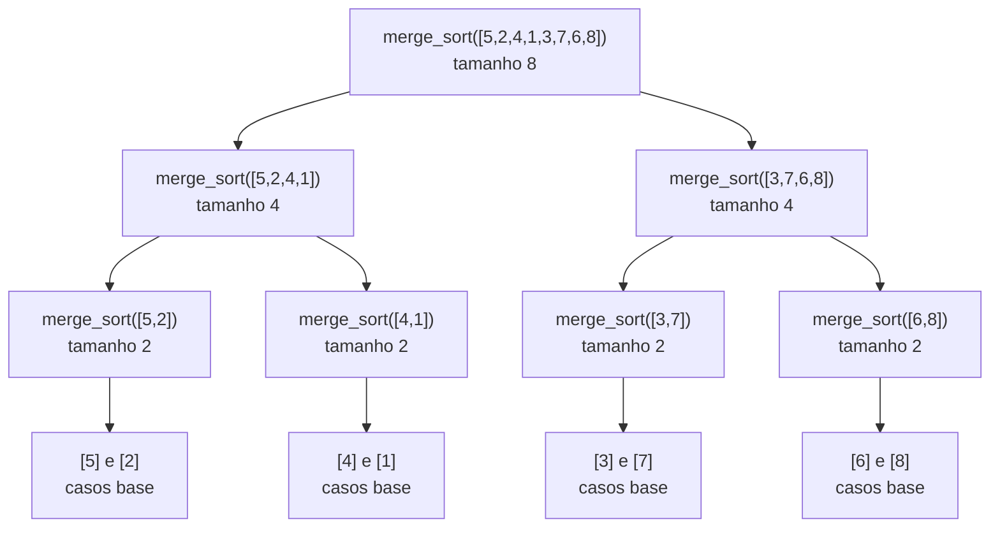

## Objetivos de Aprendizagem

- Rederivar merge sort como o algoritmo canônico de dividir para conquistar, nomeando seus passos de dividir, conquistar e combinar explicitamente.
- Aplicar a solução por árvore de recursão do conceito pré-requisito para confirmar que a recorrência `T(n) = 2T(n/2) + O(n)` do merge sort resolve para `Θ(n log n)`.
- Implementar merge sort e seu passo de merge em Python, e rastrear ambos em um exemplo concreto.
- Provar que o passo de merge padrão preserva estabilidade (elementos iguais mantêm sua ordem relativa de entrada), e explicar por que um merge incorreto pode quebrá-la.
- Explicar por que merge sort precisa de `Θ(n)` de espaço auxiliar, e por que isso é um custo genuíno, não incidental, do algoritmo.

## Contexto e Motivação

Merge sort já fez uma aparição neste currículo, em *Algoritmos de Ordenação: Uma Introdução*, onde apareceu como uma opção entre várias, colocado contra bubble, selection, e insertion sort para tornar um único ponto vívido: um algoritmo `O(n log n)` eventualmente, e decisivamente, vence um `O(n²)` conforme a entrada cresce. Essa comparação cumpriu bem seu papel, mas necessariamente tratou merge sort como uma caixa preta merecendo seu lugar por uma taxa de crescimento aceita de fé a partir de uma tabela de números. Este conceito revisita exatamente o mesmo algoritmo com um objetivo diferente: não comparando-o contra alternativas, mas entendendo-o em seus próprios termos, como a mais limpa ilustração completa única do paradigma de dividir para conquistar, dois subproblemas genuínos, trabalho real de combinação, e uma recorrência que agora pode ser resolvida por completo em vez de afirmada.

Esse "resolvida por completo" não é um acréscimo pequeno. O método de árvore de recursão do conceito pré-requisito foi construído especificamente para responder por que `T(n) = 2T(n/2) + O(n)` resolve para `Θ(n log n)`, e este conceito é onde essa derivação é aplicada ao algoritmo real ao redor do qual foi projetada, em vez de a uma versão esquemática dele. Merge sort também é o ponto onde duas propriedades que vale a pena conhecer sobre qualquer algoritmo de ordenação, se ele é *estável* (elementos iguais preservam sua ordem relativa) e quanta *memória extra* precisa além do array de entrada, se tornam concretas pela primeira vez neste currículo, de uma forma que o tratamento introdutório não teve ocasião de levantar. Ambas as propriedades importam na prática bem além deste único algoritmo: estabilidade determina se uma ordenação pode ser usada como um bloco de construção para ordenação de múltiplas chaves (ordene pela chave secundária, depois estavelmente pela chave primária), e custo de espaço determina se um algoritmo é sequer usável em dados que não cabem confortavelmente na memória duas vezes. Tanto o curso de Sedgewick & Wayne quanto o 6.006 do MIT tratam merge sort como o lugar natural para introduzir esse vocabulário, precisamente porque é a primeira ordenação coberta onde essas perguntas têm respostas genuínas, não triviais.

## Teoria Central

### O algoritmo: dividir, conquistar, combinar, nomeados explicitamente

```python
def merge_sort(items):
    if len(items) <= 1:                    # caso base: 0 ou 1 elementos já está ordenado
        return items
    mid = len(items) // 2
    left = merge_sort(items[:mid])          # dividir + conquistar: ordena recursivamente a metade esquerda
    right = merge_sort(items[mid:])         # dividir + conquistar: ordena recursivamente a metade direita
    return merge(left, right)               # combinar: mescla duas metades ordenadas em uma

def merge(left, right):
    result = []
    i = j = 0
    while i < len(left) and j < len(right):
        if left[i] <= right[j]:             # <= (não <) é o que torna o merge estável
            result.append(left[i])
            i += 1
        else:
            result.append(right[j])
            j += 1
    return result + left[i:] + right[j:]    # anexa o que sobrar de qualquer lado

merge_sort([5, 2, 4, 1, 3])   # [1, 2, 3, 4, 5]
```

Mapeado diretamente no modelo de dividir para conquistar: **dividir** divide o array em seu ponto médio em duas metades; **conquistar** ordena recursivamente cada metade independentemente (dois subproblemas, `a = 2`, cada um de tamanho `n/2`, exatamente o formato mais completo que o conceito do paradigma adiantou contra o mínimo de busca binária); **combinar** mescla as duas metades já ordenadas em um array completamente ordenado, em uma única passagem linear. Diferente do passo de combinar essencialmente de graça de busca binária, o passo de combinar de merge sort é onde trabalho real, não trivial, acontece, todo um dos `n` elementos é examinado exatamente uma vez durante o merge, que é exatamente o termo `f(n) = O(n)` que a recorrência abaixo contabiliza.

### A recorrência, e sua solução, aplicada a este algoritmo exato

Lendo `a`, `b`, e `f(n)` diretamente do código acima: duas chamadas recursivas (`a = 2`), cada uma sobre um array de metade do tamanho (`b = 2`), mais um merge que faz `O(n)` de trabalho (uma passagem sobre `n` elementos totais, dividida entre os dois segmentos `while`/anexação de sobras). Isso dá:

```
T(n) = 2T(n/2) + O(n)
```

que é exatamente o formato resolvido por completo, via árvore de recursão, no conceito pré-requisito: `Θ(n)` de trabalho em cada um dos `Θ(log n)` níveis, para um total de `Θ(n log n)`. Aplicados a este algoritmo específico, os níveis da árvore de recursão correspondem diretamente à estrutura de chamada recursiva abaixo, o nível 0 é a única chamada de topo sobre o array inteiro, o nível `k` são as `2^k` chamadas cada uma lidando com um array de tamanho `n/2^k`, e a árvore atinge o fundo uma vez que os arrays alcançam tamanho 1:



Cada nível dessa árvore faz `Θ(n)` de trabalho total de merge (um merge por nó, mas os merges em um dado nível juntos tocam todo elemento exatamente uma vez), e há `Θ(log n)` níveis (o array divide pela metade a cada passo, atingindo o fundo em tamanho 1), precisamente os dois fatos que o método da árvore de recursão combina para concluir `Θ(n log n)`, agora confirmado contra o algoritmo real em vez de uma recorrência abstrata.

### Estabilidade: elementos iguais mantêm sua ordem relativa

Uma ordenação é **estável** se, sempre que dois elementos comparam iguais, sua ordem relativa na saída combina com sua ordem relativa na entrada. A estabilidade do merge sort é uma consequência direta de um pequeno detalhe na função `merge`: a comparação `left[i] <= right[j]` (não `left[i] < right[j]`). Quando um elemento de `left` é igual ao elemento atual de `right`, o `<=` faz o elemento esquerdo ser tomado primeiro, e porque todo elemento originalmente mais à esquerda no array de entrada acaba na metade `left` (ou na porção processada anteriormente de uma metade) antes de um elemento igual da direita, essa única escolha de desempate é o que preserva a ordem relativa original através de todo nível de mesclagem. Estabilidade não é uma propriedade que precisa ser verificada separadamente em cada nível de recursão, ela vale por indução na própria estrutura recursiva: se tanto `left` quanto `right` estão estavelmente ordenados (cada um preserva a ordem relativa de seus próprios elementos originais, pela hipótese indutiva sobre subproblemas menores), e o próprio passo de merge nunca deixa um elemento de posição-original posterior pular à frente de um anterior igual, então o resultado mesclado também está estavelmente ordenado.

### Espaço: por que merge sort gasta `Θ(n)` de memória extra

A função `merge`, como escrita, aloca uma nova lista (`result`) em toda única chamada de merge, dimensionada proporcionalmente às duas metades sendo combinadas, isso é espaço *auxiliar*, memória além do próprio array de entrada. Na chamada de topo, essa nova lista tem tamanho `n`; nas duas chamadas do segundo nível, duas novas listas de tamanho total `n` são alocadas (embora não necessariamente todas vivas simultaneamente, dependendo de quando cada uma retorna); a quantidade importante não é quantas listas são alocadas ao longo da vida do algoritmo, mas a quantidade máxima de memória em uso *em qualquer momento*, que é `Θ(n)`, proporcional ao tamanho do array, não ao número de chamadas recursivas ou ao número de níveis. Este é um custo genuíno, estrutural, do algoritmo, não um artefato de uma implementação particular: qualquer merge correto de duas sequências ordenadas em uma sequência ordenada, feito pelo método padrão de varredura linear, precisa de algum lugar para escrever a saída mesclada enquanto ambas as sequências de entrada ainda estão sendo lidas, e esse algum lugar custa espaço proporcional ao tamanho combinado delas. Isso é exatamente a troca que o conceito introdutório sinalizou como "gastar memória para economizar tempo" sem derivar por quê, aqui, o *por quê* é a própria mecânica do passo de merge.

## Exemplos Resolvidos

### Exemplo 1 — rastreando a árvore de chamada completa e confirmando o trabalho Θ(n) por nível da recorrência

**Problema:** Para `merge_sort([5, 2, 4, 1, 3, 7, 6, 8])`, rastreie a árvore de chamada e confirme que o trabalho total de mesclagem em cada nível é proporcional a `n = 8`.

**Nível 2 (mais fundo, antes de mesclar para cima os casos base):** quatro merges, cada um combinando dois elementos únicos: `[5],[2]→[2,5]`; `[4],[1]→[1,4]`; `[3],[7]→[3,7]`; `[6],[8]→[6,8]`. Cada merge faz 1 comparação, tocando 2 elementos, total de elementos tocados através dos quatro merges: `4 × 2 = 8`.

**Nível 1:** dois merges, cada um combinando duas listas ordenadas de tamanho 2: `[2,5]` com `[1,4]` → compara `2,1`→`1`; `2,4`→`2`; `5,4`→`4`; só `5` resta → anexa → `[1,2,4,5]`. E `[3,7]` com `[6,8]` → compara `3,6`→`3`; `7,6`→`6`; `7,8`→`7`; só `8` resta → anexa → `[3,6,7,8]`. Total de elementos tocados através de ambos os merges: `4 + 4 = 8`.

**Nível 0:** um merge, combinando `[1,2,4,5]` com `[3,6,7,8]` → `1,3`→`1`; `2,3`→`2`; `4,3`→`3`; `4,6`→`4`; `5,6`→`5`; só `6,7,8` resta → anexa → `[1,2,3,4,5,6,7,8]`. Total de elementos tocados: `8`.

Todo nível toca exatamente `8 = n` elementos no total, confirmando concretamente a afirmação de `Θ(n)`-por-nível da Teoria Central, neste array exato, combinando com o argumento abstrato da árvore de recursão do conceito pré-requisito elemento por elemento.

### Exemplo 2 — verificando estabilidade com um empate concreto

**Problema:** Ordene a lista de pares `[(3, 'a'), (1, 'b'), (3, 'c'), (2, 'd')]` só pelo primeiro elemento, e confirme que os dois elementos com primeiro elemento `3` mantêm sua ordem relativa original (`'a'` antes de `'c'`) na saída.

**Rastreio.** Dividindo: `[(3,'a'), (1,'b')]` e `[(3,'c'), (2,'d')]`. A metade esquerda ordena para `[(1,'b'), (3,'a')]` (comparando só os primeiros elementos: `1 < 3`). A metade direita ordena para `[(2,'d'), (3,'c')]`. Mesclando essas duas: compara `(1,'b')` vs `(2,'d')` → `1 <= 2` → toma `(1,'b')`. Compara `(3,'a')` vs `(2,'d')` → `3 <= 2` é falso → toma `(2,'d')`. Compara `(3,'a')` vs `(3,'c')` → `3 <= 3` é verdadeiro → toma `(3,'a')` primeiro (o `<=` desempata a favor do lado esquerdo). Só `(3,'c')` resta → anexa. Resultado: `[(1,'b'), (2,'d'), (3,'a'), (3,'c')]`.

**Confirmação.** `(3,'a')` apareceu antes de `(3,'c')` na entrada original (posições 0 e 2), e aparece antes de `(3,'c')` na saída também, estabilidade preservada, e especificamente por causa da comparação `<=` no exato momento em que os dois pares iguais-por-primeiro-elemento foram comparados durante o merge final.

### Exemplo 3 — o que quebra se o merge usar `<` em vez de `<=`

**Problema:** Usando a mesma entrada do Exemplo 2, rastreie o que aconteceria se `merge` usasse `left[i] < right[j]` em vez de `left[i] <= right[j]`, na comparação específica entre `(3,'a')` e `(3,'c')`.

**Rastreie o passo alterado.** Tudo prossegue identicamente até comparar `(3,'a')` (de `left`) contra `(3,'c')` (de `right`). Com `<` estrito, `3 < 3` é falso, então o ramo `else` dispara e `(3,'c')` (de `right`) é tomado *primeiro*, à frente de `(3,'a')`.

**Resultado com `<`:** `[(1,'b'), (2,'d'), (3,'c'), (3,'a')]`, `(3,'c')` agora precede `(3,'a')`, mesmo que `(3,'a')` tenha aparecido primeiro na entrada original. Estabilidade é quebrada por essa mudança de um caractere, mesmo que a ordenação ainda esteja inteiramente correta em relação ao primeiro elemento sozinho (ambas as ordens são "ordenadas pelo primeiro elemento"). Isso demonstra precisamente quão estreita é a garantia de estabilidade: depende de uma escolha específica, fácil de inverter por engano, em uma comparação, não de nada sobre a estrutura recursiva geral.

## Equívocos Comuns e Armadilhas

- **"Merge sort já foi totalmente coberto no conceito introdutório de ordenação, isso é repetição."** O conceito introdutório estabeleceu *que* merge sort é `O(n log n)` contando comparações informalmente e comparando-o contra ordenações quadráticas; nunca resolveu a recorrência, nunca discutiu estabilidade, e nunca derivou o custo de espaço `Θ(n)` a partir da mecânica do passo de merge. Essas três coisas, a recorrência resolvida por completo via árvore de recursão, estabilidade provada a partir da comparação `<=`, e custo de espaço derivado da própria necessidade de um buffer de saída do merge, são conteúdo novo, não uma reafirmação da comparação de taxa de crescimento já feita.
- **"Qualquer implementação de merge sort é automaticamente estável."** Estabilidade é uma propriedade da comparação específica usada no passo de merge (`<=`, tomando o elemento esquerdo em empates), não uma consequência automática da estrutura de dividir para conquistar, o Exemplo 3 mostra uma mudança de um único caractere (`<=` para `<`) que ainda ordena corretamente mas silenciosamente quebra estabilidade.
- **"Merge sort pode ser feito para não usar espaço extra com uma implementação mais esperta."** Mesclagem in-place de duas sequências ordenadas sem nenhum buffer auxiliar é possível em princípio mas exige um algoritmo substancialmente mais complexo com piores fatores constantes, e não é a que "merge sort" se refere no tratamento padrão; o passo de merge direto e padrão mostrado aqui exige estruturalmente `Θ(n)` de espaço auxiliar porque precisa de algum lugar para escrever a saída enquanto ainda lê de ambas as entradas intocadas.
- **"Já que merge sort parece assintoticamente ótimo, seu custo de espaço realmente não importa."** Como o conceito introdutório já sinalizou e este conceito agora explica mecanicamente, `Θ(n)` de memória extra é um custo real que importa diretamente quando a entrada já está perto de preencher a memória disponível, uma ordenação in-place `O(n²)` continua sendo a única opção em alguns ambientes genuinamente restritos em memória, independentemente de quão mais lenta ela rode.

## Resumo

Merge sort, conhecido anteriormente como uma entrada em uma tabela comparativa, é a ilustração completa canônica de dividir para conquistar: dividir divide o array em seu ponto médio, conquistar ordena recursivamente cada metade (dois subproblemas, diferente do único de busca binária), e combinar mescla duas metades ordenadas em uma única passagem linear. Sua recorrência, `T(n) = 2T(n/2) + O(n)`, é exatamente o formato resolvido via árvore de recursão no conceito pré-requisito, e aplicar essa solução aqui confirma `Θ(n log n)` diretamente contra a própria estrutura de chamada do algoritmo, nível por nível. Duas propriedades que vale a pena conhecer pela primeira vez aqui: merge sort é estável, porque a comparação `<=` do passo de merge sempre prefere a metade esquerda em empates, preservando ordem relativa original por indução na estrutura recursiva; e precisa de `Θ(n)` de espaço auxiliar, porque o passo de merge deve escrever sua saída em algum lugar enquanto ambas as entradas ordenadas ainda estão sendo lidas, um custo genuíno, estrutural, não um acidente de implementação.

## Documentation Links

- [Sedgewick & Wayne — Algorithms Lectures (Princeton)](https://algs4.cs.princeton.edu/lectures/) — doc
- [MIT 6.006 — Lecture Notes (OCW)](https://ocw.mit.edu/courses/6-006-introduction-to-algorithms-spring-2020/pages/lecture-notes/) — doc
