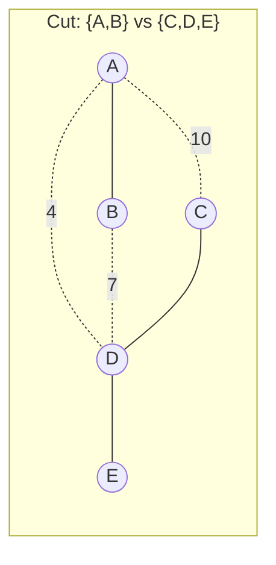
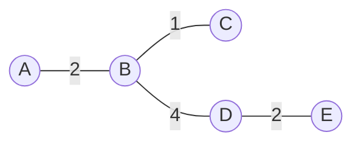

## Learning Objectives

- Define a minimum spanning tree (MST) as a spanning tree of a weighted graph whose total edge weight is smallest among all possible spanning trees.
- State the cut property and explain why it justifies a greedy strategy for building an MST.
- Distinguish "fewest edges" (any spanning tree, already guaranteed to be n − 1) from "cheapest total weight" (the additional property an MST must satisfy).
- Explain why an MST need not be unique, and identify the specific condition (a tie in edge weights) under which multiple distinct MSTs exist for the same graph.
- Recognize the generic greedy MST algorithm as the common template that both Kruskal's and Prim's algorithms instantiate.

## Context & Motivation

The discrete math treatment of trees already established what a spanning tree of a connected graph is: a subgraph that touches every vertex, uses only edges already present in the graph, and is itself a tree — meaning it's connected and acyclic, and therefore has exactly n − 1 edges for n vertices. That earlier treatment also showed that a connected graph with cycles generally has *many* distinct spanning trees, one for every different choice of which redundant edges to strip away. What it deliberately left unanswered is the question that turns "a spanning tree exists" into a genuinely useful engineering problem: if the graph's edges have costs attached, *which* of those many spanning trees should you actually build?

That question is not academic. Suppose a set of buildings on a campus need to be connected by network cable, and running cable between any two buildings has a cost that depends on the distance and the terrain in between — some pairs are cheap to connect directly, others are expensive or physically infeasible. You don't need every building connected to every other building directly; you only need every building reachable from every other one, possibly through intermediate buildings, which is exactly what a spanning tree guarantees. But among all the spanning trees of the "which buildings could be cabled to which, at what cost" graph, some cost far less in total cable than others, and a network engineer obviously wants the cheapest one that still connects everything. The identical structure shows up in laying power lines between substations, planning road networks connecting cities at minimum construction cost, wiring circuit boards, and clustering data points by cheapest pairwise similarity. In every case, the graph's vertices are the things that must all end up connected, the edges are the possible direct connections with an associated cost, and the answer sought is a **minimum spanning tree**: a spanning tree, in the exact sense already defined, that additionally minimizes the sum of the weights of the edges it uses.

This concept is the hinge between two things already in hand — the pure graph-theoretic notion of a spanning tree, and the greedy paradigm's general idea of making a sequence of locally best choices — and the two algorithms this concept leads into (Kruskal's and Prim's). What makes the MST problem a particularly satisfying application of the greedy paradigm is that greedy is not merely *a* reasonable heuristic here, as it often is for other problems where greedy only approximates the optimum; for the MST problem specifically, a provably correct structural fact (the cut property, developed below) guarantees that a greedy strategy, executed correctly, always produces a truly optimal answer, not just a good one. That guarantee is the theoretical payoff of this concept, and it is what both algorithms that follow lean on directly rather than re-deriving.

## Core Theory

### From spanning tree to minimum spanning tree

Let G = (V, E) be a connected, undirected graph, and let every edge e ∈ E carry a weight w(e) (a real number — typically nonnegative in practice, such as a distance or a cost, though nothing in the definition below requires it). A spanning tree T of G, in the sense already established, is a subgraph using all of V and a subset of E that is itself a tree. Define the **weight of a spanning tree** as the sum of the weights of its edges: w(T) = Σ w(e) for e ∈ T. A **minimum spanning tree** of G is a spanning tree T* such that w(T*) ≤ w(T) for every other spanning tree T of G.

Two things are worth being precise about here, because they are easy to blur together. First, *every* spanning tree of a connected graph on n vertices already has exactly n − 1 edges — that fact was proved in the discrete-math treatment of trees and has nothing to do with weights at all; it follows purely from being connected and acyclic. Second, an MST is not "the spanning tree with the fewest edges" — every spanning tree has the same number of edges (n − 1), so edge count can never distinguish between them. What distinguishes spanning trees from each other, once weights are in the picture, is purely the *sum* of the weights on the n − 1 edges each one happens to use. Minimizing that sum, subject to the fixed structural constraint of being some spanning tree at all, is the entire content of the MST problem.

### The cut property

The single structural fact that makes the MST problem tractable by a greedy strategy — and that both Kruskal's and Prim's algorithms rely on, whether or not they ever state it explicitly — is called the **cut property**. A **cut** of a graph is any partition of its vertex set V into two disjoint, nonempty groups, S and V − S. An edge is said to **cross** the cut if it has one endpoint in S and the other in V − S.

**Cut property:** For any cut (S, V − S) of a connected weighted graph, if there is a unique edge of minimum weight among all the edges crossing that cut, that edge belongs to *every* minimum spanning tree of the graph. More generally (allowing ties), at least one minimum-weight edge crossing any cut belongs to *some* minimum spanning tree.

The intuition, without insisting on a fully formal proof, is a straightforward exchange argument. Suppose some spanning tree T did not include the minimum-weight edge e crossing a given cut. Because T is a spanning tree, it must connect every vertex in S to every vertex in V − S somehow — meaning T contains *some* edge f crossing the same cut (otherwise S and V − S would be disconnected from each other inside T, contradicting that T spans the whole graph). Since e was the minimum-weight crossing edge, w(e) ≤ w(f). Now consider swapping f out of T and e in: adding e to T creates exactly one cycle (since T was already a tree, and adding any edge to a tree creates exactly one cycle, a fact already established for trees generally), and that cycle must cross the cut an even number of times — so removing f (which also crosses the cut, and lies on that same cycle) breaks the cycle and restores a valid spanning tree, now using e instead of f. This new tree has total weight w(T) − w(f) + w(e) ≤ w(T), i.e., it is at least as good. So no spanning tree can strictly beat one that includes the minimum crossing edge — which is exactly the claim.

The reason this matters so much practically is that it licenses a *greedy* choice: at any point, if you can identify a cut and its unique cheapest crossing edge, you can commit to that edge immediately, with a guarantee — not a heuristic hope — that some optimal solution uses it. Both algorithms developed next are, at their core, different disciplined ways of repeatedly applying exactly this one fact.

Here the cut separates {A, B} from {C, D, E}; every edge with one endpoint in {A, B} and the other in {C, D, E} crosses it — that's A–C (weight 10), A–D (weight 4), and B–D (weight 7) — while A–B, C–D, and D–E all have both endpoints on the same side and so do not cross this particular cut. Among the crossing edges {A–C: 10, A–D: 4, B–D: 7}, A–D is uniquely cheapest at weight 4, so the cut property guarantees A–D belongs to every MST of this graph, regardless of what the non-crossing edges (A–B, C–D, D–E) look like.

### The generic greedy MST algorithm

Sedgewick and Wayne's treatment of MSTs (and this is the framing this concept and its two successors adopt directly) observes that Kruskal's algorithm and Prim's algorithm, despite looking superficially quite different in implementation, are really two instances of one **generic greedy MST algorithm**:

> Starting from an empty set of edges, repeatedly find a cut that no edge in the current set crosses, identify a minimum-weight edge crossing that cut, and add it to the growing edge set — continuing until n − 1 edges have been added.

The cut property guarantees that every edge added this way is safe: it belongs to some MST, so the growing edge set can always be extended to a full MST. What distinguishes Kruskal's algorithm from Prim's is entirely a matter of *which* cuts get considered, and in what order: Kruskal's algorithm (developed next) processes all of the graph's edges once, globally, in increasing weight order, effectively considering whatever cut happens to separate each edge's two endpoint components at the moment it's examined; Prim's algorithm (developed after that) fixes attention on a single growing tree from one starting vertex and always considers the cut between "vertices already in the tree" and "vertices not yet in the tree." Both are faithful, correct instantiations of the same generic template, and the cut property is precisely why both are guaranteed to produce a true MST rather than merely a plausible-looking one.

### Uniqueness — or the lack of it

An MST is not always unique. If a connected weighted graph has all distinct edge weights (no two edges share the same weight), its MST is provably unique — this follows from the "if there is a *unique* edge of minimum weight" clause of the cut property applying unambiguously at every step, leaving no choice at any point. But when edge weights can repeat, ties can leave a genuine choice open: two different edges of the same weight might each be a valid "cheapest crossing edge" for some cut, and picking one over the other can lead to two different spanning trees that nonetheless have the identical *total* weight and are therefore both, correctly, minimum spanning trees of the same graph. This is a real and frequently misunderstood point: "the MST" is a slight abuse of language when weights aren't all distinct — the minimum *total weight* is unique, but the specific tree achieving it may not be.

## Worked Examples

### Example 1 — cabling five buildings at minimum cost

**Problem:** Five buildings A, B, C, D, E need network connectivity. The possible direct cable runs and their costs (in arbitrary cost units) are: A–B: 2, A–C: 3, B–C: 1, B–D: 4, C–D: 5, C–E: 6, D–E: 2. Find a minimum spanning tree.

**Reasoning by direct inspection (small enough to enumerate by hand before either algorithm formalizes the process):** There are 5 vertices, so any spanning tree needs exactly 4 edges. The cheapest edge overall is B–C (weight 1) — include it. The next cheapest is A–B (weight 2) or D–E (weight 2), tied; both connect previously separate pieces (A joins {B,C}; D and E form their own new pair), so both can be included without creating a cycle — take both. Current edges: B–C, A–B, D–E, connecting {A,B,C} and {D,E} as two separate components, 3 edges so far, one more needed to join them. The next cheapest remaining edge is A–C (weight 3), but A and C are already in the same component ({A,B,C}) — adding it would create a cycle (A-B-C-A), so it's rejected. Next is B–D (weight 4) — B is in {A,B,C}, D is in {D,E}, different components, so this edge joins the two remaining pieces into one. Total edges: B–C, A–B, D–E, B–D — exactly 4 edges, one spanning tree, total weight 1 + 2 + 2 + 4 = 9.

**Verification via the cut property.** Consider the cut separating {D, E} from {A, B, C}. The crossing edges are B–D (4) and C–D (5) and C–E (6) — B–D is uniquely cheapest among these, so the cut property guarantees B–D belongs to the MST, matching what was found. No cheaper total-weight spanning tree exists; any spanning tree omitting B–C (the single cheapest edge anywhere) would have to connect B and C some other way, and every other B–C-connecting path costs strictly more than one edge of weight 1 ever could contribute.

This is the resulting MST — 4 edges, total weight 9, connecting all 5 buildings.

### Example 2 — applying the cut property to justify a specific edge, without building the whole tree

**Problem:** In a graph with vertices {1,2,3,4}, edges 1–2 (weight 6), 1–3 (weight 1), 2–3 (weight 5), 2–4 (weight 3), 3–4 (weight 4). Without constructing the full MST, argue that edge 1–3 must be in every MST of this graph.

**Reasoning.** Consider the cut separating {1} from {2, 3, 4}. The only edges crossing this cut are 1–2 (weight 6) and 1–3 (weight 1) — 2–3, 2–4, and 3–4 all have both endpoints on the same side of this particular cut, so none of them cross it. Among the crossing edges, 1–3 is uniquely the cheapest (1 versus 6). By the cut property, since this minimum is unique (not tied), edge 1–3 must belong to *every* minimum spanning tree of this graph — this is guaranteed structurally, without needing to compute the rest of the tree or compare total weights of alternative trees at all.

### Example 3 — a graph with a tie, admitting two distinct MSTs

**Problem:** Vertices {1,2,3}, edges 1–2 (weight 5), 2–3 (weight 5), 1–3 (weight 5) — a triangle with all three edges equal weight. Find the MST(s).

**Reasoning.** Any spanning tree here needs 2 of the 3 edges (n − 1 = 2 for n = 3), and removing any one edge from the triangle leaves the other two, connecting all three vertices with total weight 5 + 5 = 10. There are three ways to do this — {1–2, 2–3}, {1–2, 1–3}, or {2–3, 1–3} — and every one of them has the same total weight, 10, and every one of them is, correctly, a minimum spanning tree. This is the tie case described in Core Theory directly: since no edge crossing any cut here is *uniquely* cheapest (all three edges tie at weight 5), the cut property only guarantees that *some* minimum-weight crossing edge belongs to some MST, not that a specific one belongs to *every* MST — and indeed here, several distinct trees are all simultaneously correct.

## Common Misconceptions & Pitfalls

- **"The minimum spanning tree is the spanning tree with the fewest edges."** Every spanning tree of a connected graph on n vertices has exactly n − 1 edges — full stop, regardless of weights — so edge count can never be what distinguishes an MST from any other spanning tree. What's being minimized is the *sum of the edge weights*, not the number of edges.
- **"Greedy only ever gives a good approximation for this kind of problem, never a guaranteed-optimal answer."** For many optimization problems this caveat is genuinely necessary, but the MST problem is a specific, provable exception: the cut property is a structural theorem, not a heuristic, and it guarantees that a correctly executed greedy strategy — always taking a minimum-weight edge across some cut not yet crossed — produces a truly optimal (minimum-weight) spanning tree, not merely a plausible-looking one.
- **"There is exactly one minimum spanning tree for any weighted connected graph."** This is only guaranteed when all edge weights are distinct. Example 3 shows a graph with repeated weights admitting multiple distinct MSTs, all sharing the same minimum total weight — "the MST" should be understood as "a minimum spanning tree" whenever ties are possible.
- **"The cut property requires you to already know the whole tree before it applies."** The opposite is true, and it's the entire point: the cut property lets you commit to an edge being part of *some* MST using only local information about one cut, without needing to have already built or compared complete candidate trees — this locality is exactly what makes a greedy, incremental algorithm (rather than an exhaustive search over all spanning trees) possible at all.
- **"Negative edge weights break the definition."** Nothing about the definition of a spanning tree's total weight, or the cut property's exchange argument, actually requires weights to be nonnegative — the MST problem, unlike shortest-path problems, remains perfectly well defined and the cut property still holds even if some edges have negative weight; negative weights only become a genuine complication for *other* graph problems, not this one.

## Summary

A minimum spanning tree is a spanning tree — already known to be a connected, acyclic subgraph using all n vertices and exactly n − 1 edges — that additionally minimizes the sum of the weights of the edges it uses, among all possible spanning trees of the graph. The cut property is the structural fact that makes this problem greedily solvable with a correctness *guarantee*, not just a heuristic: for any partition of the vertices into two groups, a minimum-weight edge crossing that partition is always part of some MST, and is part of *every* MST when that minimum is unique. Sedgewick and Wayne frame both algorithms that follow — Kruskal's and Prim's — as two different instantiations of one generic greedy MST algorithm built directly on top of the cut property, differing only in which cuts they examine and in what order. An MST is unique when all edge weights are distinct, but ties in edge weight can permit multiple, equally minimal, structurally different spanning trees for the same graph.

## Documentation Links

- [Sedgewick & Wayne — Algorithms Lectures (Princeton)](https://algs4.cs.princeton.edu/lectures/) — doc
- [ACM/IEEE CS2013 — Algorithms and Complexity Knowledge Area](https://csed.acm.org/cs2013-version/) — doc
