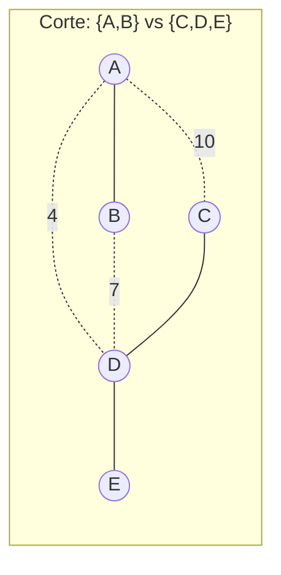
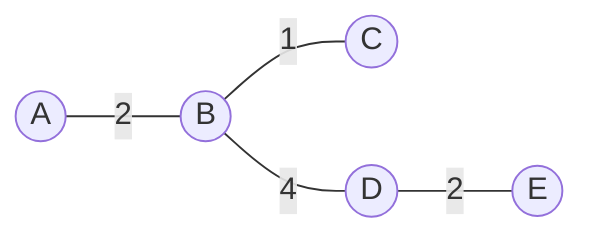

## Objetivos de Aprendizagem

- Definir uma árvore geradora mínima (MST) como uma árvore geradora de um grafo ponderado cujo peso total de aresta é menor entre todas as árvores geradoras possíveis.
- Enunciar a propriedade de corte e explicar por que ela justifica uma estratégia gulosa para construir uma MST.
- Distinguir "menos arestas" (qualquer árvore geradora, já garantida ser n − 1) de "peso total mais barato" (a propriedade adicional que uma MST deve satisfazer).
- Explicar por que uma MST não precisa ser única, e identificar a condição específica (um empate em pesos de aresta) sob a qual múltiplas MSTs distintas existem para o mesmo grafo.
- Reconhecer o algoritmo genérico guloso de MST como o modelo comum que tanto o algoritmo de Kruskal quanto o de Prim instanciam.

## Contexto e Motivação

O tratamento de matemática discreta de árvores já estabeleceu o que é uma árvore geradora de um grafo conexo: um subgrafo que toca todo vértice, usa apenas arestas já presentes no grafo, e é ele próprio uma árvore, significando que é conexo e acíclico, e portanto tem exatamente n − 1 arestas para n vértices. Aquele tratamento anterior também mostrou que um grafo conexo com ciclos geralmente tem *muitas* árvores geradoras distintas, uma para cada escolha diferente de quais arestas redundantes remover. O que deliberadamente deixou sem resposta é a pergunta que transforma "uma árvore geradora existe" em um problema de engenharia genuinamente útil: se as arestas do grafo têm custos anexados, *qual* dessas muitas árvores geradoras você deveria de fato construir?

Essa pergunta não é acadêmica. Suponha que um conjunto de prédios em um campus precise ser conectado por cabo de rede, e passar cabo entre quaisquer dois prédios tem um custo que depende da distância e do terreno entre eles, alguns pares são baratos de conectar diretamente, outros são caros ou fisicamente inviáveis. Você não precisa que todo prédio seja conectado diretamente a todo outro; só precisa que todo prédio seja alcançável a partir de todo outro, possivelmente através de prédios intermediários, que é exatamente o que uma árvore geradora garante. Mas entre todas as árvores geradoras do grafo "quais prédios poderiam ser cabeados a quais, a que custo," algumas custam muito menos cabo total que outras, e um engenheiro de rede obviamente quer a mais barata que ainda conecte tudo. A estrutura idêntica aparece em instalar linhas de energia entre subestações, planejar redes rodoviárias conectando cidades a custo mínimo de construção, cabear placas de circuito, e agrupar pontos de dados pela similaridade par-a-par mais barata. Em todo caso, os vértices do grafo são as coisas que todas devem acabar conectadas, as arestas são as possíveis conexões diretas com um custo associado, e a resposta buscada é uma **árvore geradora mínima**: uma árvore geradora, no sentido exato já definido, que adicionalmente minimiza a soma dos pesos das arestas que usa.

Este conceito é a dobradiça entre duas coisas já à mão, a noção puramente teórica de grafo de árvore geradora, e a ideia geral do paradigma guloso de fazer uma sequência de escolhas localmente melhores, e os dois algoritmos aos quais este conceito leva (Kruskal e Prim). O que torna o problema de MST uma aplicação particularmente satisfatória do paradigma guloso é que guloso não é meramente *uma* heurística razoável aqui, como frequentemente é para outros problemas onde guloso só aproxima o ótimo; para o problema de MST especificamente, um fato estrutural comprovadamente correto (a propriedade de corte, desenvolvida abaixo) garante que uma estratégia gulosa, executada corretamente, sempre produz uma resposta verdadeiramente ótima, não apenas uma boa. Essa garantia é o ganho teórico deste conceito, e é sobre o que ambos os algoritmos seguintes se apoiam diretamente em vez de rederivar.

## Teoria Central

### Da árvore geradora para a árvore geradora mínima

Seja G = (V, E) um grafo conexo, não direcionado, e seja toda aresta e ∈ E carregando um peso w(e) (um número real, tipicamente não negativo na prática, como uma distância ou um custo, embora nada na definição abaixo exija isso). Uma árvore geradora T de G, no sentido já estabelecido, é um subgrafo usando todo V e um subconjunto de E que é ele próprio uma árvore. Defina o **peso de uma árvore geradora** como a soma dos pesos de suas arestas: w(T) = Σ w(e) para e ∈ T. Uma **árvore geradora mínima** de G é uma árvore geradora T* tal que w(T*) ≤ w(T) para toda outra árvore geradora T de G.

Duas coisas valem a pena ser precisas aqui, porque são fáceis de confundir. Primeiro, *toda* árvore geradora de um grafo conexo em n vértices já tem exatamente n − 1 arestas, esse fato foi provado no tratamento de matemática discreta de árvores e não tem nada a ver com pesos de forma alguma; decorre puramente de ser conexo e acíclico. Segundo, uma MST não é "a árvore geradora com menos arestas", toda árvore geradora tem o mesmo número de arestas (n − 1), então contagem de aresta nunca pode distingui-las. O que distingue árvores geradoras umas das outras, uma vez que pesos entram em cena, é puramente a *soma* dos pesos nas n − 1 arestas que cada uma acontece de usar. Minimizar essa soma, sujeito à restrição estrutural fixa de ser alguma árvore geradora afinal, é o conteúdo inteiro do problema de MST.

### A propriedade de corte

O único fato estrutural que torna o problema de MST tratável por uma estratégia gulosa, e do qual tanto o algoritmo de Kruskal quanto o de Prim dependem, seja ou não que jamais o enunciem explicitamente, é chamado a **propriedade de corte**. Um **corte** de um grafo é qualquer partição de seu conjunto de vértices V em dois grupos disjuntos, não vazios, S e V − S. Uma aresta é dita **cruzar** o corte se tem um extremo em S e o outro em V − S.

**Propriedade de corte:** Para qualquer corte (S, V − S) de um grafo ponderado conexo, se há uma única aresta de peso mínimo entre todas as arestas cruzando aquele corte, aquela aresta pertence a *toda* árvore geradora mínima do grafo. Mais geralmente (permitindo empates), pelo menos uma aresta de peso mínimo cruzando qualquer corte pertence a *alguma* árvore geradora mínima.

A intuição, sem insistir em uma prova completamente formal, é um argumento de troca direto. Suponha que alguma árvore geradora T não incluísse a aresta e de peso mínimo cruzando um dado corte. Porque T é uma árvore geradora, deve conectar todo vértice em S a todo vértice em V − S de alguma forma, significando que T contém *alguma* aresta f cruzando o mesmo corte (caso contrário S e V − S estariam desconectados um do outro dentro de T, contradizendo que T gera o grafo inteiro). Já que e era a aresta de cruzamento de peso mínimo, w(e) ≤ w(f). Agora considere trocar f para fora de T e e para dentro: adicionar e a T cria exatamente um ciclo (já que T já era uma árvore, e adicionar qualquer aresta a uma árvore cria exatamente um ciclo, um fato já estabelecido para árvores em geral), e aquele ciclo deve cruzar o corte um número par de vezes, então remover f (que também cruza o corte, e está naquele mesmo ciclo) quebra o ciclo e restaura uma árvore geradora válida, agora usando e em vez de f. Essa nova árvore tem peso total w(T) − w(f) + w(e) ≤ w(T), ou seja, é pelo menos tão boa. Então nenhuma árvore geradora pode estritamente vencer uma que inclui a aresta de cruzamento mínima, que é exatamente a afirmação.

A razão pela qual isso importa tanto na prática é que licencia uma escolha *gulosa*: em qualquer ponto, se você pode identificar um corte e sua única aresta de cruzamento mais barata, pode se comprometer com aquela aresta imediatamente, com uma garantia, não uma esperança heurística, de que alguma solução ótima a usa. Ambos os algoritmos desenvolvidos em seguida são, em seu núcleo, formas disciplinadas diferentes de aplicar repetidamente exatamente esse único fato.

Aqui o corte separa {A, B} de {C, D, E}; toda aresta com um extremo em {A, B} e o outro em {C, D, E} o cruza, essas são A–C (peso 10), A–D (peso 4), e B–D (peso 7), enquanto A–B, C–D, e D–E todas têm ambos os extremos no mesmo lado e portanto não cruzam este corte particular. Entre as arestas de cruzamento {A–C: 10, A–D: 4, B–D: 7}, A–D é unicamente a mais barata a peso 4, então a propriedade de corte garante que A–D pertence a toda MST deste grafo, independentemente de como as arestas não cruzadas (A–B, C–D, D–E) sejam.

### O algoritmo genérico guloso de MST

O tratamento de MSTs de Sedgewick e Wayne (e este é o enquadramento que este conceito e seus dois sucessores adotam diretamente) observa que o algoritmo de Kruskal e o algoritmo de Prim, apesar de parecerem superficialmente bem diferentes na implementação, são realmente duas instâncias de um **algoritmo genérico guloso de MST**:

> Começando de um conjunto vazio de arestas, repetidamente encontre um corte que nenhuma aresta no conjunto atual cruza, identifique uma aresta de peso mínimo cruzando aquele corte, e adicione-a ao conjunto de arestas crescente, continuando até que n − 1 arestas tenham sido adicionadas.

A propriedade de corte garante que toda aresta adicionada dessa forma é segura: pertence a alguma MST, então o conjunto de arestas crescente sempre pode ser estendido para uma MST completa. O que distingue o algoritmo de Kruskal do de Prim é inteiramente uma questão de *quais* cortes são considerados, e em que ordem: o algoritmo de Kruskal (desenvolvido em seguida) processa todas as arestas do grafo uma vez, globalmente, em ordem crescente de peso, efetivamente considerando qualquer corte que aconteça de separar os dois componentes de extremo de cada aresta no momento em que é examinada; o algoritmo de Prim (desenvolvido depois disso) fixa atenção em uma única árvore crescente a partir de um vértice inicial e sempre considera o corte entre "vértices já na árvore" e "vértices ainda não na árvore." Ambos são instanciações fiéis e corretas do mesmo modelo genérico, e a propriedade de corte é precisamente por que ambos são garantidos produzir uma MST verdadeira em vez de meramente uma de aparência plausível.

### Unicidade, ou a falta dela

Uma MST nem sempre é única. Se um grafo ponderado conexo tem todos os pesos de aresta distintos (nenhuma duas arestas compartilham o mesmo peso), sua MST é comprovadamente única, isso decorre da cláusula "se há uma aresta *única* de peso mínimo" da propriedade de corte se aplicando inequivocamente em todo passo, não deixando nenhuma escolha em nenhum ponto. Mas quando pesos de aresta podem se repetir, empates podem deixar uma escolha genuína aberta: duas arestas diferentes do mesmo peso poderiam cada uma ser uma "aresta de cruzamento mais barata" válida para algum corte, e escolher uma sobre a outra pode levar a duas árvores geradoras diferentes que ainda assim têm o mesmo peso *total*, idêntico, e são portanto ambas, corretamente, árvores geradoras mínimas do mesmo grafo. Este é um ponto real e frequentemente mal entendido: "a MST" é um leve abuso de linguagem quando pesos não são todos distintos, o peso *total* mínimo é único, mas a árvore específica que o alcança pode não ser.

## Exemplos Resolvidos

### Exemplo 1 — cabeando cinco prédios a custo mínimo

**Problema:** Cinco prédios A, B, C, D, E precisam de conectividade de rede. Os percursos de cabo diretos possíveis e seus custos (em unidades de custo arbitrárias) são: A–B: 2, A–C: 3, B–C: 1, B–D: 4, C–D: 5, C–E: 6, D–E: 2. Encontre uma árvore geradora mínima.

**Raciocínio por inspeção direta (pequeno o suficiente para enumerar manualmente antes de qualquer algoritmo formalizar o processo):** Há 5 vértices, então qualquer árvore geradora precisa de exatamente 4 arestas. A aresta mais barata no geral é B–C (peso 1), inclua. A próxima mais barata é A–B (peso 2) ou D–E (peso 2), empatadas; ambas conectam pedaços anteriormente separados (A se junta a {B,C}; D e E formam seu próprio par novo), então ambas podem ser incluídas sem criar um ciclo, tome ambas. Arestas atuais: B–C, A–B, D–E, conectando {A,B,C} e {D,E} como dois componentes separados, 3 arestas até agora, mais uma necessária para juntá-los. A próxima aresta mais barata restante é A–C (peso 3), mas A e C já estão no mesmo componente ({A,B,C}), adicioná-la criaria um ciclo (A-B-C-A), então é rejeitada. Em seguida é B–D (peso 4), B está em {A,B,C}, D está em {D,E}, componentes diferentes, então essa aresta junta os dois pedaços restantes em um. Arestas totais: B–C, A–B, D–E, B–D, exatamente 4 arestas, uma árvore geradora, peso total 1 + 2 + 2 + 4 = 9.

**Verificação via a propriedade de corte.** Considere o corte separando {D, E} de {A, B, C}. As arestas cruzando são B–D (4) e C–D (5) e C–E (6), B–D é unicamente a mais barata entre elas, então a propriedade de corte garante que B–D pertence à MST, combinando com o que foi encontrado. Nenhuma árvore geradora de peso total mais barato existe; qualquer árvore geradora omitindo B–C (a única aresta mais barata em qualquer lugar) teria que conectar B e C de alguma outra forma, e todo outro caminho conectando B–C custa estritamente mais do que uma única aresta de peso 1 jamais poderia contribuir.

Esta é a MST resultante, 4 arestas, peso total 9, conectando todos os 5 prédios.

### Exemplo 2 — aplicando a propriedade de corte para justificar uma aresta específica, sem construir a árvore inteira

**Problema:** Em um grafo com vértices {1,2,3,4}, arestas 1–2 (peso 6), 1–3 (peso 1), 2–3 (peso 5), 2–4 (peso 3), 3–4 (peso 4). Sem construir a MST completa, argumente que a aresta 1–3 deve estar em toda MST deste grafo.

**Raciocínio.** Considere o corte separando {1} de {2, 3, 4}. As únicas arestas cruzando esse corte são 1–2 (peso 6) e 1–3 (peso 1), 2–3, 2–4, e 3–4 todas têm ambos os extremos no mesmo lado deste corte particular, então nenhuma delas o cruza. Entre as arestas de cruzamento, 1–3 é unicamente a mais barata (1 versus 6). Pela propriedade de corte, já que esse mínimo é único (não empatado), a aresta 1–3 deve pertencer a *toda* árvore geradora mínima deste grafo, isso é garantido estruturalmente, sem precisar calcular o resto da árvore ou comparar pesos totais de árvores alternativas de forma alguma.

### Exemplo 3 — um grafo com um empate, admitindo duas MSTs distintas

**Problema:** Vértices {1,2,3}, arestas 1–2 (peso 5), 2–3 (peso 5), 1–3 (peso 5), um triângulo com todas as três arestas de peso igual. Encontre a(s) MST(s).

**Raciocínio.** Qualquer árvore geradora aqui precisa de 2 das 3 arestas (n − 1 = 2 para n = 3), e remover qualquer uma aresta do triângulo deixa as outras duas, conectando todos os três vértices com peso total 5 + 5 = 10. Há três formas de fazer isso, {1–2, 2–3}, {1–2, 1–3}, ou {2–3, 1–3}, e cada uma delas tem o mesmo peso total, 10, e cada uma delas é, corretamente, uma árvore geradora mínima. Este é o caso de empate descrito diretamente na Teoria Central: já que nenhuma aresta cruzando qualquer corte aqui é *unicamente* mais barata (todas as três arestas empatam em peso 5), a propriedade de corte só garante que *alguma* aresta de cruzamento de peso mínimo pertence a alguma MST, não que uma específica pertence a *toda* MST, e de fato aqui, várias árvores distintas são todas simultaneamente corretas.

## Equívocos Comuns e Armadilhas

- **"A árvore geradora mínima é a árvore geradora com menos arestas."** Toda árvore geradora de um grafo conexo em n vértices tem exatamente n − 1 arestas, ponto final, independentemente de pesos, então contagem de aresta nunca pode ser o que distingue uma MST de qualquer outra árvore geradora. O que está sendo minimizado é a *soma dos pesos das arestas*, não o número de arestas.
- **"Guloso só sempre dá uma boa aproximação para esse tipo de problema, nunca uma resposta comprovadamente ótima."** Para muitos problemas de otimização essa ressalva é genuinamente necessária, mas o problema de MST é uma exceção específica, demonstrável: a propriedade de corte é um teorema estrutural, não uma heurística, e garante que uma estratégia gulosa executada corretamente, sempre tomando uma aresta de peso mínimo através de algum corte ainda não cruzado, produz uma árvore geradora verdadeiramente ótima (peso mínimo), não meramente uma de aparência plausível.
- **"Existe exatamente uma árvore geradora mínima para qualquer grafo conexo ponderado."** Isso só é garantido quando todos os pesos de aresta são distintos. O Exemplo 3 mostra um grafo com pesos repetidos admitindo múltiplas MSTs distintas, todas compartilhando o mesmo peso total mínimo, "a MST" deveria ser entendida como "uma árvore geradora mínima" sempre que empates são possíveis.
- **"A propriedade de corte exige que você já conheça a árvore inteira antes de se aplicar."** O oposto é verdade, e é o ponto inteiro: a propriedade de corte permite que você se comprometa com uma aresta sendo parte de *alguma* MST usando apenas informação local sobre um corte, sem precisar já ter construído ou comparado árvores candidatas completas, essa localidade é exatamente o que torna um algoritmo guloso, incremental (em vez de uma busca exaustiva sobre todas as árvores geradoras) possível afinal.
- **"Pesos de aresta negativos quebram a definição."** Nada sobre a definição do peso total de uma árvore geradora, ou o argumento de troca da propriedade de corte, de fato exige que pesos sejam não negativos, o problema de MST, diferente de problemas de caminho mais curto, permanece perfeitamente bem definido e a propriedade de corte ainda vale mesmo se algumas arestas têm peso negativo; pesos negativos só se tornam uma complicação genuína para *outros* problemas de grafo, não este.

## Resumo

Uma árvore geradora mínima é uma árvore geradora, já sabida ser um subgrafo conexo, acíclico usando todos os n vértices e exatamente n − 1 arestas, que adicionalmente minimiza a soma dos pesos das arestas que usa, entre todas as árvores geradoras possíveis do grafo. A propriedade de corte é o fato estrutural que torna esse problema solucionável gulosamente com uma *garantia* de correção, não apenas uma heurística: para qualquer partição dos vértices em dois grupos, uma aresta de peso mínimo cruzando aquela partição sempre faz parte de alguma MST, e faz parte de *toda* MST quando aquele mínimo é único. Sedgewick e Wayne enquadram ambos os algoritmos seguintes, Kruskal e Prim, como duas instanciações diferentes de um algoritmo genérico guloso de MST construído diretamente sobre a propriedade de corte, diferindo apenas em quais cortes examinam e em que ordem. Uma MST é única quando todos os pesos de aresta são distintos, mas empates em peso de aresta podem permitir múltiplas árvores geradoras, igualmente mínimas, estruturalmente diferentes, para o mesmo grafo.

## Documentation Links

- [Sedgewick & Wayne — Algorithms Lectures (Princeton)](https://algs4.cs.princeton.edu/lectures/) — doc
- [ACM/IEEE CS2013 — Algorithms and Complexity Knowledge Area](https://csed.acm.org/cs2013-version/) — doc
