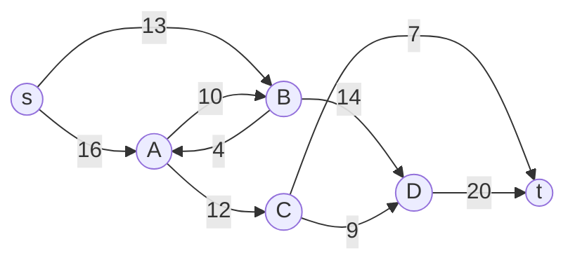

## Learning Objectives

- Define a flow network precisely: a directed graph with a capacity on every edge, a single source, and a single sink.
- State the two conditions a valid flow assignment must satisfy: capacity constraints and flow conservation at every vertex other than the source and sink.
- Define the value of a flow, and state the max-flow problem: find a valid flow assignment of maximum possible value.
- Explain why flow conservation, not capacity alone, is what makes this problem genuinely different from simply routing along the highest-capacity path.
- Identify realistic problems (network bandwidth, pipeline throughput, bipartite matching) that are instances of max-flow once phrased as a flow network.

## Context & Motivation

Every graph algorithm covered in this discipline so far has asked some version of "how do I get from here to there," measured either by number of edges (BFS), total weight (Dijkstra, Bellman-Ford), or total cost of connecting everything (MST). This concept opens a genuinely different graph question, one about *capacity* and *throughput* rather than distance: given a network where every edge has a limited carrying capacity, a single point where material enters (a source), and a single point where it must exit (a sink), how much of that material can actually get from source to sink at once, all constraints respected simultaneously? This is not a rephrasing of shortest paths; a shortest path cares about one route, while a flow problem cares about the combined throughput of every route at once, routes that necessarily compete with each other for capacity on any edge they share.

This question turns out to be one of the most widely applicable in all of algorithmic graph theory. A computer network's bandwidth planning, a pipeline system's maximum throughput, an airline's seat allocation across connecting flights, and even the seemingly unrelated problem of matching job applicants to job openings, each one is, underneath its specific vocabulary, an instance of the same underlying problem this concept defines precisely: maximum flow.

## Core Theory

### Defining a flow network

A **flow network** is a directed graph `G = (V, E)` in which every edge `(u, v)` carries a **capacity** `c(u, v) ≥ 0`, representing the maximum amount that can pass along that edge. Two special vertices are designated: a **source** `s` (where flow originates, with no incoming edges in the simplest formulation) and a **sink** `t` (where flow terminates, with no outgoing edges). Every other vertex is an intermediate point that flow may pass through but neither creates nor destroys.

This is a flow network with source `s`, sink `t`, and capacities labeled on each edge; no flow has been assigned to it yet, only the capacity limits each edge can support.

### A valid flow: two conditions, both mandatory

A **flow** is a function `f(u, v)` assigning a numeric amount to every edge, and it is valid only if it satisfies both of the following, simultaneously, at every edge and every vertex:

**Capacity constraint.** For every edge `(u, v)`: `0 ≤ f(u, v) ≤ c(u, v)`. Flow along an edge can never be negative and can never exceed that edge's capacity, exactly as intuition about a pipe suggests: you cannot push more through a pipe than its diameter allows, and you cannot push a negative amount through it either.

**Flow conservation.** For every vertex `v` other than `s` and `t`: the total flow entering `v` must exactly equal the total flow leaving `v`. Formally, `sum of f(u, v) over all u = sum of f(v, w) over all w`. Nothing accumulates or vanishes at an intermediate vertex, whatever comes in must go back out, exactly like water at a pipe junction: what flows in through any combination of incoming pipes must flow out through some combination of outgoing pipes, with nothing pooling up inside the junction itself.

This second condition, flow conservation, is the one genuinely new idea in this problem, and it is what makes max-flow a fundamentally different question from a shortest-path or a "widest single path" question: a flow assignment is a *global* object, every vertex's in-flow and out-flow must balance simultaneously, not a single route considered in isolation.

### The value of a flow, and the max-flow problem

The **value** of a flow `f`, written `|f|`, is the total amount leaving the source (equivalently, by flow conservation applied network-wide, the total amount arriving at the sink): `|f| = sum of f(s, v) over all v`. The **maximum flow problem** asks: among all valid flow assignments on a given network, find one whose value `|f|` is as large as possible.

Note precisely what is and is not being asked. The problem is not "find the shortest path from `s` to `t`" (a single-route question already fully solved by Dijkstra and Bellman-Ford), and it is not "find the single highest-capacity path" (which ignores that multiple paths can be used simultaneously, each carrying part of the total flow, as long as no edge's capacity is exceeded and no vertex's conservation is violated). It is a question about the best simultaneous use of the entire network at once.

### Real problems that are secretly max-flow

The abstraction pays off precisely because so many concrete problems reduce to it directly, once phrased in terms of a source, a sink, and capacities:

- **Network bandwidth.** Routers and links between them form a flow network directly; link capacities are literal bandwidth limits, and max-flow answers "what is the maximum sustained throughput between this server and that server?"
- **Pipeline or traffic throughput.** Pipe segments or road segments carry a maximum flow rate; max-flow between an origin and destination answers the genuine engineering question of a system's maximum sustainable throughput.
- **Bipartite matching.** Given job applicants and job openings, each applicant qualified for some subset of openings, the question "what is the maximum number of applicants that can be matched to distinct openings" becomes max-flow on a network built by connecting a source to every applicant (capacity 1 each), every applicant to their qualified openings (capacity 1 each), and every opening to a sink (capacity 1 each): a maximum flow of value `k` in this constructed network corresponds exactly to a matching of `k` applicants to `k` distinct openings, a connection that is not obvious from the original problem statement at all until the flow-network translation is made explicit.

## Worked Examples

### Example 1: verifying a candidate flow assignment satisfies both conditions

**Problem:** On the network diagrammed in Core Theory, verify whether the following flow assignment is valid: `f(s,A) = 11`, `f(s,B) = 8`, `f(A,C) = 12`, `f(A,B) = 0`, `f(B,D) = 8`, `f(B,A) = 0`, `f(C,D) = 0`, `f(C,t) = 7`, `f(D,t) = 8`, with all unlisted edges carrying 0 flow, and `f(A, C) = 11` corrected to respect what `A` actually receives.

**Re-deriving a consistent assignment:** Start from what enters `A`: only `f(s,A) = 11` enters, so total out of `A` must also be 11 (conservation). Setting `f(A,C) = 11` and `f(A,B) = 0` satisfies this: `11` in, `11 + 0 = 11` out. ✓

**Checking `B`:** In: `f(s,B) = 8` (plus `f(A,B) = 0`) = 8. Out: `f(B,D) = 8` (plus `f(B,A) = 0`) = 8. ✓ Conservation holds.

**Checking `C`:** In: `f(A,C) = 11`. Out: `f(C,t) = 7` plus `f(C,D) = 0` = 7. This does **not** balance (11 in, 7 out), so this particular assignment as stated is **invalid**: 4 units would have to vanish at `C`, which flow conservation forbids. A valid assignment would need to either reduce `f(A,C)` to 7, or route the remaining 4 units out of `C` somewhere (`f(C,D)`, if capacity allows), or increase `f(C,t)`, respecting `c(C,t) = 7` as an upper bound (so `f(C,t)` cannot itself be raised past 7).

**Lesson:** Checking a candidate flow means checking *every* vertex's conservation, not just spot-checking a few, exactly the discipline this example is meant to build before Core Theory's conditions are trusted as automatically satisfied by "a reasonable-looking" assignment.

### Example 2: computing the value of a corrected, valid flow

**Problem:** Correct Example 1 by setting `f(A,C) = 7` (instead of 11) and `f(A,B) = 4` (routing the remaining 4 units of `A`'s 11 through `B` instead), with `f(B,D)` increased to `12` to carry both `B`'s original 8 and this new 4. Verify validity and compute the flow's value.

**Checking `A`:** In: 11 (from `s`). Out: `f(A,C) + f(A,B) = 7 + 4 = 11`. ✓

**Checking `B`:** In: `f(s,B) + f(A,B) = 8 + 4 = 12`. Out: `f(B,D) = 12`. ✓ (and `c(B,D) = 14 ≥ 12`, capacity respected.)

**Checking `C`:** In: `f(A,C) = 7`. Out: `f(C,t) = 7`. ✓

**Checking `D`:** In: `f(B,D) = 12`. Out: `f(D,t) = 12` needed; `c(D,t) = 20 ≥ 12`, so this is achievable. ✓

**Value:** `|f| = f(s,A) + f(s,B) = 11 + 8 = 19`, equivalently `f(C,t) + f(D,t) = 7 + 12 = 19`. Both computations of `|f|` agree, exactly as flow conservation network-wide guarantees they must.

## Common Misconceptions & Pitfalls

- **"Max-flow is just shortest path with a different cost function."** Shortest path finds one route; max-flow finds a simultaneous assignment across potentially many routes at once, constrained by conservation at every vertex, not just a total-weight comparison along a single path. Example 2's valid flow uses two disjoint paths (`s→A→C→t` and `s→A→B→D→t`, with `A` splitting its incoming flow between them) simultaneously, something a single-path algorithm has no way to express.
- **"A flow assignment is valid as long as no single edge exceeds its capacity."** Example 1 shows a capacity-respecting assignment can still be invalid: every listed edge was within capacity, yet the assignment failed at vertex `C` because conservation, not capacity, was violated. Both conditions must hold, and capacity alone is not sufficient.
- **"The value of a flow can be computed only by summing what leaves the source."** It can equally be computed by summing what arrives at the sink, as Example 2 confirms both ways; this equality is not a coincidence, it follows directly from conservation applied to every intermediate vertex, and it becomes a genuinely useful cross-check for any hand-verified flow.
- **"Bipartite matching and network bandwidth are unrelated problems that happen to share the word 'flow' informally."** Core Theory's bipartite matching reduction is a literal, formal translation, not an analogy: a specific constructed flow network's maximum flow value *is* the matching problem's answer, with no approximation or loss of information in the translation.

## Summary

A flow network is a directed graph with a capacity on every edge, a designated source, and a designated sink. A valid flow assignment must respect capacity on every edge (never negative, never exceeding that edge's limit) and conservation at every intermediate vertex (total in equals total out), a genuinely global constraint that distinguishes this from a single-route shortest-path question. The value of a flow is the total leaving the source, equivalently the total arriving at the sink, and the maximum flow problem asks for a valid assignment maximizing that value. This abstraction captures a surprising range of concrete problems, network bandwidth, pipeline throughput, and bipartite matching among them, once each is translated into the source-sink-capacity vocabulary this concept establishes. The next concept develops the first general-purpose method for actually computing a maximum flow: the Ford-Fulkerson method, built around repeatedly finding an augmenting path and pushing more flow along it.

## Documentation Links

- [MIT 6.006 - Lecture Notes (OCW)](https://ocw.mit.edu/courses/6-006-introduction-to-algorithms-spring-2020/pages/lecture-notes/): doc
- [Sedgewick & Wayne - Algorithms Lectures (Princeton)](https://algs4.cs.princeton.edu/lectures/): doc
