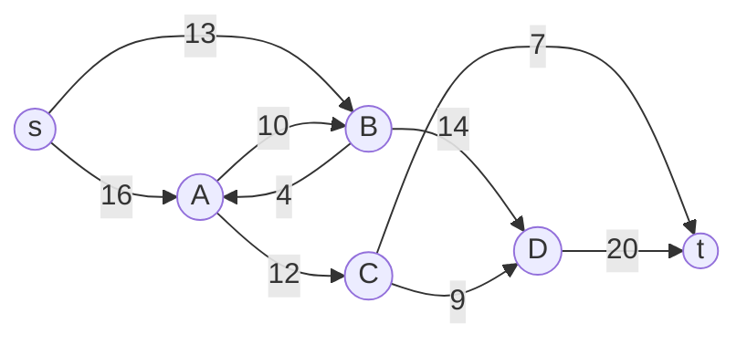

## Objetivos de Aprendizagem

- Definir precisamente uma rede de fluxo: um grafo direcionado com uma capacidade em toda aresta, uma única fonte e um único sumidouro.
- Enunciar as duas condições que uma atribuição de fluxo válida precisa satisfazer: restrição de capacidade e conservação de fluxo em todo vértice além da fonte e do sumidouro.
- Definir o valor de um fluxo, e enunciar o problema do fluxo máximo: encontrar uma atribuição de fluxo válida de valor máximo possível.
- Explicar por que conservação de fluxo, não capacidade sozinha, é o que torna esse problema genuinamente diferente de simplesmente rotear pelo caminho de maior capacidade.
- Identificar problemas realistas (banda de rede, vazão de duto, emparelhamento bipartido) que são instâncias de fluxo máximo uma vez formulados como uma rede de fluxo.

## Contexto e Motivação

Todo algoritmo de grafo coberto até agora nesta disciplina perguntou alguma versão de "como chego daqui até ali", medido ou por número de arestas (BFS), peso total (Dijkstra, Bellman-Ford), ou custo total de conectar tudo (MST). Este conceito abre uma pergunta genuinamente diferente sobre grafos, uma sobre *capacidade* e *vazão* em vez de distância: dada uma rede onde toda aresta tem uma capacidade de transporte limitada, um único ponto onde material entra (uma fonte), e um único ponto onde precisa sair (um sumidouro), quanto desse material de fato consegue ir da fonte ao sumidouro de uma vez, respeitando todas as restrições simultaneamente? Isso não é uma reformulação de caminhos mínimos, um caminho mínimo se importa com uma única rota, enquanto um problema de fluxo se importa com a vazão combinada de todas as rotas ao mesmo tempo, rotas que necessariamente competem entre si por capacidade em qualquer aresta que compartilham.

Essa pergunta acaba sendo uma das mais amplamente aplicáveis em toda a teoria algorítmica de grafos. O planejamento de banda de uma rede de computadores, a vazão máxima de um sistema de dutos, a alocação de assentos de uma companhia aérea através de voos de conexão, e até o problema aparentemente não relacionado de emparelhar candidatos a vagas de emprego, cada um deles é, por trás de seu vocabulário específico, uma instância do mesmo problema subjacente que este conceito define precisamente: fluxo máximo.

## Teoria Central

### Definindo uma rede de fluxo

Uma **rede de fluxo** é um grafo direcionado `G = (V, E)` no qual toda aresta `(u, v)` carrega uma **capacidade** `c(u, v) ≥ 0`, representando o máximo que pode passar por aquela aresta. Dois vértices especiais são designados: uma **fonte** `s` (onde o fluxo se origina, sem arestas de entrada na formulação mais simples) e um **sumidouro** `t` (onde o fluxo termina, sem arestas de saída). Todo outro vértice é um ponto intermediário pelo qual o fluxo pode passar mas que não cria nem destrói fluxo.

Esta é uma rede de fluxo com fonte `s`, sumidouro `t`, e capacidades rotuladas em cada aresta; nenhum fluxo foi atribuído a ela ainda, apenas os limites de capacidade que cada aresta consegue suportar.

### Um fluxo válido: duas condições, ambas obrigatórias

Um **fluxo** é uma função `f(u, v)` atribuindo uma quantidade numérica a toda aresta, e só é válido se satisfizer ambas as condições a seguir, simultaneamente, em toda aresta e todo vértice:

**Restrição de capacidade.** Para toda aresta `(u, v)`: `0 ≤ f(u, v) ≤ c(u, v)`. O fluxo em uma aresta nunca pode ser negativo e nunca pode exceder a capacidade daquela aresta, exatamente como a intuição sobre um cano sugere: você não pode empurrar mais do que o diâmetro de um cano permite, e também não pode empurrar uma quantidade negativa por ele.

**Conservação de fluxo.** Para todo vértice `v` além de `s` e `t`: o fluxo total entrando em `v` precisa ser exatamente igual ao fluxo total saindo de `v`. Formalmente, `soma de f(u, v) sobre todo u = soma de f(v, w) sobre todo w`. Nada se acumula ou desaparece em um vértice intermediário, tudo que entra precisa sair, exatamente como água em uma junção de canos: o que flui por qualquer combinação de canos de entrada precisa fluir para fora por alguma combinação de canos de saída, sem nada se acumulando dentro da própria junção.

Essa segunda condição, conservação de fluxo, é a ideia genuinamente nova neste problema, e é o que torna fluxo máximo uma pergunta fundamentalmente diferente de uma pergunta de caminho mínimo ou de "caminho único mais largo": uma atribuição de fluxo é um objeto *global*, o fluxo de entrada e saída de todo vértice precisa se equilibrar simultaneamente, não uma única rota considerada isoladamente.

### O valor de um fluxo, e o problema do fluxo máximo

O **valor** de um fluxo `f`, escrito `|f|`, é a quantidade total saindo da fonte (equivalentemente, por conservação de fluxo aplicada à rede inteira, a quantidade total chegando ao sumidouro): `|f| = soma de f(s, v) sobre todo v`. O **problema do fluxo máximo** pergunta: entre todas as atribuições de fluxo válidas em uma rede dada, encontre uma cujo valor `|f|` seja o maior possível.

Note precisamente o que está e o que não está sendo perguntado. O problema não é "encontre o caminho mais curto de `s` a `t`" (uma pergunta de rota única já completamente resolvida por Dijkstra e Bellman-Ford), e não é "encontre o único caminho de maior capacidade" (o que ignora que múltiplos caminhos podem ser usados simultaneamente, cada um carregando parte do fluxo total, desde que nenhuma capacidade de aresta seja excedida e nenhuma conservação de vértice seja violada). É uma pergunta sobre o melhor uso simultâneo da rede inteira de uma vez.

### Problemas reais que secretamente são fluxo máximo

A abstração se paga precisamente porque tantos problemas concretos se reduzem a ela diretamente, uma vez formulados em termos de uma fonte, um sumidouro, e capacidades:

- **Banda de rede.** Roteadores e os links entre eles formam uma rede de fluxo diretamente; capacidades de link são limites literais de banda, e fluxo máximo responde "qual é a vazão sustentada máxima entre este servidor e aquele servidor?"
- **Vazão de duto ou tráfego.** Segmentos de duto ou de estrada carregam uma taxa de fluxo máxima; fluxo máximo entre uma origem e um destino responde a pergunta genuína de engenharia sobre a vazão máxima sustentável de um sistema.
- **Emparelhamento bipartido.** Dados candidatos a emprego e vagas abertas, cada candidato qualificado para algum subconjunto de vagas, a pergunta "qual é o número máximo de candidatos que pode ser emparelhado a vagas distintas" se torna fluxo máximo em uma rede construída conectando uma fonte a todo candidato (capacidade 1 cada), todo candidato às suas vagas qualificadas (capacidade 1 cada), e toda vaga a um sumidouro (capacidade 1 cada): um fluxo máximo de valor `k` nessa rede construída corresponde exatamente a um emparelhamento de `k` candidatos a `k` vagas distintas, uma conexão que não é nada óbvia a partir do enunciado original do problema até que a tradução para rede de fluxo seja tornada explícita.

## Exemplos Resolvidos

### Exemplo 1: verificando se uma atribuição de fluxo candidata satisfaz ambas as condições

**Problema:** Na rede diagramada na Teoria Central, verifique se a seguinte atribuição de fluxo é válida: `f(s,A) = 11`, `f(s,B) = 8`, `f(A,C) = 12`, `f(A,B) = 0`, `f(B,D) = 8`, `f(B,A) = 0`, `f(C,D) = 0`, `f(C,t) = 7`, `f(D,t) = 8`, com toda aresta não listada carregando fluxo 0, e `f(A, C) = 11` corrigido para respeitar o que `A` de fato recebe.

**Re-derivando uma atribuição consistente:** Comece pelo que entra em `A`: só `f(s,A) = 11` entra, então o total saindo de `A` também precisa ser 11 (conservação). Definir `f(A,C) = 11` e `f(A,B) = 0` satisfaz isso: `11` entrando, `11 + 0 = 11` saindo. ✓

**Verificando `B`:** Entrando: `f(s,B) = 8` (mais `f(A,B) = 0`) = 8. Saindo: `f(B,D) = 8` (mais `f(B,A) = 0`) = 8. ✓ Conservação vale.

**Verificando `C`:** Entrando: `f(A,C) = 11`. Saindo: `f(C,t) = 7` mais `f(C,D) = 0` = 7. Isso **não** equilibra (11 entrando, 7 saindo), então essa atribuição específica, como enunciada, é **inválida**: 4 unidades teriam que desaparecer em `C`, o que conservação de fluxo proíbe. Uma atribuição válida precisaria ou reduzir `f(A,C)` para 7, ou rotear as 4 unidades restantes para fora de `C` para algum lugar (`f(C,D)`, se a capacidade permitir), ou aumentar `f(C,t)`, respeitando `c(C,t) = 7` como um limite superior (então `f(C,t)` não pode ser elevado além de 7).

**Lição:** Verificar um fluxo candidato significa verificar a conservação de *todo* vértice, não só verificar alguns pontualmente, exatamente a disciplina que este exemplo pretende construir antes de as condições da Teoria Central serem confiadas como automaticamente satisfeitas por uma atribuição "que parece razoável".

### Exemplo 2: calculando o valor de um fluxo válido corrigido

**Problema:** Corrija o Exemplo 1 definindo `f(A,C) = 7` (em vez de 11) e `f(A,B) = 4` (roteando as 4 unidades restantes dos 11 de `A` através de `B` em vez disso), com `f(B,D)` aumentado para `12` para carregar tanto os 8 originais de `B` quanto esses novos 4. Verifique a validade e calcule o valor do fluxo.

**Verificando `A`:** Entrando: 11 (de `s`). Saindo: `f(A,C) + f(A,B) = 7 + 4 = 11`. ✓

**Verificando `B`:** Entrando: `f(s,B) + f(A,B) = 8 + 4 = 12`. Saindo: `f(B,D) = 12`. ✓ (e `c(B,D) = 14 ≥ 12`, capacidade respeitada.)

**Verificando `C`:** Entrando: `f(A,C) = 7`. Saindo: `f(C,t) = 7`. ✓

**Verificando `D`:** Entrando: `f(B,D) = 12`. Saindo: `f(D,t) = 12` necessário; `c(D,t) = 20 ≥ 12`, então isso é alcançável. ✓

**Valor:** `|f| = f(s,A) + f(s,B) = 11 + 8 = 19`, equivalentemente `f(C,t) + f(D,t) = 7 + 12 = 19`. Os dois cálculos de `|f|` concordam, exatamente como a conservação de fluxo pela rede inteira garante que devem.

## Equívocos Comuns e Armadilhas

- **"Fluxo máximo é só caminho mínimo com uma função de custo diferente."** Caminho mínimo encontra uma rota; fluxo máximo encontra uma atribuição simultânea através de potencialmente muitas rotas ao mesmo tempo, restrita por conservação em todo vértice, não só uma comparação de peso total ao longo de um único caminho. O fluxo válido do Exemplo 2 usa dois caminhos disjuntos (`s→A→C→t` e `s→A→B→D→t`, com `A` dividindo seu fluxo de entrada entre eles) simultaneamente, algo que um algoritmo de caminho único não tem como expressar.
- **"Uma atribuição de fluxo é válida contanto que nenhuma aresta individual exceda sua capacidade."** O Exemplo 1 mostra que uma atribuição que respeita capacidade ainda pode ser inválida: toda aresta listada estava dentro da capacidade, mas a atribuição falhou no vértice `C` porque conservação, não capacidade, foi violada. Ambas as condições precisam valer, e capacidade sozinha não é suficiente.
- **"O valor de um fluxo só pode ser calculado somando o que sai da fonte."** Pode ser calculado igualmente somando o que chega ao sumidouro, como o Exemplo 2 confirma das duas formas; essa igualdade não é uma coincidência, ela decorre diretamente da conservação aplicada a todo vértice intermediário, e se torna uma checagem cruzada genuinamente útil para qualquer fluxo verificado manualmente.
- **"Emparelhamento bipartido e banda de rede são problemas não relacionados que por acaso compartilham a palavra 'fluxo' informalmente."** A redução de emparelhamento bipartido da Teoria Central é uma tradução literal e formal, não uma analogia: o valor do fluxo máximo de uma rede construída específica *é* a resposta do problema de emparelhamento, sem nenhuma aproximação ou perda de informação na tradução.

## Resumo

Uma rede de fluxo é um grafo direcionado com uma capacidade em toda aresta, uma fonte designada, e um sumidouro designado. Uma atribuição de fluxo válida precisa respeitar capacidade em toda aresta (nunca negativa, nunca excedendo o limite daquela aresta) e conservação em todo vértice intermediário (total entrando igual a total saindo), uma restrição genuinamente global que distingue isso de uma pergunta de caminho mínimo de rota única. O valor de um fluxo é o total saindo da fonte, equivalentemente o total chegando ao sumidouro, e o problema do fluxo máximo pergunta por uma atribuição válida maximizando esse valor. Essa abstração captura uma gama surpreendente de problemas concretos, banda de rede, vazão de duto, e emparelhamento bipartido entre eles, uma vez que cada um é traduzido para o vocabulário de fonte-sumidouro-capacidade que este conceito estabelece. O próximo conceito desenvolve o primeiro método de propósito geral para de fato calcular um fluxo máximo: o método de Ford-Fulkerson, construído em torno de repetidamente encontrar um caminho de aumento e empurrar mais fluxo por ele.

## Documentation Links

- [MIT 6.006 - Lecture Notes (OCW)](https://ocw.mit.edu/courses/6-006-introduction-to-algorithms-spring-2020/pages/lecture-notes/): doc
- [Sedgewick & Wayne - Algorithms Lectures (Princeton)](https://algs4.cs.princeton.edu/lectures/): doc
