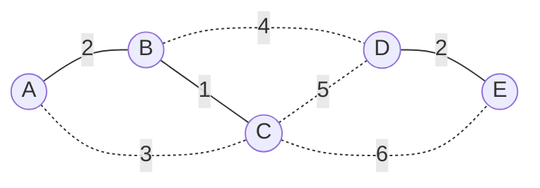

## Learning Objectives

- State Prim's algorithm precisely: starting from any single vertex, repeatedly extract the cheapest edge connecting the growing tree to a vertex not yet in it, using a binary heap as the priority queue.
- Justify Prim's correctness via the cut property, identifying the specific cut it examines at every step (tree-so-far versus everything not yet in the tree).
- Draw the structural parallel between Prim's algorithm and Dijkstra's algorithm — both grow a structure one vertex at a time, always taking the cheapest next option off a heap — while correctly distinguishing what each one compares (edge weight versus path distance).
- Derive Prim's running time with a binary heap, O(E log V), and explain where each term comes from.
- Trace Prim's algorithm by hand on a small weighted graph, and compare the resulting tree to Kruskal's algorithm's result on the same graph, including cases where the two produce different but equally valid MSTs.

## Context & Motivation

Kruskal's algorithm showed one way of instantiating the generic greedy MST algorithm: sort every edge globally, then sweep through that sorted list once, using union-find to reject anything that would close a cycle. Prim's algorithm is the second classic instantiation of the exact same underlying template — and it is worth being clear from the outset that it is not a "better" or "worse" algorithm than Kruskal's, just a different, equally correct way of applying the same cut-property guarantee, organized around a different way of choosing which cut to examine at each step.

Where Kruskal's algorithm looks at the whole edge set at once and lets components merge wherever the sorted order happens to connect them, Prim's algorithm instead commits to a single starting vertex and grows one connected tree outward from it, one vertex at a time. At every step, the tree built so far occupies some subset S of the vertices, and everything else sits outside S; the algorithm looks at every edge with exactly one endpoint in S (these are precisely the edges crossing the cut between S and V − S) and picks the cheapest one, adding both that edge and the new vertex it reaches to the tree. This is a direct, literal reading of the cut property: at every step, the cut being examined is fixed by which vertices happen to already be in the tree, and the edge taken is guaranteed, by the cut property, to belong to some MST.

Finding "the cheapest edge crossing the current cut" quickly, at every one of the n − 1 steps this process needs, is exactly a repeated extract-min operation over a changing set of candidate edges — and this is precisely the same computational pattern Dijkstra's algorithm relies on for computing shortest paths: both algorithms grow a structure outward from a starting vertex, one vertex at a time, and at every step consult a binary heap to find the cheapest next option instantly rather than scanning every candidate from scratch. The heap's insert and extract-min operations, each bounded by the tree's height and therefore O(log n) as already established, are what let both algorithms afford doing this scan at every single step of an n-step process without the whole thing degrading to something quadratic. This is a genuine structural kinship, not a superficial one — but it comes with one real, worth-stating difference, developed below: what the two algorithms compare when deciding what's "cheapest" is not the same quantity at all.

## Core Theory

### The algorithm, stated precisely

Given a connected, weighted, undirected graph G = (V, E):

1. Pick any starting vertex s; initialize the tree-so-far as the single vertex set S = {s}.
2. Maintain a min-heap of candidate edges — every edge with exactly one endpoint in S and the other outside S — keyed by weight. (Initially, this is every edge incident to s.)
3. Repeat until S contains all of V:
   - Extract the minimum-weight edge (u, v) from the heap, where u ∈ S and v ∉ S. (If the extracted edge's "outside" endpoint turns out to already be in S — because it was added to the heap earlier from a different tree vertex and has since been absorbed — discard it and extract again; this is a stale entry, not a valid crossing edge anymore.)
   - Add v to S and the edge (u, v) to the growing tree.
   - For every edge (v, w) with w ∉ S, insert it into the heap (it is now a new candidate crossing edge, since v has just joined S).
4. Stop once |S| = |V|; the accumulated edges form a minimum spanning tree.

Each vertex is added to S exactly once, so the loop runs n − 1 times (once per non-starting vertex), and each time a vertex joins S, its incident edges to still-outside vertices get freshly inserted into the heap — this is exactly analogous to how Dijkstra's algorithm inserts freshly discovered tentative distances into its own heap each time it settles a vertex.

### Correctness via the cut property

At the moment the algorithm extracts an edge (u, v) with u ∈ S and v ∉ S, that edge is, by construction, the minimum-weight edge among every candidate currently in the heap that crosses the cut (S, V − S) — and every edge crossing that cut which hasn't already been superseded by a cheaper one is present in the heap at that point (each was inserted when its S-side endpoint joined). So the extracted edge is genuinely a minimum-weight edge crossing the current cut, and the cut property guarantees it belongs to some MST. Since S starts as a single vertex and grows by exactly one vertex per step until it covers all of V, and every edge added is safe by this argument, the final result — n − 1 edges connecting all of V — is a correct MST, by the identical logic that justified Kruskal's algorithm, applied to a different sequence of cuts (here, always "S versus the rest," rather than Kruskal's implicit, globally-sorted sequence of component-merging cuts).

### Complexity, and where each term comes from

Across the whole run, the heap receives at most one insertion per edge (each edge (v, w) is inserted at most once — when its first endpoint to join S causes it to become a candidate — even though it might later become stale and get discarded without ever being extracted usefully), so there are O(E) insertions, each O(log E) = O(log V) (since E is at most O(V²), log E and log V differ only by a constant factor). There are also O(E) extractions in the worst case (every inserted edge is eventually pulled out, whether it's used or discarded as stale), each also O(log V). Both operations together give O(E log V) total. This matches Kruskal's O(E log E) = O(E log V) asymptotically — the two algorithms have the same big-O running time, and the choice between them in practice usually comes down to graph density (Prim's, implemented with an adjacency list and a heap, tends to be preferred for dense graphs, while Kruskal's tends to be preferred when the edge list is already sorted or nearly so, or when the graph is sparse) rather than one being asymptotically superior to the other.

### The real parallel — and the real difference — with Dijkstra's algorithm

Both Prim's algorithm and Dijkstra's algorithm follow the identical outer shape: start from one vertex, maintain a frontier of candidate next-steps in a heap, repeatedly extract the cheapest one, mark a new vertex as settled, and insert its newly reachable neighbors as fresh candidates. The heap's role is identical in both — answer "what's cheapest right now" in O(log n) time, without which both algorithms would need an O(n) linear scan over candidates at every one of their n steps, turning an O(E log V)-shaped algorithm into something closer to O(V²) or worse.

The difference that matters is *what number sits in the heap next to each candidate*. Prim's algorithm compares raw **edge weights** — the cost of the single edge from the tree to a candidate vertex, considered in isolation, with no memory of how the tree got there. Dijkstra's algorithm compares **cumulative path distances** — the total cost of the best path found so far from the source all the way to a candidate vertex, which means Dijkstra's algorithm must *update* a candidate's key when a cheaper path to it is discovered through some other route (a decrease-key-style operation), while Prim's algorithm only ever cares about the single cheapest edge reaching a candidate directly from the tree, regardless of how far that candidate is, overall, from the starting vertex. Two vertices connected by an expensive direct edge but reachable via a cheap multi-hop path are treated identically by both algorithms in terms of heap mechanics, but the *numbers* they'd carry would differ — Prim's heap entry cares only about that one direct edge's weight, while Dijkstra's would reflect the cheaper multi-hop total. This is why the two algorithms, despite sharing essentially the same code skeleton around the heap, solve genuinely different problems: Prim's produces a tree of minimum total *edge* weight; Dijkstra's produces a tree (or set of paths) of minimum total *distance from the source* to every vertex, and these are provably not always the same tree, even on the identical graph.

Starting Prim's algorithm from A on this graph: S = {A}; cheapest edge from A is A–B (weight 2), so B joins; cheapest edge crossing {A,B} is B–C (weight 1), so C joins; cheapest edge crossing {A,B,C} is now compared among A–C (3, stale — C already in S), B–D (4), C–D (5), C–E (6) — B–D wins, D joins; cheapest edge crossing {A,B,C,D} is D–E (2) versus C–E (6) — D–E wins, E joins. Accumulated edges: A–B, B–C, B–D, D–E — total weight 2 + 1 + 4 + 2 = 9, the identical total found by Kruskal's algorithm on this same graph (though notice the edges themselves — A–B, B–C, B–D, D–E — are exactly the same set Kruskal's algorithm found too, in this particular case).

## Worked Examples

### Example 1 — running Prim's from a different start vertex, same graph as Kruskal's Example 1

**Problem:** Using the same five-building graph from the Kruskal's algorithm concept (A–B: 2, A–C: 3, B–C: 1, B–D: 4, C–D: 5, C–E: 6, D–E: 2), run Prim's algorithm starting from vertex D instead of A, and confirm it reaches the same total weight.

**Trace.** S = {D}. Candidate edges from D: B–D (4), C–D (5), D–E (2). Cheapest is D–E (2) — E joins. S = {D, E}. New candidates from E: C–E (6). Full candidate set now: B–D (4), C–D (5), C–E (6). Cheapest is B–D (4) — B joins. S = {D, E, B}. New candidates from B: A–B (2), B–C (1). Full candidate set: C–D (5), C–E (6), A–B (2), B–C (1). Cheapest is B–C (1) — C joins. S = {D, E, B, C}. New candidates from C: A–C (3) (C–D and C–E are now stale, both endpoints already in S). Full candidate set: C–D (5, stale), C–E (6, stale), A–B (2), A–C (3). Cheapest valid entry is A–B (2) — A joins. S = {A, B, C, D, E} — done.

**Accepted edges:** D–E, B–D, B–C, A–B — total weight 2 + 4 + 1 + 2 = 9. Same total weight as before, and in fact the identical edge set as Example 1's trace from vertex A and as Kruskal's algorithm's result — this particular graph happens to have a unique MST (all its edge weights are distinct except the D–E/A–B tie at weight 2, and that tie doesn't affect which edges end up chosen), so any correct algorithm, from any starting vertex, converges on the same tree.

### Example 2 — a tie that produces a genuinely different tree than Kruskal's

**Problem:** Vertices {1, 2, 3}, all three edges weight 5 (1–2, 2–3, 1–3) — the same tied-weight triangle from the minimum spanning tree problem concept's Example 3, where any two of the three edges form a valid MST of total weight 10. Run Kruskal's algorithm and Prim's algorithm (from vertex 1) and compare.

**Kruskal's**, processing edges in whatever order a stable sort places equal-weight edges (say, input order 1–2, 2–3, 1–3): accepts 1–2 (first, no cycle possible yet), accepts 2–3 (connects new vertex 3), rejects 1–3 (1 and 3 already connected via 1-2-3). Result: {1–2, 2–3}.

**Prim's**, starting from vertex 1: S = {1}; candidates 1–2 (5), 1–3 (5) — tied; suppose the heap's tie-breaking (implementation-dependent, say by insertion order) extracts 1–2 first — vertex 2 joins. S = {1, 2}; candidates 1–3 (5), 2–3 (5) — tied again; suppose 2–3 is extracted — vertex 3 joins. Result: {1–2, 2–3} — same as Kruskal's here, by coincidence of tie-breaking, but had the heap broken the second tie the other way, extracting 1–3 instead, the result would have been {1–2, 1–3} — a different edge set, still total weight 10, still a fully valid MST.

**Conclusion.** Both algorithms are correct, and on this graph, whether they land on the identical tree or two different ones depends entirely on implementation-specific tie-breaking inside the sort (Kruskal's) or the heap (Prim's) — not on any flaw in either algorithm. This is the concrete demonstration of the point already made when MSTs were first defined: uniqueness of the MST is guaranteed only when edge weights are all distinct; with ties, "the MST" can validly refer to more than one tree, and different correct algorithms (or the same algorithm with different tie-breaking or a different start vertex) can land on different, equally minimal, members of that set.

## Common Misconceptions & Pitfalls

- **"Prim's algorithm and Dijkstra's algorithm are basically the same algorithm applied to the same problem."** They share an outer skeleton (grow from one vertex, use a heap, extract cheapest-first) but solve different problems and compare different quantities: Prim's compares the weight of a single edge from the tree to a candidate; Dijkstra's compares the total accumulated path distance from the source to a candidate. A graph can have a minimum spanning tree that is not the same tree as Dijkstra's shortest-path tree from the same source — the two structures optimize different objectives (minimum total tree weight versus minimum distance-from-source to every vertex) and generally coincide only by chance or in special cases (such as when a single source vertex's shortest-path tree happens to also minimize total weight).
- **"Since Kruskal's and Prim's both compute an MST, they must always produce the identical edge set on the same graph."** Both are guaranteed to produce a tree of the identical *minimum total weight*, but as Example 2 shows, when edge weights tie, the specific edges chosen can differ between the two algorithms — or even between two runs of the same algorithm with different tie-breaking or a different starting vertex for Prim's. Only when all edge weights are distinct is the MST (and therefore the result of any correct algorithm) guaranteed unique.
- **"The heap in Prim's algorithm needs to hold every edge in the graph from the start."** Only edges incident to vertices already in S are ever inserted, and only when their S-side endpoint first joins — the heap's contents grow incrementally as the tree grows, never needing more than O(E) total insertions across the whole run, not because every edge is loaded upfront.
- **"A stale heap entry (both endpoints already in S) is a bug that needs to be prevented."** It's an expected, harmless byproduct of the algorithm as commonly implemented with a basic (non-decrease-key) binary heap: an edge can be inserted once from each of its two endpoints as they separately join S, and whichever copy is extracted second is simply discarded on sight (checked and skipped) rather than treated as an error — this is a normal part of the O(E log V) accounting, not something requiring special-case correctness handling.

## Summary

Prim's algorithm is the second concrete instantiation of the generic greedy MST algorithm: starting from a single vertex, it grows one connected tree outward, and at every step extracts the minimum-weight edge crossing the cut between the tree built so far and everything outside it, using a binary heap to find that minimum quickly — the same heap mechanics, and the same "grow one vertex at a time, always take the cheapest next option" outer shape, that Dijkstra's algorithm uses, though Prim's compares raw edge weights while Dijkstra's compares cumulative path distances, a real distinction despite the shared skeleton. Correctness again follows directly from the cut property, applied to the specific sequence of cuts defined by the growing tree-so-far. With a binary heap, the running time is O(E log V), asymptotically matching Kruskal's O(E log E). On graphs with tied edge weights, Prim's and Kruskal's algorithms — or even two runs of the same algorithm with different starting points or tie-breaking — can produce different edge sets that are nonetheless equally valid minimum spanning trees, since only the total weight, not the specific tree, is guaranteed unique in that case.

## Documentation Links

- [Sedgewick & Wayne — Algorithms Lectures (Princeton)](https://algs4.cs.princeton.edu/lectures/) — doc
- [MIT 6.006 — Lecture Notes (OCW)](https://ocw.mit.edu/courses/6-006-introduction-to-algorithms-spring-2020/pages/lecture-notes/) — doc
