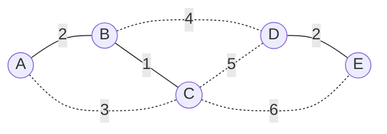

## Objetivos de Aprendizagem

- Enunciar o algoritmo de Prim precisamente: começando de um único vértice, extraia repetidamente a aresta mais barata conectando a árvore crescente a um vértice ainda não nela, usando um heap binário como fila de prioridade.
- Justificar a correção de Prim via a propriedade de corte, identificando o corte específico que examina em todo passo (árvore-até-agora versus tudo ainda não na árvore).
- Traçar o paralelo estrutural entre o algoritmo de Prim e o algoritmo de Dijkstra, ambos crescem uma estrutura um vértice de cada vez, sempre tomando a próxima opção mais barata de um heap, enquanto distinguem corretamente o que cada um compara (peso de aresta versus distância de caminho).
- Derivar o tempo de execução de Prim com um heap binário, O(E log V), e explicar de onde vem cada termo.
- Rastrear o algoritmo de Prim manualmente em um pequeno grafo ponderado, e comparar a árvore resultante com o resultado do algoritmo de Kruskal no mesmo grafo, incluindo casos onde os dois produzem MSTs diferentes mas igualmente válidas.

## Contexto e Motivação

O algoritmo de Kruskal mostrou uma forma de instanciar o algoritmo genérico guloso de MST: ordene toda aresta globalmente, depois varra essa lista ordenada uma vez, usando union-find para rejeitar qualquer coisa que fecharia um ciclo. O algoritmo de Prim é a segunda instanciação clássica do mesmíssimo modelo subjacente, e vale a pena deixar claro desde o início que não é um algoritmo "melhor" ou "pior" que o de Kruskal, apenas uma forma diferente, igualmente correta, de aplicar a mesma garantia da propriedade de corte, organizada em torno de uma forma diferente de escolher qual corte examinar a cada passo.

Onde o algoritmo de Kruskal olha para o conjunto de arestas inteiro de uma vez e deixa componentes mesclarem onde quer que a ordem ordenada aconteça de conectá-los, o algoritmo de Prim em vez disso se compromete com um único vértice inicial e cresce uma árvore conexa para fora a partir dele, um vértice de cada vez. Em todo passo, a árvore construída até agora ocupa algum subconjunto S dos vértices, e tudo mais fica fora de S; o algoritmo olha para toda aresta com exatamente um extremo em S (essas são precisamente as arestas cruzando o corte entre S e V − S) e escolhe a mais barata, adicionando tanto aquela aresta quanto o novo vértice que ela alcança à árvore. Isso é uma leitura direta, literal, da propriedade de corte: em todo passo, o corte sendo examinado é fixado por quais vértices acontecem de já estar na árvore, e a aresta tomada é garantida, pela propriedade de corte, pertencer a alguma MST.

Encontrar "a aresta mais barata cruzando o corte atual" rapidamente, em cada um dos n − 1 passos que este processo precisa, é exatamente uma operação repetida de extract-min sobre um conjunto mudando de arestas candidatas, e esse é precisamente o mesmo padrão computacional do qual o algoritmo de Dijkstra depende para calcular caminhos mais curtos: ambos os algoritmos crescem uma estrutura para fora a partir de um vértice inicial, um vértice de cada vez, e em todo passo consultam um heap binário para encontrar a próxima opção mais barata instantaneamente em vez de varrer todo candidato do zero. As operações de inserção e extract-min do heap, cada uma limitada pela altura da árvore e portanto O(log n) como já estabelecido, são o que permite que ambos os algoritmos se dêem ao luxo de fazer essa varredura em toda única etapa de um processo de n etapas sem que tudo degrade para algo quadrático. Este é um parentesco estrutural genuíno, não superficial, mas vem com uma diferença real, que vale a pena enunciar, desenvolvida abaixo: o que os dois algoritmos comparam ao decidir o que é "mais barato" não é a mesma quantidade de forma alguma.

## Teoria Central

### O algoritmo, enunciado precisamente

Dado um grafo conexo, ponderado, não direcionado G = (V, E):

1. Escolha qualquer vértice inicial s; inicialize a árvore-até-agora como o conjunto de vértice único S = {s}.
2. Mantenha um min-heap de arestas candidatas, toda aresta com exatamente um extremo em S e o outro fora de S, chaveada por peso. (Inicialmente, isso é toda aresta incidente a s.)
3. Repita até que S contenha todo V:
   - Extraia a aresta de peso mínimo (u, v) do heap, onde u ∈ S e v ∉ S. (Se o extremo "de fora" da aresta extraída acaba de já estar em S, porque foi adicionado ao heap anteriormente a partir de um vértice de árvore diferente e desde então foi absorvido, descarte e extraia de novo; essa é uma entrada obsoleta, não mais uma aresta de cruzamento válida.)
   - Adicione v a S e a aresta (u, v) à árvore crescente.
   - Para toda aresta (v, w) com w ∉ S, insira-a no heap (agora é uma nova aresta candidata de cruzamento, já que v acabou de se juntar a S).
4. Pare uma vez que |S| = |V|; as arestas acumuladas formam uma árvore geradora mínima.

Todo vértice é adicionado a S exatamente uma vez, então o laço roda n − 1 vezes (uma vez por vértice não inicial), e toda vez que um vértice se junta a S, suas arestas incidentes a vértices ainda de fora são recém-inseridas no heap, isso é exatamente análogo a como o algoritmo de Dijkstra insere distâncias tentativas recém-descobertas em seu próprio heap toda vez que estabelece um vértice.

### Correção via a propriedade de corte

No momento em que o algoritmo extrai uma aresta (u, v) com u ∈ S e v ∉ S, essa aresta é, por construção, a aresta de peso mínimo entre toda candidata atualmente no heap que cruza o corte (S, V − S), e toda aresta cruzando aquele corte que ainda não foi superada por uma mais barata está presente no heap naquele ponto (cada uma foi inserida quando seu extremo do lado de S se juntou). Então a aresta extraída é genuinamente uma aresta de peso mínimo cruzando o corte atual, e a propriedade de corte garante que pertence a alguma MST. Já que S começa como um único vértice e cresce por exatamente um vértice por passo até cobrir todo V, e toda aresta adicionada é segura por esse argumento, o resultado final, n − 1 arestas conectando todo V, é uma MST correta, pela lógica idêntica que justificou o algoritmo de Kruskal, aplicada a uma sequência diferente de cortes (aqui, sempre "S versus o resto", em vez da sequência implícita, globalmente ordenada, de cortes de mesclagem de componente de Kruskal).

### Complexidade, e de onde vem cada termo

Através da execução inteira, o heap recebe no máximo uma inserção por aresta (cada aresta (v, w) é inserida no máximo uma vez, quando seu primeiro extremo a se juntar a S a torna candidata, mesmo que mais tarde se torne obsoleta e seja descartada sem jamais ser extraída utilmente), então há O(E) inserções, cada uma O(log E) = O(log V) (já que E é no máximo O(V²), log E e log V diferem apenas por um fator constante). Há também O(E) extrações no pior caso (toda aresta inserida é eventualmente retirada, seja usada ou descartada como obsoleta), cada uma também O(log V). Ambas as operações juntas dão O(E log V) total. Isso combina com o O(E log E) = O(E log V) de Kruskal assintoticamente, os dois algoritmos têm o mesmo tempo de execução big-O, e a escolha entre eles na prática geralmente se resume à densidade do grafo (Prim, implementado com uma lista de adjacência e um heap, tende a ser preferido para grafos densos, enquanto Kruskal tende a ser preferido quando a lista de arestas já está ordenada ou quase, ou quando o grafo é esparso) em vez de um ser assintoticamente superior ao outro.

### O paralelo real, e a diferença real, com o algoritmo de Dijkstra

Tanto o algoritmo de Prim quanto o algoritmo de Dijkstra seguem o mesmo formato externo idêntico: comece de um vértice, mantenha uma fronteira de próximos-passos candidatos em um heap, extraia repetidamente o mais barato, marque um novo vértice como estabelecido, e insira seus vizinhos recém-alcançáveis como novos candidatos. O papel do heap é idêntico em ambos: responda "o que é mais barato agora mesmo" em tempo O(log n), sem o qual ambos os algoritmos precisariam de uma varredura linear O(n) sobre candidatos em cada um de seus n passos, transformando um algoritmo de formato O(E log V) em algo mais próximo de O(V²) ou pior.

A diferença que importa é *qual número fica no heap ao lado de cada candidato*. O algoritmo de Prim compara **pesos de aresta** crus, o custo da única aresta da árvore até um vértice candidato, considerado isoladamente, sem memória de como a árvore chegou lá. O algoritmo de Dijkstra compara **distâncias de caminho acumuladas**, o custo total do melhor caminho encontrado até agora da fonte até um vértice candidato, o que significa que o algoritmo de Dijkstra deve *atualizar* a chave de um candidato quando um caminho mais barato até ele é descoberto através de alguma outra rota (uma operação estilo diminuir-chave), enquanto o algoritmo de Prim só jamais se importa com a única aresta mais barata alcançando um candidato diretamente da árvore, independentemente de quão longe aquele candidato está, no geral, do vértice inicial. Dois vértices conectados por uma aresta direta cara mas alcançáveis via um caminho barato de múltiplos saltos são tratados identicamente por ambos os algoritmos em termos de mecânica de heap, mas os *números* que carregariam diferiam, a entrada de heap de Prim só se importa com o peso daquela única aresta direta, enquanto a de Dijkstra refletiria o total de múltiplos saltos mais barato. Isso é por que os dois algoritmos, apesar de compartilhar essencialmente o mesmo esqueleto de código em torno do heap, resolvem problemas genuinamente diferentes: o de Prim produz uma árvore de peso total de *aresta* mínimo; o de Dijkstra produz uma árvore (ou conjunto de caminhos) de *distância a partir da fonte* mínima até todo vértice, e essas comprovadamente nem sempre são a mesma árvore, mesmo no grafo idêntico.

Começando o algoritmo de Prim a partir de A neste grafo: S = {A}; a aresta mais barata a partir de A é A–B (peso 2), então B se junta; a aresta mais barata cruzando {A,B} é B–C (peso 1), então C se junta; a aresta mais barata cruzando {A,B,C} agora é comparada entre A–C (3, obsoleta, C já em S), B–D (4), C–D (5), C–E (6), B–D vence, D se junta; a aresta mais barata cruzando {A,B,C,D} é D–E (2) versus C–E (6), D–E vence, E se junta. Arestas acumuladas: A–B, B–C, B–D, D–E, peso total 2 + 1 + 4 + 2 = 9, o mesmo total encontrado pelo algoritmo de Kruskal neste mesmo grafo (embora note que as próprias arestas, A–B, B–C, B–D, D–E, são exatamente o mesmo conjunto que o algoritmo de Kruskal também encontrou, neste caso particular).

## Exemplos Resolvidos

### Exemplo 1 — rodando Prim a partir de um vértice inicial diferente, mesmo grafo do Exemplo 1 de Kruskal

**Problema:** Usando o mesmo grafo dos cinco prédios do conceito do algoritmo de Kruskal (A–B: 2, A–C: 3, B–C: 1, B–D: 4, C–D: 5, C–E: 6, D–E: 2), rode o algoritmo de Prim começando do vértice D em vez de A, e confirme que alcança o mesmo peso total.

**Rastreamento.** S = {D}. Arestas candidatas a partir de D: B–D (4), C–D (5), D–E (2). A mais barata é D–E (2), E se junta. S = {D, E}. Novas candidatas de E: C–E (6). Conjunto candidato completo agora: B–D (4), C–D (5), C–E (6). A mais barata é B–D (4), B se junta. S = {D, E, B}. Novas candidatas de B: A–B (2), B–C (1). Conjunto candidato completo: C–D (5), C–E (6), A–B (2), B–C (1). A mais barata é B–C (1), C se junta. S = {D, E, B, C}. Novas candidatas de C: A–C (3) (C–D e C–E agora estão obsoletas, ambos extremos já em S). Conjunto candidato completo: C–D (5, obsoleta), C–E (6, obsoleta), A–B (2), A–C (3). A entrada válida mais barata é A–B (2), A se junta. S = {A, B, C, D, E}, terminado.

**Arestas aceitas:** D–E, B–D, B–C, A–B, peso total 2 + 4 + 1 + 2 = 9. Mesmo peso total de antes, e de fato o conjunto de aresta idêntico ao rastreamento do Exemplo 1 a partir do vértice A e ao resultado do algoritmo de Kruskal, este grafo particular acontece de ter uma MST única (todos os seus pesos de aresta são distintos exceto o empate D–E/A–B em peso 2, e esse empate não afeta quais arestas acabam escolhidas), então qualquer algoritmo correto, a partir de qualquer vértice inicial, converge na mesma árvore.

### Exemplo 2 — um empate que produz uma árvore genuinamente diferente da de Kruskal

**Problema:** Vértices {1, 2, 3}, todas as três arestas peso 5 (1–2, 2–3, 1–3), o mesmo triângulo de peso empatado do Exemplo 3 do conceito do problema de árvore geradora mínima, onde quaisquer duas das três arestas formam uma MST válida de peso total 10. Rode o algoritmo de Kruskal e o algoritmo de Prim (a partir do vértice 1) e compare.

**Kruskal**, processando arestas em qualquer ordem que uma ordenação estável coloque arestas de peso igual (digamos, ordem de entrada 1–2, 2–3, 1–3): aceita 1–2 (primeira, nenhum ciclo possível ainda), aceita 2–3 (conecta o novo vértice 3), rejeita 1–3 (1 e 3 já conectados via 1-2-3). Resultado: {1–2, 2–3}.

**Prim**, começando do vértice 1: S = {1}; candidatas 1–2 (5), 1–3 (5), empatadas; suponha que o desempate do heap (dependente da implementação, digamos por ordem de inserção) extrai 1–2 primeiro, o vértice 2 se junta. S = {1, 2}; candidatas 1–3 (5), 2–3 (5), empatadas de novo; suponha que 2–3 seja extraída, o vértice 3 se junta. Resultado: {1–2, 2–3}, mesmo que Kruskal aqui, por coincidência de desempate, mas se o heap tivesse desempatado o segundo empate na outra direção, extraindo 1–3 em vez disso, o resultado teria sido {1–2, 1–3}, um conjunto de aresta diferente, ainda peso total 10, ainda uma MST completamente válida.

**Conclusão.** Ambos os algoritmos estão corretos, e neste grafo, se pousam na árvore idêntica ou em duas diferentes depende inteiramente de desempate específico de implementação dentro da ordenação (Kruskal) ou do heap (Prim), não de nenhuma falha em qualquer algoritmo. Esta é a demonstração concreta do ponto já feito quando MSTs foram primeiro definidas: unicidade da MST é garantida só quando pesos de aresta são todos distintos; com empates, "a MST" pode validamente se referir a mais de uma árvore, e algoritmos corretos diferentes (ou o mesmo algoritmo com desempate diferente ou um vértice inicial diferente) podem pousar em membros diferentes, igualmente mínimos, daquele conjunto.

## Equívocos Comuns e Armadilhas

- **"O algoritmo de Prim e o algoritmo de Dijkstra são basicamente o mesmo algoritmo aplicado ao mesmo problema."** Compartilham um esqueleto externo (crescer a partir de um vértice, usar um heap, extrair mais-barato-primeiro) mas resolvem problemas diferentes e comparam quantidades diferentes: Prim compara o peso de uma única aresta da árvore até um candidato; Dijkstra compara a distância de caminho total acumulada da fonte até um candidato. Um grafo pode ter uma árvore geradora mínima que não é a mesma árvore que a árvore de caminho mais curto de Dijkstra a partir da mesma fonte, as duas estruturas otimizam objetivos diferentes (peso total mínimo da árvore versus distância mínima da fonte até todo vértice) e geralmente coincidem só por acaso ou em casos especiais (como quando a árvore de caminho mais curto de um único vértice fonte acontece de também minimizar peso total).
- **"Já que Kruskal e Prim ambos calculam uma MST, devem sempre produzir o conjunto de aresta idêntico no mesmo grafo."** Ambos são garantidos produzir uma árvore do mesmo *peso total mínimo* idêntico, mas como o Exemplo 2 mostra, quando pesos de aresta empatam, as arestas específicas escolhidas podem diferir entre os dois algoritmos, ou até entre duas execuções do mesmo algoritmo com desempate diferente ou um vértice inicial diferente para Prim. Só quando todos os pesos de aresta são distintos a MST (e portanto o resultado de qualquer algoritmo correto) é garantida única.
- **"O heap no algoritmo de Prim precisa conter toda aresta do grafo desde o início."** Só arestas incidentes a vértices já em S são jamais inseridas, e só quando seu extremo do lado de S primeiro se junta, o conteúdo do heap cresce incrementalmente conforme a árvore cresce, nunca precisando de mais que O(E) inserções totais através da execução inteira, não porque toda aresta é carregada antecipadamente.
- **"Uma entrada obsoleta do heap (ambos extremos já em S) é um bug que precisa ser prevenido."** É um subproduto esperado, inofensivo, do algoritmo como comumente implementado com um heap binário básico (sem diminuir-chave): uma aresta pode ser inserida uma vez a partir de cada um de seus dois extremos conforme se juntam separadamente a S, e qualquer cópia que é extraída em segundo lugar é simplesmente descartada à vista (verificada e pulada) em vez de tratada como um erro, isso é uma parte normal da contabilidade O(E log V), não algo exigindo tratamento especial de correção.

## Resumo

O algoritmo de Prim é a segunda instanciação concreta do algoritmo genérico guloso de MST: começando de um único vértice, cresce uma árvore conexa para fora, e em todo passo extrai a aresta de peso mínimo cruzando o corte entre a árvore construída até agora e tudo fora dela, usando um heap binário para encontrar aquele mínimo rapidamente, a mesma mecânica de heap, e o mesmo formato externo "cresça um vértice de cada vez, sempre tome a próxima opção mais barata", que o algoritmo de Dijkstra usa, embora Prim compare pesos de aresta crus enquanto Dijkstra compara distâncias de caminho acumuladas, uma distinção real apesar do esqueleto compartilhado. Correção de novo decorre diretamente da propriedade de corte, aplicada à sequência específica de cortes definida pela árvore-até-agora crescente. Com um heap binário, o tempo de execução é O(E log V), combinando assintoticamente com o O(E log E) de Kruskal. Em grafos com pesos de aresta empatados, os algoritmos de Prim e Kruskal, ou até duas execuções do mesmo algoritmo com pontos iniciais ou desempate diferentes, podem produzir conjuntos de aresta diferentes que são ainda assim igualmente válidas árvores geradoras mínimas, já que só o peso total, não a árvore específica, é garantido único nesse caso.

## Documentation Links

- [Sedgewick & Wayne — Algorithms Lectures (Princeton)](https://algs4.cs.princeton.edu/lectures/) — doc
- [MIT 6.006 — Lecture Notes (OCW)](https://ocw.mit.edu/courses/6-006-introduction-to-algorithms-spring-2020/pages/lecture-notes/) — doc
