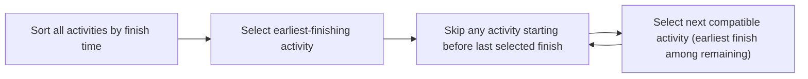

## Learning Objectives

- State the activity-selection problem precisely: given activities with start and end times, select the maximum-size set of pairwise non-overlapping activities.
- State the greedy rule (always select, among remaining compatible activities, the one that finishes earliest) and execute it on a concrete instance.
- Reproduce, in full, an exchange-argument proof that the earliest-finish-time greedy rule always produces an optimal solution.
- Explain why this proof technique (take an arbitrary optimal solution, show it can be modified to match the greedy choice without loss) generalizes to justify other greedy algorithms.

## Context & Motivation

The previous concept established, with a concrete and fairly damning counterexample, that a greedy rule can look completely reasonable and still be provably wrong — coin change with denominations `{1,3,4}` is a real algorithm, executed correctly, that returns a suboptimal answer with total confidence. That result leaves an uncomfortable question hanging: if greedy algorithms cannot be trusted just because their local rule "sounds right," how can *any* greedy algorithm ever be trusted at all? The answer is that trust has to be earned through an actual proof, specific to the problem and the rule, and this concept exists to show exactly what such a proof looks like, completely and without hand-waving, for one of the cleanest examples in algorithm design: **activity selection**.

The activity-selection problem is a natural scheduling question — given a collection of proposed activities, each occupying a fixed interval of time, and a single resource (one lecture hall, one machine, one person) that can only host one activity at a time, select as many non-overlapping activities as possible. The greedy rule for it — always take, among the activities still available, the one that finishes earliest — turns out to be provably optimal, and the proof technique used to establish this, the **exchange argument**, is one of the two or three standard templates used across the field to justify greedy algorithms generally (the other major template, an *exchange-and-repeat* argument for matroid-structured problems, builds directly on this one). Working through this proof rigorously — in the same spirit of complete, formal proof already established for tree theorems elsewhere in this curriculum — is what turns "greedy happened to work on my test cases" into "greedy is guaranteed to work on every instance of this problem," which is exactly the gap the previous concept's counterexample was designed to make visible.

## Core Theory

### Problem statement

Given a set of `n` activities `{a₁, a₂, ..., aₙ}`, where activity `aᵢ` has a start time `sᵢ` and a finish time `fᵢ` (with `sᵢ < fᵢ`), two activities `aᵢ` and `aⱼ` are **compatible** if their intervals do not overlap — that is, `[sᵢ, fᵢ)` and `[sⱼ, fⱼ)` are disjoint, equivalently `fᵢ ≤ sⱼ` or `fⱼ ≤ sᵢ` (one finishes at or before the other starts). The **activity-selection problem** asks for a maximum-size subset of the activities that are pairwise compatible — a set that could all be scheduled on the single shared resource without any two overlapping.

### The greedy rule: earliest finish time first

**Greedy strategy:** sort all activities by finish time, ascending. Select the first activity (the one with the smallest finish time overall). Then repeatedly select the next activity, in finish-time order, whose start time is not earlier than the finish time of the most recently selected activity (i.e., it is compatible with everything selected so far) — skipping any activity that conflicts, and never reconsidering a rejected activity later.

```python
def activity_selection(activities):
    # activities: list of (start, finish) tuples
    activities = sorted(activities, key=lambda a: a[1])   # sort by finish time
    selected = [activities[0]]
    last_finish = activities[0][1]
    for (s, f) in activities[1:]:
        if s >= last_finish:
            selected.append((s, f))
            last_finish = f
    return selected
```

This rule is deliberately the simplest possible greedy criterion: it never looks at how long an activity is, how many other activities it conflicts with, or anything about the future — only "does it finish soonest, among the ones still compatible." The whole burden of this concept is to show, rigorously, that this simplicity does not cost optimality here (in contrast to the previous concept's coin-change counterexample, where an equally simple rule genuinely did cost optimality).



### The exchange-argument proof of correctness

**Claim.** The greedy algorithm above produces a maximum-size set of pairwise compatible activities.

The proof has two parts: first, a lemma establishing that greedy's very first choice is always "safe" (never worse than any optimal solution's structure); second, an inductive argument extending that safety to every subsequent choice, via the same exchange idea applied to a shrinking subproblem.

**Lemma (the greedy-choice property).** Let `A` be the full set of activities, and let `a₁` be the activity in `A` with the earliest finish time (greedy's first pick). Then there exists *some* optimal solution to the activity-selection problem on `A` that includes `a₁`.

*Proof of the lemma.* Let `O` be any optimal solution for `A` (one exists, since the problem asks for a maximum over a finite number of subsets, and at least one such maximum-size compatible subset must exist). Let `k` be the activity in `O` with the earliest finish time among all activities in `O`. Two cases:

- **Case 1: `k = a₁`.** Then `O` already contains `a₁`, and we are done — `O` itself is an optimal solution containing `a₁`.
- **Case 2: `k ≠ a₁`.** Since `a₁` has the earliest finish time of *any* activity in the entire set `A` (by definition of `a₁`), and `k ∈ A`, it follows that `f(a₁) ≤ f(k)`. Construct `O' = (O \ {k}) ∪ {a₁}` — remove `k` from `O` and insert `a₁` in its place. We verify `O'` is (a) a valid compatible set, and (b) the same size as `O`, hence also optimal.
  - *Same size:* removing one element and adding one distinct element (`a₁ ∉ O` since `k` was the unique earliest-finishing element of `O` and `a₁ ≠ k`) leaves `|O'| = |O|`.
  - *Still compatible:* every other activity in `O \ {k}` was compatible with `k` (since `O` was a valid compatible set), meaning each such activity `aⱼ ∈ O \ {k}` either finishes before `k` starts, or starts after `k` finishes. But `k` was chosen as the *earliest-finishing* activity in `O`, so no activity in `O \ {k}` can finish before `k` — every `aⱼ ∈ O \ {k}` must instead satisfy `s(aⱼ) ≥ f(k)`, i.e., every other activity in `O` starts no earlier than `k` finishes. Since `f(a₁) ≤ f(k) ≤ s(aⱼ)` for every such `aⱼ`, replacing `k` with `a₁` preserves compatibility with every activity that remains — `a₁` finishes no later than `k` did, so anything that was compatible with `k` (by starting at or after `k`'s finish time) is automatically compatible with `a₁` too, which finishes even sooner.
  - Since `O'` is compatible and the same size as the optimal `O`, `O'` is also an optimal solution — and it contains `a₁`, as required. ∎ (lemma)

**Finishing the proof, by induction on the number of remaining activities considered.** The lemma establishes that some optimal solution `O'` contains greedy's first choice `a₁`. Once `a₁` is fixed as part of the solution, every activity incompatible with `a₁` (those starting before `a₁` finishes) can never appear alongside it in *any* valid solution, so the remaining problem reduces exactly to activity selection on the smaller set `A' = {a ∈ A : s(a) ≥ f(a₁)}` — activities compatible with `a₁` — where an optimal solution for the original problem containing `a₁` corresponds exactly to `{a₁}` plus an optimal solution for this smaller subproblem on `A'`. But this is *the same problem*, just on a strictly smaller activity set, and greedy's next step (selecting the earliest-finishing activity among those compatible with `a₁`, i.e., the earliest-finishing activity in `A'`) is precisely greedy's first step applied to `A'`. The lemma applies again, verbatim, to `A'`: some optimal solution for `A'` contains greedy's chosen activity `a₂`. By induction on the size of the remaining activity set (which strictly shrinks at each application, terminating when no activities remain), greedy's entire sequence of choices — `a₁, a₂, a₃, ...` — can always be extended, one choice at a time, to a full optimal solution, meaning the complete set greedy outputs is itself optimal. ∎ (theorem)

### Why this is a genuine exchange argument, not a restatement

The proof never argues "greedy's choice looks good" as a standalone claim — it argues something stronger and more careful: *any* optimal solution, however it was constructed, can be transformed into one that agrees with greedy's first choice, without losing any activities in the process. That transformation — swap out the optimal solution's earliest-finishing activity for the true earliest-finishing activity in the whole set, and show nothing breaks — is the "exchange." Once that's established, the argument doesn't need to repeat itself from scratch for the second choice; it recognizes that after fixing `a₁`, the remaining problem is an identical smaller instance of the same problem, so the exact same lemma (already proved, for arbitrary input sets) reapplies directly.

## Worked Examples

### Example 1 — full trace of the greedy algorithm

**Problem:** Activities given as (start, finish) pairs: `(1,4), (3,5), (0,6), (5,7), (3,9), (5,9), (6,10), (8,11), (8,12), (2,14), (12,16)`. Find a maximum compatible subset.

**Sort by finish time:** `(1,4), (3,5), (0,6), (5,7), (6,10), (8,11), (3,9), (5,9), (8,12), (2,14), (12,16)`.

**Trace.** Select `(1,4)` (earliest finish overall); `last_finish = 4`. Next, `(3,5)`: start `3 < 4`, incompatible, skip. `(0,6)`: start `0 < 4`, skip. `(5,7)`: start `5 ≥ 4`, compatible — select; `last_finish = 7`. `(6,10)`: start `6 < 7`, skip. `(8,11)`: start `8 ≥ 7`, select; `last_finish = 11`. `(3,9)`: start `3 < 11`, skip. `(5,9)`: skip. `(8,12)`: start `8 < 11`, skip. `(2,14)`: skip. `(12,16)`: start `12 ≥ 11`, select; `last_finish = 16`.

**Result:** `{(1,4), (5,7), (8,11), (12,16)}` — 4 activities. By the theorem just proved, this is guaranteed optimal — no compatible subset of this activity list has 5 or more activities, and checking exhaustively (or trusting the proof) confirms no larger compatible set exists.

### Example 2 — seeing the exchange argument operate concretely

**Problem:** Take activities `A = {(0,10), (0,3), (4,8)}`. Show explicitly how the exchange-argument lemma transforms a hypothetical optimal solution that omits greedy's first choice.

**Greedy's first choice:** sorted by finish time, `(0,3)` finishes earliest — `a₁ = (0,3)`.

**Suppose (hypothetically, for the sake of the exchange) someone proposed `O = {(0,10)}`** as an optimal solution (size 1) that does not contain `a₁`. Here `k = (0,10)` is the earliest (only) finishing activity in `O`. Since `f(a₁) = 3 ≤ f(k) = 10`, construct `O' = (O \ {k}) ∪ {a₁} = {(0,3)}`. Check: `O'` has the same size (1) and is trivially compatible (a single activity is always compatible with itself). So `O'` is equally optimal and now contains `a₁` — exactly as the lemma guarantees, and this exchange also reveals that `O = \{(0,10)\}` was never actually optimal in the first place, since `{(0,3), (4,8)}` (size 2, both compatible: `4 ≥ 3`) beats it — consistent with the exchange argument, which only claims that *some* optimal solution contains `a₁`, correctly identifying that the true optimum here is the 2-activity set built by continuing greedy from `a₁`.

### Example 3 — why the rule fails if "earliest finish" is replaced by "shortest duration"

**Problem:** Compare the earliest-finish-time rule against a superficially similar greedy rule — "always pick the shortest remaining activity" — on `A = {(0,4), (4,8), (0,1), (1,9)}` where durations are 4, 4, 1, 8 respectively.

**Earliest-finish-time greedy (proved optimal above):** sorted by finish: `(0,1)` [finish 1], `(0,4)` [finish 4], `(4,8)` [finish 8], `(1,9)` [finish 9]. Select `(0,1)`, `last_finish=1`. `(0,4)`: start `0 < 1`, skip. `(4,8)`: start `4 ≥ 1`, select, `last_finish = 8`. `(1,9)`: start `1 < 8`, skip. Result: `{(0,1), (4,8)}`, size 2.

**"Shortest duration first" greedy:** shortest is `(0,1)` (duration 1) — select, `last_finish = 1`. Next shortest among remaining: `(0,4)` and `(4,8)` tie at duration 4; suppose `(0,4)` is considered first — but its start `0 < 1`, skip (incompatible). `(4,8)`: start `4 ≥ 1`, select, `last_finish = 8`. `(1,9)` (duration 8): start `1 < 8`, skip. Result: also `{(0,1),(4,8)}`, size 2 here — this particular instance happens not to distinguish the two rules, illustrating exactly the previous concept's warning: passing one test case is not proof. The earliest-finish-time rule is the one with an actual exchange-argument proof behind it (Core Theory above); "shortest duration first" has no such proof, and indeed is a well-known greedy rule that provably fails on other instances (a single long activity with generous slack can be compatible with far more of the schedule than several short but awkwardly-placed ones) — reinforcing why this concept insists on the full proof for the earliest-finish rule specifically, rather than accepting any rule that "sounds similarly reasonable."

## Common Misconceptions & Pitfalls

- **"The exchange argument only shows greedy's first choice is fine — it doesn't say anything about later choices."** This is exactly what the induction step in Core Theory addresses: after fixing `a₁`, the remaining activities compatible with it form a smaller instance of the *identical* problem, so the same lemma (proved for a completely arbitrary activity set) applies again to that smaller instance, and again after that — the induction is what extends the single-step lemma into a guarantee about the entire sequence of choices, not just the first.
- **"Greedy by earliest finish time and greedy by shortest duration are basically the same idea, so both are probably fine."** Example 3 shows they can coincide on some instances, but only earliest-finish-time carries an actual optimality proof; shortest-duration-first is a different rule entirely and is known to fail on other instances (concretely: one long, non-overlapping-with-much activity vs. several short mutually-incompatible ones) — resemblance between rules is not evidence of shared correctness, matching the previous concept's broader warning about plausible-sounding greedy rules.
- **"The lemma proves greedy's choice is *the* unique optimal solution."** It proves something weaker and sufficient: that *some* optimal solution contains greedy's choice — as Example 2 shows, other supposed "optimal" candidates might not contain it (and might not even be optimal at all), but the existence of at least one optimal solution agreeing with greedy at each step is exactly enough to carry the induction through to the end.
- **"This proof technique is specific to activity selection and doesn't generalize."** The exchange argument — take an arbitrary optimal solution, show it can be modified to match the greedy choice without losing anything, then recurse on the smaller remaining subproblem — is a standard, reusable proof template applied across many other greedy algorithms (minimum spanning trees, Huffman coding, and more); activity selection is simply one of the cleanest settings to see the full template executed without extra complications.

## Summary

The activity-selection problem asks for the largest set of pairwise non-overlapping activities from a given collection, and the greedy rule of always selecting the earliest-finishing compatible activity is provably optimal — not merely plausible, in contrast to the coin-change rule examined in the previous concept. The proof has two parts: a greedy-choice lemma showing that any optimal solution can be modified, via a direct exchange (swapping out its earliest-finishing activity for the true earliest-finishing activity of the whole set), to agree with greedy's first pick without any loss in size or compatibility; and an inductive argument showing that after fixing that first choice, the remaining problem is an identical, smaller instance of activity selection, to which the same lemma reapplies at every subsequent step. This is a complete, self-contained proof, not an appeal to intuition, and it is exactly the kind of rigor the previous concept's coin-change counterexample was designed to motivate — greedy earns trust only through an argument of this shape, specific to the problem and rule at hand.

## Documentation Links

- [Sedgewick & Wayne — Algorithms Lectures (Princeton)](https://algs4.cs.princeton.edu/lectures/) — doc
- [ACM/IEEE CS2013 — Algorithms and Complexity Knowledge Area](https://csed.acm.org/cs2013-version/) — doc
