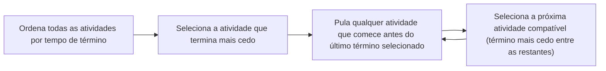

## Objetivos de Aprendizagem

- Enunciar o problema de seleção de atividades precisamente: dadas atividades com horários de início e término, selecione o conjunto de tamanho máximo de atividades duas a duas sem sobreposição.
- Enunciar a regra gulosa (sempre selecionar, entre as atividades compatíveis restantes, a que termina mais cedo) e executá-la em uma instância concreta.
- Reproduzir, por completo, uma prova por argumento de troca de que a regra gulosa de tempo-de-término-mais-cedo sempre produz uma solução ótima.
- Explicar por que essa técnica de prova (tome uma solução ótima arbitrária, mostre que pode ser modificada para combinar com a escolha gulosa sem perda) generaliza para justificar outros algoritmos gulosos.

## Contexto e Motivação

O conceito anterior estabeleceu, com um contraexemplo concreto e bastante contundente, que uma regra gulosa pode parecer completamente razoável e ainda assim estar comprovadamente errada, troco de moedas com denominações `{1,3,4}` é um algoritmo real, executado corretamente, que retorna uma resposta subótima com confiança total. Esse resultado deixa uma pergunta desconfortável pendente: se algoritmos gulosos não podem ser confiados apenas porque sua regra local "soa correta", como *qualquer* algoritmo guloso pode jamais ser confiado? A resposta é que confiança tem que ser conquistada através de uma prova real, específica ao problema e à regra, e este conceito existe para mostrar exatamente como tal prova se parece, completamente e sem gestos vagos, para um dos exemplos mais limpos em design de algoritmo: **seleção de atividades**.

O problema de seleção de atividades é uma pergunta natural de agendamento, dada uma coleção de atividades propostas, cada uma ocupando um intervalo fixo de tempo, e um único recurso (uma sala de aula, uma máquina, uma pessoa) que só pode hospedar uma atividade por vez, selecione o máximo de atividades sem sobreposição possível. A regra gulosa para isso, sempre tome, entre as atividades ainda disponíveis, a que termina mais cedo, acaba sendo comprovadamente ótima, e a técnica de prova usada para estabelecer isso, o **argumento de troca**, é um dos dois ou três modelos padrão usados em todo o campo para justificar algoritmos gulosos em geral (o outro modelo principal, um argumento de *troca-e-repetição* para problemas estruturados como matroides, se constrói diretamente sobre este). Trabalhar essa prova rigorosamente, no mesmo espírito de prova completa e formal já estabelecido para teoremas de árvore em outro lugar neste currículo, é o que transforma "guloso aconteceu de funcionar nos meus casos de teste" em "guloso é garantido funcionar em toda instância deste problema", que é exatamente a lacuna que o contraexemplo do conceito anterior foi projetado para tornar visível.

## Teoria Central

### Enunciado do problema

Dado um conjunto de `n` atividades `{a₁, a₂, ..., aₙ}`, onde a atividade `aᵢ` tem um horário de início `sᵢ` e um horário de término `fᵢ` (com `sᵢ < fᵢ`), duas atividades `aᵢ` e `aⱼ` são **compatíveis** se seus intervalos não se sobrepõem, ou seja, `[sᵢ, fᵢ)` e `[sⱼ, fⱼ)` são disjuntos, equivalentemente `fᵢ ≤ sⱼ` ou `fⱼ ≤ sᵢ` (uma termina em ou antes da outra começar). O **problema de seleção de atividades** pede um subconjunto de tamanho máximo das atividades que são duas a duas compatíveis, um conjunto que poderia todo ser agendado no único recurso compartilhado sem que quaisquer duas se sobrepusessem.

### A regra gulosa: tempo de término mais cedo primeiro

**Estratégia gulosa:** ordene todas as atividades por tempo de término, ascendente. Selecione a primeira atividade (a de menor tempo de término no geral). Depois repetidamente selecione a próxima atividade, em ordem de tempo de término, cujo horário de início não seja anterior ao tempo de término da atividade selecionada mais recentemente (ou seja, é compatível com tudo selecionado até agora), pulando qualquer atividade que conflite, e nunca reconsiderando uma atividade rejeitada depois.

```python
def activity_selection(activities):
    # activities: lista de tuplas (início, término)
    activities = sorted(activities, key=lambda a: a[1])   # ordena por tempo de término
    selected = [activities[0]]
    last_finish = activities[0][1]
    for (s, f) in activities[1:]:
        if s >= last_finish:
            selected.append((s, f))
            last_finish = f
    return selected
```

Essa regra é deliberadamente o critério guloso mais simples possível: nunca olha quanto tempo dura uma atividade, com quantas outras atividades ela conflita, ou qualquer coisa sobre o futuro, apenas "termina mais cedo, entre as ainda compatíveis." O fardo inteiro deste conceito é mostrar, rigorosamente, que essa simplicidade não custa otimalidade aqui (em contraste com o contraexemplo de troco de moedas do conceito anterior, onde uma regra igualmente simples genuinamente custou otimalidade).



### A prova por argumento de troca da correção

**Afirmação.** O algoritmo guloso acima produz um conjunto de tamanho máximo de atividades duas a duas compatíveis.

A prova tem duas partes: primeiro, um lema estabelecendo que a própria primeira escolha de guloso é sempre "segura" (nunca pior que a estrutura de qualquer solução ótima); segundo, um argumento indutivo estendendo essa segurança para toda escolha subsequente, via a mesma ideia de troca aplicada a um subproblema encolhendo.

**Lema (a propriedade da escolha gulosa).** Seja `A` o conjunto completo de atividades, e seja `a₁` a atividade em `A` com o tempo de término mais cedo (primeira escolha de guloso). Então existe *alguma* solução ótima para o problema de seleção de atividades em `A` que inclui `a₁`.

*Prova do lema.* Seja `O` qualquer solução ótima para `A` (uma existe, já que o problema pede um máximo sobre um número finito de subconjuntos, e pelo menos um tal subconjunto compatível de tamanho máximo deve existir). Seja `k` a atividade em `O` com o tempo de término mais cedo entre todas as atividades em `O`. Dois casos:

- **Caso 1: `k = a₁`.** Então `O` já contém `a₁`, e terminamos, o próprio `O` é uma solução ótima contendo `a₁`.
- **Caso 2: `k ≠ a₁`.** Já que `a₁` tem o tempo de término mais cedo de *qualquer* atividade no conjunto inteiro `A` (por definição de `a₁`), e `k ∈ A`, segue que `f(a₁) ≤ f(k)`. Construa `O' = (O \ {k}) ∪ {a₁}`, remova `k` de `O` e insira `a₁` em seu lugar. Verificamos que `O'` é (a) um conjunto compatível válido, e (b) do mesmo tamanho que `O`, portanto também ótimo.
  - *Mesmo tamanho:* remover um elemento e adicionar um elemento distinto (`a₁ ∉ O` já que `k` era o único elemento de término mais cedo de `O` e `a₁ ≠ k`) deixa `|O'| = |O|`.
  - *Ainda compatível:* toda outra atividade em `O \ {k}` era compatível com `k` (já que `O` era um conjunto compatível válido), significando que toda tal atividade `aⱼ ∈ O \ {k}` ou termina antes de `k` começar, ou começa depois de `k` terminar. Mas `k` foi escolhida como a atividade de término *mais cedo* em `O`, então nenhuma atividade em `O \ {k}` pode terminar antes de `k`, toda `aⱼ ∈ O \ {k}` deve em vez disso satisfazer `s(aⱼ) ≥ f(k)`, ou seja, toda outra atividade em `O` começa não antes do término de `k`. Já que `f(a₁) ≤ f(k) ≤ s(aⱼ)` para toda tal `aⱼ`, substituir `k` por `a₁` preserva compatibilidade com toda atividade que permanece, `a₁` termina não mais tarde que `k` terminava, então qualquer coisa que era compatível com `k` (começando em ou depois do término de `k`) é automaticamente compatível com `a₁` também, que termina ainda mais cedo.
  - Já que `O'` é compatível e do mesmo tamanho que o ótimo `O`, `O'` também é uma solução ótima, e contém `a₁`, como exigido. ∎ (lema)

**Terminando a prova, por indução no número de atividades restantes consideradas.** O lema estabelece que alguma solução ótima `O'` contém a primeira escolha `a₁` de guloso. Uma vez que `a₁` é fixada como parte da solução, toda atividade incompatível com `a₁` (as que começam antes de `a₁` terminar) nunca pode aparecer ao lado dela em *nenhuma* solução válida, então o problema restante se reduz exatamente à seleção de atividades no conjunto menor `A' = {a ∈ A : s(a) ≥ f(a₁)}`, atividades compatíveis com `a₁`, onde uma solução ótima para o problema original contendo `a₁` corresponde exatamente a `{a₁}` mais uma solução ótima para este subproblema menor em `A'`. Mas isso é *o mesmo problema*, só que em um conjunto de atividades estritamente menor, e o próximo passo de guloso (selecionar a atividade de término mais cedo entre as compatíveis com `a₁`, ou seja, a atividade de término mais cedo em `A'`) é precisamente o primeiro passo de guloso aplicado a `A'`. O lema se aplica de novo, palavra por palavra, a `A'`: alguma solução ótima para `A'` contém a atividade escolhida `a₂` de guloso. Por indução no tamanho do conjunto de atividades restante (que estritamente encolhe a cada aplicação, terminando quando nenhuma atividade resta), a sequência inteira de escolhas de guloso, `a₁, a₂, a₃, ...`, sempre pode ser estendida, uma escolha de cada vez, para uma solução ótima completa, significando que o conjunto completo que guloso produz é ele próprio ótimo. ∎ (teorema)

### Por que isso é um argumento de troca genuíno, não uma reformulação

A prova nunca argumenta "a escolha de guloso parece boa" como uma afirmação isolada, argumenta algo mais forte e mais cuidadoso: *qualquer* solução ótima, como quer que tenha sido construída, pode ser transformada em uma que concorda com a primeira escolha de guloso, sem perder nenhuma atividade no processo. Essa transformação, trocar a atividade de término mais cedo da solução ótima pela atividade de término mais cedo verdadeira do conjunto inteiro, e mostrar que nada quebra, é a "troca." Uma vez que isso é estabelecido, o argumento não precisa se repetir do zero para a segunda escolha; reconhece que depois de fixar `a₁`, o problema restante é uma instância menor, idêntica, do mesmo problema, então exatamente o mesmo lema (já provado, para conjuntos de entrada arbitrários) se reaplica diretamente.

## Exemplos Resolvidos

### Exemplo 1 — rastreamento completo do algoritmo guloso

**Problema:** Atividades dadas como pares (início, término): `(1,4), (3,5), (0,6), (5,7), (3,9), (5,9), (6,10), (8,11), (8,12), (2,14), (12,16)`. Encontre um subconjunto compatível de tamanho máximo.

**Ordene por tempo de término:** `(1,4), (3,5), (0,6), (5,7), (6,10), (8,11), (3,9), (5,9), (8,12), (2,14), (12,16)`.

**Rastreamento.** Seleciona `(1,4)` (término mais cedo no geral); `last_finish = 4`. Depois, `(3,5)`: início `3 < 4`, incompatível, pula. `(0,6)`: início `0 < 4`, pula. `(5,7)`: início `5 ≥ 4`, compatível, seleciona; `last_finish = 7`. `(6,10)`: início `6 < 7`, pula. `(8,11)`: início `8 ≥ 7`, seleciona; `last_finish = 11`. `(3,9)`: início `3 < 11`, pula. `(5,9)`: pula. `(8,12)`: início `8 < 11`, pula. `(2,14)`: pula. `(12,16)`: início `12 ≥ 11`, seleciona; `last_finish = 16`.

**Resultado:** `{(1,4), (5,7), (8,11), (12,16)}`, 4 atividades. Pelo teorema recém-provado, isso é garantido ótimo, nenhum subconjunto compatível desta lista de atividades tem 5 ou mais atividades, e verificar exaustivamente (ou confiar na prova) confirma que nenhum conjunto compatível maior existe.

### Exemplo 2 — vendo o argumento de troca operar concretamente

**Problema:** Tome atividades `A = {(0,10), (0,3), (4,8)}`. Mostre explicitamente como o lema do argumento de troca transforma uma solução ótima hipotética que omite a primeira escolha de guloso.

**Primeira escolha de guloso:** ordenado por tempo de término, `(0,3)` termina mais cedo, `a₁ = (0,3)`.

**Suponha (hipoteticamente, para o propósito da troca) que alguém propôs `O = {(0,10)}`** como uma solução ótima (tamanho 1) que não contém `a₁`. Aqui `k = (0,10)` é a atividade de término mais cedo (única) em `O`. Já que `f(a₁) = 3 ≤ f(k) = 10`, construa `O' = (O \ {k}) ∪ {a₁} = {(0,3)}`. Verifique: `O'` tem o mesmo tamanho (1) e é trivialmente compatível (uma única atividade é sempre compatível consigo mesma). Então `O'` é igualmente ótimo e agora contém `a₁`, exatamente como o lema garante, e essa troca também revela que `O = \{(0,10)\}` nunca foi de fato ótimo em primeiro lugar, já que `{(0,3), (4,8)}` (tamanho 2, ambas compatíveis: `4 ≥ 3`) o vence, consistente com o argumento de troca, que só afirma que *alguma* solução ótima contém `a₁`, identificando corretamente que o verdadeiro ótimo aqui é o conjunto de 2 atividades construído continuando guloso a partir de `a₁`.

### Exemplo 3 — por que a regra falha se "término mais cedo" é substituído por "menor duração"

**Problema:** Compare a regra de tempo-de-término-mais-cedo contra uma regra gulosa superficialmente similar, "sempre escolha a menor atividade restante", em `A = {(0,4), (4,8), (0,1), (1,9)}` onde as durações são 4, 4, 1, 8 respectivamente.

**Guloso por tempo-de-término-mais-cedo (provado ótimo acima):** ordenado por término: `(0,1)` [término 1], `(0,4)` [término 4], `(4,8)` [término 8], `(1,9)` [término 9]. Seleciona `(0,1)`, `last_finish=1`. `(0,4)`: início `0 < 1`, pula. `(4,8)`: início `4 ≥ 1`, seleciona, `last_finish = 8`. `(1,9)`: início `1 < 8`, pula. Resultado: `{(0,1), (4,8)}`, tamanho 2.

**Guloso por "menor duração primeiro":** a menor é `(0,1)` (duração 1), seleciona, `last_finish = 1`. Próxima menor entre as restantes: `(0,4)` e `(4,8)` empatam em duração 4; suponha que `(0,4)` é considerada primeiro, mas seu início `0 < 1`, pula (incompatível). `(4,8)`: início `4 ≥ 1`, seleciona, `last_finish = 8`. `(1,9)` (duração 8): início `1 < 8`, pula. Resultado: também `{(0,1),(4,8)}`, tamanho 2 aqui, essa instância específica acontece de não distinguir as duas regras, ilustrando exatamente o alerta do conceito anterior: passar em um caso de teste não é prova. A regra de tempo-de-término-mais-cedo é a que tem uma prova real por argumento de troca por trás dela (Teoria Central acima); "menor duração primeiro" não tem tal prova, e de fato é uma regra gulosa bem conhecida que comprovadamente falha em outras instâncias (uma única atividade longa com folga generosa pode ser compatível com muito mais do agendamento que várias curtas mas posicionadas de forma estranha), reforçando por que este conceito insiste na prova completa para a regra de término mais cedo especificamente, em vez de aceitar qualquer regra que "soa similarmente razoável."

## Equívocos Comuns e Armadilhas

- **"O argumento de troca só mostra que a primeira escolha de guloso está bem, não diz nada sobre escolhas posteriores."** Isso é exatamente o que o passo de indução na Teoria Central aborda: depois de fixar `a₁`, as atividades restantes compatíveis com ela formam uma instância menor do problema *idêntico*, então o mesmo lema (provado para um conjunto de atividades completamente arbitrário) se aplica de novo àquela instância menor, e de novo depois disso, a indução é o que estende o lema de passo único para uma garantia sobre a sequência inteira de escolhas, não apenas a primeira.
- **"Guloso por tempo de término mais cedo e guloso por menor duração são basicamente a mesma ideia, então ambos provavelmente estão bem."** O Exemplo 3 mostra que podem coincidir em algumas instâncias, mas só tempo-de-término-mais-cedo carrega uma prova de otimalidade real; menor-duração-primeiro é uma regra inteiramente diferente e é conhecida por falhar em outras instâncias (concretamente: uma atividade longa, não sobreposta com muitas versus várias curtas mutuamente incompatíveis), semelhança entre regras não é evidência de correção compartilhada, combinando com o alerta mais amplo do conceito anterior sobre regras gulosas que soam plausíveis.
- **"O lema prova que a escolha de guloso é *a* única solução ótima."** Ele prova algo mais fraco e suficiente: que *alguma* solução ótima contém a escolha de guloso, como o Exemplo 2 mostra, outros candidatos supostamente "ótimos" podem não contê-la (e podem nem mesmo ser ótimos de forma alguma), mas a existência de pelo menos uma solução ótima concordando com guloso em cada passo é exatamente suficiente para levar a indução até o fim.
- **"Essa técnica de prova é específica para seleção de atividades e não generaliza."** O argumento de troca, tome uma solução ótima arbitrária, mostre que pode ser modificada para combinar com a escolha gulosa sem perder nada, depois recurse no subproblema restante menor, é um modelo de prova padrão e reutilizável aplicado através de muitos outros algoritmos gulosos (árvores geradoras mínimas, codificação de Huffman, e mais); seleção de atividades é simplesmente um dos cenários mais limpos para ver o modelo completo executado sem complicações extras.

## Resumo

O problema de seleção de atividades pede o maior conjunto de atividades duas a duas sem sobreposição de uma dada coleção, e a regra gulosa de sempre selecionar a atividade compatível de término mais cedo é comprovadamente ótima, não meramente plausível, em contraste com a regra de troco de moedas examinada no conceito anterior. A prova tem duas partes: um lema da escolha gulosa mostrando que qualquer solução ótima pode ser modificada, via uma troca direta (substituindo sua atividade de término mais cedo pela verdadeira atividade de término mais cedo do conjunto inteiro), para concordar com a primeira escolha de guloso sem nenhuma perda em tamanho ou compatibilidade; e um argumento indutivo mostrando que depois de fixar essa primeira escolha, o problema restante é uma instância idêntica, menor, de seleção de atividades, à qual o mesmo lema se reaplica em todo passo subsequente. Esta é uma prova completa, autocontida, não um apelo à intuição, e é exatamente o tipo de rigor que o contraexemplo de troco de moedas do conceito anterior foi projetado para motivar, guloso conquista confiança apenas através de um argumento desse formato, específico ao problema e à regra em questão.

## Documentation Links

- [Sedgewick & Wayne — Algorithms Lectures (Princeton)](https://algs4.cs.princeton.edu/lectures/) — doc
- [ACM/IEEE CS2013 — Algorithms and Complexity Knowledge Area](https://csed.acm.org/cs2013-version/) — doc
