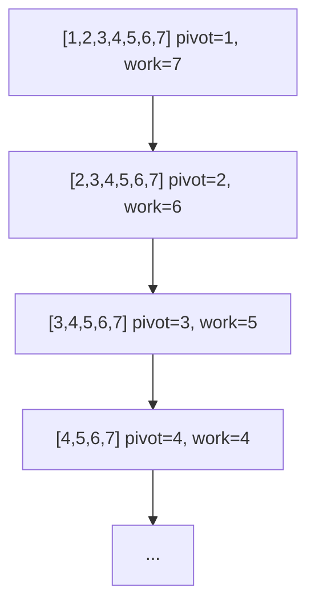

## Learning Objectives

- Construct a concrete input that forces naive quicksort (pivot = first or last element) into its O(n²) worst case.
- Explain, in terms of partition balance, why an unlucky sequence of pivot choices degrades running time from O(n log n) to O(n²).
- Describe randomized pivot selection and argue informally why it makes the worst case vanishingly unlikely on *every* input, including adversarial ones.
- Distinguish "worst case over inputs" from "expected case over random choices" and explain why randomization changes which one applies to quicksort.

## Context & Motivation

The previous concept established that quicksort partitions in place and recurses on two resulting sub-segments — but it deliberately left open a question that turns out to be the whole story: how large are those two sub-segments? If a pivot happens to land near the middle of the segment every time, the recursion splits roughly in half at every level, giving `T(n) = 2T(n/2) + O(n)`, which resolves (by the same recurrence-solving tools used for merge sort) to O(n log n). But nothing in the partitioning mechanics *guarantees* a balanced split — the pivot could just as easily land at one extreme end of the segment every single time, and when it does, quicksort's running time is not O(n log n) at all.

This matters for a reason that goes well beyond quicksort itself: it is one of the clearest teaching examples in all of algorithm design of a strategy whose *worst-case* behavior over all possible inputs is bad, but whose *expected* behavior — once a single well-placed coin flip is introduced into the algorithm — is good on every input, including ones an adversary designed specifically to break it. That gap between "bad on some inputs" and "bad only with vanishing probability, on any input" is the entire justification for randomized algorithms as a discipline, and quicksort is the canonical first example most curricula use to introduce it. Understanding *why* a single random choice defeats an adversary — rather than simply being told that it does — is the actual payoff of this concept.

## Core Theory

### The worst case: always picking an extreme element

Consider the simplest, most naive pivot rule: always choose the **first** element of the current segment as the pivot (a common simplification of Lomuto's scheme, which normally picks the last). Now feed this algorithm an **already-sorted** array, `A = [1, 2, 3, 4, 5, 6, 7]`.

Partitioning `[1, 2, 3, 4, 5, 6, 7]` with pivot `1`: since `1` is already the smallest element, the partition produces a left side of size 0 and a right side of size 6 — `[2, 3, 4, 5, 6, 7]`. Partitioning that with pivot `2` (again the smallest remaining element) produces a left side of size 0 and a right side of size 5. This repeats at every level: each partition call does O(k) work to discover that the pivot belongs at the very start of a segment of size `k`, and recurses on a single sub-segment of size `k − 1`.



The recursion depth is n (not log n), and the total work is `n + (n-1) + (n-2) + ... + 1 = n(n+1)/2 = O(n²)`. An already-sorted array is not a pathological, contrived edge case — it is one of the *most common* real-world inputs (nearly-sorted logs, re-sorted data, already-ordered records), which is precisely why "always pick the first or last element" is not an acceptable pivot rule for production code. The same O(n²) behavior occurs symmetrically on a reverse-sorted array with a "pick the last element" rule, or on many other structured inputs an adversary (or just bad luck) could construct deliberately.

### Why a fixed pivot rule is an adversarial target

The deeper problem with "always pick the first element" is not that sorted arrays are unusually bad luck — it is that the pivot rule is **fixed and known in advance**. Any deterministic rule for choosing a pivot (first element, last element, even a fixed formula like "the middle index") can, in principle, be defeated by an adversary who constructs an input specifically designed to make every pivot choice the worst possible one, given full knowledge of the algorithm's source code. This is a structural weakness shared by *any* deterministic pivot strategy, not a quirk of "first element" specifically — whatever fixed rule is chosen, there exists some input built around exploiting exactly that rule.

### Randomization as a defense: choosing the pivot uniformly at random

The fix is to break the link between "the input" and "which element becomes the pivot" entirely: at each partition call, choose the pivot **uniformly at random** from the current segment (e.g., swap a randomly chosen index with the last position, then run Lomuto as before). Call the resulting algorithm **randomized quicksort**.

The crucial change: for a *fixed* input array, the running time of randomized quicksort is no longer a single fixed number — it is a **random variable**, because it depends on the sequence of coin flips made during execution, not on the input alone. An adversary who knows the input in advance (even the exact bytes of the array) still cannot predict which element will be chosen as pivot at each step, because that choice is made by the algorithm's internal randomness, not derived from the data. The adversary can still construct an input that would be bad *for one particular sequence of unlucky pivot choices*, but they cannot force that unlucky sequence to actually occur — every run independently redraws its own random pivots.

### Why the bad case becomes rare: a counting argument

Here is the intuition for why this actually works, without full formal expectation calculus. Fix any segment of size `k`. A partition step is "bad" (in the sense of contributing to the O(n²) blowup) only if the pivot lands among, say, the smallest few or largest few elements of the segment — landing anywhere reasonably central produces a split that is unbalanced by at most a constant factor and still shrinks the segment geometrically. Concretely: if the pivot is chosen uniformly at random from `k` elements, the probability it falls **outside** the extreme quarter at each end (i.e., it produces a split where neither side has fewer than `k/4` elements) is at least 1/2 — half of all possible pivot ranks (roughly the "middle half," ranks between `k/4` and `3k/4`) give this reasonably balanced outcome. So at *every single partition call*, regardless of what the input looks like, there is at least a fair coin's chance of landing a "good enough" pivot.

Now the argument becomes about repeated fair coin flips, not about the input: a segment can only shrink from size `k` toward size 1 through a *bounded number* of "good" splits (each good split cuts the segment by at least a constant factor, e.g. to at most `3k/4`, so after O(log n) good splits in a row the segment is essentially gone) — meanwhile, a run of consecutive *bad* splits (each one barely shrinking the segment, e.g. by only 1 element) is exactly analogous to a long run of heads (or tails) in a sequence of fair coin flips, which is exponentially unlikely to persist for very many flips in a row. Since roughly half of all draws are "good" independent of the data, the expected number of partition calls needed before enough "good" splits accumulate to finish the sort is O(n log n) overall — the O(n²) behavior would require an atypically long, specific run of bad luck at every level, simultaneously, which becomes vanishingly improbable as n grows, on *any* fixed input whatsoever.

This is the key qualitative shift: without randomization, "quicksort is slow" is a statement about which *inputs* are bad. With randomization, no input is bad — only certain (increasingly rare, as the array grows) *sequences of internal coin flips* are, and those are equally rare no matter what the adversary writes into the array.

## Worked Examples

### Example 1 — quantifying the O(n²) blowup concretely

**Problem:** For the sorted array `[1, 2, ..., 7]` with the "always pick first element" rule, count the total number of comparisons performed across the whole sort, and compare against n log₂ n for n = 7.

**Solution.** As traced in Core Theory, partitioning a segment of size `k` compares the pivot against the remaining `k − 1` elements, then recurses on a segment of size `k − 1`. Total comparisons: `6 + 5 + 4 + 3 + 2 + 1 + 0 = 21`. This matches `n(n-1)/2 = 7·6/2 = 21`, the closed form for `O(n²)` behavior. Compare: `n log₂ n = 7 · log₂ 7 ≈ 7 · 2.807 ≈ 19.6`, which is what a *balanced* quicksort would be expected to roughly track. At n = 7 the two numbers (21 vs. ~19.6) look close, but the gap widens sharply as n grows — at n = 1,000,000, `n²/2 ≈ 5 × 10^11` versus `n log₂ n ≈ 2 × 10^7`, a factor of roughly 25,000 times slower. This is the concrete cost of the worst case, not an abstract asymptotic curiosity.

### Example 2 — a randomized pivot defeats the same adversarial input

**Problem:** Run randomized quicksort on the same sorted array `[1, 2, 3, 4, 5, 6, 7]` and observe that the *specific* bad sequence of choices (always picking the current minimum) is now just one of many equally possible outcomes, rather than the one the algorithm is forced into.

```python
import random

def randomized_partition(A, lo, hi):
    r = random.randint(lo, hi)
    A[r], A[hi] = A[hi], A[r]   # move random element to the end, then use Lomuto
    pivot = A[hi]
    i = lo - 1
    for j in range(lo, hi):
        if A[j] <= pivot:
            i += 1
            A[i], A[j] = A[j], A[i]
    A[i + 1], A[hi] = A[hi], A[i + 1]
    return i + 1

def randomized_quicksort(A, lo=0, hi=None):
    if hi is None:
        hi = len(A) - 1
    if lo < hi:
        q = randomized_partition(A, lo, hi)
        randomized_quicksort(A, lo, q - 1)
        randomized_quicksort(A, q + 1, hi)
```

**Reasoning.** On the input `[1, 2, 3, 4, 5, 6, 7]`, the first call to `randomized_partition` picks `r` uniformly from indices 0–6 — a 1-in-7 chance of picking index 0 (value 1, the worst possible pivot, reproducing the bad case for this level) but a 6-in-7 chance of picking anything else, most of which produce a far more balanced split (e.g., picking value 4, the median, splits the array into two segments of size 3 each — as good a split as possible). Crucially, this probability is a property of *the algorithm's coin flip*, computed identically no matter what the array's actual values are — the same 1-in-7 versus 6-in-7 split applies whether the array is sorted, reverse-sorted, or the specific array an adversary spent hours constructing to break a fixed pivot rule.

### Example 3 — the "middle half" bound made concrete on n = 8

**Problem:** For a segment of 8 distinct elements, count how many of the 8 possible pivot choices (by rank) produce a split where both sides have at least 2 elements (i.e., neither side is more than 3/4 of the segment).

**Solution.** Ranks 1 and 2 (the two smallest) put fewer than 2 elements on the left (ranks 1 gives 0, rank 2 gives 1) — bad. Symmetrically, ranks 7 and 8 (the two largest) are bad on the right side. Ranks 3, 4, 5, 6 — the middle four out of eight — all give a left side of size 2 to 5 and a right side of size 2 to 5, satisfying "neither side smaller than 2." That's 4 good ranks out of 8, exactly half — matching the "at least 1/2 probability of a good split" claim used in Core Theory, and illustrating concretely why the bound doesn't require anything close to hitting the exact median; a wide range of "good enough" pivots all count toward the favorable half.

## Common Misconceptions & Pitfalls

- **"Randomized quicksort's worst case is O(n log n)."** This is false and a common conflation — the worst case (over all possible sequences of coin flips) is still O(n²); what changes is that this worst case becomes *extremely improbable* for any fixed input, so the **expected** running time, averaged over the algorithm's own randomness, is O(n log n) on every input. Worst-case and expected-case are different claims, and randomization only improves the second one.
- **"Randomization removes the need to worry about bad inputs entirely — it can never behave badly."** It can, in principle, always behave badly on *any* run (there is always some non-zero probability of drawing an unlucky pivot at every single level), but that probability shrinks so fast as n grows that it is negligible in practice — "expected O(n log n)" is a statement about probability, not a guarantee, unlike merge sort's genuinely deterministic O(n log n) worst case.
- **"Picking the middle element by index (not by rank) fixes the worst case without needing randomness."** Picking `A[(lo+hi)//2]` is still a deterministic rule and is just as vulnerable in principle to an adversarial input constructed with knowledge of that specific rule (e.g., certain patterned arrays defeat "always pick the middle index" just as reliably as sorted arrays defeat "always pick the first element") — determinism itself, not the particular choice of index, is what randomization is curing.
- **"An already-sorted array is a rare, unrealistic edge case not worth worrying about."** As discussed in Core Theory, nearly- or fully-sorted data is extremely common in practice (logs, previously-sorted datasets, incremental updates) — this is precisely why "always pick first/last" is considered a genuinely bad default, not a merely theoretical concern.

## Summary

Quicksort's running time depends entirely on how balanced its partition splits are: a lucky sequence of near-median pivots gives the same O(n log n) recurrence as merge sort, but a fixed, deterministic pivot rule (such as always picking the first element) can be defeated by a specific, entirely realistic input — an already-sorted array — producing genuinely O(n²) behavior, with recursion depth n instead of log n. Randomizing the pivot choice at every partition call does not eliminate the possibility of a bad run, but it severs the connection between "which input was given" and "which pivot gets chosen," so that any fixed input faces the same, rapidly-shrinking probability of a run of unlucky choices — making the expected running time O(n log n) on every input, including ones an adversary designed with full knowledge of the algorithm. The core intuition is a counting argument: roughly half of all possible pivot ranks produce a "good enough" split at any given step, so a genuinely bad outcome requires an increasingly improbable run of bad luck as the array grows.

## Documentation Links

- [Sedgewick & Wayne — Algorithms Lectures (Princeton)](https://algs4.cs.princeton.edu/lectures/) — doc
- [MIT 6.006 — Syllabus (OCW)](https://ocw.mit.edu/courses/6-006-introduction-to-algorithms-spring-2020/pages/syllabus/) — doc
