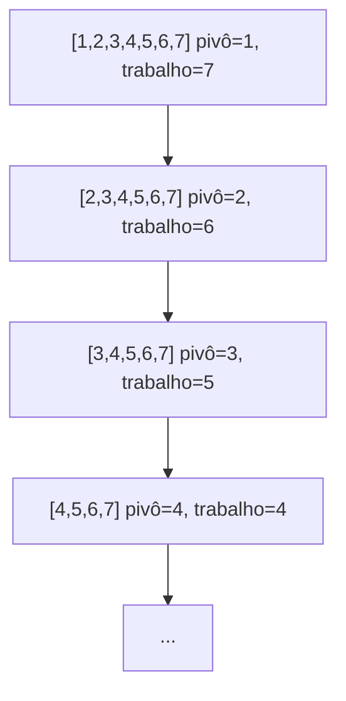

## Objetivos de Aprendizagem

- Construir uma entrada concreta que force o quicksort ingênuo (pivô = primeiro ou último elemento) para seu pior caso O(n²).
- Explicar, em termos de balanço de particionamento, por que uma sequência azarada de escolhas de pivô degrada o tempo de execução de O(n log n) para O(n²).
- Descrever seleção aleatória de pivô e argumentar informalmente por que ela torna o pior caso extremamente improvável em *qualquer* entrada, incluindo as adversariais.
- Distinguir "pior caso sobre entradas" de "caso esperado sobre escolhas aleatórias" e explicar por que randomização muda qual das duas se aplica ao quicksort.

## Contexto e Motivação

O conceito anterior estabeleceu que quicksort particiona in place e recursa em dois subsegmentos resultantes, mas deliberadamente deixou em aberto uma pergunta que acaba sendo a história inteira: quão grandes são esses dois subsegmentos? Se um pivô acontece de cair perto do meio do segmento toda vez, a recursão se divide aproximadamente pela metade em todo nível, dando `T(n) = 2T(n/2) + O(n)`, que resolve (pelas mesmas ferramentas de resolução de recorrência usadas para merge sort) para O(n log n). Mas nada na mecânica de particionamento *garante* uma divisão balanceada, o pivô poderia igualmente cair em uma extremidade do segmento toda única vez, e quando isso acontece, o tempo de execução do quicksort não é O(n log n) de forma alguma.

Isso importa por uma razão que vai bem além do próprio quicksort: é um dos exemplos didáticos mais claros em todo o design de algoritmo de uma estratégia cujo comportamento de *pior caso* sobre todas as entradas possíveis é ruim, mas cujo comportamento *esperado*, uma vez que um único lançamento de moeda bem posicionado é introduzido no algoritmo, é bom em toda entrada, incluindo aquelas que um adversário projetou especificamente para quebrá-lo. Essa lacuna entre "ruim em algumas entradas" e "ruim só com probabilidade que desaparece, em qualquer entrada" é a justificativa inteira para algoritmos randomizados como disciplina, e quicksort é o exemplo canônico que a maioria dos currículos usa para introduzi-la. Entender *por que* uma única escolha aleatória derrota um adversário, em vez de simplesmente ser informado que derrota, é o ganho real deste conceito.

## Teoria Central

### O pior caso: sempre escolhendo um elemento extremo

Considere a regra de pivô mais ingênua e simples: sempre escolha o **primeiro** elemento do segmento atual como pivô (uma simplificação comum do esquema de Lomuto, que normalmente escolhe o último). Agora alimente este algoritmo com um array **já ordenado**, `A = [1, 2, 3, 4, 5, 6, 7]`.

Particionando `[1, 2, 3, 4, 5, 6, 7]` com pivô `1`: já que `1` já é o menor elemento, o particionamento produz um lado esquerdo de tamanho 0 e um lado direito de tamanho 6, `[2, 3, 4, 5, 6, 7]`. Particionando isso com pivô `2` (de novo o menor elemento restante) produz um lado esquerdo de tamanho 0 e um lado direito de tamanho 5. Isso se repete em todo nível: toda chamada de particionamento faz O(k) de trabalho para descobrir que o pivô pertence bem no início de um segmento de tamanho `k`, e recursa em um único subsegmento de tamanho `k − 1`.



A profundidade de recursão é n (não log n), e o trabalho total é `n + (n-1) + (n-2) + ... + 1 = n(n+1)/2 = O(n²)`. Um array já ordenado não é um caso de borda patológico e artificial, é uma das entradas *mais comuns* do mundo real (logs quase ordenados, dados reordenados, registros já ordenados), o que é precisamente por que "sempre escolha o primeiro ou último elemento" não é uma regra de pivô aceitável para código de produção. O mesmo comportamento O(n²) ocorre simetricamente em um array ordenado ao contrário com uma regra "escolha o último elemento", ou em muitas outras entradas estruturadas que um adversário (ou apenas azar) poderia construir deliberadamente.

### Por que uma regra de pivô fixa é um alvo adversarial

O problema mais profundo com "sempre escolha o primeiro elemento" não é que arrays ordenados sejam um azar incomum, é que a regra de pivô é **fixa e conhecida antecipadamente**. Qualquer regra determinística para escolher um pivô (primeiro elemento, último elemento, até uma fórmula fixa como "o índice do meio") pode, em princípio, ser derrotada por um adversário que constrói uma entrada especificamente projetada para tornar toda escolha de pivô a pior possível, dado conhecimento completo do código-fonte do algoritmo. Essa é uma fraqueza estrutural compartilhada por *qualquer* estratégia de pivô determinística, não uma peculiaridade do "primeiro elemento" especificamente, seja qual for a regra fixa escolhida, existe alguma entrada construída em torno de explorar exatamente aquela regra.

### Randomização como defesa: escolhendo o pivô uniformemente ao acaso

O conserto é quebrar completamente o vínculo entre "a entrada" e "qual elemento se torna o pivô": em cada chamada de particionamento, escolha o pivô **uniformemente ao acaso** a partir do segmento atual (por exemplo, troque um índice escolhido aleatoriamente com a última posição, depois rode Lomuto como antes). Chame o algoritmo resultante de **quicksort randomizado**.

A mudança crucial: para um array de entrada *fixo*, o tempo de execução do quicksort randomizado não é mais um único número fixo, é uma **variável aleatória**, porque depende da sequência de lançamentos de moeda feitos durante a execução, não só da entrada. Um adversário que conhece a entrada antecipadamente (mesmo os bytes exatos do array) ainda não pode prever qual elemento será escolhido como pivô em cada passo, porque essa escolha é feita pela aleatoriedade interna do algoritmo, não derivada dos dados. O adversário ainda pode construir uma entrada que seria ruim *para uma sequência particular de escolhas de pivô azaradas*, mas não pode forçar essa sequência azarada a de fato ocorrer, toda execução redesenha independentemente seus próprios pivôs aleatórios.

### Por que o caso ruim se torna raro: um argumento de contagem

Aqui está a intuição de por que isso de fato funciona, sem o cálculo de expectativa formal completo. Fixe qualquer segmento de tamanho `k`. Um passo de particionamento é "ruim" (no sentido de contribuir para a explosão O(n²)) só se o pivô cair entre, digamos, os poucos menores ou poucos maiores elementos do segmento, cair em qualquer lugar razoavelmente central produz uma divisão que é desbalanceada por no máximo um fator constante e ainda encolhe o segmento geometricamente. Concretamente: se o pivô é escolhido uniformemente ao acaso entre `k` elementos, a probabilidade de que caia **fora** do quarto extremo em cada extremidade (ou seja, produz uma divisão onde nenhum lado tem menos que `k/4` elementos) é pelo menos 1/2, metade de todos os rankings de pivô possíveis (aproximadamente a "metade do meio," rankings entre `k/4` e `3k/4`) dão esse resultado razoavelmente balanceado. Então em *toda única chamada de particionamento*, independentemente de como a entrada se pareça, há pelo menos uma chance de moeda honesta de cair em um pivô "bom o suficiente".

Agora o argumento se torna sobre lançamentos de moeda honesta repetidos, não sobre a entrada: um segmento só pode encolher de tamanho `k` em direção a tamanho 1 através de um *número limitado* de divisões "boas" (toda divisão boa corta o segmento por pelo menos um fator constante, por exemplo para no máximo `3k/4`, então depois de O(log n) divisões boas seguidas o segmento está essencialmente esgotado), enquanto isso, uma sequência de divisões *ruins* consecutivas (cada uma mal encolhendo o segmento, por exemplo apenas por 1 elemento) é exatamente análoga a uma longa sequência de caras (ou coroas) em uma sequência de lançamentos de moeda honesta, o que é exponencialmente improvável de persistir por muitos lançamentos seguidos. Já que aproximadamente metade de todas as extrações são "boas" independentemente dos dados, o número esperado de chamadas de particionamento necessárias antes que divisões "boas" suficientes se acumulem para terminar a ordenação é O(n log n) no geral, o comportamento O(n²) exigiria uma sequência atipicamente longa e específica de azar em todo nível, simultaneamente, o que se torna extremamente improvável conforme n cresce, em *qualquer* entrada fixa seja qual for.

Essa é a mudança qualitativa chave: sem randomização, "quicksort é lento" é uma afirmação sobre quais *entradas* são ruins. Com randomização, nenhuma entrada é ruim, só certas (cada vez mais raras, conforme o array cresce) *sequências de lançamentos de moeda internos* são, e essas são igualmente raras não importa o que o adversário escreva no array.

## Exemplos Resolvidos

### Exemplo 1 — quantificando a explosão O(n²) concretamente

**Problema:** Para o array ordenado `[1, 2, ..., 7]` com a regra "sempre escolha o primeiro elemento", conte o número total de comparações realizadas através de toda a ordenação, e compare contra n log₂ n para n = 7.

**Solução.** Como rastreado na Teoria Central, particionar um segmento de tamanho `k` compara o pivô contra os `k − 1` elementos restantes, depois recursa em um segmento de tamanho `k − 1`. Comparações totais: `6 + 5 + 4 + 3 + 2 + 1 + 0 = 21`. Isso combina com `n(n-1)/2 = 7·6/2 = 21`, a forma fechada para comportamento `O(n²)`. Compare: `n log₂ n = 7 · log₂ 7 ≈ 7 · 2.807 ≈ 19.6`, que é aproximadamente o que um quicksort *balanceado* seria esperado a acompanhar. Em n = 7 os dois números (21 vs. ~19.6) parecem próximos, mas a lacuna se amplia drasticamente conforme n cresce, em n = 1.000.000, `n²/2 ≈ 5 × 10^11` versus `n log₂ n ≈ 2 × 10^7`, um fator de aproximadamente 25.000 vezes mais lento. Este é o custo concreto do pior caso, não uma curiosidade assintótica abstrata.

### Exemplo 2 — um pivô randomizado derrota a mesma entrada adversarial

**Problema:** Rode quicksort randomizado no mesmo array ordenado `[1, 2, 3, 4, 5, 6, 7]` e observe que a sequência ruim *específica* de escolhas (sempre escolhendo o mínimo atual) agora é apenas um entre muitos resultados igualmente possíveis, em vez do único ao qual o algoritmo é forçado.

```python
import random

def randomized_partition(A, lo, hi):
    r = random.randint(lo, hi)
    A[r], A[hi] = A[hi], A[r]   # move elemento aleatório para o fim, depois usa Lomuto
    pivot = A[hi]
    i = lo - 1
    for j in range(lo, hi):
        if A[j] <= pivot:
            i += 1
            A[i], A[j] = A[j], A[i]
    A[i + 1], A[hi] = A[hi], A[i + 1]
    return i + 1

def randomized_quicksort(A, lo=0, hi=None):
    if hi is None:
        hi = len(A) - 1
    if lo < hi:
        q = randomized_partition(A, lo, hi)
        randomized_quicksort(A, lo, q - 1)
        randomized_quicksort(A, q + 1, hi)
```

**Raciocínio.** Na entrada `[1, 2, 3, 4, 5, 6, 7]`, a primeira chamada a `randomized_partition` escolhe `r` uniformemente entre os índices 0–6, uma chance de 1 em 7 de escolher o índice 0 (valor 1, o pior pivô possível, reproduzindo o caso ruim para este nível) mas uma chance de 6 em 7 de escolher qualquer outra coisa, a maioria das quais produz uma divisão muito mais balanceada (por exemplo, escolher o valor 4, a mediana, divide o array em dois segmentos de tamanho 3 cada, uma divisão tão boa quanto possível). Crucialmente, essa probabilidade é uma propriedade do *lançamento de moeda do algoritmo*, calculada identicamente não importa quais sejam os valores reais do array, a mesma divisão 1-em-7 versus 6-em-7 se aplica seja o array ordenado, ordenado ao contrário, ou o array específico que um adversário passou horas construindo para quebrar uma regra de pivô fixa.

### Exemplo 3 — o limite da "metade do meio" concretizado em n = 8

**Problema:** Para um segmento de 8 elementos distintos, conte quantas das 8 escolhas de pivô possíveis (por ranking) produzem uma divisão onde ambos os lados têm pelo menos 2 elementos (ou seja, nenhum lado é mais que 3/4 do segmento).

**Solução.** Rankings 1 e 2 (os dois menores) colocam menos de 2 elementos à esquerda (ranking 1 dá 0, ranking 2 dá 1), ruim. Simetricamente, rankings 7 e 8 (os dois maiores) são ruins no lado direito. Rankings 3, 4, 5, 6, os quatro do meio entre oito, todos dão um lado esquerdo de tamanho 2 a 5 e um lado direito de tamanho 2 a 5, satisfazendo "nenhum lado menor que 2." Isso é 4 rankings bons entre 8, exatamente metade, combinando com a afirmação de "pelo menos 1/2 de probabilidade de uma divisão boa" usada na Teoria Central, e ilustrando concretamente por que o limite não exige nada perto de acertar exatamente a mediana; uma ampla gama de pivôs "bons o suficiente" todos contam para a metade favorável.

## Equívocos Comuns e Armadilhas

- **"O pior caso do quicksort randomizado é O(n log n)."** Isso é falso e uma confusão comum, o pior caso (sobre todas as sequências possíveis de lançamentos de moeda) ainda é O(n²); o que muda é que esse pior caso se torna *extremamente improvável* para qualquer entrada fixa, então o tempo de execução **esperado**, calculado em média sobre a própria aleatoriedade do algoritmo, é O(n log n) em toda entrada. Pior caso e caso esperado são afirmações diferentes, e randomização só melhora a segunda.
- **"Randomização remove completamente a necessidade de se preocupar com entradas ruins, ele nunca pode se comportar mal."** Pode, em princípio, sempre se comportar mal em *qualquer* execução (sempre há alguma probabilidade não nula de tirar um pivô azarado em todo único nível), mas essa probabilidade encolhe tão rápido conforme n cresce que é negligenciável na prática, "O(n log n) esperado" é uma afirmação sobre probabilidade, não uma garantia, diferente do pior caso genuinamente determinístico O(n log n) do merge sort.
- **"Escolher o elemento do meio por índice (não por ranking) conserta o pior caso sem precisar de aleatoriedade."** Escolher `A[(lo+hi)//2]` ainda é uma regra determinística e é igualmente vulnerável em princípio a uma entrada adversarial construída com conhecimento dessa regra específica (por exemplo, certos arrays padronizados derrotam "sempre escolha o índice do meio" tão confiavelmente quanto arrays ordenados derrotam "sempre escolha o primeiro elemento"), determinismo em si, não a escolha particular de índice, é o que randomização está curando.
- **"Um array já ordenado é um caso de borda raro e irrealista que não vale a pena se preocupar."** Como discutido na Teoria Central, dados quase ou completamente ordenados são extremamente comuns na prática (logs, conjuntos de dados previamente ordenados, atualizações incrementais), isso é precisamente por que "sempre escolha primeiro/último" é considerado um padrão genuinamente ruim, não uma preocupação meramente teórica.

## Resumo

O tempo de execução do quicksort depende inteiramente de quão balanceadas são suas divisões de particionamento: uma sequência sortuda de pivôs próximos da mediana dá a mesma recorrência O(n log n) do merge sort, mas uma regra de pivô fixa e determinística (como sempre escolher o primeiro elemento) pode ser derrotada por uma entrada específica, inteiramente realista, um array já ordenado, produzindo comportamento genuinamente O(n²), com profundidade de recursão n em vez de log n. Randomizar a escolha de pivô em toda chamada de particionamento não elimina a possibilidade de uma execução ruim, mas rompe a conexão entre "qual entrada foi dada" e "qual pivô é escolhido", de forma que qualquer entrada fixa enfrenta a mesma probabilidade, rapidamente encolhendo, de uma sequência de escolhas azaradas, tornando o tempo de execução esperado O(n log n) em toda entrada, incluindo as que um adversário projetou com conhecimento completo do algoritmo. A intuição central é um argumento de contagem: aproximadamente metade de todos os rankings de pivô possíveis produzem uma divisão "boa o suficiente" em qualquer passo dado, então um resultado genuinamente ruim exige uma sequência cada vez mais improvável de azar conforme o array cresce.

## Documentation Links

- [Sedgewick & Wayne — Algorithms Lectures (Princeton)](https://algs4.cs.princeton.edu/lectures/) — doc
- [MIT 6.006 — Syllabus (OCW)](https://ocw.mit.edu/courses/6-006-introduction-to-algorithms-spring-2020/pages/syllabus/) — doc
