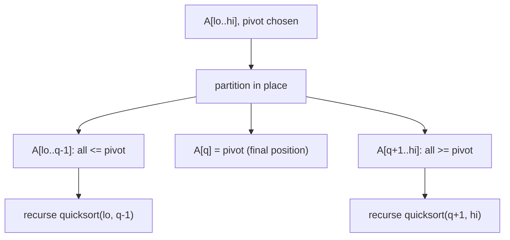

## Learning Objectives

- Explain the quicksort strategy — pick a pivot, partition the array around it, then recurse on both sides — and state why partitioning is the operation that does all the real work.
- Implement the Lomuto partition scheme in place and trace its invariant on a concrete array.
- Implement the Hoare partition scheme and explain how its two-pointer convergence differs from Lomuto's single-pass invariant.
- Justify why quicksort's partitioning step uses only O(1) extra space per call, in direct contrast with merge sort's O(n) auxiliary array.
- Determine the final sorted position of the pivot after one partition call, without looking at the rest of the array.

## Context & Motivation

Merge sort's divide-and-conquer recipe splits the array first — down the middle, regardless of the values it contains — and does all of its real work in the *combine* step, merging two already-sorted halves back together. Quicksort inverts that division of labor entirely. It does the hard work up front, during the *divide* step, by rearranging the array so that everything smaller than some chosen element sits to that element's left and everything larger sits to its right; once that rearrangement — the **partition** — is done, the *combine* step is trivial, because nothing needs to be merged at all. Two sorted subarrays sitting on either side of a single correctly-placed element are already a fully sorted array, with no further work required.

This is not a minor implementation variant of merge sort — it is a genuinely different algorithmic idea, discovered by Tony Hoare in 1959, and it is worth understanding on its own terms because the partitioning step it introduces is one of the most reused subroutines in algorithm design. The same in-place partitioning logic that quicksort uses to recurse on two halves is also exactly what the median-of-medians and quickselect algorithms use to find the *k*-th smallest element in linear time without sorting the whole array at all — partitioning, not the recursive sort wrapped around it, is the reusable idea.

Quicksort also earns its place in this curriculum for a second, very practical reason: it is one of the few textbook divide-and-conquer algorithms that sorts **in place**, using only a constant amount of extra memory beyond the input array itself (aside from the recursion stack, addressed in the next concept). Merge sort's O(n log n) guarantee comes at the cost of an O(n) auxiliary array at every level of the merge; quicksort gets the same asymptotic comparison count, in the average case, while touching almost no extra memory. That trade-off — guaranteed performance versus in-place efficiency — is a running theme across the rest of this cluster of concepts, and it starts here, with the mechanics of partitioning itself.

## Core Theory

### The partition invariant

Given an array segment `A[lo..hi]` and a chosen **pivot** value `p` (initially some element of that segment), a **partition** of the segment rearranges its elements in place so that afterward there is some index `q` with:

- every element in `A[lo..q-1]` is ≤ `p`,
- `A[q] == p`,
- every element in `A[q+1..hi]` is ≥ `p`.

Nothing is claimed about the *order* within `A[lo..q-1]` or within `A[q+1..hi]` — only that every element in the left group is no larger than the pivot and every element in the right group is no smaller. Once this holds, `q` is the pivot's final, correct position in the fully sorted array — no later step will ever move it again — and the algorithm recurses independently on `A[lo..q-1]` and `A[q+1..hi]`.



### The Lomuto partition scheme

Lomuto's scheme (popularized by Sedgewick, and the version most commonly taught first) always chooses the **last** element of the segment as the pivot, and maintains a single invariant as it scans left to right with two indices: `i` marks the boundary of the "known ≤ pivot" region, and `j` scans forward looking for elements to fold into that region.

```python
def lomuto_partition(A, lo, hi):
    pivot = A[hi]          # pivot is always the last element
    i = lo - 1              # boundary: A[lo..i] are all <= pivot
    for j in range(lo, hi):
        if A[j] <= pivot:
            i += 1
            A[i], A[j] = A[j], A[i]
    A[i + 1], A[hi] = A[hi], A[i + 1]   # place pivot in its final slot
    return i + 1             # pivot's final index

def quicksort(A, lo=0, hi=None):
    if hi is None:
        hi = len(A) - 1
    if lo < hi:
        q = lomuto_partition(A, lo, hi)
        quicksort(A, lo, q - 1)
        quicksort(A, q + 1, hi)
```

The invariant that makes this correct: at the top of every loop iteration, `A[lo..i]` are all ≤ pivot, and `A[i+1..j-1]` are all > pivot (everything scanned so far that failed the test). When `A[j] <= pivot`, extending the "≤ pivot" region by one means swapping the new qualifying element into position `i+1` — which is exactly why `i` is incremented first, then swapped. After the loop finishes scanning through `hi - 1`, swapping the pivot itself (sitting at `A[hi]`) into position `i+1` both finalizes the pivot's position and completes the partition.

### The Hoare partition scheme

Hoare's original scheme instead uses **two pointers converging from opposite ends**, and is often faster in practice because it does roughly three times fewer swaps on average, though it does not place the pivot at a fixed, easily-stated final index the way Lomuto's does.

```python
def hoare_partition(A, lo, hi):
    pivot = A[lo]           # pivot is the first element here
    i, j = lo - 1, hi + 1
    while True:
        i += 1
        while A[i] < pivot:
            i += 1
        j -= 1
        while A[j] > pivot:
            j -= 1
        if i >= j:
            return j          # NOT necessarily the pivot's final index
        A[i], A[j] = A[j], A[i]
```

With Hoare's scheme, the recursive calls are `quicksort(lo, j)` and `quicksort(j + 1, hi)` — the split point `j` is a valid partition boundary (everything at or before `j` is ≤ pivot, everything after is ≥ pivot), but the pivot value itself may end up anywhere within the left group, not sitting exactly at index `j`. This is a common source of off-by-one bugs when students try to graft Lomuto-style recursive calls (`quicksort(lo, q-1)` / `quicksort(q+1, hi)`) onto Hoare's partition — the two schemes' return values mean genuinely different things and are not interchangeable.

### Why partitioning needs only O(1) extra space

Both schemes above rearrange the segment using only **swaps within the array itself** — no auxiliary array is ever allocated. Contrast this directly with merge sort's combine step, which cannot merge two sorted halves in place without either extra storage or a substantially more complex (and slower) in-place merge; the standard merge-sort implementation allocates an O(n)-sized temporary array at (effectively) every level of the recursion. Quicksort's partition step uses a fixed number of index variables (`i`, `j`, `pivot`) regardless of the segment size — that is what "O(1) extra space" means here: the *partitioning itself* needs no memory that scales with the input. (The recursion itself still consumes stack space, which is addressed properly as part of the algorithm's overall space complexity in the following concept — but the partition operation in isolation is genuinely constant-space.)

## Worked Examples

### Example 1 — tracing Lomuto partition step by step

**Problem:** Partition `A = [8, 3, 1, 7, 0, 10, 2]` using Lomuto's scheme (pivot = last element, `2`).

Initial state: `lo = 0`, `hi = 6`, `pivot = A[6] = 2`, `i = -1`.

| j | A[j] | A[j] <= 2? | action | array after step |
|---|------|-----------|--------|-------------------|
| 0 | 8 | no | — | [8, 3, 1, 7, 0, 10, 2] |
| 1 | 3 | no | — | [8, 3, 1, 7, 0, 10, 2] |
| 2 | 1 | yes | i=0, swap A[0],A[2] | [1, 3, 8, 7, 0, 10, 2] |
| 3 | 7 | no | — | [1, 3, 8, 7, 0, 10, 2] |
| 4 | 0 | yes | i=1, swap A[1],A[4] | [1, 0, 8, 7, 3, 10, 2] |
| 5 | 10 | no | — | [1, 0, 8, 7, 3, 10, 2] |

Loop ends (j reached `hi - 1 = 5`). Final step: swap `A[i+1] = A[2]` with `A[hi] = A[6]`:

`[1, 0, 8, 7, 3, 10, 2]` → swap indices 2 and 6 → `[1, 0, 2, 7, 3, 10, 8]`

The pivot `2` now sits at index `q = 2`. Check the invariant: `A[0..1] = [1, 0]`, both ≤ 2 ✓; `A[3..6] = [7, 3, 10, 8]`, all ≥ 2 ✓. The algorithm now recurses independently on `A[0..1]` and `A[3..6]` — the pivot at index 2 is never touched again.

### Example 2 — the pivot's final position is immediate, not incidental

**Problem:** Explain, without running the whole sort, why after one partition call on `[5, 5, 5, 5]` with pivot `A[3] = 5`, the result is already fully partitioned (though not necessarily in a way that looks "moved").

**Reasoning.** Every element equals the pivot, so every comparison `A[j] <= pivot` succeeds, and `i` increments on every iteration — the loop ends with `i = 2` (having processed `j = 0, 1, 2`), and the final swap places `A[3]` (the pivot) at index 3, which is where it already was. The array is unchanged as a sequence of swaps that happen to be no-ops or self-swaps, but the invariant is still verified: `A[0..2] = [5,5,5]` all ≤ 5, `A[3] = 5`, and the (empty) right side trivially satisfies "all ≥ 5." This edge case — an array of all-equal elements — is exactly the case that produces the *worst possible* split (one side of size 0, the other of size n − 1 at every level), a fact picked up again in the next concept on average-case analysis.

### Example 3 — Hoare's scheme on the same array, contrasted

**Problem:** Partition `A = [8, 3, 1, 7, 0, 10, 2]` using Hoare's scheme (pivot = first element, `8`).

`i = -1, j = 7` initially. First pass: `i` advances until `A[i] >= 8` — that's `i = 0` (`A[0] = 8`). `j` retreats until `A[j] <= 8` — that's `j = 6` (`A[6] = 2`). Since `i < j`, swap `A[0]` and `A[6]`: `[2, 3, 1, 7, 0, 10, 8]`.

Second pass: `i` advances from 1 — `A[1]=3 < 8` ok, continue; `A[2]=1 < 8` ok, continue; `A[3]=7 < 8` ok, continue; `A[4]=0 < 8` ok, continue; `A[5]=10 >= 8`, stop at `i = 5`. `j` retreats from 5 — `A[5] = 10 > 8`, continue; `j = 4`, `A[4] = 0 <= 8`, stop at `j = 4`. Now `i = 5 > j = 4`, so the loop ends and returns `j = 4`.

Notice the pivot value `8` ended up at index 6 in the array `[2, 3, 1, 7, 0, 10, 8]` — not at the returned split index 4, and not even inside the "left" partition `A[0..4] = [2,3,1,7,0]`. That is exactly the behavior flagged in Core Theory: Hoare's return value is a valid split boundary (`A[0..4]` are all ≤ 8, `A[5..6] = [10, 8]` are all ≥ 8), but it is not the pivot's resting index, unlike Lomuto's `q`.

## Common Misconceptions & Pitfalls

- **"Partitioning sorts the array."** It does not — it only guarantees a coarse ordering relative to one pivot value. In Example 1, after partitioning, `A[3..6] = [7, 3, 10, 8]` is not sorted at all; sorting only emerges after the recursive calls finish partitioning every smaller sub-segment down to size 0 or 1.
- **"Any element can serve as the pivot with identical downstream behavior."** The choice of pivot changes the sizes of the two resulting partitions, and therefore changes the total work done — this is treated properly as a running-time question in the next concept, but it starts being visible here: an already-sorted array with Lomuto's "always pick the last element" rule produces the most lopsided possible split at every level (one side empty, one side everything else), as seen with the all-equal array in Example 2.
- **"Lomuto's `q` and Hoare's `j` mean the same thing and the recursive calls can be written identically for both."** As Example 3 shows concretely, they do not: Lomuto's `q` is the pivot's exact final index, so the safe recursive calls are `(lo, q-1)` and `(q+1, hi)`; Hoare's `j` is only a partition boundary, and the correct recursive calls are `(lo, j)` and `(j+1, hi)` — using Lomuto-style calls on a Hoare partition can silently drop an element from recursion or infinite-loop on inputs of size 2.
- **"In-place means no extra memory is used anywhere in quicksort."** The partition step itself is O(1) extra space, but the recursive calls still consume stack frames — for a well-balanced recursion this is O(log n) stack depth, still far better than merge sort's O(n) auxiliary array, but not literally zero extra memory; this distinction matters more once quicksort's actual worst-case recursion depth is analyzed.

## Summary

Quicksort partitions an array segment around a chosen pivot so that everything ≤ the pivot ends up on its left and everything ≥ the pivot ends up on its right, then recurses independently on each side — with no merge step needed afterward, unlike merge sort. The Lomuto scheme scans left to right with a single boundary index and places the pivot at an exactly known final position; the Hoare scheme converges two pointers from opposite ends, does fewer swaps on average, but returns only a partition boundary, not the pivot's resting index — the two are not drop-in replacements for each other's recursive calls. Both schemes rearrange elements using only in-place swaps, giving partitioning itself O(1) extra space, a genuine and practically important contrast with merge sort's O(n) auxiliary array at every level of its combine step.

## Documentation Links

- [Sedgewick & Wayne — Algorithms Lectures (Princeton)](https://algs4.cs.princeton.edu/lectures/) — doc
- [MIT 6.006 — Lecture Notes (OCW)](https://ocw.mit.edu/courses/6-006-introduction-to-algorithms-spring-2020/pages/lecture-notes/) — doc
