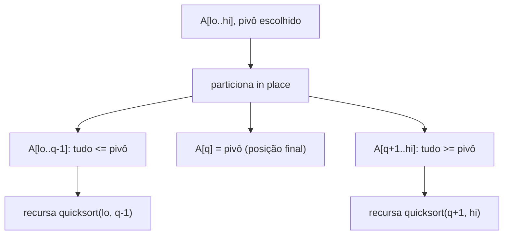

## Objetivos de Aprendizagem

- Explicar a estratégia do quicksort, escolher um pivô, particionar o array em torno dele, depois recursar em ambos os lados, e enunciar por que particionar é a operação que faz todo o trabalho real.
- Implementar o esquema de particionamento de Lomuto in-place e rastrear seu invariante em um array concreto.
- Implementar o esquema de particionamento de Hoare e explicar como sua convergência de dois ponteiros difere do invariante de passagem única de Lomuto.
- Justificar por que o passo de particionamento do quicksort usa apenas O(1) de espaço extra por chamada, em contraste direto com o array auxiliar O(n) do merge sort.
- Determinar a posição final ordenada do pivô depois de uma chamada de particionamento, sem olhar para o resto do array.

## Contexto e Motivação

A receita de dividir para conquistar do merge sort divide o array primeiro, ao meio, independentemente dos valores que contém, e faz todo seu trabalho real no passo de *combinar*, mesclando duas metades já ordenadas de volta juntas. Quicksort inverte essa divisão de trabalho completamente. Ele faz o trabalho difícil antecipadamente, durante o passo de *dividir*, rearranjando o array de forma que tudo menor que algum elemento escolhido fique à esquerda daquele elemento e tudo maior fique à sua direita; uma vez que esse rearranjo, o **particionamento**, é feito, o passo de *combinar* é trivial, porque nada precisa ser mesclado de forma alguma. Dois subarrays ordenados sentados em cada lado de um único elemento corretamente posicionado já são um array completamente ordenado, sem mais trabalho necessário.

Isso não é uma variante de implementação menor do merge sort, é uma ideia algorítmica genuinamente diferente, descoberta por Tony Hoare em 1959, e vale a pena entendê-la em seus próprios termos porque o passo de particionamento que ela introduz é uma das sub-rotinas mais reutilizadas em design de algoritmo. A mesma lógica de particionamento in-place que quicksort usa para recursar em duas metades também é exatamente o que os algoritmos median-of-medians e quickselect usam para encontrar o *k*-ésimo menor elemento em tempo linear sem ordenar o array inteiro, particionamento, não a ordenação recursiva envolta em torno dele, é a ideia reutilizável.

Quicksort também ganha seu lugar neste currículo por uma segunda razão, bem prática: é um dos poucos algoritmos clássicos de dividir para conquistar que ordena **in place**, usando apenas uma quantidade constante de memória extra além do próprio array de entrada (à parte a pilha de recursão, tratada no próximo conceito). A garantia O(n log n) do merge sort vem ao custo de um array auxiliar O(n) em todo nível do merge; quicksort obtém a mesma contagem de comparação assintótica, no caso médio, enquanto toca quase nenhuma memória extra. Essa troca, desempenho garantido versus eficiência in-place, é um tema recorrente através do resto deste grupo de conceitos, e começa aqui, com a mecânica do próprio particionamento.

## Teoria Central

### O invariante de particionamento

Dado um segmento de array `A[lo..hi]` e um valor de **pivô** escolhido `p` (inicialmente algum elemento daquele segmento), um **particionamento** do segmento rearranja seus elementos in place de forma que depois haja algum índice `q` com:

- todo elemento em `A[lo..q-1]` é ≤ `p`,
- `A[q] == p`,
- todo elemento em `A[q+1..hi]` é ≥ `p`.

Nada é afirmado sobre a *ordem* dentro de `A[lo..q-1]` ou dentro de `A[q+1..hi]`, só que todo elemento no grupo esquerdo não é maior que o pivô e todo elemento no grupo direito não é menor. Uma vez que isso vale, `q` é a posição final, correta, do pivô no array completamente ordenado, nenhum passo posterior jamais o moverá de novo, e o algoritmo recursa independentemente em `A[lo..q-1]` e `A[q+1..hi]`.



### O esquema de particionamento de Lomuto

O esquema de Lomuto (popularizado por Sedgewick, e a versão mais comumente ensinada primeiro) sempre escolhe o **último** elemento do segmento como pivô, e mantém um único invariante enquanto varre da esquerda para a direita com dois índices: `i` marca a fronteira da região "conhecida ≤ pivô", e `j` varre para frente procurando elementos para incorporar naquela região.

```python
def lomuto_partition(A, lo, hi):
    pivot = A[hi]          # o pivô é sempre o último elemento
    i = lo - 1              # fronteira: A[lo..i] são todos <= pivô
    for j in range(lo, hi):
        if A[j] <= pivot:
            i += 1
            A[i], A[j] = A[j], A[i]
    A[i + 1], A[hi] = A[hi], A[i + 1]   # coloca o pivô em seu slot final
    return i + 1             # índice final do pivô

def quicksort(A, lo=0, hi=None):
    if hi is None:
        hi = len(A) - 1
    if lo < hi:
        q = lomuto_partition(A, lo, hi)
        quicksort(A, lo, q - 1)
        quicksort(A, q + 1, hi)
```

O invariante que torna isso correto: no topo de toda iteração do laço, `A[lo..i]` são todos ≤ pivô, e `A[i+1..j-1]` são todos > pivô (tudo varrido até agora que falhou o teste). Quando `A[j] <= pivô`, estender a região "≤ pivô" em um significa trocar o novo elemento qualificado para a posição `i+1`, que é exatamente por que `i` é incrementado primeiro, depois trocado. Depois que o laço termina de varrer até `hi - 1`, trocar o próprio pivô (sentado em `A[hi]`) para a posição `i+1` tanto finaliza a posição do pivô quanto completa o particionamento.

### O esquema de particionamento de Hoare

O esquema original de Hoare, em vez disso, usa **dois ponteiros convergindo de extremidades opostas**, e é frequentemente mais rápido na prática porque faz aproximadamente três vezes menos trocas em média, embora não coloque o pivô em um índice final fixo e facilmente enunciável como o de Lomuto faz.

```python
def hoare_partition(A, lo, hi):
    pivot = A[lo]           # o pivô é o primeiro elemento aqui
    i, j = lo - 1, hi + 1
    while True:
        i += 1
        while A[i] < pivot:
            i += 1
        j -= 1
        while A[j] > pivot:
            j -= 1
        if i >= j:
            return j          # NÃO necessariamente o índice final do pivô
        A[i], A[j] = A[j], A[i]
```

Com o esquema de Hoare, as chamadas recursivas são `quicksort(lo, j)` e `quicksort(j + 1, hi)`, o ponto de divisão `j` é uma fronteira de particionamento válida (tudo em ou antes de `j` é ≤ pivô, tudo depois é ≥ pivô), mas o próprio valor do pivô pode acabar em qualquer lugar dentro do grupo esquerdo, não sentado exatamente no índice `j`. Isso é uma fonte comum de erros de índice fora por um quando estudantes tentam enxertar chamadas recursivas estilo Lomuto (`quicksort(lo, q-1)` / `quicksort(q+1, hi)`) sobre o particionamento de Hoare, os valores de retorno dos dois esquemas significam coisas genuinamente diferentes e não são intercambiáveis.

### Por que particionar precisa de apenas O(1) de espaço extra

Ambos os esquemas acima rearranjam o segmento usando apenas **trocas dentro do próprio array**, nenhum array auxiliar é jamais alocado. Contraste isso diretamente com o passo de combinar do merge sort, que não pode mesclar duas metades ordenadas in place sem armazenamento extra ou um merge in-place substancialmente mais complexo (e mais lento); a implementação padrão de merge sort aloca um array temporário de tamanho O(n) em (efetivamente) todo nível da recursão. O passo de particionamento do quicksort usa um número fixo de variáveis de índice (`i`, `j`, `pivot`) independentemente do tamanho do segmento, isso é o que "O(1) de espaço extra" significa aqui: o *próprio particionamento* não precisa de memória que escale com a entrada. (A própria recursão ainda consome espaço de pilha, o que é tratado propriamente como parte da complexidade de espaço geral do algoritmo no conceito seguinte, mas a operação de particionamento isolada é genuinamente de espaço constante.)

## Exemplos Resolvidos

### Exemplo 1 — rastreando o particionamento de Lomuto passo a passo

**Problema:** Particione `A = [8, 3, 1, 7, 0, 10, 2]` usando o esquema de Lomuto (pivô = último elemento, `2`).

Estado inicial: `lo = 0`, `hi = 6`, `pivot = A[6] = 2`, `i = -1`.

| j | A[j] | A[j] <= 2? | ação | array depois do passo |
|---|------|-----------|--------|-------------------|
| 0 | 8 | não | — | [8, 3, 1, 7, 0, 10, 2] |
| 1 | 3 | não | — | [8, 3, 1, 7, 0, 10, 2] |
| 2 | 1 | sim | i=0, troca A[0],A[2] | [1, 3, 8, 7, 0, 10, 2] |
| 3 | 7 | não | — | [1, 3, 8, 7, 0, 10, 2] |
| 4 | 0 | sim | i=1, troca A[1],A[4] | [1, 0, 8, 7, 3, 10, 2] |
| 5 | 10 | não | — | [1, 0, 8, 7, 3, 10, 2] |

O laço termina (j chegou a `hi - 1 = 5`). Passo final: troca `A[i+1] = A[2]` com `A[hi] = A[6]`:

`[1, 0, 8, 7, 3, 10, 2]` → troca índices 2 e 6 → `[1, 0, 2, 7, 3, 10, 8]`

O pivô `2` agora fica no índice `q = 2`. Verifique o invariante: `A[0..1] = [1, 0]`, ambos ≤ 2 ✓; `A[3..6] = [7, 3, 10, 8]`, todos ≥ 2 ✓. O algoritmo agora recursa independentemente em `A[0..1]` e `A[3..6]`, o pivô no índice 2 nunca é tocado de novo.

### Exemplo 2 — a posição final do pivô é imediata, não incidental

**Problema:** Explique, sem rodar a ordenação inteira, por que depois de uma chamada de particionamento em `[5, 5, 5, 5]` com pivô `A[3] = 5`, o resultado já está completamente particionado (embora não necessariamente de uma forma que pareça "movida").

**Raciocínio.** Todo elemento é igual ao pivô, então toda comparação `A[j] <= pivô` é bem-sucedida, e `i` incrementa em toda iteração, o laço termina com `i = 2` (tendo processado `j = 0, 1, 2`), e a troca final coloca `A[3]` (o pivô) no índice 3, que é onde já estava. O array permanece inalterado como uma sequência de trocas que acontecem de ser no-ops ou auto-trocas, mas o invariante ainda é verificado: `A[0..2] = [5,5,5]` todos ≤ 5, `A[3] = 5`, e o lado direito (vazio) trivialmente satisfaz "tudo ≥ 5." Este caso de borda, um array de elementos todos iguais, é exatamente o caso que produz a divisão *pior possível* (um lado de tamanho 0, o outro de tamanho n − 1 em todo nível), um fato retomado no próximo conceito sobre análise de caso médio.

### Exemplo 3 — o esquema de Hoare no mesmo array, contrastado

**Problema:** Particione `A = [8, 3, 1, 7, 0, 10, 2]` usando o esquema de Hoare (pivô = primeiro elemento, `8`).

`i = -1, j = 7` inicialmente. Primeira passagem: `i` avança até `A[i] >= 8`, isso é `i = 0` (`A[0] = 8`). `j` retrocede até `A[j] <= 8`, isso é `j = 6` (`A[6] = 2`). Como `i < j`, troca `A[0]` e `A[6]`: `[2, 3, 1, 7, 0, 10, 8]`.

Segunda passagem: `i` avança de 1, `A[1]=3 < 8` ok, continua; `A[2]=1 < 8` ok, continua; `A[3]=7 < 8` ok, continua; `A[4]=0 < 8` ok, continua; `A[5]=10 >= 8`, para em `i = 5`. `j` retrocede de 5, `A[5] = 10 > 8`, continua; `j = 4`, `A[4] = 0 <= 8`, para em `j = 4`. Agora `i = 5 > j = 4`, então o laço termina e retorna `j = 4`.

Note que o valor do pivô `8` acabou no índice 6 no array `[2, 3, 1, 7, 0, 10, 8]`, não no índice de divisão retornado 4, e nem mesmo dentro do particionamento "esquerdo" `A[0..4] = [2,3,1,7,0]`. Esse é exatamente o comportamento sinalizado na Teoria Central: o valor de retorno de Hoare é uma fronteira de divisão válida (`A[0..4]` são todos ≤ 8, `A[5..6] = [10, 8]` são todos ≥ 8), mas não é o índice de repouso do pivô, diferente do `q` de Lomuto.

## Equívocos Comuns e Armadilhas

- **"Particionar ordena o array."** Não ordena, garante apenas uma ordenação grosseira relativa a um valor de pivô. No Exemplo 1, depois de particionar, `A[3..6] = [7, 3, 10, 8]` não está ordenado de forma alguma; ordenação só emerge depois que as chamadas recursivas terminam de particionar todo subsegmento menor até tamanho 0 ou 1.
- **"Qualquer elemento pode servir como pivô com comportamento posterior idêntico."** A escolha do pivô muda os tamanhos das duas partições resultantes, e portanto muda o trabalho total feito, isso é tratado propriamente como uma pergunta de tempo de execução no próximo conceito, mas começa a ficar visível aqui: um array já ordenado com a regra "sempre escolha o último elemento" de Lomuto produz a divisão mais desequilibrada possível em todo nível (um lado vazio, um lado tudo mais), como visto com o array de elementos todos iguais no Exemplo 2.
- **"O `q` de Lomuto e o `j` de Hoare significam a mesma coisa e as chamadas recursivas podem ser escritas identicamente para ambos."** Como o Exemplo 3 mostra concretamente, não significam: o `q` de Lomuto é o índice final exato do pivô, então as chamadas recursivas seguras são `(lo, q-1)` e `(q+1, hi)`; o `j` de Hoare é apenas uma fronteira de particionamento, e as chamadas recursivas corretas são `(lo, j)` e `(j+1, hi)`, usar chamadas estilo Lomuto em um particionamento de Hoare pode silenciosamente descartar um elemento da recursão ou entrar em loop infinito em entradas de tamanho 2.
- **"In-place significa que nenhuma memória extra é usada em lugar nenhum no quicksort."** O próprio passo de particionamento é O(1) de espaço extra, mas as chamadas recursivas ainda consomem quadros de pilha, para uma recursão bem balanceada isso é profundidade de pilha O(log n), ainda muito melhor que o array auxiliar O(n) do merge sort, mas não literalmente zero memória extra; essa distinção importa mais uma vez que a profundidade de recursão de pior caso real do quicksort é analisada.

## Resumo

Quicksort particiona um segmento de array em torno de um pivô escolhido de forma que tudo ≤ o pivô acabe à sua esquerda e tudo ≥ o pivô acabe à sua direita, depois recursa independentemente em cada lado, sem passo de merge necessário depois, diferente do merge sort. O esquema de Lomuto varre da esquerda para a direita com um único índice de fronteira e coloca o pivô em uma posição final exatamente conhecida; o esquema de Hoare converge dois ponteiros de extremidades opostas, faz menos trocas em média, mas retorna apenas uma fronteira de particionamento, não o índice de repouso do pivô, os dois não são substitutos diretos um do outro nas chamadas recursivas. Ambos os esquemas rearranjam elementos usando apenas trocas in-place, dando ao próprio particionamento O(1) de espaço extra, um contraste genuíno e praticamente importante com o array auxiliar O(n) do merge sort em todo nível de seu passo de combinar.

## Documentation Links

- [Sedgewick & Wayne — Algorithms Lectures (Princeton)](https://algs4.cs.princeton.edu/lectures/) — doc
- [MIT 6.006 — Lecture Notes (OCW)](https://ocw.mit.edu/courses/6-006-introduction-to-algorithms-spring-2020/pages/lecture-notes/) — doc
