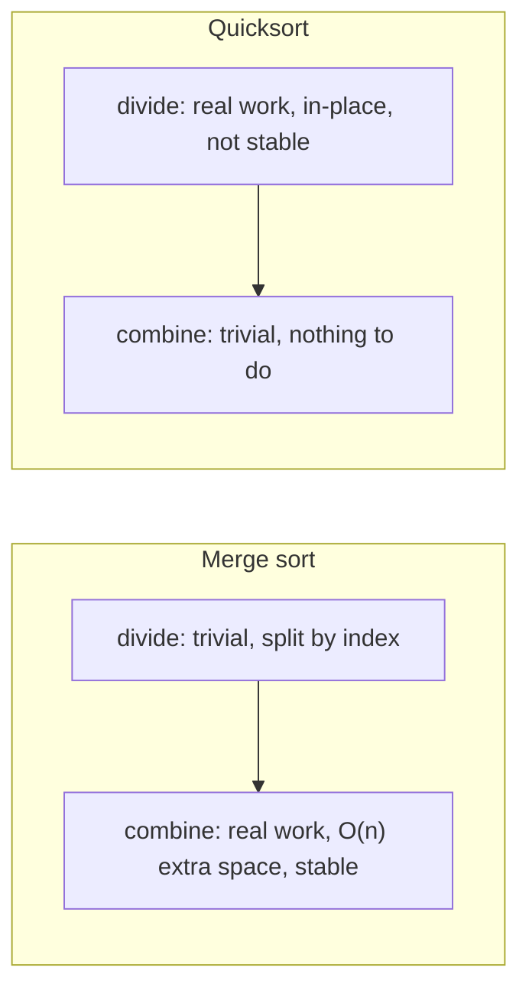

## Learning Objectives

- Compare quicksort and merge sort across time complexity, space complexity, and stability, citing the precise guarantee each provides.
- Explain why both algorithms meet the same O(n log n) comparison-sort lower bound "on average," yet arrive there through structurally different arguments.
- Justify, with a concrete scenario, when a system should prefer merge sort's worst-case guarantee over quicksort's typically-faster-in-practice behavior.
- Identify what "stability" means for a sort and why quicksort's in-place partitioning makes it difficult to preserve.

## Context & Motivation

By this point, two genuinely different divide-and-conquer sorting algorithms have each been analyzed on their own terms: merge sort divides trivially and does its real work while combining, always in O(n log n) time but never in less than O(n) extra space; quicksort divides with real work (partitioning) and combines trivially, achieving O(n log n) *expected* time in-place, but degrading to O(n²) on an unlucky (or, without randomization, adversarially chosen) sequence of pivots. Neither algorithm is a strictly better version of the other — each makes a different set of trade-offs, and a working engineer needs to know which trade-off matters for a given situation, not just which algorithm is "faster" in the abstract.

This comparison also matters because it is a recurring shape in algorithm design generally: a guaranteed worst-case bound bought at the cost of extra memory or a more rigid structure, versus a typically-better-in-practice approach that carries some risk, however small, of a bad outcome. Understanding exactly *why* each algorithm lands where it does — not simply memorizing "quicksort is fast, merge sort is safe" — is what lets that judgment transfer to new situations: choosing between a hash table and a balanced tree, an approximate algorithm and an exact one, a lock-free structure and a lock-based one, all involve some version of the same guaranteed-worst-case-versus-typical-performance question first encountered concretely here.

## Core Theory

### Head-to-head comparison

| Property | Quicksort (randomized) | Merge sort |
|---|---|---|
| Average-case time | O(n log n) | O(n log n) |
| Worst-case time | O(n²) (astronomically unlikely with randomization) | O(n log n), always |
| Extra space | O(log n) (recursion stack only — partitioning itself is O(1)) | O(n) (auxiliary array for merging) |
| In-place? | Yes | No (standard implementation) |
| Stable? | No (standard implementations) | Yes |
| Where the "hard work" happens | Divide step (partitioning) | Combine step (merging) |

Every row of this table reflects a genuine, load-bearing structural difference between the two algorithms — none of these are incidental implementation details that a cleverer version could simply remove.

### Why the worst-case guarantee differs

Merge sort's O(n log n) bound holds unconditionally: the recursion always splits the array exactly in half by index (`T(n) = 2T(n/2) + O(n)` for the merge step), regardless of the data's values. There is no input, however adversarially constructed, that can make merge sort split unevenly — the split point is fixed by position, not by comparison outcomes. Quicksort's split point, by contrast, is determined by where the pivot's value happens to rank among the segment's elements — a property of the *data*, not the *index* — which is exactly what makes an unbalanced split (and hence O(n²) behavior) possible in principle, defended against only probabilistically by randomization, as established in the previous concept. "Meets the lower bound on average" is therefore a fundamentally different kind of claim for each algorithm: for merge sort it is also the worst case; for quicksort it is a statement about expectation over internal coin flips, with a residual (vanishingly small, but nonzero) chance of doing much worse.

### Why extra space differs

Merge sort's combine step needs to interleave two already-sorted subarrays into sorted order — doing this correctly in place, without overwriting elements still needed for comparison, requires either a full auxiliary array (the standard approach, O(n) extra space) or a substantially more intricate in-place merge algorithm that is rarely used in practice because of its complexity and worse constant factors. Quicksort's partitioning, as established in the first concept of this cluster, rearranges elements using only swaps within the original array — no second array is ever needed, only the O(log n) stack space consumed by the recursion itself (assuming the smaller of the two partitions is always recursed on first, which bounds stack depth to O(log n) even in the worst case, a standard optimization).

### Why stability differs

A sort is **stable** if elements that compare as equal retain their original relative order after sorting — this matters whenever a sort key doesn't uniquely determine an item's identity (e.g., sorting a list of purchase records by date, where records sharing the same date should stay in whatever order they were originally listed). Merge sort's combine step can always be written to prefer the left subarray's element on a tie, which preserves original order because the left subarray consists entirely of elements that appeared earlier in the original array — stability falls out naturally from how merging works. Quicksort's in-place partitioning, by contrast, swaps elements across arbitrary distances in the array based on comparisons with the pivot — two equal elements can easily be swapped past each other during partitioning, with no mechanism in the standard algorithm to track or preserve their original relative order. A stable variant of quicksort exists but requires extra bookkeeping (typically extra space) that erodes the in-place advantage that makes quicksort attractive in the first place.

### Why quicksort is often faster in practice despite the same asymptotic average case

Both algorithms perform O(n log n) comparisons on average, but quicksort typically runs faster in real measurements because of **constant factors** the asymptotic notation deliberately hides. Quicksort's partitioning accesses memory in a tight, mostly sequential scan with excellent **cache locality** — the two index pointers move through contiguous memory, and modern CPUs prefetch aggressively for exactly this access pattern. Merge sort's combine step also scans sequentially, but must read from two separate subarrays and write into a third auxiliary array, which touches more distinct memory regions and, more importantly, requires the extra allocation and copying overhead every level of the recursion. Quicksort also tends to do fewer total element moves for many practical distributions, and modern standard-library sorts (e.g., introsort, used by many language runtimes) are built around quicksort's in-place, cache-friendly partitioning specifically because of this practical edge — while defending against the O(n²) worst case with a fallback (typically switching to heapsort if recursion depth grows suspiciously large).

## Worked Examples

### Example 1 — computing actual extra memory for a concrete n

**Problem:** For an array of one million 64-bit integers (8 MB total), estimate the extra memory each algorithm needs at its peak.

**Merge sort.** The standard implementation allocates an auxiliary array of the same size as the (sub)array being merged at each level — in a typical implementation this is a single n-sized scratch buffer reused across the recursion, so roughly another 8 MB, doubling the algorithm's total memory footprint to sort the same 8 MB of data.

**Quicksort (in-place, randomized).** Only O(log n) extra space for the recursion stack — for n = 1,000,000, log₂ n ≈ 20, so on the order of a few dozen stack frames' worth of index variables, a negligible fraction of a kilobyte. Quicksort sorts the same 8 MB of data using essentially no additional memory beyond the array itself.

This is the concrete, practical shape of the "in-place vs. O(n) extra space" trade-off — not an abstract asymptotic distinction, but a real doubling of memory footprint for large datasets under memory pressure (embedded systems, memory-constrained servers, or simply very large arrays where doubling matters).

### Example 2 — a stability failure made concrete

**Problem:** Sort the records `[(A, 3), (B, 1), (C, 3), (D, 2)]` by their numeric key using a standard (unstable) quicksort partition, and show that `(A, 3)` and `(C, 3)` can end up out of their original relative order.

**Reasoning.** Suppose Lomuto's partition picks the last element, `(D, 2)`, as the pivot on the first call. Scanning left to right: `(A,3)` fails `<= 2`; `(B,1)` passes, swap into position 0 with itself, `i=0`; `(C,3)` fails; end of scan, swap pivot into position `i+1=1`: the array becomes `[(B,1), (D,2), (C,3), (A,3)]`. Notice `(C,3)` now appears *before* `(A,3)`, even though `(A,3)` came first in the original array — the tie between the two key-3 records has been broken in the opposite order from how they originally appeared, purely as a side effect of which swaps partitioning happened to perform. A stable sort (merge sort, or a specifically stability-preserving variant of quicksort) would guarantee `(A,3)` still precedes `(C,3)` after sorting.

### Example 3 — choosing an algorithm for a real system

**Problem:** A real-time flight-control system must sort sensor readings on every control cycle, with a hard deadline: if any single sort call takes longer than the frame budget, the system misses a safety-critical update. Which algorithm should it use, and why?

**Reasoning.** This is exactly the scenario where merge sort's *guaranteed* O(n log n) worst case is worth its O(n) memory cost: randomized quicksort's expected O(n log n) behavior comes with a nonzero — if extremely small — probability of degrading toward O(n²) on any given call, and in a hard-real-time system, "extremely unlikely to miss the deadline" is not an acceptable substitute for "provably cannot miss the deadline." A system where the *worst possible* single execution must be bounded, not just the typical or average one, is precisely the situation described in Core Theory as favoring merge sort's unconditional guarantee over quicksort's typically-faster, occasionally-risky performance — assuming the extra memory is available, which for sensor-sized arrays it typically is.

## Common Misconceptions & Pitfalls

- **"Quicksort is strictly faster than merge sort."** Only true as a statement about *typical, expected* performance, driven by constant factors like cache locality — it is not true about worst-case behavior, where merge sort's guarantee is strictly stronger, nor is it a universal claim; for certain data distributions or memory layouts, merge sort's predictability can outperform quicksort's variance in aggregate, especially when tail latency (not average latency) is what's being optimized.
- **"Both being O(n log n) on average means they're interchangeable in practice."** As Example 3 shows, "on average" hides an important difference — merge sort's O(n log n) is also its worst case, while quicksort's is only its expected case; systems with hard deadlines or adversarial inputs care about exactly this distinction, not just the shared average-case label.
- **"Quicksort could be made stable just by being more careful with the comparisons."** Preserving relative order among equal elements while doing in-place swaps across arbitrary distances is not simply a matter of implementation care — genuinely stable in-place partitioning is a much harder problem, and practical stable variants of quicksort typically reintroduce the extra memory that in-place quicksort was trying to avoid in the first place, eroding its main advantage.
- **"Merge sort's O(n) extra space is a minor implementation detail, not a real trade-off."** As Example 1 shows concretely, this can mean literally doubling the memory footprint required to sort a dataset — for large arrays or memory-constrained environments, this is a first-order practical cost, not a footnote.

## Summary

Quicksort and merge sort both achieve O(n log n) comparisons on average, but arrive there through opposite divide-and-conquer structures — quicksort does its real work while dividing (partitioning, in place, O(log n) stack space, but O(n²) possible if partitions are badly unbalanced) while merge sort does its real work while combining (merging, requiring O(n) auxiliary space, but with a worst case that is always O(n log n), never worse, because its split is by index rather than by data). Merge sort's combine step naturally preserves relative order among equal elements (stability); quicksort's in-place swaps generally do not, without extra bookkeeping. In practice, quicksort is often faster due to better cache locality and lower constant factors — but any system whose correctness or safety depends on a guaranteed worst-case bound, rather than a typically-fast expected one, should prefer merge sort's unconditional guarantee, extra memory cost and all.

## Documentation Links

- [Sedgewick & Wayne — Algorithms Lectures (Princeton)](https://algs4.cs.princeton.edu/lectures/) — doc
- [MIT 6.006 — Lecture Notes (OCW)](https://ocw.mit.edu/courses/6-006-introduction-to-algorithms-spring-2020/pages/lecture-notes/) — doc
