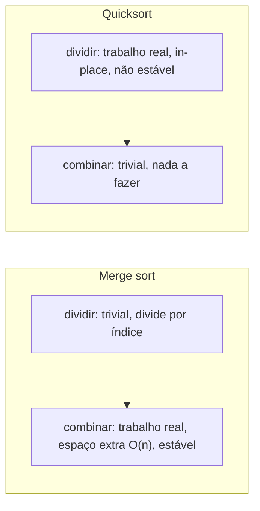

## Objetivos de Aprendizagem

- Comparar quicksort e merge sort em complexidade de tempo, complexidade de espaço, e estabilidade, citando a garantia precisa que cada um fornece.
- Explicar por que ambos os algoritmos atingem o mesmo limite inferior O(n log n) de ordenação por comparação "em média," mas chegam lá através de argumentos estruturalmente diferentes.
- Justificar, com um cenário concreto, quando um sistema deveria preferir a garantia de pior caso do merge sort sobre o comportamento tipicamente mais rápido na prática do quicksort.
- Identificar o que "estabilidade" significa para uma ordenação e por que o particionamento in-place do quicksort torna difícil preservá-la.

## Contexto e Motivação

A esta altura, dois algoritmos de ordenação por dividir para conquistar genuinamente diferentes foram cada um analisado em seus próprios termos: merge sort divide trivialmente e faz seu trabalho real enquanto combina, sempre em tempo O(n log n) mas nunca em menos de O(n) de espaço extra; quicksort divide com trabalho real (particionamento) e combina trivialmente, alcançando tempo O(n log n) *esperado* in-place, mas degradando para O(n²) em uma sequência azarada (ou, sem randomização, adversarialmente escolhida) de pivôs. Nenhum dos algoritmos é uma versão estritamente melhor do outro, cada um faz um conjunto diferente de trocas, e um engenheiro em atuação precisa saber qual troca importa para uma dada situação, não apenas qual algoritmo é "mais rápido" no abstrato.

Essa comparação também importa porque é um formato recorrente em design de algoritmo em geral: um limite garantido de pior caso comprado ao custo de memória extra ou uma estrutura mais rígida, versus uma abordagem tipicamente melhor na prática que carrega algum risco, por menor que seja, de um resultado ruim. Entender exatamente *por que* cada algoritmo termina onde termina, não simplesmente memorizar "quicksort é rápido, merge sort é seguro", é o que permite que esse julgamento se transfira para novas situações: escolher entre uma hash table e uma árvore balanceada, um algoritmo aproximado e um exato, uma estrutura sem lock e uma baseada em lock, todos envolvem alguma versão da mesma pergunta de garantia-de-pior-caso-versus-desempenho-típico encontrada concretamente aqui pela primeira vez.

## Teoria Central

### Comparação lado a lado

| Propriedade | Quicksort (randomizado) | Merge sort |
|---|---|---|
| Tempo caso médio | O(n log n) | O(n log n) |
| Tempo pior caso | O(n²) (astronomicamente improvável com randomização) | O(n log n), sempre |
| Espaço extra | O(log n) (só pilha de recursão, o próprio particionamento é O(1)) | O(n) (array auxiliar para mesclar) |
| In-place? | Sim | Não (implementação padrão) |
| Estável? | Não (implementações padrão) | Sim |
| Onde o "trabalho difícil" acontece | Passo de dividir (particionamento) | Passo de combinar (mesclagem) |

Toda linha desta tabela reflete uma diferença estrutural genuína e estrutural entre os dois algoritmos, nenhuma dessas é um detalhe de implementação incidental que uma versão mais esperta poderia simplesmente remover.

### Por que a garantia de pior caso difere

O limite O(n log n) do merge sort vale incondicionalmente: a recursão sempre divide o array exatamente pela metade por índice (`T(n) = 2T(n/2) + O(n)` para o passo de merge), independentemente dos valores dos dados. Não existe entrada, por mais adversarialmente construída que seja, que possa fazer merge sort dividir de forma desigual, o ponto de divisão é fixado por posição, não por resultados de comparação. O ponto de divisão do quicksort, em contraste, é determinado por onde o valor do pivô acontece de rankear entre os elementos do segmento, uma propriedade dos *dados*, não do *índice*, que é exatamente o que torna uma divisão desbalanceada (e portanto comportamento O(n²)) possível em princípio, defendida apenas probabilisticamente por randomização, como estabelecido no conceito anterior. "Atinge o limite inferior em média" é portanto um tipo fundamentalmente diferente de afirmação para cada algoritmo: para merge sort é também o pior caso; para quicksort é uma afirmação sobre expectativa em relação aos lançamentos de moeda internos, com uma chance residual (extremamente pequena, mas não nula) de se sair muito pior.

### Por que o espaço extra difere

O passo de combinar do merge sort precisa intercalar dois subarrays já ordenados em ordem ordenada, fazer isso corretamente in place, sem sobrescrever elementos ainda necessários para comparação, exige ou um array auxiliar completo (a abordagem padrão, O(n) de espaço extra) ou um algoritmo de merge in-place substancialmente mais intrincado que é raramente usado na prática por causa de sua complexidade e piores fatores constantes. O particionamento do quicksort, como estabelecido no primeiro conceito deste grupo, rearranja elementos usando apenas trocas dentro do array original, nenhum segundo array é jamais necessário, apenas o espaço de pilha O(log n) consumido pela própria recursão (assumindo que a menor das duas partições é sempre recursada primeiro, o que limita a profundidade de pilha a O(log n) mesmo no pior caso, uma otimização padrão).

### Por que a estabilidade difere

Uma ordenação é **estável** se elementos que comparam iguais retêm sua ordem relativa original depois de ordenar, isso importa sempre que uma chave de ordenação não determina unicamente a identidade de um item (por exemplo, ordenar uma lista de registros de compra por data, onde registros compartilhando a mesma data devem permanecer em qualquer ordem que estavam originalmente listados). O passo de combinar do merge sort sempre pode ser escrito para preferir o elemento do subarray esquerdo em um empate, o que preserva a ordem original porque o subarray esquerdo consiste inteiramente de elementos que apareceram antes no array original, estabilidade surge naturalmente de como a mesclagem funciona. O particionamento in-place do quicksort, em contraste, troca elementos através de distâncias arbitrárias no array baseado em comparações com o pivô, dois elementos iguais podem facilmente ser trocados um passando pelo outro durante o particionamento, sem nenhum mecanismo no algoritmo padrão para rastrear ou preservar sua ordem relativa original. Uma variante estável do quicksort existe mas exige contabilidade extra (tipicamente espaço extra) que corrói a vantagem in-place que torna quicksort atraente em primeiro lugar.

### Por que quicksort é frequentemente mais rápido na prática apesar do mesmo caso médio assintótico

Ambos os algoritmos fazem O(n log n) comparações em média, mas quicksort tipicamente roda mais rápido em medições reais por causa de **fatores constantes** que a notação assintótica deliberadamente esconde. O particionamento do quicksort acessa memória em uma varredura apertada, majoritariamente sequencial, com excelente **localidade de cache**, os dois ponteiros de índice se movem através de memória contígua, e CPUs modernas fazem pré-busca agressivamente exatamente para esse padrão de acesso. O passo de combinar do merge sort também varre sequencialmente, mas deve ler de dois subarrays separados e escrever em um terceiro array auxiliar, o que toca mais regiões de memória distintas e, mais importante, exige a sobrecarga extra de alocação e cópia em todo nível da recursão. Quicksort também tende a fazer menos movimentos totais de elementos para muitas distribuições práticas, e ordenações modernas de biblioteca padrão (por exemplo, introsort, usado por muitos runtimes de linguagem) são construídas em torno do particionamento in-place e amigável ao cache do quicksort especificamente por causa dessa vantagem prática, enquanto se defendem contra o pior caso O(n²) com um fallback (tipicamente trocando para heapsort se a profundidade de recursão cresce suspeitosamente grande).

## Exemplos Resolvidos

### Exemplo 1 — calculando memória extra real para um n concreto

**Problema:** Para um array de um milhão de inteiros de 64 bits (8 MB total), estime a memória extra que cada algoritmo precisa em seu pico.

**Merge sort.** A implementação padrão aloca um array auxiliar do mesmo tamanho do (sub)array sendo mesclado em cada nível, em uma implementação típica isso é um único buffer temporário de tamanho n reutilizado através da recursão, então aproximadamente mais 8 MB, dobrando a pegada de memória total do algoritmo para ordenar os mesmos 8 MB de dados.

**Quicksort (in-place, randomizado).** Apenas O(log n) de espaço extra para a pilha de recursão, para n = 1.000.000, log₂ n ≈ 20, então na ordem de algumas dezenas de quadros de pilha de variáveis de índice, uma fração negligenciável de um kilobyte. Quicksort ordena os mesmos 8 MB de dados usando essencialmente nenhuma memória adicional além do próprio array.

Este é o formato concreto e prático da troca "in-place vs. O(n) de espaço extra", não uma distinção assintótica abstrata, mas um dobramento real de pegada de memória para conjuntos de dados grandes sob pressão de memória (sistemas embarcados, servidores restritos em memória, ou simplesmente arrays muito grandes onde dobrar importa).

### Exemplo 2 — uma falha de estabilidade concretizada

**Problema:** Ordene os registros `[(A, 3), (B, 1), (C, 3), (D, 2)]` por sua chave numérica usando um particionamento de quicksort padrão (não estável), e mostre que `(A, 3)` e `(C, 3)` podem acabar fora de sua ordem relativa original.

**Raciocínio.** Suponha que o particionamento de Lomuto escolha o último elemento, `(D, 2)`, como pivô na primeira chamada. Varrendo da esquerda para a direita: `(A,3)` falha `<= 2`; `(B,1)` passa, troca para a posição 0 consigo mesmo, `i=0`; `(C,3)` falha; fim da varredura, troca o pivô para a posição `i+1=1`: o array se torna `[(B,1), (D,2), (C,3), (A,3)]`. Note que `(C,3)` agora aparece *antes* de `(A,3)`, mesmo que `(A,3)` tenha vindo primeiro no array original, o empate entre os dois registros de chave 3 foi desfeito na ordem oposta de como originalmente apareceram, puramente como efeito colateral de quais trocas o particionamento aconteceu de realizar. Uma ordenação estável (merge sort, ou uma variante do quicksort especificamente preservando estabilidade) garantiria que `(A,3)` ainda precede `(C,3)` depois de ordenar.

### Exemplo 3 — escolhendo um algoritmo para um sistema real

**Problema:** Um sistema de controle de voo em tempo real deve ordenar leituras de sensor em todo ciclo de controle, com um prazo rígido: se qualquer chamada de ordenação única leva mais tempo que o orçamento do quadro, o sistema perde uma atualização crítica de segurança. Qual algoritmo deveria usar, e por quê?

**Raciocínio.** Este é exatamente o cenário onde o pior caso *garantido* O(n log n) do merge sort vale seu custo de memória O(n): o comportamento esperado O(n log n) do quicksort randomizado vem com uma probabilidade não nula, ainda que extremamente pequena, de degradar em direção a O(n²) em qualquer chamada dada, e em um sistema de tempo real rígido, "extremamente improvável de perder o prazo" não é um substituto aceitável para "provavelmente não pode perder o prazo." Um sistema onde a *pior* execução única possível deve ser limitada, não apenas a típica ou média, é precisamente a situação descrita na Teoria Central como favorecendo a garantia incondicional do merge sort sobre o desempenho tipicamente mais rápido, ocasionalmente arriscado, do quicksort, assumindo que a memória extra esteja disponível, o que para arrays de tamanho de sensor tipicamente está.

## Equívocos Comuns e Armadilhas

- **"Quicksort é estritamente mais rápido que merge sort."** Só é verdade como uma afirmação sobre desempenho *típico, esperado*, impulsionado por fatores constantes como localidade de cache, não é verdade sobre comportamento de pior caso, onde a garantia do merge sort é estritamente mais forte, nem é uma afirmação universal; para certas distribuições de dados ou layouts de memória, a previsibilidade do merge sort pode superar a variância do quicksort no agregado, especialmente quando latência de cauda (não latência média) é o que está sendo otimizado.
- **"Ambos serem O(n log n) em média significa que são intercambiáveis na prática."** Como o Exemplo 3 mostra, "em média" esconde uma diferença importante, o O(n log n) do merge sort é também seu pior caso, enquanto o do quicksort é apenas seu caso esperado; sistemas com prazos rígidos ou entradas adversariais se importam exatamente com essa distinção, não apenas com o rótulo compartilhado de caso médio.
- **"Quicksort poderia ser feito estável apenas sendo mais cuidadoso com as comparações."** Preservar ordem relativa entre elementos iguais enquanto faz trocas in-place através de distâncias arbitrárias não é simplesmente uma questão de cuidado de implementação, particionamento in-place genuinamente estável é um problema muito mais difícil, e variantes estáveis práticas do quicksort tipicamente reintroduzem a memória extra que o quicksort in-place estava tentando evitar em primeiro lugar, corroendo sua vantagem principal.
- **"O espaço extra O(n) do merge sort é um detalhe de implementação menor, não uma troca real."** Como o Exemplo 1 mostra concretamente, isso pode significar literalmente dobrar a pegada de memória necessária para ordenar um conjunto de dados, para arrays grandes ou ambientes restritos em memória, esse é um custo prático de primeira ordem, não uma nota de rodapé.

## Resumo

Quicksort e merge sort ambos alcançam O(n log n) comparações em média, mas chegam lá através de estruturas opostas de dividir para conquistar, quicksort faz seu trabalho real enquanto divide (particionamento, in place, espaço de pilha O(log n), mas O(n²) possível se as partições ficarem mal balanceadas) enquanto merge sort faz seu trabalho real enquanto combina (mesclagem, exigindo espaço auxiliar O(n), mas com um pior caso que é sempre O(n log n), nunca pior, porque sua divisão é por índice em vez de por dados). O passo de combinar do merge sort naturalmente preserva ordem relativa entre elementos iguais (estabilidade); as trocas in-place do quicksort geralmente não, sem contabilidade extra. Na prática, quicksort é frequentemente mais rápido devido a melhor localidade de cache e fatores constantes menores, mas qualquer sistema cuja correção ou segurança dependa de um limite garantido de pior caso, em vez de um tipicamente rápido esperado, deveria preferir a garantia incondicional do merge sort, custo de memória extra e tudo.

## Documentation Links

- [Sedgewick & Wayne — Algorithms Lectures (Princeton)](https://algs4.cs.princeton.edu/lectures/) — doc
- [MIT 6.006 — Lecture Notes (OCW)](https://ocw.mit.edu/courses/6-006-introduction-to-algorithms-spring-2020/pages/lecture-notes/) — doc
