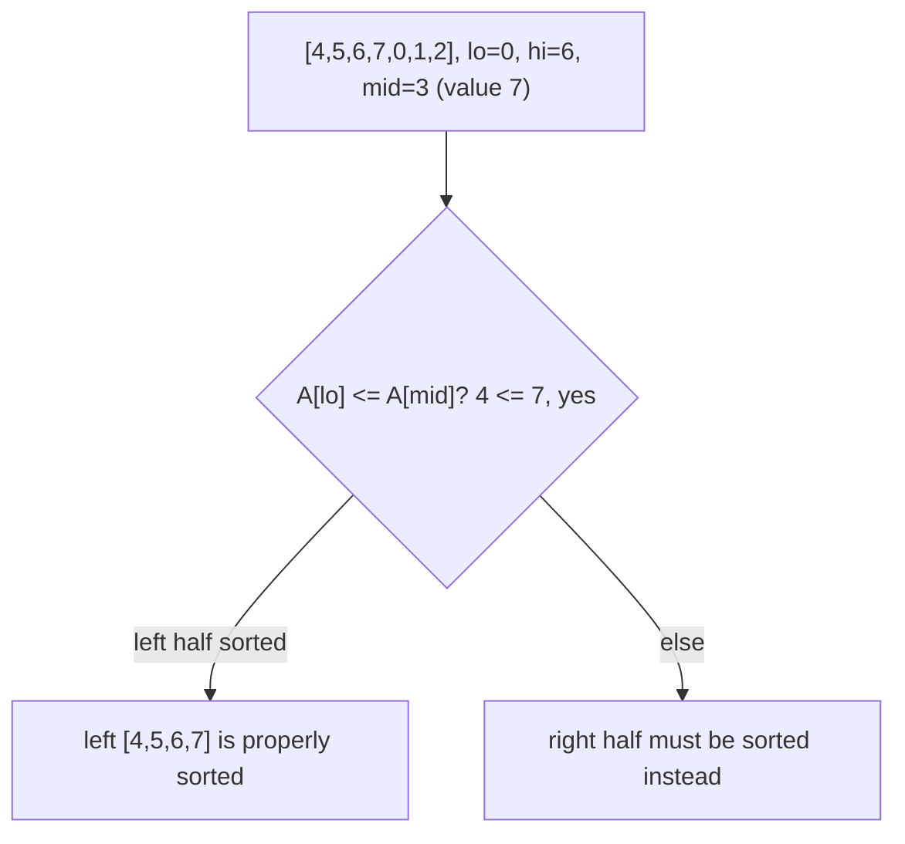

## Learning Objectives

- State the essential invariant that makes binary search work, independent of the specific "plain sorted array" setting it is usually first taught in.
- Recognize a rotated sorted array as a structure that still supports O(log n) search, despite not being fully sorted end to end.
- Implement search-in-rotated-sorted-array in Python, correctly identifying which half is "properly sorted" at each step.
- Trace the algorithm on a concrete rotated array and justify each decision to recurse left or right.

## Context & Motivation

Binary search is usually introduced as a technique for one very specific setting: an array that is fully sorted, end to end, where at each step a single comparison against the middle element tells you unambiguously which half the target could possibly be in. It's tempting to treat that setting as the *definition* of binary search — but the real underlying idea is more general than "the array is sorted." The real idea is this: at every step, you only need enough structural information to eliminate at least half of the remaining candidates with a single O(1) check, and the recursion on whichever half survives is exactly as good a place to keep searching as the recursion would have been on the original array. Binary search is really divide-and-conquer applied to searching, using the search structure — not literal, global sortedness — as the thing that lets you eliminate half the space each time.

This distinction is not just philosophical. A classic and genuinely useful application shows the idea surviving in a setting where the array is *not* globally sorted at all: a **rotated sorted array**, such as `[4, 5, 6, 7, 0, 1, 2]` — take a sorted array, `[0, 1, 2, 4, 5, 6, 7]`, and rotate it at some unknown pivot index, so that it wraps around partway through. Reading it left to right, it is not sorted (7 is immediately followed by 0) — and yet, remarkably, it still contains enough local structure to search it in O(log n), using the exact same "eliminate half the candidates every step" strategy that makes plain binary search work. This is exactly the kind of problem that shows up in real interview and systems settings — searching a circular buffer, a log file that wrapped around, a version-controlled dataset that was shifted — and it is the standard, well-known example curricula use to demonstrate that binary search's core idea generalizes past its textbook setting.

## Core Theory

### The real invariant behind binary search

Standard binary search maintains one invariant: at every step, the target — if present at all — is known to lie somewhere within the current `[lo, hi]` window. A single comparison against `A[mid]` tells you, in a plain sorted array, which of the two halves `[lo, mid-1]` or `[mid+1, hi]` could still contain the target, and the other half is safely discarded. The property doing all the work is not "the array is sorted" in the abstract — it is the narrower, reusable fact that **given the midpoint's value, you can always determine which half is consistent with the target possibly being there, and rule out the other half entirely, using O(1) work.** Whenever that property holds — even in a structure that is not fully sorted — the same divide-by-half logic applies.

### Rotated sorted arrays retain exactly this property

A rotated sorted array is formed by taking a sorted array and rotating it at an unknown pivot index `p`: everything from index `p` onward, followed by everything from index 0 up to `p - 1`, e.g. `[0,1,2,4,5,6,7]` rotated at `p = 4` gives `[4,5,6,7,0,1,2]`. The key structural fact: **at least one of the two halves split by any midpoint is always itself a plain, fully sorted run.** This is not a coincidence — a rotation introduces at most one "break point" (where a larger element is immediately followed by a smaller one) in the entire array, so splitting the array anywhere can place that single break point in at most one of the two halves; the other half, containing no break point, must be genuinely sorted.



### The decision rule at each step

Given `lo`, `hi`, and `mid = (lo + hi) // 2`, determine which half is properly sorted by comparing `A[lo]` and `A[mid]`:

- If `A[lo] <= A[mid]`, the left half `A[lo..mid]` is sorted (no rotation break within it).
- Otherwise, the break point must be within the left half, which means the right half `A[mid..hi]` is necessarily the sorted one instead.

Once the sorted half is identified, a single range check tells you whether the target could be in it: if the target falls within `[A[lo], A[mid]]` (inclusive) when the left half is sorted, search left; otherwise it must be in the right half (whether or not the right half is itself fully sorted — if the target isn't in the known-sorted half's range, it can only be on the other side). Symmetrically when the right half is the sorted one. Either way, exactly one half is discarded at each step, with O(1) work to decide which — identical in spirit to plain binary search's `A[mid]` comparison, just requiring one extra check to first identify which half is safe to reason about directly.

### Full implementation

```python
def search_rotated(A, target):
    lo, hi = 0, len(A) - 1
    while lo <= hi:
        mid = (lo + hi) // 2
        if A[mid] == target:
            return mid
        if A[lo] <= A[mid]:               # left half is properly sorted
            if A[lo] <= target < A[mid]:
                hi = mid - 1              # target in sorted left half
            else:
                lo = mid + 1              # target must be in the right half
        else:                              # right half is properly sorted
            if A[mid] < target <= A[hi]:
                lo = mid + 1              # target in sorted right half
            else:
                hi = mid - 1              # target must be in the left half
    return -1
```

Each iteration does O(1) work and discards at least half of `[lo, hi]`, so the loop runs O(log n) times — the same complexity as plain binary search, achieved by a genuinely different (but structurally analogous) case analysis at each step.

## Worked Examples

### Example 1 — full trace on the canonical example

**Problem:** Search for `0` in `A = [4, 5, 6, 7, 0, 1, 2]`.

**Step 1.** `lo=0, hi=6, mid=3`, `A[mid]=7`. Not equal to target. Check `A[lo]=4 <= A[mid]=7`: true, left half `[4,5,6,7]` is sorted. Is target `0` within `[A[lo], A[mid]) = [4, 7)`? No (`0 < 4`). So the target must be in the right half: `lo = mid + 1 = 4`.

**Step 2.** `lo=4, hi=6, mid=5`, `A[mid]=1`. Not equal to target. Check `A[lo]=0 <= A[mid]=1`: true, left half (of this sub-window) `[0,1]` is sorted. Is target `0` within `[A[lo], A[mid]) = [0, 1)`? Yes (`0 <= 0 < 1`). So search left: `hi = mid - 1 = 4`.

**Step 3.** `lo=4, hi=4, mid=4`, `A[mid]=0`. Equal to target — return index `4`. ✓ (Indeed `A[4] = 0`.)

Three iterations for n = 7 elements — consistent with O(log n) (`log₂ 7 ≈ 2.8`, rounding up to 3 comparisons).

### Example 2 — target not present, and the other rotation branch

**Problem:** Search for `3` in `A = [4, 5, 6, 7, 0, 1, 2]` (same array; `3` does not appear).

**Step 1.** `lo=0, hi=6, mid=3`, `A[mid]=7`. Left half `[4,5,6,7]` sorted (`A[lo]=4 <= 7`). Is `3` in `[4, 7)`? No. So `lo = 4`.

**Step 2.** `lo=4, hi=6, mid=5`, `A[mid]=1`. Left half of this window `[0,1]` sorted (`A[lo]=0 <= 1`). Is `3` in `[0, 1)`? No. So `lo = mid+1 = 6`.

**Step 3.** `lo=6, hi=6, mid=6`, `A[mid]=2`. Not equal to `3`. `A[lo]=2 <= A[mid]=2`: true, "left half" (a single element) trivially sorted. Is `3` in `[2, 2)`? No (empty range — `2 <= 3 < 2` is false). So `lo = mid + 1 = 7`.

Now `lo=7 > hi=6`, loop ends, return `-1`. Correct — `3` is genuinely absent from the array, and the algorithm terminates in O(log n) steps rather than needing a linear scan to confirm absence.

### Example 3 — exercising the other branch of the outer decision

**Problem:** Search for `5` in `A = [6, 7, 0, 1, 2, 4, 5]` (a different rotation of the same underlying sorted array, rotated so the break point falls earlier).

**Step 1.** `lo=0, hi=6, mid=3`, `A[mid]=1`. Not equal to target. Check `A[lo]=6 <= A[mid]=1`: false — so this time the **right** half `[1,2,4,5]` (indices 3–6) is the properly sorted one instead. Is target `5` within `(A[mid], A[hi]] = (1, 5]`? Yes (`1 < 5 <= 5`). So search right: `lo = mid + 1 = 4`.

**Step 2.** `lo=4, hi=6, mid=5`, `A[mid]=4`. Not equal to target. `A[lo]=2 <= A[mid]=4`: true, left half `[2,4]` sorted. Is `5` within `[2, 4)`? No. So `lo = mid + 1 = 6`.

**Step 3.** `lo=6, hi=6, mid=6`, `A[mid]=5`. Match — return index `6`.

This trace deliberately exercises the `else` branch of the outer `if A[lo] <= A[mid]` check (the right half being the sorted one), the branch that Example 1 and 2 never needed, confirming both halves of the case analysis in Core Theory are actually necessary and correctly handled.

## Common Misconceptions & Pitfalls

- **"A rotated sorted array can't be searched in O(log n) because it isn't sorted."** As shown throughout Core Theory and all three examples, the array being non-globally-sorted does not remove the property binary search actually depends on — at every split point, one of the two halves is guaranteed to be a genuinely sorted run, and that is sufficient to eliminate half the search space per step.
- **"You need to first find the rotation pivot, then binary-search normally within the correct segment."** This works but is unnecessary overhead — finding the pivot first would itself take a separate O(log n) search, and then a second O(log n) search within the identified segment, for no benefit over the single-pass algorithm above, which determines "which half is sorted" fresh at every step without ever needing to locate the pivot explicitly.
- **"Comparing `A[mid]` to `A[hi]` instead of `A[lo]` doesn't matter — either works the same way."** It is possible to write a correct version using `A[mid]` vs. `A[hi]`, but the case analysis (which range check applies, which half to recurse into) changes accordingly — mixing conventions from two different correct implementations (e.g., using an `A[lo]`-based branch condition together with an `A[hi]`-based range check) produces a version that is subtly wrong on some rotations, typically ones where the target equals a boundary element.
- **"Duplicates don't change anything about this algorithm."** They do — if duplicate values are allowed (e.g., `A[lo] == A[mid]` without the two halves being provably distinguishable, such as `[1,1,1,0,1]`), it becomes impossible in the worst case to tell which half is properly sorted using only value comparisons, and no algorithm can guarantee O(log n) in general on such inputs — this concept, matching the "distinct values" assumption used in most treatments (Sedgewick, MIT 6.006), assumes no duplicate keys.

## Summary

Binary search's real engine is not "the array is globally sorted" but the narrower, reusable property that at each step, one comparison suffices to identify and discard at least half of the remaining candidates. A rotated sorted array — sorted, then wrapped around at an unknown pivot — is not globally sorted, yet at every possible split point, one of the two halves is guaranteed to be a genuinely sorted run (since a rotation introduces at most one break point, which can fall in at most one half). Determining which half is sorted with one extra comparison, then checking whether the target's value falls within that half's known range, reproduces the same "eliminate half, recurse" structure as plain binary search, achieving O(log n) time. This is the standard, well-known demonstration that binary search generalizes to any structure retaining this eliminate-half property, not just to flat sorted arrays.

## Documentation Links

- [ACM/IEEE CS2013 — Algorithms and Complexity Knowledge Area](https://csed.acm.org/cs2013-version/) — doc
- [MIT 6.006 — Lecture Notes (OCW)](https://ocw.mit.edu/courses/6-006-introduction-to-algorithms-spring-2020/pages/lecture-notes/) — doc
