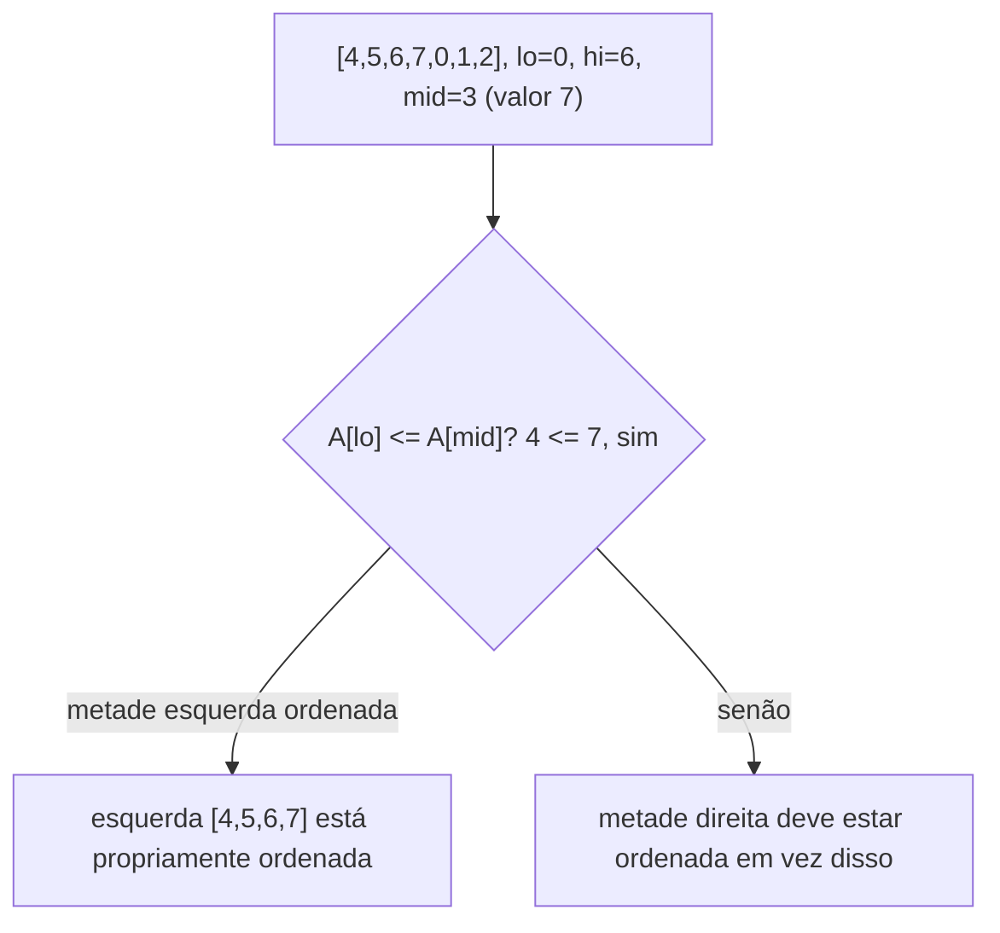

## Objetivos de Aprendizagem

- Enunciar o invariante essencial que faz busca binária funcionar, independente do cenário específico de "array simples ordenado" no qual ela é normalmente ensinada primeiro.
- Reconhecer um array ordenado rotacionado como uma estrutura que ainda suporta busca O(log n), apesar de não estar completamente ordenado de ponta a ponta.
- Implementar busca-em-array-ordenado-rotacionado em Python, identificando corretamente qual metade está "propriamente ordenada" em cada passo.
- Rastrear o algoritmo em um array rotacionado concreto e justificar cada decisão de recursar à esquerda ou à direita.

## Contexto e Motivação

Busca binária é geralmente introduzida como uma técnica para um cenário muito específico: um array que está completamente ordenado, de ponta a ponta, onde a cada passo uma única comparação contra o elemento do meio diz inequivocamente em qual metade o alvo poderia possivelmente estar. É tentador tratar esse cenário como a *definição* de busca binária, mas a ideia real subjacente é mais geral que "o array está ordenado". A ideia real é essa: em todo passo, você só precisa de informação estrutural suficiente para eliminar pelo menos metade dos candidatos restantes com uma única verificação O(1), e a recursão em qualquer metade que sobreviva é exatamente tão bom lugar para continuar buscando quanto a recursão teria sido no array original. Busca binária é realmente dividir para conquistar aplicado à busca, usando a estrutura de busca, não ordenação global literal, como a coisa que permite eliminar metade do espaço a cada vez.

Essa distinção não é apenas filosófica. Uma aplicação clássica e genuinamente útil mostra a ideia sobrevivendo em um cenário onde o array *não* está globalmente ordenado de forma alguma: um **array ordenado rotacionado**, como `[4, 5, 6, 7, 0, 1, 2]`, pegue um array ordenado, `[0, 1, 2, 4, 5, 6, 7]`, e rotacione-o em algum índice pivô desconhecido, de forma que ele dê a volta no meio do caminho. Lendo da esquerda para a direita, não está ordenado (7 é imediatamente seguido por 0), e ainda assim, notavelmente, ainda contém estrutura local suficiente para buscá-lo em O(log n), usando exatamente a mesma estratégia "elimine metade dos candidatos a cada passo" que faz busca binária simples funcionar. Este é exatamente o tipo de problema que aparece em entrevistas reais e cenários de sistemas, buscar em um buffer circular, um arquivo de log que deu a volta, um conjunto de dados versionado que foi deslocado, e é o exemplo padrão e bem conhecido que currículos usam para demonstrar que a ideia central de busca binária generaliza além de seu cenário de livro-texto.

## Teoria Central

### O invariante real por trás de busca binária

Busca binária padrão mantém um invariante: em todo passo, o alvo, se estiver presente, é conhecido por estar em algum lugar dentro da janela atual `[lo, hi]`. Uma única comparação contra `A[mid]` diz, em um array simples ordenado, qual das duas metades `[lo, mid-1]` ou `[mid+1, hi]` ainda poderia conter o alvo, e a outra metade é descartada com segurança. A propriedade que faz todo o trabalho não é "o array está ordenado" no abstrato, é o fato mais estreito e reutilizável de que **dado o valor do ponto médio, você sempre pode determinar qual metade é consistente com o alvo possivelmente estar ali, e descartar a outra metade inteiramente, usando trabalho O(1).** Sempre que essa propriedade vale, mesmo em uma estrutura que não está completamente ordenada, a mesma lógica de dividir pela metade se aplica.

### Arrays ordenados rotacionados retêm exatamente essa propriedade

Um array ordenado rotacionado é formado tomando um array ordenado e rotacionando-o em algum índice pivô desconhecido `p`: tudo do índice `p` em diante, seguido por tudo do índice 0 até `p - 1`, por exemplo `[0,1,2,4,5,6,7]` rotacionado em `p = 4` dá `[4,5,6,7,0,1,2]`. O fato estrutural chave: **pelo menos uma das duas metades divididas por qualquer ponto médio é sempre ela própria uma sequência simples, completamente ordenada.** Isso não é coincidência, uma rotação introduz no máximo um "ponto de quebra" (onde um elemento maior é imediatamente seguido por um menor) no array inteiro, então dividir o array em qualquer lugar pode colocar esse único ponto de quebra em no máximo uma das duas metades; a outra metade, não contendo nenhum ponto de quebra, deve ser genuinamente ordenada.



### A regra de decisão em cada passo

Dado `lo`, `hi`, e `mid = (lo + hi) // 2`, determine qual metade está propriamente ordenada comparando `A[lo]` e `A[mid]`:

- Se `A[lo] <= A[mid]`, a metade esquerda `A[lo..mid]` está ordenada (sem quebra de rotação dentro dela).
- Caso contrário, o ponto de quebra deve estar dentro da metade esquerda, o que significa que a metade direita `A[mid..hi]` é necessariamente a ordenada em vez disso.

Uma vez que a metade ordenada é identificada, uma única verificação de intervalo diz se o alvo poderia estar nela: se o alvo cai dentro de `[A[lo], A[mid]]` (inclusive) quando a metade esquerda está ordenada, busque à esquerda; caso contrário deve estar na metade direita (esteja ou não a metade direita ela própria completamente ordenada, se o alvo não está no intervalo da metade conhecidamente ordenada, só pode estar do outro lado). Simetricamente quando a metade direita é a ordenada. De qualquer forma, exatamente uma metade é descartada a cada passo, com trabalho O(1) para decidir qual, idêntico em espírito à comparação `A[mid]` da busca binária simples, só exigindo uma verificação extra para primeiro identificar qual metade é segura para raciocinar diretamente.

### Implementação completa

```python
def search_rotated(A, target):
    lo, hi = 0, len(A) - 1
    while lo <= hi:
        mid = (lo + hi) // 2
        if A[mid] == target:
            return mid
        if A[lo] <= A[mid]:               # metade esquerda está propriamente ordenada
            if A[lo] <= target < A[mid]:
                hi = mid - 1              # alvo na metade esquerda ordenada
            else:
                lo = mid + 1              # alvo deve estar na metade direita
        else:                              # metade direita está propriamente ordenada
            if A[mid] < target <= A[hi]:
                lo = mid + 1              # alvo na metade direita ordenada
            else:
                hi = mid - 1              # alvo deve estar na metade esquerda
    return -1
```

Cada iteração faz trabalho O(1) e descarta pelo menos metade de `[lo, hi]`, então o laço roda O(log n) vezes, a mesma complexidade da busca binária simples, alcançada por uma análise de caso genuinamente diferente (mas estruturalmente análoga) a cada passo.

## Exemplos Resolvidos

### Exemplo 1 — rastreamento completo no exemplo canônico

**Problema:** Busque `0` em `A = [4, 5, 6, 7, 0, 1, 2]`.

**Passo 1.** `lo=0, hi=6, mid=3`, `A[mid]=7`. Não igual ao alvo. Verifique `A[lo]=4 <= A[mid]=7`: verdadeiro, metade esquerda `[4,5,6,7]` está ordenada. O alvo `0` está dentro de `[A[lo], A[mid]) = [4, 7)`? Não (`0 < 4`). Então o alvo deve estar na metade direita: `lo = mid + 1 = 4`.

**Passo 2.** `lo=4, hi=6, mid=5`, `A[mid]=1`. Não igual ao alvo. Verifique `A[lo]=0 <= A[mid]=1`: verdadeiro, metade esquerda (desta subjanela) `[0,1]` está ordenada. O alvo `0` está dentro de `[A[lo], A[mid]) = [0, 1)`? Sim (`0 <= 0 < 1`). Então busque à esquerda: `hi = mid - 1 = 4`.

**Passo 3.** `lo=4, hi=4, mid=4`, `A[mid]=0`. Igual ao alvo, retorna o índice `4`. ✓ (De fato `A[4] = 0`.)

Três iterações para n = 7 elementos, consistente com O(log n) (`log₂ 7 ≈ 2.8`, arredondando para cima para 3 comparações).

### Exemplo 2 — alvo não presente, e o outro ramo da rotação

**Problema:** Busque `3` em `A = [4, 5, 6, 7, 0, 1, 2]` (mesmo array; `3` não aparece).

**Passo 1.** `lo=0, hi=6, mid=3`, `A[mid]=7`. Metade esquerda `[4,5,6,7]` ordenada (`A[lo]=4 <= 7`). `3` está em `[4, 7)`? Não. Então `lo = 4`.

**Passo 2.** `lo=4, hi=6, mid=5`, `A[mid]=1`. Metade esquerda desta janela `[0,1]` ordenada (`A[lo]=0 <= 1`). `3` está em `[0, 1)`? Não. Então `lo = mid+1 = 6`.

**Passo 3.** `lo=6, hi=6, mid=6`, `A[mid]=2`. Não igual a `3`. `A[lo]=2 <= A[mid]=2`: verdadeiro, "metade esquerda" (um único elemento) trivialmente ordenada. `3` está em `[2, 2)`? Não (intervalo vazio, `2 <= 3 < 2` é falso). Então `lo = mid + 1 = 7`.

Agora `lo=7 > hi=6`, o laço termina, retorna `-1`. Correto, `3` está genuinamente ausente do array, e o algoritmo termina em O(log n) passos em vez de precisar de uma varredura linear para confirmar ausência.

### Exemplo 3 — exercitando o outro ramo da decisão externa

**Problema:** Busque `5` em `A = [6, 7, 0, 1, 2, 4, 5]` (uma rotação diferente do mesmo array ordenado subjacente, rotacionado de forma que o ponto de quebra caia mais cedo).

**Passo 1.** `lo=0, hi=6, mid=3`, `A[mid]=1`. Não igual ao alvo. Verifique `A[lo]=6 <= A[mid]=1`: falso, então desta vez a metade **direita** `[1,2,4,5]` (índices 3–6) é a propriamente ordenada em vez disso. O alvo `5` está dentro de `(A[mid], A[hi]] = (1, 5]`? Sim (`1 < 5 <= 5`). Então busque à direita: `lo = mid + 1 = 4`.

**Passo 2.** `lo=4, hi=6, mid=5`, `A[mid]=4`. Não igual ao alvo. `A[lo]=2 <= A[mid]=4`: verdadeiro, metade esquerda `[2,4]` ordenada. `5` está dentro de `[2, 4)`? Não. Então `lo = mid + 1 = 6`.

**Passo 3.** `lo=6, hi=6, mid=6`, `A[mid]=5`. Combina, retorna o índice `6`.

Este rastreamento deliberadamente exercita o ramo `else` da verificação externa `if A[lo] <= A[mid]` (a metade direita sendo a ordenada), o ramo que os Exemplos 1 e 2 nunca precisaram, confirmando que ambas as metades da análise de caso na Teoria Central são de fato necessárias e tratadas corretamente.

## Equívocos Comuns e Armadilhas

- **"Um array ordenado rotacionado não pode ser buscado em O(log n) porque não está ordenado."** Como mostrado através da Teoria Central e todos os três exemplos, o array não estar globalmente ordenado não remove a propriedade da qual busca binária de fato depende, em todo ponto de divisão, uma das duas metades é garantida como uma sequência genuinamente ordenada, e isso é suficiente para eliminar metade do espaço de busca por passo.
- **"Você precisa primeiro encontrar o pivô da rotação, depois fazer busca binária normalmente dentro do segmento correto."** Isso funciona mas é sobrecarga desnecessária, encontrar o pivô primeiro exigiria ele mesmo uma busca O(log n) separada, e depois uma segunda busca O(log n) dentro do segmento identificado, sem nenhum benefício sobre o algoritmo de passagem única acima, que determina "qual metade está ordenada" do zero em todo passo sem jamais precisar localizar o pivô explicitamente.
- **"Comparar `A[mid]` com `A[hi]` em vez de `A[lo]` não importa, ambos funcionam da mesma forma."** É possível escrever uma versão correta usando `A[mid]` vs. `A[hi]`, mas a análise de caso (qual verificação de intervalo se aplica, em qual metade recursar) muda de acordo, misturar convenções de duas implementações corretas diferentes (por exemplo, usar uma condição de ramo baseada em `A[lo]` junto com uma verificação de intervalo baseada em `A[hi]`) produz uma versão que é sutilmente errada em algumas rotações, tipicamente aquelas onde o alvo é igual a um elemento de fronteira.
- **"Duplicatas não mudam nada sobre este algoritmo."** Mudam, se valores duplicados são permitidos (por exemplo, `A[lo] == A[mid]` sem que as duas metades sejam comprovadamente distinguíveis, como `[1,1,1,0,1]`), se torna impossível no pior caso dizer qual metade está propriamente ordenada usando apenas comparações de valor, e nenhum algoritmo pode garantir O(log n) em geral em tais entradas, este conceito, combinando com a suposição de "valores distintos" usada na maioria dos tratamentos (Sedgewick, MIT 6.006), assume nenhuma chave duplicada.

## Resumo

O motor real da busca binária não é "o array está globalmente ordenado" mas a propriedade mais estreita e reutilizável de que, em cada passo, uma comparação basta para identificar e descartar pelo menos metade dos candidatos restantes. Um array ordenado rotacionado, ordenado, depois envolto em algum pivô desconhecido, não está globalmente ordenado, mas em todo ponto de divisão possível, uma das duas metades é garantida como uma sequência genuinamente ordenada (já que uma rotação introduz no máximo um ponto de quebra, que pode cair em no máximo uma metade). Determinar qual metade está ordenada com uma comparação extra, depois verificar se o valor do alvo cai dentro do intervalo conhecido daquela metade, reproduz a mesma estrutura "elimine metade, recurse" da busca binária simples, alcançando tempo O(log n). Esta é a demonstração padrão e bem conhecida de que busca binária generaliza para qualquer estrutura que retenha essa propriedade de eliminar-metade, não só para arrays simples ordenados.

## Documentation Links

- [ACM/IEEE CS2013 — Algorithms and Complexity Knowledge Area](https://csed.acm.org/cs2013-version/) — doc
- [MIT 6.006 — Lecture Notes (OCW)](https://ocw.mit.edu/courses/6-006-introduction-to-algorithms-spring-2020/pages/lecture-notes/) — doc
