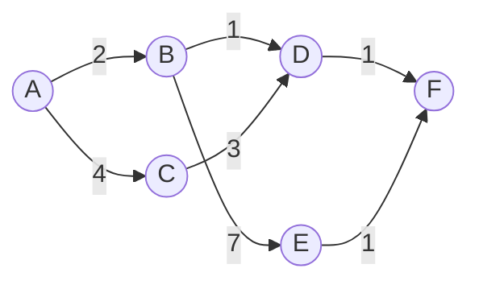

## Learning Objectives

- Explain why knowing a graph is a DAG in advance lets shortest paths be computed without a priority queue or repeated relaxation rounds.
- Implement the DAG shortest-path algorithm: process vertices in topological order, relaxing each vertex's outgoing edges exactly once.
- Prove that this single linear pass produces correct shortest distances, using the topological-order guarantee from cycle detection and topological sort.
- Trace the algorithm by hand on a small weighted DAG, including a variant with a negative edge, and confirm correctness in both cases.
- Compare the running time, O(V + E), against Dijkstra's O((V + E) log V) and Bellman-Ford's O(VE), and explain exactly which structural fact buys the speedup.

## Context & Motivation

Both shortest-path algorithms covered so far paid a real cost to handle graphs about which nothing extra was assumed. Dijkstra's algorithm needed a heap-backed priority queue to efficiently find "the closest not-yet-finalized vertex," because in general there is no way to know in advance which vertex that will be. Bellman-Ford needed to relax every edge repeatedly, V−1 times, because in general there is no way to know in advance an order in which relaxing each edge exactly once would already produce correct distances. Both of these costs exist specifically to compensate for not knowing anything about the graph's structure ahead of time.

But sometimes a great deal *is* known ahead of time: if the graph is guaranteed to be a DAG — no cycles at all, a fact the cycle-detection topic already showed how to check directly — then the topological-sort topic already produced exactly the missing piece of information both other algorithms had to work around: a linear order of vertices in which every edge points strictly forward. Once that order is in hand, shortest paths on a DAG become almost anticlimactically simple: walk the vertices in topological order, relax each vertex's outgoing edges exactly once, and every distance is guaranteed correct by the time the pass finishes — no priority queue, no repeated rounds, one single O(V + E) sweep. This is the payoff the entire cluster of topics — cycle detection, topological sort, and the general relaxation setup — was building toward: two ideas that seemed unrelated (a specific DFS-derived vertex ordering, and the specific "update a tentative distance" primitive) combine into an algorithm faster than either general-purpose shortest-path method, precisely because a DAG's acyclic structure removes the very source of difficulty both of those methods had to pay to work around.

## Core Theory

### The algorithm: relax in topological order, exactly once per vertex

Given a DAG, first compute a topological order of its vertices (via the DFS finish-time method from the earlier topic, or any other valid method). Initialize `dist[source] = 0`, `dist[v] = ∞` for every other vertex. Then process vertices strictly in topological order: for each vertex u, in turn, relax every outgoing edge (u, v). No vertex's outgoing edges are ever relaxed more than once, and no vertex is processed until every vertex that could possibly contribute to its distance has already been fully processed.

```python
def dag_shortest_paths(adj, topo_order, source):
    dist = {v: float('inf') for v in topo_order}
    parent = {v: None for v in topo_order}
    dist[source] = 0

    for u in topo_order:
        if dist[u] == float('inf'):
            continue   # unreachable from source; nothing to propagate
        for v, weight in adj[u]:
            candidate = dist[u] + weight
            if candidate < dist[v]:
                dist[v] = candidate
                parent[v] = u

    return dist, parent
```

### Theorem: one pass in topological order suffices

**Claim.** After processing every vertex exactly once, in topological order, relaxing its outgoing edges, `dist[v]` equals the true shortest-path distance from the source to v, for every vertex v.

**Proof.** By the defining property of a topological order, every edge (u, v) has u appearing before v in the order. Take any vertex v reachable from the source, and consider a shortest path to it, s = v₀, v₁, …, v_k = v. Since every edge on this path points forward in the topological order, v₀, v₁, …, v_k appear in that same relative order during the algorithm's single pass. **Claim, by induction on i:** by the time the algorithm finishes processing v_i, `dist[v_i]` already equals the true shortest distance to v_i along this path. Base case: `dist[v₀] = dist[source] = 0`, correct from initialization, before the pass even starts. Inductive step: assume `dist[v_i]` is already correct by the time v_i is processed. Since v_i appears before v_{i+1} in the topological order (as v_i → v_{i+1} is an edge of the path), v_i is processed, and its outgoing edges — including specifically (v_i, v_{i+1}) — are relaxed, *before* v_{i+1} is ever processed itself. This relaxation sets `dist[v_{i+1}] ≤ dist[v_i] + weight(v_i, v_{i+1})`, which by the inductive hypothesis is exactly the true shortest distance to v_{i+1} along this path. So by the time the pass reaches v_k = v, `dist[v]` has been correctly set. Since this holds for the shortest path to every reachable vertex, every `dist[v]` is correct after the single pass. ∎

Crucially, this proof never once needed edge weights to be non-negative — nothing in the argument depended on sign at all, only on the topological ordering guaranteeing every relevant predecessor is processed, and hence has its final distance already relaxed forward, before its successor is ever examined. A DAG has no cycles to worry about looping through indefinitely, so there is no analogue of a "negative-weight cycle" to break anything.



### Why this beats both general-purpose algorithms

Dijkstra's algorithm needs a heap specifically because, without more information, it cannot know in advance which vertex to finalize next — it has to ask the heap, at O(log V) cost, every single time. Here, the topological order *is* that answer, computed once, up front, in O(V + E) via the DFS-based method already covered — no repeated querying needed at all during the relaxation pass itself. Bellman-Ford needs V−1 rounds because, without more information, it cannot know an order in which every edge relaxes correctly in a single pass — here, the topological order *is* exactly such an order, by construction (every edge points forward through it), so a single pass suffices instead of V−1. The entire speedup, from O((V+E) log V) or O(VE) down to O(V + E), comes from spending O(V + E) once, up front, to discover the topological order — a cost that would otherwise have been paid over and over, implicitly, by either general-purpose algorithm's need to repeatedly ask "what's safe to process next?"

## Worked Examples

### Example 1 — shortest paths on a DAG, non-negative weights

**Problem:** Using the graph above (edges A→B(2), A→C(4), B→D(1), B→E(7), C→D(3), D→F(1), E→F(1)), with topological order A, C, B, E, D, F (the same order derived by DFS finish times in the earlier topic on this graph's edge structure), compute shortest distances from A.

**Trace.** `dist = {A:0, B:∞, C:∞, D:∞, E:∞, F:∞}`.

Process A (`dist[A]=0`): relax A→B(2): `dist[B] = 0+2=2`. Relax A→C(4): `dist[C] = 0+4=4`.

Process C (`dist[C]=4`): relax C→D(3): `dist[D] = 4+3=7`.

Process B (`dist[B]=2`): relax B→D(1): candidate `2+1=3 < 7` — update `dist[D] = 3`. Relax B→E(7): `dist[E] = 2+7=9`.

Process E (`dist[E]=9`): relax E→F(1): `dist[F] = 9+1=10`.

Process D (`dist[D]=3`): relax D→F(1): candidate `3+1=4 < 10` — update `dist[F] = 4`.

Process F (`dist[F]=4`): no outgoing edges.

**Result:** `dist = {A:0, B:2, C:4, D:3, E:9, F:4}`. Verify F: candidate paths are A→B→D→F (2+1+1=4), A→B→E→F (2+7+1=10), A→C→D→F (4+3+1=8) — the minimum is 4, matching `dist[F]` exactly, found in a single forward pass with no vertex's outgoing edges ever revisited.

### Example 2 — the same DAG, with a negative edge, still handled correctly

**Problem:** Change B→E's weight from 7 to −7, and recompute.

**Trace.** Process A: `dist[B] = 2`, `dist[C] = 4`. Process C: relax C→D(3): `dist[D] = 4+3=7`. Process B: relax B→D(1): `2+1=3 < 7` — update `dist[D] = 3`. Relax B→E(−7): `dist[E] = 2+(−7) = −5`. Process E: relax E→F(1): `dist[F] = −5+1 = −4`. Process D: relax D→F(1): candidate `3+1=4`, not `< −4` — no update. Process F: no outgoing edges.

**Result:** `dist[F] = −4`, achieved via A→B→E→F (2 − 7 + 1 = −4) — correctly identified as cheaper than any route through D, despite the negative edge. Dijkstra's algorithm would mishandle this graph (a negative edge can finalize a vertex too early, exactly as the earlier counterexample showed); Bellman-Ford would handle it correctly but at the cost of multiple rounds over every edge. The DAG algorithm handles it in one pass, at no extra cost, because — as the correctness proof noted — its argument never relied on non-negative weights in the first place; a DAG's lack of cycles removes the only structural danger negative weights posed (a negative cycle to loop through indefinitely), so ordinary negative edges are simply not a problem.

## Common Misconceptions & Pitfalls

- **"The DAG shortest-path algorithm is just Bellman-Ford with fewer rounds."** It is a genuinely different algorithm, not a truncated version of the same one — Bellman-Ford relaxes every edge, in arbitrary order, however many times it takes for information to propagate along the longest possible simple path (up to V−1 rounds); the DAG algorithm relaxes every edge exactly once, in an order *specifically chosen* (topological order) so that a single pass already suffices, by construction. The speedup comes from choosing the order deliberately, not from the graph happening to need fewer rounds of an otherwise-identical brute-force method.
- **"Since the DAG algorithm tolerates negative weights, it must also tolerate negative cycles, like Bellman-Ford's detection mode."** A DAG cannot contain a cycle at all, negative or otherwise — cycle detection would already have rejected the graph in the earlier topic if one existed, before this algorithm is even applicable. The tolerance for negative *edges* (not cycles) here is a genuine feature, but it presupposes acyclicity has already been established; nothing about this algorithm detects or handles a cycle, because on a true DAG, no such case can arise.
- **"Any linear order of the vertices works, not just a topological one."** The correctness proof depends entirely on every edge pointing forward through the chosen order — processing vertices in a non-topological order (e.g., alphabetical, if it doesn't happen to coincide with a valid topological order) could easily relax an edge (u, v) before u's own distance has been finalized, producing understated or simply wrong distances for v, since v would be processed and finalized based on an as-yet-incomplete `dist[u]`.
- **"This algorithm still needs to check for negative-weight cycles."** No such check is needed or meaningful: a DAG has no cycles of any kind by definition, so there is nothing analogous to Bellman-Ford's Vth-round check to run — the absence of cycles is precisely the assumption that lets the single-pass algorithm skip both the heap Dijkstra needs and the repeated-rounds-plus-detection Bellman-Ford needs.

## Summary

Knowing in advance that a graph is a DAG turns the general weighted shortest-path problem into something solvable in a single O(V + E) pass: process vertices in topological order (computed once via DFS, from the earlier topic), and relax each vertex's outgoing edges exactly once. Correctness follows directly from the topological order's defining guarantee — every edge points forward through it — which means every vertex's predecessors on any path are fully processed, with correct final distances, before that vertex is ever examined itself; no repeated relaxation rounds and no priority queue are needed. This is faster than both general-purpose methods: O(V + E) beats Dijkstra's O((V+E) log V) by avoiding the heap entirely, and beats Bellman-Ford's O(VE) by replacing V−1 rounds with exactly one, in both cases because the topological order supplies, up front, the exact information both general algorithms otherwise had to pay to discover implicitly, round by round or query by query. As a genuine bonus, this algorithm handles negative edge weights correctly at no extra cost, since a DAG's acyclic structure removes the only way negative weights cause trouble — a negative-weight cycle — leaving the relaxation argument sound regardless of individual edge signs.

## Documentation Links

- [MIT 6.006 — Lecture Notes (OCW)](https://ocw.mit.edu/courses/6-006-introduction-to-algorithms-spring-2020/pages/lecture-notes/) — doc
- [Sedgewick & Wayne — Algorithms Lectures (Princeton)](https://algs4.cs.princeton.edu/lectures/) — doc
