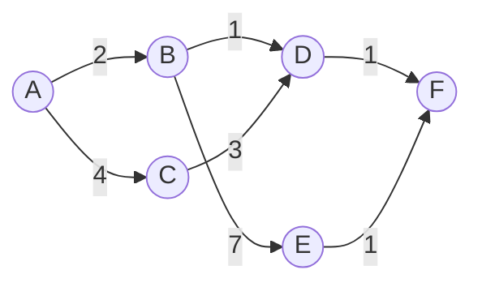

## Objetivos de Aprendizagem

- Explicar por que saber que um grafo é um DAG de antemão permite calcular caminhos mais curtos sem uma fila de prioridade ou rodadas repetidas de relaxamento.
- Implementar o algoritmo de caminho mais curto em DAG: processe vértices em ordem topológica, relaxando as arestas de saída de cada vértice exatamente uma vez.
- Provar que essa única passagem linear produz distâncias mais curtas corretas, usando a garantia de ordem topológica de detecção de ciclo e ordenação topológica.
- Rastrear o algoritmo manualmente em um pequeno DAG ponderado, incluindo uma variante com uma aresta negativa, e confirmar correção em ambos os casos.
- Comparar o tempo de execução, O(V + E), contra o O((V + E) log V) de Dijkstra e o O(VE) de Bellman-Ford, e explicar exatamente qual fato estrutural compra a aceleração.

## Contexto e Motivação

Ambos os algoritmos de caminho mais curto cobertos até agora pagaram um custo real para lidar com grafos sobre os quais nada extra era assumido. O algoritmo de Dijkstra precisou de uma fila de prioridade apoiada em heap para encontrar eficientemente "o vértice não finalizado mais próximo," porque em geral não há como saber antecipadamente qual vértice será esse. Bellman-Ford precisou relaxar toda aresta repetidamente, V−1 vezes, porque em geral não há como saber antecipadamente uma ordem na qual relaxar cada aresta exatamente uma vez já produziria distâncias corretas. Ambos esses custos existem especificamente para compensar não saber nada sobre a estrutura do grafo antecipadamente.

Mas às vezes muito *é* conhecido antecipadamente: se o grafo é garantido ser um DAG, sem nenhum ciclo de forma alguma, um fato que o tópico de detecção de ciclo já mostrou como verificar diretamente, então o tópico de ordenação topológica já produziu exatamente a peça de informação que faltava com a qual ambos os outros algoritmos tiveram que trabalhar em torno: uma ordem linear de vértices na qual toda aresta aponta estritamente para frente. Uma vez que essa ordem está à mão, caminhos mais curtos em um DAG se tornam quase anticlimaticamente simples: caminhe pelos vértices em ordem topológica, relaxe as arestas de saída de cada vértice exatamente uma vez, e toda distância é garantida correta no momento em que a passagem termina, nenhuma fila de prioridade, nenhuma rodada repetida, uma única varredura O(V + E). Esse é o ganho para o qual o grupo de tópicos inteiro, detecção de ciclo, ordenação topológica, e o modelo geral de relaxamento, estava construindo: duas ideias que pareciam não relacionadas (uma ordenação de vértice específica derivada de DFS, e a primitiva específica de "atualizar uma distância tentativa") se combinam em um algoritmo mais rápido que qualquer um dos métodos gerais de caminho mais curto, precisamente porque a estrutura acíclica de um DAG remove a própria fonte de dificuldade com a qual ambos esses métodos tiveram que pagar para trabalhar em torno.

## Teoria Central

### O algoritmo: relaxe em ordem topológica, exatamente uma vez por vértice

Dado um DAG, primeiro calcule uma ordem topológica de seus vértices (via o método de tempo de término de DFS do tópico anterior, ou qualquer outro método válido). Inicialize `dist[fonte] = 0`, `dist[v] = ∞` para todo outro vértice. Depois processe vértices estritamente em ordem topológica: para cada vértice u, por sua vez, relaxe toda aresta de saída (u, v). As arestas de saída de nenhum vértice são jamais relaxadas mais de uma vez, e nenhum vértice é processado até que todo vértice que poderia possivelmente contribuir para sua distância já tenha sido completamente processado.

```python
def dag_shortest_paths(adj, topo_order, source):
    dist = {v: float('inf') for v in topo_order}
    parent = {v: None for v in topo_order}
    dist[source] = 0

    for u in topo_order:
        if dist[u] == float('inf'):
            continue   # inalcançável a partir da fonte; nada a propagar
        for v, weight in adj[u]:
            candidate = dist[u] + weight
            if candidate < dist[v]:
                dist[v] = candidate
                parent[v] = u

    return dist, parent
```

### Teorema: uma passagem em ordem topológica basta

**Afirmação.** Depois de processar todo vértice exatamente uma vez, em ordem topológica, relaxando suas arestas de saída, `dist[v]` é igual à distância verdadeira de caminho mais curto da fonte até v, para todo vértice v.

**Prova.** Pela propriedade definidora de uma ordem topológica, toda aresta (u, v) tem u aparecendo antes de v na ordem. Tome qualquer vértice v alcançável a partir da fonte, e considere um caminho mais curto até ele, s = v₀, v₁, …, v_k = v. Já que toda aresta nesse caminho aponta para frente na ordem topológica, v₀, v₁, …, v_k aparecem naquela mesma ordem relativa durante a única passagem do algoritmo. **Afirmação, por indução em i:** no momento em que o algoritmo termina de processar v_i, `dist[v_i]` já é igual à distância verdadeira mais curta até v_i ao longo desse caminho. Caso base: `dist[v₀] = dist[fonte] = 0`, correto desde a inicialização, antes mesmo de a passagem começar. Passo indutivo: assuma que `dist[v_i]` já está correto no momento em que v_i é processado. Já que v_i aparece antes de v_{i+1} na ordem topológica (já que v_i → v_{i+1} é uma aresta do caminho), v_i é processado, e suas arestas de saída, incluindo especificamente (v_i, v_{i+1}), são relaxadas, *antes* que v_{i+1} seja jamais processado por si só. Esse relaxamento define `dist[v_{i+1}] ≤ dist[v_i] + peso(v_i, v_{i+1})`, que pela hipótese indutiva é exatamente a distância verdadeira mais curta até v_{i+1} ao longo desse caminho. Então no momento em que a passagem alcança v_k = v, `dist[v]` foi corretamente definido. Já que isso vale para o caminho mais curto de todo vértice alcançável, todo `dist[v]` está correto depois da única passagem. ∎

Crucialmente, essa prova nunca precisou que pesos de aresta fossem não negativos, nada no argumento dependia de sinal de forma alguma, só da ordenação topológica garantir que todo predecessor relevante é processado, e portanto tem sua distância final já relaxada para frente, antes que seu sucessor seja jamais examinado. Um DAG não tem ciclos com que se preocupar dando voltas indefinidamente, então não há análogo de um "ciclo de peso negativo" para quebrar nada.



### Por que isso vence ambos os algoritmos de propósito geral

O algoritmo de Dijkstra precisa de um heap especificamente porque, sem mais informação, não pode saber antecipadamente qual vértice finalizar em seguida, tem que perguntar ao heap, a custo O(log V), toda única vez. Aqui, a ordem topológica *é* essa resposta, calculada uma vez, antecipadamente, em O(V + E) via o método baseado em DFS já coberto, nenhuma consulta repetida necessária de forma alguma durante a própria passagem de relaxamento. Bellman-Ford precisa de V−1 rodadas porque, sem mais informação, não pode saber uma ordem na qual toda aresta relaxa corretamente em uma única passagem, aqui, a ordem topológica *é* exatamente tal ordem, por construção (toda aresta aponta para frente através dela), então uma única passagem basta em vez de V−1. A aceleração inteira, de O((V+E) log V) ou O(VE) para O(V + E), vem de gastar O(V + E) uma vez, antecipadamente, para descobrir a ordem topológica, um custo que de outra forma teria sido pago repetidamente, implicitamente, pela necessidade de qualquer algoritmo de propósito geral de perguntar repetidamente "o que é seguro processar em seguida?"

## Exemplos Resolvidos

### Exemplo 1 — caminhos mais curtos em um DAG, pesos não negativos

**Problema:** Usando o grafo acima (arestas A→B(2), A→C(4), B→D(1), B→E(7), C→D(3), D→F(1), E→F(1)), com ordem topológica A, C, B, E, D, F (a mesma ordem derivada por tempos de término de DFS no tópico anterior sobre a estrutura de aresta deste grafo), calcule distâncias mais curtas a partir de A.

**Rastreamento.** `dist = {A:0, B:∞, C:∞, D:∞, E:∞, F:∞}`.

Processa A (`dist[A]=0`): relaxa A→B(2): `dist[B] = 0+2=2`. Relaxa A→C(4): `dist[C] = 0+4=4`.

Processa C (`dist[C]=4`): relaxa C→D(3): `dist[D] = 4+3=7`.

Processa B (`dist[B]=2`): relaxa B→D(1): candidato `2+1=3 < 7`, atualiza `dist[D] = 3`. Relaxa B→E(7): `dist[E] = 2+7=9`.

Processa E (`dist[E]=9`): relaxa E→F(1): `dist[F] = 9+1=10`.

Processa D (`dist[D]=3`): relaxa D→F(1): candidato `3+1=4 < 10`, atualiza `dist[F] = 4`.

Processa F (`dist[F]=4`): sem arestas de saída.

**Resultado:** `dist = {A:0, B:2, C:4, D:3, E:9, F:4}`. Verifique F: caminhos candidatos são A→B→D→F (2+1+1=4), A→B→E→F (2+7+1=10), A→C→D→F (4+3+1=8), o mínimo é 4, combinando exatamente com `dist[F]`, encontrado em uma única passagem para frente sem que as arestas de saída de nenhum vértice sejam jamais revisitadas.

### Exemplo 2 — o mesmo DAG, com uma aresta negativa, ainda tratado corretamente

**Problema:** Mude o peso de B→E de 7 para −7, e recalcule.

**Rastreamento.** Processa A: `dist[B] = 2`, `dist[C] = 4`. Processa C: relaxa C→D(3): `dist[D] = 4+3=7`. Processa B: relaxa B→D(1): `2+1=3 < 7`, atualiza `dist[D] = 3`. Relaxa B→E(−7): `dist[E] = 2+(−7) = −5`. Processa E: relaxa E→F(1): `dist[F] = −5+1 = −4`. Processa D: relaxa D→F(1): candidato `3+1=4`, não `< −4`, sem atualização. Processa F: sem arestas de saída.

**Resultado:** `dist[F] = −4`, alcançado via A→B→E→F (2 − 7 + 1 = −4), corretamente identificado como mais barato que qualquer rota através de D, apesar da aresta negativa. O algoritmo de Dijkstra trataria mal esse grafo (uma aresta negativa pode finalizar um vértice cedo demais, exatamente como o contraexemplo anterior mostrou); Bellman-Ford o trataria corretamente mas ao custo de múltiplas rodadas sobre toda aresta. O algoritmo de DAG o trata em uma passagem, sem custo extra, porque, como a prova de correção notou, seu argumento nunca dependeu de pesos não negativos em primeiro lugar; a falta de ciclos de um DAG remove o único perigo estrutural que pesos negativos representavam (um ciclo de peso negativo para dar voltas indefinidamente), então arestas negativas comuns simplesmente não são um problema.

## Equívocos Comuns e Armadilhas

- **"O algoritmo de caminho mais curto em DAG é só Bellman-Ford com menos rodadas."** É um algoritmo genuinamente diferente, não uma versão truncada do mesmo, Bellman-Ford relaxa toda aresta, em ordem arbitrária, quantas vezes for necessário para que informação se propague ao longo do caminho simples mais longo possível (até V−1 rodadas); o algoritmo de DAG relaxa toda aresta exatamente uma vez, em uma ordem *especificamente escolhida* (ordem topológica) para que uma única passagem já baste, por construção. A aceleração vem de escolher a ordem deliberadamente, não do grafo acontecer de precisar de menos rodadas de um método de força bruta por outro lado idêntico.
- **"Já que o algoritmo de DAG tolera pesos negativos, deve também tolerar ciclos negativos, como o modo de detecção de Bellman-Ford."** Um DAG não pode conter nenhum ciclo de forma alguma, negativo ou não, detecção de ciclo já teria rejeitado o grafo no tópico anterior se um existisse, antes mesmo de esse algoritmo ser aplicável. A tolerância a *arestas* negativas (não ciclos) aqui é um recurso genuíno, mas pressupõe que acíclicidade já foi estabelecida; nada sobre este algoritmo detecta ou trata um ciclo, porque em um DAG verdadeiro, nenhum tal caso pode surgir.
- **"Qualquer ordem linear dos vértices funciona, não só uma topológica."** A prova de correção depende inteiramente de toda aresta apontar para frente através da ordem escolhida, processar vértices em uma ordem não topológica (por exemplo, alfabética, se não acontecer de coincidir com uma ordem topológica válida) poderia facilmente relaxar uma aresta (u, v) antes que a própria distância de u tenha sido finalizada, produzindo distâncias subestimadas ou simplesmente erradas para v, já que v seria processado e finalizado baseado em um `dist[u]` ainda incompleto.
- **"Este algoritmo ainda precisa verificar ciclos de peso negativo."** Nenhuma verificação assim é necessária ou significativa: um DAG não tem ciclos de nenhum tipo por definição, então não há nada análogo à verificação de V-ésima rodada de Bellman-Ford para rodar, a ausência de ciclos é precisamente a suposição que permite ao algoritmo de passagem única pular tanto o heap que Dijkstra precisa quanto as rodadas-repetidas-mais-detecção que Bellman-Ford precisa.

## Resumo

Saber antecipadamente que um grafo é um DAG transforma o problema geral de caminho mais curto ponderado em algo solucionável em uma única passagem O(V + E): processe vértices em ordem topológica (calculada uma vez via DFS, do tópico anterior), e relaxe as arestas de saída de cada vértice exatamente uma vez. Correção decorre diretamente da garantia definidora da ordem topológica, toda aresta aponta para frente através dela, o que significa que todo predecessor de um vértice em qualquer caminho é completamente processado, com distâncias finais corretas, antes que aquele vértice seja jamais examinado por si só; nenhuma rodada de relaxamento repetida e nenhuma fila de prioridade são necessárias. Isso é mais rápido que ambos os métodos gerais: O(V + E) vence o O((V+E) log V) de Dijkstra evitando o heap inteiramente, e vence o O(VE) de Bellman-Ford substituindo V−1 rodadas por exatamente uma, em ambos os casos porque a ordem topológica fornece, antecipadamente, exatamente a informação que ambos os algoritmos gerais de outra forma tiveram que pagar para descobrir implicitamente, rodada por rodada ou consulta por consulta. Como um bônus genuíno, este algoritmo trata pesos de aresta negativos corretamente sem custo extra, já que a estrutura acíclica de um DAG remove a única forma pela qual pesos negativos causam problema, um ciclo de peso negativo, deixando o argumento de relaxamento sólido independentemente de sinais de aresta individuais.

## Documentation Links

- [MIT 6.006 — Lecture Notes (OCW)](https://ocw.mit.edu/courses/6-006-introduction-to-algorithms-spring-2020/pages/lecture-notes/) — doc
- [Sedgewick & Wayne — Algorithms Lectures (Princeton)](https://algs4.cs.princeton.edu/lectures/) — doc
