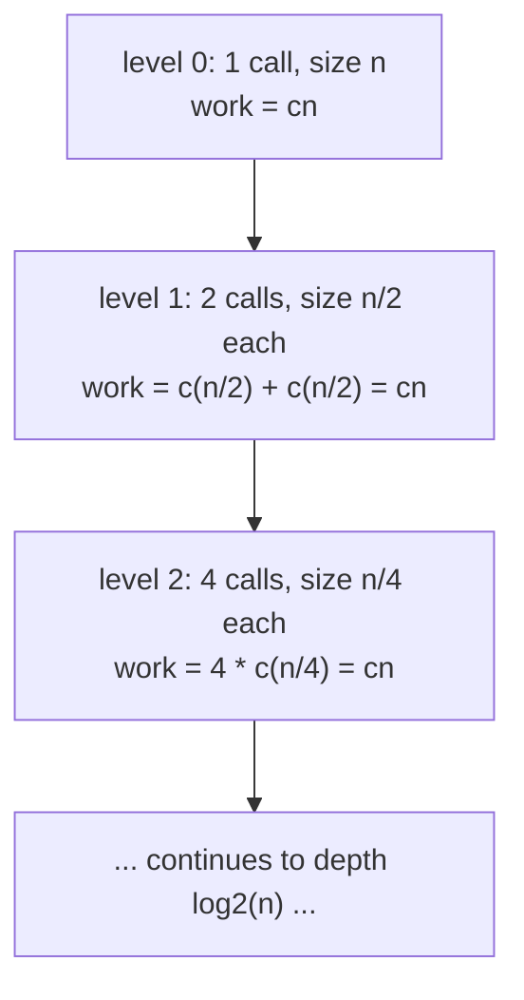
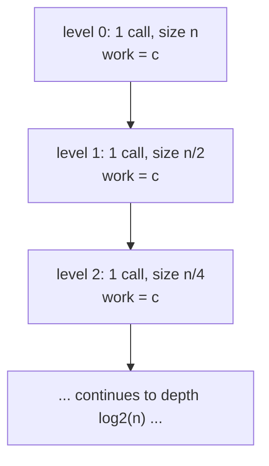

## Learning Objectives

- Write down the recurrence a divide-and-conquer algorithm implies, from its number of subproblems, its subproblem size, and its combine cost.
- Draw a recursion tree for a given recurrence, and use it to count the number of levels and the work done per level.
- Solve `T(n) = 2T(n/2) + O(n)` via a recursion tree, and state the closed-form bound it produces.
- Solve `T(n) = T(n/2) + O(1)` the same way, and contrast the resulting growth rate against the previous recurrence's.
- Match a new recurrence against these canonical shapes by pattern-matching, without re-deriving a recursion tree from scratch each time.

## Context & Motivation

The divide-and-conquer paradigm gives a recipe for building an algorithm — divide, conquer, combine — but a recipe alone doesn't say how fast the resulting algorithm runs. What it does give is a *running-time equation* that describes itself in terms of a smaller version of itself: if solving a problem of size `n` means solving `a` subproblems of size `n/b`, plus spending some extra time `f(n)` dividing and combining, then the total running time `T(n)` obeys `T(n) = a·T(n/b) + f(n)`. This is a **recurrence** — an equation whose own solution appears inside itself — and it is completely accurate as a description of the running time, but it is not, by itself, useful for comparing algorithms or predicting behavior at scale. Nobody looks at `T(n) = 2T(n/2) + O(n)` and immediately sees "that's roughly `n log n`" without doing some work first; that translation from self-referential equation to closed form is exactly the gap this concept closes.

MIT's 6.006 and Sedgewick & Wayne's course both treat this translation the same way at the introductory level: not by proving a fully general theorem covering every possible recurrence shape (the Master Theorem, in its complete form, does exist and is covered in more advanced treatments), but by drawing a **recursion tree** for a small number of canonical shapes, reading the total work directly off the tree, and then recognizing those same shapes by pattern-matching whenever they reappear. This is a deliberately lighter-weight approach than a formal proof, and it is chosen specifically because it builds the right intuition — *why* a recurrence resolves to the growth rate it does — rather than delivering a rule to apply mechanically without understanding it. The two shapes worked through here, `T(n) = 2T(n/2) + O(n)` (merge sort's shape, solved in full in the next concept) and `T(n) = T(n/2) + O(1)` (binary search's shape, from the previous concept), are exactly the two the paradigm concept previewed, and seeing both solved side by side is what makes the pattern-matching approach generalize to recurrences neither one has been seen before.

## Core Theory

### From algorithm shape to recurrence

A divide-and-conquer algorithm that produces `a` subproblems of size `n/b`, plus `f(n)` non-recursive work per call, has running time described by:

```
T(n) = a·T(n/b) + f(n)
```

with some base case, typically `T(1) = O(1)` (a problem of constant size is solved in constant time, with no further recursion). Reading `a`, `b`, and `f(n)` off an algorithm's divide, conquer, and combine steps is mechanical once those three steps are identified clearly — which is exactly why the previous concept spent the effort naming them precisely. Binary search has `a = 1` subproblem of size `n/2`, plus `O(1)` combine work, giving `T(n) = T(n/2) + O(1)`. Merge sort (previewed in the paradigm concept, solved in full next) has `a = 2` subproblems of size `n/2`, plus `O(n)` merge work, giving `T(n) = 2T(n/2) + O(n)`.

### The recursion tree: turning self-reference into a picture

A recursion tree makes the recurrence's self-reference visible by drawing one node per recursive call, with each node labeled by the *non-recursive* work that call does on its own, and each node's children being the calls it makes. The tree's structure directly answers the two questions needed to sum up the total work: how many **levels** does the tree have, and how much work does each level do, added across every node at that level?

For `T(n) = 2T(n/2) + O(n)`, each call does `O(n)` work of its own (the merge, in merge sort's case) and produces 2 children, each handling a problem of half the size:



Each level, no matter how many calls it contains, sums to the same total: `cn`. This is not a coincidence of the specific numbers chosen — it falls directly out of `a = 2` subproblems each of size `n/2` and `f(n) = cn`: at level `k` there are `2^k` calls, each on a problem of size `n / 2^k`, each doing `c · (n / 2^k)` work of its own, for a per-level total of `2^k · c · (n / 2^k) = cn`, independent of `k`. The tree's total work is then `cn` multiplied by the number of levels.

### Counting levels: how deep does the tree go?

The tree bottoms out once the subproblem size reaches the base case, size 1. Starting from `n` and halving at each level, the size at level `k` is `n / 2^k`; this reaches 1 when `2^k = n`, i.e., `k = log2(n)`. So the tree has `log2(n) + 1` levels (level 0 through level `log2(n)`, counting both endpoints) — for asymptotic purposes, this is `Θ(log n)` levels.

### Solving `T(n) = 2T(n/2) + O(n)`: merge sort's shape

Multiplying the per-level work (`cn`, shown above to be the same at every level) by the number of levels (`Θ(log n)`) gives the total work summed across the whole tree:

```
total work = cn · Θ(log n) = Θ(n log n)
```

This is the recursion-tree argument, in full, for why `T(n) = 2T(n/2) + O(n)` resolves to `T(n) = Θ(n log n)` — not asserted, but read directly off the tree: `Θ(n)` work per level, `Θ(log n)` levels, multiplied together. This is exactly the recurrence the next concept, merge sort revisited, derives from the algorithm's own divide/conquer/merge structure, and this is where its solution comes from.

### Solving `T(n) = T(n/2) + O(1)`: binary search's shape, contrasted

The same recursion-tree method applies, with two changes: only `a = 1` child per node (not 2), and each node's own work is `O(1)` (not `O(n)`) — reflecting binary search's trivial combine step from the paradigm concept.



Here each level does only `c` work total (one call, doing constant work), not `cn` — because there is only ever one call per level, not `2^k` of them. The tree still has `Θ(log n)` levels, by the identical halving argument as before (subproblem size `n / 2^k` reaches 1 at `k = log2(n)`), but now the total work is:

```
total work = c · Θ(log n) = Θ(log n)
```

Contrasting the two trees side by side makes the source of the difference precise: both recurrences have the *same* number of levels (`Θ(log n)`, since both halve the problem size at each step), but they differ in how much work is done *per level* — `Θ(n)` per level when there are 2 branching subproblems each doing proportional work, versus `Θ(1)` per level when there is only 1 subproblem doing constant work. That single difference in branching and per-call cost is exactly what separates an `Θ(n log n)` algorithm from a `Θ(log n)` one, even though both recurrences "look similar" at a glance (both have a `T(n/2)` term).

### Pattern-matching against these two shapes

Once these two recursion trees have been worked through once, a new recurrence can usually be classified by matching it against one of these shapes rather than re-drawing a tree from scratch:

- `T(n) = a·T(n/2) + O(n)` with `a = 1`: one subproblem, linear combine work — the *total* work is dominated by the top level alone (`O(n)` at level 0, and every level below does strictly less, since each level's total work shrinks by a factor of 2 rather than staying constant as in the `a=2` case) — this resolves to `Θ(n)`, not `Θ(n log n)`, precisely because there's only one branch to spread the `O(n)` combine cost across the levels below.
- `T(n) = 2·T(n/2) + O(n)`: the merge sort shape worked through above — `Θ(n log n)`.
- `T(n) = 1·T(n/2) + O(1)`: the binary search shape worked through above — `Θ(log n)`.

The general principle the recursion-tree method reveals, without needing a fully general theorem to state it: compare how the *total* work per level changes as the tree gets deeper. If it stays constant across levels (as in the `2T(n/2) + O(n)` case), the total is (per-level work) × (number of levels). If it shrinks geometrically going down the tree (as in the `1·T(n/2) + O(n)` case above), the total is dominated by the top level alone. If it stays constant but each level's total is itself already small (as in the `T(n/2) + O(1)` case), the total is again (per-level work) × (number of levels), just with a much smaller per-level constant.

## Worked Examples

### Example 1 — full recursion-tree derivation for `T(n) = 2T(n/2) + O(n)`

**Problem:** Confirm `T(n) = Θ(n log n)` for `T(n) = 2T(n/2) + cn`, `T(1) = c`, using concrete numbers at `n = 16`.

**Level 0:** 1 call, size 16, work `= 16c`.
**Level 1:** 2 calls, size 8 each, work `= 2 · 8c = 16c`.
**Level 2:** 4 calls, size 4 each, work `= 4 · 4c = 16c`.
**Level 3:** 8 calls, size 2 each, work `= 8 · 2c = 16c`.
**Level 4:** 16 calls, size 1 each (base case), work `= 16 · c = 16c`.

Every level totals `16c`, confirming the general claim that per-level work stays constant. Number of levels: `log2(16) + 1 = 4 + 1 = 5`. Total work: `5 · 16c = 80c = Θ(16 log 16) = Θ(n log n)` for `n = 16`. This matches the general derivation exactly, with concrete numbers replacing the symbolic `n`.

### Example 2 — full recursion-tree derivation for `T(n) = T(n/2) + O(1)`

**Problem:** Confirm `T(n) = Θ(log n)` for `T(n) = T(n/2) + c`, `T(1) = c`, using `n = 16`.

**Level 0:** 1 call, work `= c`.
**Level 1:** 1 call, work `= c`.
**Level 2:** 1 call, work `= c`.
**Level 3:** 1 call, work `= c`.
**Level 4:** 1 call (base case, size 1), work `= c`.

Every level totals `c` (not growing, since there's only ever one call per level). Number of levels: `log2(16) + 1 = 5`, identical to Example 1's level count — both recurrences halve the problem size at every step, so both produce the same *number* of levels. Total work: `5 · c = Θ(log 16) = Θ(log n)` for `n = 16`. Comparing directly against Example 1: same number of levels (5), but `16c` of work per level there versus `c` here — the entire gap between `Θ(n log n)` and `Θ(log n)` traces back to that one difference, not to the number of levels.

### Example 3 — pattern-matching a new recurrence

**Problem:** A hypothetical algorithm splits its input into 4 subproblems of size `n/2` each (overlapping subproblems are allowed here — this is a deliberately artificial example to test the pattern-matching method), with `O(n)` combine work. Its recurrence is `T(n) = 4T(n/2) + O(n)`. Without drawing a full tree, estimate its growth rate by extending the reasoning above.

**Level 0:** 1 call, work `= cn`.
**Level 1:** 4 calls, size `n/2` each, work `= 4 · c(n/2) = 2cn` — double level 0's work, not equal to it.
**Level 2:** 16 calls, size `n/4` each, work `= 16 · c(n/4) = 4cn` — double level 1's again.

Unlike the merge-sort shape, here the per-level work *grows* geometrically going down the tree (each level doubles the previous one), rather than staying constant. When work grows geometrically toward the leaves, the total is dominated by the *last* level, not spread evenly — the number of leaves is `4^(log2 n) = n^2`, each doing `O(1)` base-case work, giving a total of `Θ(n^2)`. This example is included specifically to show a case where the "constant work per level" pattern from `2T(n/2) + O(n)` does *not* apply — pattern-matching means checking which of the canonical shapes actually fits, not assuming every `T(n/2)`-containing recurrence behaves like merge sort's.

## Common Misconceptions & Pitfalls

- **"More recursive calls in the recurrence always means a worse growth rate."** Example 3's `4T(n/2) + O(n)` does grow faster (`Θ(n²)`) than merge sort's `2T(n/2) + O(n)` (`Θ(n log n)`), but the reason is specifically that 4 branches with linear combine work makes the per-level total grow geometrically, not merely that "4 is more than 2" — the relationship between the branching factor `a`, the size reduction `b`, and the combine cost `f(n)` is what determines the outcome, not any one of the three numbers alone.
- **"`T(n) = T(n/2) + O(1)` and `T(n) = 2T(n/2) + O(n)` should behave similarly because they both contain a `T(n/2)` term."** Example 2 versus Example 1 shows these resolve to `Θ(log n)` and `Θ(n log n)` respectively — genuinely different growth rates, both having the *same number* of levels (`Θ(log n)`, from halving) but wildly different amounts of work *per* level. Matching only the recursive term while ignoring the combine cost `f(n)` and the number of subproblems `a` is exactly the mistake that conflates these two.
- **"The recursion tree method is just as good as the Master Theorem, so there's no need to ever learn the formal version."** The tree method used here is deliberately informal and works cleanly on the specific shapes it's applied to by hand — it does not, on its own, provide a general proof covering every possible `a`, `b`, and `f(n)` combination, particularly ones where the per-level work neither stays constant nor grows/shrinks geometrically in a clean way. It builds the right intuition for *why* these bounds hold, which is exactly the goal at this level, but a fully general treatment (the Master Theorem, covered in more advanced courses) exists for cases this informal method doesn't cleanly resolve.
- **"Counting levels is enough on its own; the per-level work doesn't need separate attention."** Both worked examples have the identical number of levels (`Θ(log n)`, from the same halving argument) yet totally different final answers — the number of levels alone never determines the total; it must always be combined with how work per level behaves across those levels.

## Summary

A divide-and-conquer algorithm's running time is described by a recurrence `T(n) = a·T(n/b) + f(n)`, read directly off its divide, conquer, and combine steps. Solving such a recurrence at this level means drawing a recursion tree, computing the work done at each level, counting the number of levels (`Θ(log n)` whenever the problem size is repeatedly divided by a constant factor `b`), and multiplying — or, once a canonical shape has been seen, recognizing it by pattern-matching instead of re-deriving it. `T(n) = 2T(n/2) + O(n)` — merge sort's shape — has constant work (`Θ(n)`) at every one of its `Θ(log n)` levels, giving `Θ(n log n)` overall. `T(n) = T(n/2) + O(1)` — binary search's shape — has only constant work (`Θ(1)`) at each of the same `Θ(log n)` levels, giving `Θ(log n)` overall. The two recurrences share the same level count but differ entirely in per-level work, which is exactly the source of their different growth rates, and this same recursion-tree reasoning generalizes to new recurrences by checking whether their per-level work stays constant, grows, or shrinks going down the tree.

## Documentation Links

- [MIT 6.006 — Lecture Notes (OCW)](https://ocw.mit.edu/courses/6-006-introduction-to-algorithms-spring-2020/pages/lecture-notes/) — doc
- [Sedgewick & Wayne — Algorithms Lectures (Princeton)](https://algs4.cs.princeton.edu/lectures/) — doc
