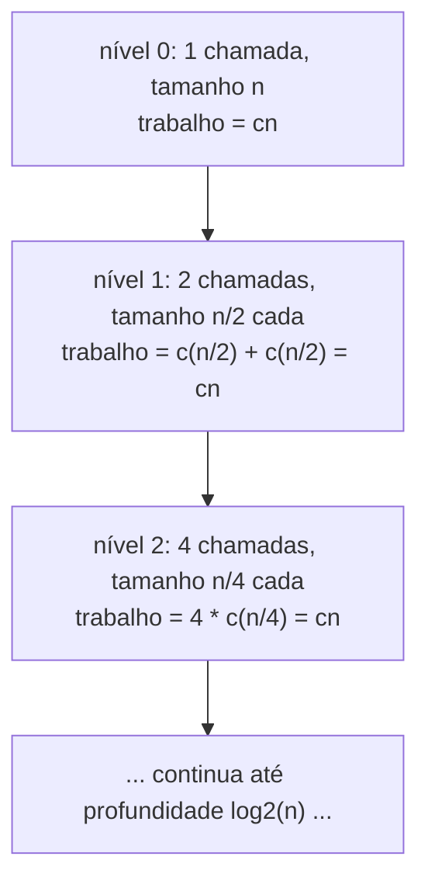
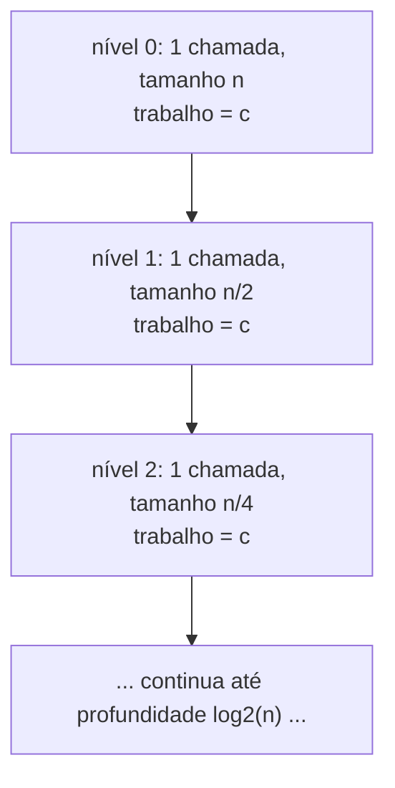

## Objetivos de Aprendizagem

- Escrever a recorrência que um algoritmo de dividir para conquistar implica, a partir de seu número de subproblemas, do tamanho do subproblema, e do custo de combinar.
- Desenhar uma árvore de recursão para uma recorrência dada, e usá-la para contar o número de níveis e o trabalho feito por nível.
- Resolver `T(n) = 2T(n/2) + O(n)` via uma árvore de recursão, e enunciar o limite em forma fechada que ela produz.
- Resolver `T(n) = T(n/2) + O(1)` da mesma forma, e contrastar a taxa de crescimento resultante contra a da recorrência anterior.
- Combinar uma nova recorrência com esses formatos canônicos por reconhecimento de padrão, sem redesenhar uma árvore de recursão do zero a cada vez.

## Contexto e Motivação

O paradigma de dividir para conquistar dá uma receita para construir um algoritmo, dividir, conquistar, combinar, mas uma receita sozinha não diz quão rápido o algoritmo resultante roda. O que ela dá é uma *equação de tempo de execução* que se descreve em termos de uma versão menor de si mesma: se resolver um problema de tamanho `n` significa resolver `a` subproblemas de tamanho `n/b`, mais gastar algum tempo extra `f(n)` dividindo e combinando, então o tempo de execução total `T(n)` obedece `T(n) = a·T(n/b) + f(n)`. Isso é uma **recorrência**, uma equação cuja própria solução aparece dentro dela mesma, e é completamente precisa como uma descrição do tempo de execução, mas não é, por si só, útil para comparar algoritmos ou prever comportamento em escala. Ninguém olha para `T(n) = 2T(n/2) + O(n)` e imediatamente vê "isso é aproximadamente `n log n`" sem fazer algum trabalho primeiro; essa tradução de equação autorreferente para forma fechada é exatamente a lacuna que este conceito fecha.

Tanto o 6.006 do MIT quanto o curso de Sedgewick & Wayne tratam essa tradução da mesma forma no nível introdutório: não provando um teorema completamente geral cobrindo todo formato possível de recorrência (o Teorema Mestre, em sua forma completa, existe e é coberto em tratamentos mais avançados), mas desenhando uma **árvore de recursão** para um pequeno número de formatos canônicos, lendo o trabalho total diretamente da árvore, e depois reconhecendo esses mesmos formatos por reconhecimento de padrão sempre que reaparecem. Essa é uma abordagem deliberadamente mais leve que uma prova formal, e é escolhida especificamente porque constrói a intuição certa, *por que* uma recorrência resolve para a taxa de crescimento que resolve, em vez de entregar uma regra para aplicar mecanicamente sem entendê-la. Os dois formatos trabalhados aqui, `T(n) = 2T(n/2) + O(n)` (o formato do merge sort, resolvido por completo no próximo conceito) e `T(n) = T(n/2) + O(1)` (o formato da busca binária, do conceito anterior), são exatamente os dois que o conceito do paradigma adiantou, e ver ambos resolvidos lado a lado é o que faz a abordagem de reconhecimento de padrão generalizar para recorrências nunca vistas antes.

## Teoria Central

### Do formato do algoritmo para a recorrência

Um algoritmo de dividir para conquistar que produz `a` subproblemas de tamanho `n/b`, mais `f(n)` de trabalho não recursivo por chamada, tem tempo de execução descrito por:

```
T(n) = a·T(n/b) + f(n)
```

com algum caso base, tipicamente `T(1) = O(1)` (um problema de tamanho constante é resolvido em tempo constante, sem mais recursão). Ler `a`, `b`, e `f(n)` a partir dos passos de dividir, conquistar e combinar de um algoritmo é mecânico uma vez que esses três passos são identificados claramente, o que é exatamente por que o conceito anterior gastou o esforço de nomeá-los precisamente. Busca binária tem `a = 1` subproblema de tamanho `n/2`, mais `O(1)` de trabalho de combinar, dando `T(n) = T(n/2) + O(1)`. Merge sort (adiantado no conceito do paradigma, resolvido por completo em seguida) tem `a = 2` subproblemas de tamanho `n/2`, mais `O(n)` de trabalho de merge, dando `T(n) = 2T(n/2) + O(n)`.

### A árvore de recursão: transformando autorreferência em uma figura

Uma árvore de recursão torna a autorreferência da recorrência visível desenhando um nó por chamada recursiva, com cada nó rotulado pelo trabalho *não recursivo* que aquela chamada faz por conta própria, e os filhos de cada nó sendo as chamadas que ele faz. A estrutura da árvore responde diretamente as duas perguntas necessárias para somar o trabalho total: quantos **níveis** a árvore tem, e quanto trabalho cada nível faz, somado através de todo nó naquele nível?

Para `T(n) = 2T(n/2) + O(n)`, cada chamada faz `O(n)` de trabalho próprio (o merge, no caso do merge sort) e produz 2 filhos, cada um lidando com um problema da metade do tamanho:



Todo nível, não importa quantas chamadas contenha, soma para o mesmo total: `cn`. Isso não é uma coincidência dos números específicos escolhidos, decorre diretamente de `a = 2` subproblemas cada um de tamanho `n/2` e `f(n) = cn`: no nível `k` há `2^k` chamadas, cada uma sobre um problema de tamanho `n / 2^k`, cada uma fazendo `c · (n / 2^k)` de trabalho próprio, para um total por nível de `2^k · c · (n / 2^k) = cn`, independente de `k`. O trabalho total da árvore é então `cn` multiplicado pelo número de níveis.

### Contando níveis: quão fundo a árvore vai?

A árvore atinge o fundo quando o tamanho do subproblema alcança o caso base, tamanho 1. Começando de `n` e dividindo pela metade a cada nível, o tamanho no nível `k` é `n / 2^k`; isso alcança 1 quando `2^k = n`, ou seja, `k = log2(n)`. Então a árvore tem `log2(n) + 1` níveis (nível 0 até nível `log2(n)`, contando ambos os extremos), para propósitos assintóticos, isso são `Θ(log n)` níveis.

### Resolvendo `T(n) = 2T(n/2) + O(n)`: o formato do merge sort

Multiplicar o trabalho por nível (`cn`, mostrado acima ser o mesmo em todo nível) pelo número de níveis (`Θ(log n)`) dá o trabalho total somado através da árvore inteira:

```
trabalho total = cn · Θ(log n) = Θ(n log n)
```

Este é o argumento da árvore de recursão, por completo, para por que `T(n) = 2T(n/2) + O(n)` resolve para `T(n) = Θ(n log n)`, não afirmado, mas lido diretamente da árvore: `Θ(n)` de trabalho por nível, `Θ(log n)` níveis, multiplicados. Essa é exatamente a recorrência que o próximo conceito, merge sort revisitado, deriva da própria estrutura de dividir/conquistar/mesclar do algoritmo, e é daí que sua solução vem.

### Resolvendo `T(n) = T(n/2) + O(1)`: o formato da busca binária, contrastado

O mesmo método de árvore de recursão se aplica, com duas mudanças: apenas `a = 1` filho por nó (não 2), e o próprio trabalho de cada nó é `O(1)` (não `O(n)`), refletindo o passo de combinar trivial de busca binária do conceito do paradigma.



Aqui cada nível faz apenas `c` de trabalho total (uma chamada, fazendo trabalho constante), não `cn`, porque há apenas uma chamada por nível, não `2^k` delas. A árvore ainda tem `Θ(log n)` níveis, pelo argumento idêntico de divisão pela metade de antes (tamanho do subproblema `n / 2^k` alcança 1 em `k = log2(n)`), mas agora o trabalho total é:

```
trabalho total = c · Θ(log n) = Θ(log n)
```

Contrastar as duas árvores lado a lado torna a origem da diferença precisa: ambas as recorrências têm o *mesmo* número de níveis (`Θ(log n)`, já que ambas dividem o tamanho do problema pela metade a cada passo), mas diferem em quanto trabalho é feito *por nível*, `Θ(n)` por nível quando há 2 subproblemas se ramificando cada um fazendo trabalho proporcional, versus `Θ(1)` por nível quando há apenas 1 subproblema fazendo trabalho constante. Essa única diferença em ramificação e custo por chamada é exatamente o que separa um algoritmo `Θ(n log n)` de um `Θ(log n)`, mesmo que ambas as recorrências "pareçam similares" à primeira vista (ambas têm um termo `T(n/2)`).

### Reconhecendo padrões contra esses dois formatos

Uma vez que essas duas árvores de recursão foram trabalhadas uma vez, uma nova recorrência geralmente pode ser classificada combinando-a contra um desses formatos em vez de redesenhar uma árvore do zero:

- `T(n) = a·T(n/2) + O(n)` com `a = 1`: um subproblema, trabalho de combinar linear, o trabalho *total* é dominado só pelo nível do topo (`O(n)` no nível 0, e todo nível abaixo faz estritamente menos, já que o trabalho total de cada nível encolhe por um fator de 2 em vez de permanecer constante como no caso `a=2`), isso resolve para `Θ(n)`, não `Θ(n log n)`, precisamente porque há apenas um ramo para espalhar o custo de combinar `O(n)` através dos níveis abaixo.
- `T(n) = 2·T(n/2) + O(n)`: o formato do merge sort trabalhado acima, `Θ(n log n)`.
- `T(n) = 1·T(n/2) + O(1)`: o formato da busca binária trabalhado acima, `Θ(log n)`.

O princípio geral que o método da árvore de recursão revela, sem precisar de um teorema completamente geral para enunciá-lo: compare como o trabalho *total* por nível muda conforme a árvore fica mais funda. Se permanece constante através dos níveis (como no caso `2T(n/2) + O(n)`), o total é (trabalho por nível) × (número de níveis). Se encolhe geometricamente descendo a árvore (como no caso `1·T(n/2) + O(n)` acima), o total é dominado só pelo nível do topo. Se permanece constante mas o total de cada nível já é pequeno por si só (como no caso `T(n/2) + O(1)`), o total é novamente (trabalho por nível) × (número de níveis), só com uma constante por nível muito menor.

## Exemplos Resolvidos

### Exemplo 1 — derivação completa de árvore de recursão para `T(n) = 2T(n/2) + O(n)`

**Problema:** Confirme `T(n) = Θ(n log n)` para `T(n) = 2T(n/2) + cn`, `T(1) = c`, usando números concretos em `n = 16`.

**Nível 0:** 1 chamada, tamanho 16, trabalho `= 16c`.
**Nível 1:** 2 chamadas, tamanho 8 cada, trabalho `= 2 · 8c = 16c`.
**Nível 2:** 4 chamadas, tamanho 4 cada, trabalho `= 4 · 4c = 16c`.
**Nível 3:** 8 chamadas, tamanho 2 cada, trabalho `= 8 · 2c = 16c`.
**Nível 4:** 16 chamadas, tamanho 1 cada (caso base), trabalho `= 16 · c = 16c`.

Todo nível soma `16c`, confirmando a afirmação geral de que o trabalho por nível permanece constante. Número de níveis: `log2(16) + 1 = 4 + 1 = 5`. Trabalho total: `5 · 16c = 80c = Θ(16 log 16) = Θ(n log n)` para `n = 16`. Isso combina exatamente com a derivação geral, com números concretos substituindo o `n` simbólico.

### Exemplo 2 — derivação completa de árvore de recursão para `T(n) = T(n/2) + O(1)`

**Problema:** Confirme `T(n) = Θ(log n)` para `T(n) = T(n/2) + c`, `T(1) = c`, usando `n = 16`.

**Nível 0:** 1 chamada, trabalho `= c`.
**Nível 1:** 1 chamada, trabalho `= c`.
**Nível 2:** 1 chamada, trabalho `= c`.
**Nível 3:** 1 chamada, trabalho `= c`.
**Nível 4:** 1 chamada (caso base, tamanho 1), trabalho `= c`.

Todo nível soma `c` (não crescendo, já que há apenas uma chamada por nível). Número de níveis: `log2(16) + 1 = 5`, idêntico à contagem de níveis do Exemplo 1, ambas as recorrências dividem o tamanho do problema pela metade a cada passo, então ambas produzem o mesmo *número* de níveis. Trabalho total: `5 · c = Θ(log 16) = Θ(log n)` para `n = 16`. Comparando diretamente com o Exemplo 1: mesmo número de níveis (5), mas `16c` de trabalho por nível ali versus `c` aqui, a lacuna inteira entre `Θ(n log n)` e `Θ(log n)` remonta a essa única diferença, não ao número de níveis.

### Exemplo 3 — reconhecendo o padrão de uma nova recorrência

**Problema:** Um algoritmo hipotético divide sua entrada em 4 subproblemas de tamanho `n/2` cada (subproblemas sobrepostos são permitidos aqui, este é um exemplo deliberadamente artificial para testar o método de reconhecimento de padrão), com `O(n)` de trabalho de combinar. Sua recorrência é `T(n) = 4T(n/2) + O(n)`. Sem desenhar uma árvore completa, estime sua taxa de crescimento estendendo o raciocínio acima.

**Nível 0:** 1 chamada, trabalho `= cn`.
**Nível 1:** 4 chamadas, tamanho `n/2` cada, trabalho `= 4 · c(n/2) = 2cn`, o dobro do trabalho do nível 0, não igual a ele.
**Nível 2:** 16 chamadas, tamanho `n/4` cada, trabalho `= 16 · c(n/4) = 4cn`, o dobro do nível 1 de novo.

Diferente do formato do merge sort, aqui o trabalho por nível *cresce* geometricamente descendo a árvore (cada nível dobra o anterior), em vez de permanecer constante. Quando o trabalho cresce geometricamente em direção às folhas, o total é dominado pelo *último* nível, não espalhado uniformemente, o número de folhas é `4^(log2 n) = n^2`, cada uma fazendo `O(1)` de trabalho de caso base, dando um total de `Θ(n^2)`. Este exemplo é incluído especificamente para mostrar um caso onde o padrão de "trabalho constante por nível" de `2T(n/2) + O(n)` *não* se aplica, reconhecimento de padrão significa verificar qual dos formatos canônicos de fato se encaixa, não assumir que toda recorrência contendo `T(n/2)` se comporta como a do merge sort.

## Equívocos Comuns e Armadilhas

- **"Mais chamadas recursivas na recorrência sempre significa uma taxa de crescimento pior."** O `4T(n/2) + O(n)` do Exemplo 3 de fato cresce mais rápido (`Θ(n²)`) que o `2T(n/2) + O(n)` do merge sort (`Θ(n log n)`), mas a razão é especificamente que 4 ramos com trabalho de combinar linear faz o total por nível crescer geometricamente, não meramente que "4 é mais que 2", a relação entre o fator de ramificação `a`, a redução de tamanho `b`, e o custo de combinar `f(n)` é o que determina o resultado, não qualquer um dos três números isoladamente.
- **"`T(n) = T(n/2) + O(1)` e `T(n) = 2T(n/2) + O(n)` deveriam se comportar de forma similar porque ambas contêm um termo `T(n/2)`."** O Exemplo 2 versus o Exemplo 1 mostra que essas resolvem para `Θ(log n)` e `Θ(n log n)` respectivamente, taxas de crescimento genuinamente diferentes, ambas tendo o *mesmo número* de níveis (`Θ(log n)`, de dividir pela metade) mas quantidades de trabalho *por* nível extremamente diferentes. Combinar apenas o termo recursivo enquanto ignora o custo de combinar `f(n)` e o número de subproblemas `a` é exatamente o erro que confunde essas duas.
- **"O método da árvore de recursão é tão bom quanto o Teorema Mestre, então nunca há necessidade de aprender a versão formal."** O método de árvore usado aqui é deliberadamente informal e funciona bem nos formatos específicos aos quais é aplicado manualmente, ele não fornece, por si só, uma prova geral cobrindo toda combinação possível de `a`, `b`, e `f(n)`, particularmente aquelas onde o trabalho por nível nem permanece constante nem cresce/encolhe geometricamente de forma limpa. Ele constrói a intuição certa para *por que* esses limites valem, que é exatamente o objetivo neste nível, mas um tratamento completamente geral (o Teorema Mestre, coberto em cursos mais avançados) existe para casos que esse método informal não resolve de forma limpa.
- **"Contar níveis é suficiente por si só; o trabalho por nível não precisa de atenção separada."** Ambos os exemplos resolvidos têm o número idêntico de níveis (`Θ(log n)`, do mesmo argumento de dividir pela metade) ainda assim respostas finais totalmente diferentes, o número de níveis sozinho nunca determina o total; sempre deve ser combinado com como o trabalho por nível se comporta através desses níveis.

## Resumo

O tempo de execução de um algoritmo de dividir para conquistar é descrito por uma recorrência `T(n) = a·T(n/b) + f(n)`, lida diretamente de seus passos de dividir, conquistar e combinar. Resolver tal recorrência neste nível significa desenhar uma árvore de recursão, calcular o trabalho feito em cada nível, contar o número de níveis (`Θ(log n)` sempre que o tamanho do problema é repetidamente dividido por um fator constante `b`), e multiplicar, ou, uma vez que um formato canônico foi visto, reconhecê-lo por reconhecimento de padrão em vez de rederivá-lo. `T(n) = 2T(n/2) + O(n)`, o formato do merge sort, tem trabalho constante (`Θ(n)`) em cada um de seus `Θ(log n)` níveis, dando `Θ(n log n)` no total. `T(n) = T(n/2) + O(1)`, o formato da busca binária, tem apenas trabalho constante (`Θ(1)`) em cada um dos mesmos `Θ(log n)` níveis, dando `Θ(log n)` no total. As duas recorrências compartilham a mesma contagem de níveis mas diferem inteiramente no trabalho por nível, que é exatamente a origem de suas diferentes taxas de crescimento, e esse mesmo raciocínio de árvore de recursão generaliza para novas recorrências verificando se o trabalho por nível permanece constante, cresce, ou encolhe descendo a árvore.

## Documentation Links

- [MIT 6.006 — Lecture Notes (OCW)](https://ocw.mit.edu/courses/6-006-introduction-to-algorithms-spring-2020/pages/lecture-notes/) — doc
- [Sedgewick & Wayne — Algorithms Lectures (Princeton)](https://algs4.cs.princeton.edu/lectures/) — doc
