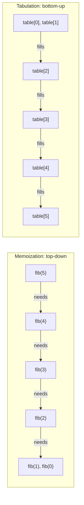

## Learning Objectives

- Fill a table of Fibonacci subproblem answers iteratively, from smallest to largest, with no recursive calls at all.
- Compare tabulation directly against memoization on the same subproblems: same set solved, same asymptotic time, opposite order of computation.
- Explain why tabulation avoids the call-stack cost memoization retains.
- Identify the dependency order a tabulated solution must respect (every subproblem's inputs already filled before it is computed).
- Choose between memoization and tabulation for a new DP problem based on which structural properties favor each.

## Context & Motivation

Memoization solved the redundant-computation problem while keeping recursion's natural top-down shape: start from the original question, recurse toward smaller subproblems, and only compute each distinct one once thanks to the cache. That shape is often the most natural way to *think through* a new DP problem, since it mirrors how the recursive definition itself reads. But it is not the only way to compute the same answers, and it is not free — every memoized call still pays for a stack frame the moment it isn't a cache hit, and the very first descent to the smallest base cases still needs as many simultaneously-pending frames as the input is deep, exactly as ordinary unmemoized recursion did.

Tabulation is the mirror image: instead of starting at the top and recursing downward, start at the bottom — the base cases — and iteratively build upward, filling in a table of subproblem answers in an order that guarantees, by the time any given subproblem is reached, every subproblem it depends on has already been filled in. No recursive call is made anywhere; the entire computation is an explicit loop. This is exactly the shape the recursion concept's iterative Fibonacci already demonstrated in miniature — "accumulate a running total by walking a sequence once" — except here what's being accumulated is not a single running sum but a table of every distinct subproblem's answer, because later subproblems may need to look back at more than just "the immediately previous" entry.

The two techniques are not competing paradigms so much as two directions through the identical set of subproblems: memoization solves the same subproblems tabulation does, in the same asymptotic time, purely by reversing which subproblem gets computed first. Seeing this concretely, on the exact same problem, is the most direct way to internalize what "top-down" and "bottom-up" actually mean as opposite traversal orders over one shared dependency structure.

## Core Theory

### Filling a table from the smallest subproblem up

Fibonacci's tabulated version needs no recursion whatsoever:

```python
def fib_tab(n):
    if n <= 1:
        return n
    table = [0] * (n + 1)
    table[0] = 0                 # base case
    table[1] = 1                 # base case
    for i in range(2, n + 1):    # iterate upward, smallest to largest
        table[i] = table[i - 1] + table[i - 2]
    return table[n]
```

Tracing `fib_tab(5)`'s table fill, entry by entry:

| `table[0]` | `table[1]` | `table[2]` | `table[3]` | `table[4]` | `table[5]` |
|---|---|---|---|---|---|
| 0 (base) | 1 (base) | 0+1=1 | 1+1=2 | 1+2=3 | 2+3=5 |

Every entry, once filled, is available for every later entry that needs it — `table[4]` reads `table[3]` and `table[2]`, both already filled by the time the loop reaches `i = 4`, because the loop proceeds strictly left to right. No entry is ever computed more than once, and no entry is computed before something it depends on. This ordering requirement — every subproblem's dependencies filled before the subproblem itself is reached — is the one hard constraint tabulation imposes that memoization, thanks to recursion resolving dependencies automatically via the call stack, does not need to think about explicitly.

### Same subproblems, opposite direction



Memoization starts at `fib(5)` and discovers, by recursing, that it needs `fib(4)` and `fib(3)`, which in turn need smaller values still — the dependency structure is uncovered on the way down, and the cache is what prevents rediscovering the same dependency twice. Tabulation starts at the opposite end, already knowing (because the recurrence itself specifies it) that `table[i]` depends on `table[i-1]` and `table[i-2]`, and simply fills in that order from the start. Both compute the identical `n + 1` distinct values (`fib(0)` through `fib(n)`), both do `O(1)` work per value beyond looking up already-filled entries, and both run in `O(n)` total time. The only difference is which end of the dependency chain gets visited first.

### Why tabulation avoids the call-stack cost

Because `fib_tab` contains no recursive call anywhere — only a single `for` loop — it needs exactly one stack frame for the entire computation, regardless of how large `n` is. Memoized `fib_memo(n)`, by contrast, still needs `O(n)` simultaneously-pending stack frames on its first descent to the base case, before any cache hits become possible — the same cost ordinary unmemoized recursion pays, since the cache doesn't exist yet at the moment that first descent happens. For large enough `n`, this difference is not merely theoretical: a memoized recursive solution can hit a language's recursion-depth limit (Python's `RecursionError`, as the recursion concept described) on an input where the equivalent tabulated loop runs without any such risk, because a loop's memory use does not grow with call depth the way recursion's does.

### When each direction is preferable

Tabulation's iterative, no-recursion form is generally preferred when the full range of subproblems needs to be computed anyway (as is often the case for a table indexed by, say, "every prefix length up to n") and when avoiding stack overhead matters. Memoization is often preferred when only a fraction of all possible subproblems are actually reachable from the specific input given — the recursive top-down form naturally computes and caches only the subproblems genuinely needed along the way, whereas a naively-written bottom-up table might fill in every entry up to some bound regardless of whether the top-level call needs all of them. Both are legitimate, correct approaches to the same underlying dependency structure; the choice is a practical one about stack depth, the shape of which subproblems are actually needed, and often simply which direction is easier to reason through for the specific recurrence at hand.

## Worked Examples

### Example 1 — hand-filling the Fibonacci table

**Problem:** Fill `fib_tab`'s table for `n = 7` by hand, and confirm the final answer against the sequence's well-known values.

| i | 0 | 1 | 2 | 3 | 4 | 5 | 6 | 7 |
|---|---|---|---|---|---|---|---|---|
| table[i] | 0 | 1 | 1 | 2 | 3 | 5 | 8 | 13 |

Each entry from `i = 2` onward is `table[i-1] + table[i-2]`: `table[2] = 1+0 = 1`, `table[3] = 1+1 = 2`, `table[4] = 2+1 = 3`, `table[5] = 3+2 = 5`, `table[6] = 5+3 = 8`, `table[7] = 8+5 = 13` — matching the standard Fibonacci sequence exactly, and matching what `fib_memo(7)` would also return, computed here with zero recursive calls.

### Example 2 — tabulating the grid-paths problem

**Problem:** Tabulate `count_paths(r, c) = count_paths(r-1, c) + count_paths(r, c-1)`, base case `count_paths(0, c) = count_paths(r, 0) = 1`, for a `3×3` grid.

Since each cell depends on the cell above and the cell to its left, filling row by row, left to right within each row, guarantees both dependencies are already filled:

```python
def count_paths_tab(rows, cols):
    table = [[1] * (cols + 1) for _ in range(rows + 1)]   # first row/col: base case, all 1s
    for r in range(1, rows + 1):
        for c in range(1, cols + 1):
            table[r][c] = table[r - 1][c] + table[r][c - 1]
    return table[rows][cols]
```

| r \\ c | 0 | 1 | 2 | 3 |
|---|---|---|---|---|
| 0 | 1 | 1 | 1 | 1 |
| 1 | 1 | 2 | 3 | 4 |
| 2 | 1 | 3 | 6 | 10 |
| 3 | 1 | 4 | 10 | 20 |

`table[1][1] = table[0][1] + table[1][0] = 1 + 1 = 2`; `table[2][2] = table[1][2] + table[2][1] = 3 + 3 = 6`; `table[3][3] = table[2][3] + table[3][2] = 10 + 10 = 20`. The final answer, 20 distinct paths across a `3×3` grid, matches what a memoized recursive version would compute — filled here row by row, with every dependency already resolved by the time each cell is reached.

### Example 3 — a dependency order that would break tabulation

**Problem:** Suppose someone tried to fill the grid-paths table column by column right-to-left instead of the order used above. Would that work?

**Diagnosis.** `table[r][c]` depends on `table[r-1][c]` (the cell above, same column) and `table[r][c-1]` (the cell to the left, previous column). Filling columns right-to-left means that when column `c` is being filled, column `c-1` — which every entry in column `c` needs — has not been filled yet. The loop would read uninitialized (or stale) values, producing wrong answers, unless the base case columns happen to be trivial in a way that hides the bug. The general lesson: a tabulated loop's iteration order is not a free choice — it must respect the recurrence's actual dependencies, filling every subproblem an entry needs strictly before that entry itself is computed.

## Common Misconceptions & Pitfalls

- **"Tabulation is a different algorithm from memoization, solving a different set of subproblems."** Both solve the identical set of subproblems (Example 1 and 2 both land on exactly the same final answers memoization would) — the only difference is the order those subproblems get filled in, top-down-with-a-cache versus bottom-up-with-a-loop.
- **"Any iteration order works, as long as every entry eventually gets filled."** Example 3 shows this is false — the iteration order must respect the recurrence's dependencies; filling an entry before something it depends on has been computed produces silently wrong answers, not a slower-but-correct result.
- **"Tabulation is always strictly better than memoization because it avoids the call stack."** Tabulation's iterative loop typically does need to compute every entry up to some bound, even ones the final answer doesn't actually need — for a sparse or highly input-dependent set of reachable subproblems, memoization's on-demand recursion can do genuinely less total work by never touching irrelevant subproblems at all.
- **"Tabulation needs a 1D array (or 2D grid) — it can't handle the same problems memoization can."** The array shape simply mirrors whatever the subproblem's identifying parameters are (a single index for Fibonacci, a pair for the grid) — this generalizes to as many dimensions as a problem's recurrence needs, as the upcoming Longest Common Subsequence concept will use directly with a two-dimensional table.

## Summary

Tabulation solves the identical subproblems memoization does, in the identical `O(n)`-style asymptotic time, by filling a table iteratively from the smallest base cases upward rather than recursing downward from the original input with a cache — Fibonacci's `table[2], table[3], …, table[n]`, each filled only after the entries it depends on already have values, needs no recursive call at all. Because it replaces recursion with a plain loop, tabulation uses a single stack frame throughout, avoiding the `O(n)`-deep call stack memoization still pays on its first descent to base cases — a real, practical advantage on inputs large enough to risk a recursion-depth limit. The one hard requirement tabulation imposes is respecting dependency order: every subproblem an entry needs must already be filled before that entry is computed, or the fill produces silently wrong values rather than merely slow ones. Choosing between the two is a practical judgment — full-range tables needed anyway and stack-depth concerns favor tabulation; a sparse or input-dependent set of genuinely-needed subproblems favors memoization's on-demand recursion.

## Documentation Links

- [MIT 6.006 — Lecture Notes (OCW)](https://ocw.mit.edu/courses/6-006-introduction-to-algorithms-spring-2020/pages/lecture-notes/) — doc
- [ACM/IEEE CS2013 — Algorithms and Complexity Knowledge Area](https://csed.acm.org/cs2013-version/) — doc
