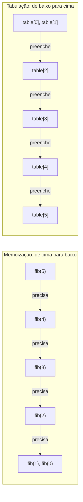

## Objetivos de Aprendizagem

- Preencher uma tabela de respostas de subproblema de Fibonacci iterativamente, do menor para o maior, sem nenhuma chamada recursiva.
- Comparar tabulação diretamente contra memoização nos mesmos subproblemas: mesmo conjunto resolvido, mesmo tempo assintótico, ordem oposta de computação.
- Explicar por que tabulação evita o custo de pilha de chamada que memoização retém.
- Identificar a ordem de dependência que uma solução tabulada deve respeitar (as entradas de todo subproblema já preenchidas antes de ele ser calculado).
- Escolher entre memoização e tabulação para um novo problema de DP baseado em quais propriedades estruturais favorecem cada uma.

## Contexto e Motivação

Memoização resolveu o problema de computação redundante enquanto mantinha o formato natural de cima para baixo da recursão: comece pela pergunta original, recurse em direção a subproblemas menores, e só calcule cada um distinto uma vez graças ao cache. Esse formato é frequentemente a forma mais natural de *pensar através de* um novo problema de DP, já que espelha como a própria definição recursiva se lê. Mas não é a única forma de calcular as mesmas respostas, e não é de graça, toda chamada memoizada ainda paga por um quadro de pilha no momento em que não é um acerto de cache, e a própria primeira descida até os menores casos base ainda precisa de tantos quadros simultaneamente pendentes quanto a entrada é funda, exatamente como recursão comum não memoizada precisava.

Tabulação é a imagem espelhada: em vez de começar no topo e recursar para baixo, comece no fundo, os casos base, e construa iterativamente para cima, preenchendo uma tabela de respostas de subproblema em uma ordem que garante, no momento em que qualquer dado subproblema é alcançado, que todo subproblema do qual ele depende já foi preenchido. Nenhuma chamada recursiva é feita em nenhum lugar; a computação inteira é um laço explícito. Esse é exatamente o formato que o Fibonacci iterativo do conceito de recursão já demonstrou em miniatura, "acumule um total corrente caminhando por uma sequência uma vez", exceto que aqui o que está sendo acumulado não é uma única soma corrente mas uma tabela da resposta de todo subproblema distinto, porque subproblemas posteriores podem precisar olhar para trás para mais do que apenas "a entrada imediatamente anterior".

As duas técnicas não são tanto paradigmas competindo quanto duas direções através do mesmíssimo conjunto de subproblemas: memoização resolve os mesmos subproblemas que tabulação resolve, no mesmo tempo assintótico, puramente invertendo qual subproblema é calculado primeiro. Ver isso concretamente, no mesmíssimo problema, é a forma mais direta de internalizar o que "de cima para baixo" e "de baixo para cima" de fato significam como ordens de travessia opostas sobre uma estrutura de dependência compartilhada.

## Teoria Central

### Preenchendo uma tabela do menor subproblema para cima

A versão tabulada de Fibonacci não precisa de nenhuma recursão:

```python
def fib_tab(n):
    if n <= 1:
        return n
    table = [0] * (n + 1)
    table[0] = 0                 # caso base
    table[1] = 1                 # caso base
    for i in range(2, n + 1):    # itera para cima, do menor para o maior
        table[i] = table[i - 1] + table[i - 2]
    return table[n]
```

Rastreando o preenchimento da tabela de `fib_tab(5)`, entrada por entrada:

| `table[0]` | `table[1]` | `table[2]` | `table[3]` | `table[4]` | `table[5]` |
|---|---|---|---|---|---|
| 0 (base) | 1 (base) | 0+1=1 | 1+1=2 | 1+2=3 | 2+3=5 |

Toda entrada, uma vez preenchida, está disponível para toda entrada posterior que precisa dela, `table[4]` lê `table[3]` e `table[2]`, ambas já preenchidas no momento em que o laço alcança `i = 4`, porque o laço prossegue estritamente da esquerda para a direita. Nenhuma entrada é jamais calculada mais de uma vez, e nenhuma entrada é calculada antes de algo do qual depende. Esse requisito de ordenação, as dependências de todo subproblema preenchidas antes que o próprio subproblema seja alcançado, é a única restrição rígida que tabulação impõe, que memoização, graças à recursão resolver dependências automaticamente via a pilha de chamada, não precisa pensar explicitamente.

### Mesmos subproblemas, direção oposta



Memoização começa em `fib(5)` e descobre, recursando, que precisa de `fib(4)` e `fib(3)`, que por sua vez precisam de valores ainda menores, a estrutura de dependência é descoberta no caminho descendente, e o cache é o que previne redescobrir a mesma dependência duas vezes. Tabulação começa na extremidade oposta, já sabendo (porque a própria recorrência o especifica) que `table[i]` depende de `table[i-1]` e `table[i-2]`, e simplesmente preenche naquela ordem desde o início. Ambas calculam os mesmos `n + 1` valores distintos idênticos (`fib(0)` até `fib(n)`), ambas fazem `O(1)` de trabalho por valor além de consultar entradas já preenchidas, e ambas rodam em tempo total `O(n)`. A única diferença é qual extremidade da cadeia de dependência é visitada primeiro.

### Por que tabulação evita o custo de pilha de chamada

Porque `fib_tab` não contém nenhuma chamada recursiva em lugar nenhum, apenas um único laço `for`, precisa de exatamente um quadro de pilha para a computação inteira, independentemente de quão grande `n` seja. `fib_memo(n)` memoizado, em contraste, ainda precisa de `O(n)` quadros de pilha simultaneamente pendentes em sua primeira descida até o caso base, antes que quaisquer acertos de cache se tornem possíveis, o mesmo custo que recursão comum não memoizada paga, já que o cache ainda não existe no momento em que aquela primeira descida acontece. Para n grande o suficiente, essa diferença não é meramente teórica: uma solução recursiva memoizada pode atingir o limite de profundidade de recursão de uma linguagem (o `RecursionError` do Python, como o conceito de recursão descreveu) em uma entrada onde o laço tabulado equivalente roda sem nenhum tal risco, porque o uso de memória de um laço não cresce com profundidade de chamada como o de recursão faz.

### Quando cada direção é preferível

O formato iterativo, sem recursão, de tabulação é geralmente preferido quando a gama completa de subproblemas precisa ser calculada de qualquer forma (como é frequentemente o caso para uma tabela indexada por, digamos, "todo comprimento de prefixo até n") e quando evitar sobrecarga de pilha importa. Memoização é frequentemente preferida quando só uma fração de todos os subproblemas possíveis é de fato alcançável a partir da entrada específica dada, o formato recursivo de cima para baixo naturalmente calcula e cacheia só os subproblemas genuinamente necessários ao longo do caminho, enquanto uma tabela de baixo para cima ingenuamente escrita poderia preencher toda entrada até algum limite independentemente de se a chamada de nível superior precisa de todas elas. Ambas são abordagens legítimas, corretas, para a mesma estrutura de dependência subjacente; a escolha é uma prática sobre profundidade de pilha, o formato de quais subproblemas são de fato necessários, e frequentemente simplesmente qual direção é mais fácil de raciocinar para a recorrência específica em questão.

## Exemplos Resolvidos

### Exemplo 1 — preenchendo a tabela de Fibonacci manualmente

**Problema:** Preencha a tabela de `fib_tab` para `n = 7` manualmente, e confirme a resposta final contra os valores bem conhecidos da sequência.

| i | 0 | 1 | 2 | 3 | 4 | 5 | 6 | 7 |
|---|---|---|---|---|---|---|---|---|
| table[i] | 0 | 1 | 1 | 2 | 3 | 5 | 8 | 13 |

Toda entrada a partir de `i = 2` é `table[i-1] + table[i-2]`: `table[2] = 1+0 = 1`, `table[3] = 1+1 = 2`, `table[4] = 2+1 = 3`, `table[5] = 3+2 = 5`, `table[6] = 5+3 = 8`, `table[7] = 8+5 = 13`, combinando exatamente com a sequência de Fibonacci padrão, e combinando com o que `fib_memo(7)` também retornaria, calculado aqui com zero chamadas recursivas.

### Exemplo 2 — tabulando o problema de caminhos em grid

**Problema:** Tabule `count_paths(r, c) = count_paths(r-1, c) + count_paths(r, c-1)`, caso base `count_paths(0, c) = count_paths(r, 0) = 1`, para um grid `3×3`.

Já que cada célula depende da célula acima e da célula à sua esquerda, preencher linha por linha, da esquerda para a direita dentro de cada linha, garante que ambas as dependências já estão preenchidas:

```python
def count_paths_tab(rows, cols):
    table = [[1] * (cols + 1) for _ in range(rows + 1)]   # primeira linha/coluna: caso base, tudo 1s
    for r in range(1, rows + 1):
        for c in range(1, cols + 1):
            table[r][c] = table[r - 1][c] + table[r][c - 1]
    return table[rows][cols]
```

| r \\ c | 0 | 1 | 2 | 3 |
|---|---|---|---|---|
| 0 | 1 | 1 | 1 | 1 |
| 1 | 1 | 2 | 3 | 4 |
| 2 | 1 | 3 | 6 | 10 |
| 3 | 1 | 4 | 10 | 20 |

`table[1][1] = table[0][1] + table[1][0] = 1 + 1 = 2`; `table[2][2] = table[1][2] + table[2][1] = 3 + 3 = 6`; `table[3][3] = table[2][3] + table[3][2] = 10 + 10 = 20`. A resposta final, 20 caminhos distintos através de um grid `3×3`, combina com o que uma versão recursiva memoizada calcularia, preenchido aqui linha por linha, com toda dependência já resolvida no momento em que cada célula é alcançada.

### Exemplo 3 — uma ordem de dependência que quebraria tabulação

**Problema:** Suponha que alguém tentasse preencher a tabela de caminhos-em-grid coluna por coluna da direita para a esquerda em vez da ordem usada acima. Isso funcionaria?

**Diagnóstico.** `table[r][c]` depende de `table[r-1][c]` (a célula acima, mesma coluna) e `table[r][c-1]` (a célula à esquerda, coluna anterior). Preencher colunas da direita para a esquerda significa que quando a coluna `c` está sendo preenchida, a coluna `c-1`, que toda entrada na coluna `c` precisa, ainda não foi preenchida. O laço leria valores não inicializados (ou obsoletos), produzindo respostas erradas, a menos que as colunas de caso base aconteçam de ser triviais de uma forma que esconda o bug. A lição geral: a ordem de iteração de um laço tabulado não é uma escolha livre, deve respeitar as dependências reais da recorrência, preenchendo todo subproblema do qual uma entrada precisa estritamente antes que a própria entrada seja calculada.

## Equívocos Comuns e Armadilhas

- **"Tabulação é um algoritmo diferente de memoização, resolvendo um conjunto diferente de subproblemas."** Ambas resolvem o mesmíssimo conjunto de subproblemas (os Exemplos 1 e 2 ambos pousam nas mesmíssimas respostas finais que memoização daria), a única diferença é a ordem em que esses subproblemas são preenchidos, de cima para baixo com um cache versus de baixo para cima com um laço.
- **"Qualquer ordem de iteração funciona, contanto que toda entrada eventualmente seja preenchida."** O Exemplo 3 mostra que isso é falso, a ordem de iteração deve respeitar as dependências da recorrência; preencher uma entrada antes de algo do qual depende ter sido calculado produz respostas silenciosamente erradas, não um resultado mais lento porém correto.
- **"Tabulação é sempre estritamente melhor que memoização porque evita a pilha de chamada."** O laço iterativo de tabulação tipicamente precisa calcular toda entrada até algum limite, mesmo algumas que a resposta final não de fato precisa, para um conjunto esparso ou altamente dependente da entrada de subproblemas alcançáveis, a recursão sob demanda de memoização pode fazer genuinamente menos trabalho total nunca tocando subproblemas irrelevantes de forma alguma.
- **"Tabulação precisa de um array 1D (ou grid 2D), não pode lidar com os mesmos problemas que memoização consegue."** O formato do array simplesmente espelha quaisquer que sejam os parâmetros identificadores do subproblema (um único índice para Fibonacci, um par para o grid), isso generaliza para tantas dimensões quanto a recorrência de um problema precisar, como o próximo conceito de Subsequência Comum Mais Longa usará diretamente com uma tabela bidimensional.

## Resumo

Tabulação resolve os mesmíssimos subproblemas que memoização resolve, no mesmíssimo tempo assintótico estilo `O(n)`, preenchendo uma tabela iterativamente dos menores casos base para cima em vez de recursar para baixo a partir da entrada original com um cache, as entradas `table[2], table[3], …, table[n]` de Fibonacci, cada uma preenchida só depois que as entradas das quais depende já têm valores, não precisa de nenhuma chamada recursiva de forma alguma. Porque substitui recursão por um laço simples, tabulação usa um único quadro de pilha durante todo o processo, evitando a pilha de chamada de profundidade `O(n)` que memoização ainda paga em sua primeira descida até casos base, uma vantagem real, prática, em entradas grandes o suficiente para arriscar um limite de profundidade de recursão. O único requisito rígido que tabulação impõe é respeitar a ordem de dependência: toda entrada da qual uma entrada precisa deve já estar preenchida antes que aquela entrada seja calculada, ou o preenchimento produz valores silenciosamente errados em vez de meramente lentos. Escolher entre as duas é um julgamento prático, tabelas de gama completa necessárias de qualquer forma e preocupações de profundidade de pilha favorecem tabulação; um conjunto esparso ou dependente da entrada de subproblemas genuinamente necessários favorece a recursão sob demanda de memoização.

## Documentation Links

- [MIT 6.006 — Lecture Notes (OCW)](https://ocw.mit.edu/courses/6-006-introduction-to-algorithms-spring-2020/pages/lecture-notes/) — doc
- [ACM/IEEE CS2013 — Algorithms and Complexity Knowledge Area](https://csed.acm.org/cs2013-version/) — doc
