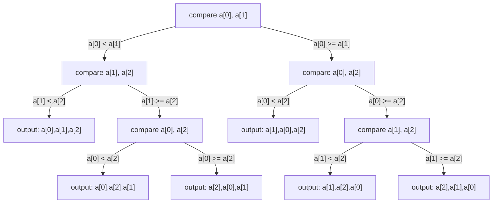

## Learning Objectives

- Model any comparison-based sorting algorithm as a binary decision tree, and explain what each internal node and each leaf represents.
- Explain why a correct comparison sort's decision tree needs at least `n!` leaves, for an input of `n` distinct elements.
- Derive the `Ω(n log n)` worst-case lower bound from the `n!`-leaves fact and the height of a binary tree, using Stirling's approximation.
- Distinguish this lower bound, which applies only to comparison-based sorts, from algorithms (like counting sort) that sort without comparing elements.
- Explain why merge sort's `O(n log n)` upper bound, together with this lower bound, means merge sort is asymptotically optimal among comparison sorts, not merely fast.

## Context & Motivation

Every sorting algorithm covered so far in this curriculum — bubble, selection, insertion, and now merge sort — has been analyzed from one direction only: an upper bound, a proof that the algorithm never does more than some amount of work. Merge sort's `O(n log n)` upper bound, solved in full in the prerequisite concept, raises an obvious next question that no amount of further upper-bound analysis can answer: is `O(n log n)` actually as good as sorting can get, or is there some cleverer comparison-based algorithm still undiscovered that could do better? Answering that question requires a completely different kind of argument — not "here is an algorithm, and here is why it's fast," but "here is why *no* algorithm of a certain kind can possibly be faster, no matter how cleverly designed." This is a **lower bound**, and it is a genuinely different, and generally harder, kind of claim than anything proved about merge sort itself.

The argument this concept develops — the decision-tree argument — is one of the cleanest impossibility proofs in the introductory algorithms canon, covered in essentially identical form in Sedgewick & Wayne's course, MIT's 6.006, and the ACM/IEEE CS2013 curriculum guidelines for algorithms and complexity. It shows that *any* algorithm that sorts purely by comparing pairs of elements — which includes every sort covered in this curriculum so far, and in fact includes the overwhelming majority of general-purpose sorting algorithms used in practice — must do at least `Ω(n log n)` comparisons in the worst case. Combined with merge sort's `O(n log n)` upper bound, this closes the question definitively: merge sort (and any other `O(n log n)` comparison sort) is not merely a good algorithm that happens to run reasonably fast — it is asymptotically *optimal*, in the strict sense that no comparison-based algorithm, however cleverly designed, can do better in the worst case. That distinction — "fast" versus "provably as fast as any algorithm of this kind can possibly be" — is exactly what a lower bound proof, and only a lower bound proof, can establish.

## Core Theory

### Modeling a comparison sort as a decision tree

Any comparison-based sorting algorithm, run on `n` distinct elements, can be modeled as a **binary decision tree**: each **internal node** represents one comparison the algorithm makes between two elements (say, "is `items[i] < items[j]`?"), with its two children representing the two possible outcomes (true or false) and the sequence of further comparisons the algorithm would make next in each case. Each **leaf** represents a point where the algorithm has gathered enough information from its comparisons so far to commit to one specific output ordering — one specific permutation of the original input.



This diagram sketches a decision tree for sorting 3 elements: every root-to-leaf path corresponds to one specific sequence of comparison outcomes the algorithm might observe on some input, and the leaf at the end of that path is the output ordering the algorithm commits to once it has seen exactly those outcomes. Crucially, this is a model of the algorithm's *behavior*, not a data structure the algorithm builds explicitly at run time — the algorithm never constructs this tree itself, but its comparisons and branches trace out one root-to-leaf path through it on every run, and that path is fully determined by the specific input given. The tree above happens to have exactly 6 leaves — one for each of the `3! = 6` possible orderings of 3 distinct elements — which is not a coincidence, and is exactly the fact the rest of this concept builds on.

### Why the tree needs at least `n!` leaves

For a comparison sort to be *correct*, it must produce a different output ordering for every different possible relative ordering of the input elements — if the same leaf were reached for two different underlying permutations of the input, the algorithm would output the identical ordering for both, and at least one of those outputs would necessarily be wrong (since the two different input permutations require two different correct output orderings... more precisely, since the algorithm only sees the results of comparisons, a distinct sequence of comparison outcomes is needed to distinguish every one of the `n!` possible relative orderings the input could have arrived in). There are exactly `n!` distinct permutations of `n` distinct elements — `n!` distinct ways the input could be ordered, each requiring the algorithm to route it to its own distinct leaf. So:

```
number of leaves ≥ n!
```

This is the entire combinatorial core of the argument: a decision tree correctly modeling a comparison sort on `n` elements needs *at least* `n!` leaves, one for every input permutation that needs to be correctly identified and routed to its correctly-sorted output.

### From leaf count to tree height: the depth argument

A binary tree of height `h` has at most `2^h` leaves — each level below the root at most doubles the number of nodes, so `h` levels of doubling starting from 1 root gives at most `2^h` leaves at the bottom. Combined with the `n!`-leaves requirement:

```
2^h ≥ number of leaves ≥ n!
```

Taking `log2` of both sides:

```
h ≥ log2(n!)
```

The height of the decision tree is exactly the worst-case number of comparisons the algorithm makes — the longest root-to-leaf path is the sequence of comparisons on whichever input requires the most comparisons to pin down. So this inequality says directly: **any correct comparison sort makes at least `log2(n!)` comparisons in the worst case.**

### Stirling's approximation: `log2(n!)` is `Θ(n log n)`

`log2(n!)` is not yet in a familiar closed form, but it can be bounded using Stirling's approximation, which states (without deriving it here — this is a standard result from combinatorics, stated rather than proved, exactly as this curriculum's lighter recursion-tree approach to recurrences stated rather than fully proved the Master Theorem):

```
n! ≈ (n/e)^n √(2πn)
```

Taking `log2` of both sides and keeping only the dominant term: `log2(n!) ≈ n·log2(n) - n·log2(e) + O(log n) = Θ(n log n)`. So the lower bound on tree height, `h ≥ log2(n!)`, becomes:

```
h = Ω(n log n)
```

**Any comparison-based sorting algorithm makes at least `Ω(n log n)` comparisons in the worst case.** This is the headline result, and it is a lower bound over an entire *class* of algorithms — every possible way of sorting by comparisons, not just the specific algorithms this curriculum happens to have covered — which is exactly what makes it a genuine impossibility proof rather than an observation about one algorithm.

### Why this doesn't apply to every sorting algorithm

The argument's entire foundation is that the algorithm's only source of information about the input is pairwise comparisons — every branch in the decision tree is a comparison outcome, and nothing else. An algorithm that extracts information from its input in some other way — for instance, counting sort, which uses each element's actual value directly to compute its final position, rather than comparing it against other elements — is not modeled by this decision tree at all, and the `Ω(n log n)` bound simply does not apply to it. Counting sort achieves `O(n + k)` time (where `k` is the range of possible values), which can be asymptotically *faster* than `n log n` when `k` is small — and this is not a contradiction of the lower bound, because counting sort is not a comparison sort in the sense this argument requires.

## Worked Examples

### Example 1 — counting leaves and confirming `n! ≤ 2^h` for `n = 3`

**Problem:** For the decision tree sketched in Core Theory (sorting 3 elements), confirm the leaf count matches `3!` and find its height.

**Leaf count.** The tree has 6 leaves (`L1` through `L6`), one for each output ordering shown. `3! = 3 × 2 × 1 = 6`. Matches exactly — for `n = 3`, this particular tree achieves the minimum possible leaf count, with no leaf wasted on an impossible or duplicated outcome.

**Height.** The longest root-to-leaf path is `R → N1 → N3 → L2` (or `L3`) — 3 edges, so height `h = 3`. Check the inequality: `2^h = 2^3 = 8 ≥ 6 = 3!` — satisfied, with room to spare (this particular tree isn't perfectly balanced, so it doesn't hit the `2^h ≥ n!` bound as tightly as an optimal tree would, but the inequality still holds as required).

**Compare against the bound.** `log2(3!) = log2(6) ≈ 2.585`, so the lower bound guarantees `h ≥ 2.585`, meaning `h ≥ 3` since height must be an integer — and indeed this tree's actual height, 3, matches that rounded-up bound exactly, showing the bound is tight (achievable) even at this small size.

### Example 2 — why `n!` distinct leaves are truly necessary, by explicit contradiction

**Problem:** Suppose a proposed sorting algorithm for `n = 3` elements `[a, b, c]` had a decision tree with only 5 leaves instead of 6. Explain concretely why this algorithm cannot be correct.

**Reasoning.** There are `3! = 6` distinct relative orderings the three input elements could arrive in (all six permutations of `a, b, c` by relative rank). If the decision tree has only 5 leaves, then by the pigeonhole principle, at least two of these six distinct input permutations must route to the *same* leaf — meaning the algorithm would follow an identical sequence of comparison outcomes for both, and therefore commit to the identical output ordering for both. But two distinct permutations of the input require two distinct correctly-sorted outputs (since sorting an already-almost-sorted arrangement differently from a nearly-reverse one must produce different results unless the two inputs happened to be identical, which they are not, by assumption of distinct relative orderings) — so at least one of the two inputs sharing that leaf must be sorted *incorrectly* by this algorithm. A 5-leaf tree for `n = 3` cannot be a correct sorting algorithm's decision tree, concretely confirming why the `n!`-leaves requirement in Core Theory is not merely a convenient lower bound but a strict necessity for correctness.

### Example 3 — applying the bound to confirm merge sort's optimality

**Problem:** Merge sort's recurrence, solved in the prerequisite concept, gives `T(n) = Θ(n log n)`. Use the decision-tree lower bound to state precisely in what sense this makes merge sort "optimal."

**The upper bound.** Merge sort (and its merge step) is comparison-based — every decision it makes about relative order comes from comparing `left[i] <= right[j]`, one pairwise comparison at a time — so it is a valid instance of the class of algorithms this concept's lower bound applies to. Its worst-case running time, `O(n log n)`, was derived in full via recursion tree in the prerequisite concept.

**The lower bound.** This concept establishes that *any* comparison-based sort needs `Ω(n log n)` comparisons in the worst case — a bound that holds for merge sort, for every quadratic sort covered earlier, and for every comparison sort not yet invented.

**Conclusion.** Merge sort's upper bound (`O(n log n)`) and the universal lower bound (`Ω(n log n)`) meet exactly, at the same growth rate. This means merge sort is not simply "a fast algorithm that happens to work well" — it is asymptotically optimal among *all* comparison-based sorting algorithms, in the strict sense that no comparison sort, however cleverly designed, can improve on its worst-case growth rate. This is a fundamentally stronger claim than anything an upper-bound analysis alone, however carefully done, could ever establish on its own.

## Common Misconceptions & Pitfalls

- **"This proves no sorting algorithm can ever beat `O(n log n)`."** The bound applies specifically to *comparison-based* sorts — algorithms whose only access to the input is pairwise comparisons. Counting sort, radix sort, and other algorithms that use elements' actual values directly (not just comparisons between them) are not covered by this argument at all, and some genuinely do beat `Θ(n log n)` under the right conditions (small key range, for instance) — the lower bound is about a *class* of algorithms, not about sorting in general.
- **"The decision tree is something the algorithm actually builds while running."** The tree is a model used to *analyze* the algorithm's worst-case behavior, not a structure any real comparison sort constructs — real algorithms like merge sort make comparisons and branch based on their outcomes exactly as the tree describes, but they never explicitly enumerate the whole tree; the tree exists only in the proof, tracing every possible root-to-leaf path the real algorithm's comparisons could take across every possible input.
- **"`n!` leaves means the tree must have exactly `n!` leaves."** The requirement, from Example 2's pigeonhole argument, is a *lower bound*: correctness requires *at least* `n!` leaves (so that no two distinct permutations are forced to share an output), but a real tree can have more leaves than that minimum — for instance, if some root-to-leaf paths are never actually reachable by any input, or if the algorithm is simply not as efficient as it could be. `n!` is the minimum any correct comparison sort's tree must reach, not an exact count every such tree hits.
- **"Since this is a worst-case bound, it says nothing useful about typical or average performance."** The `Ω(n log n)` bound specifically concerns the *worst* case — the longest root-to-leaf path — and a careful version of the same decision-tree argument (using an averaging argument over all `n!` leaves rather than just the single longest path) in fact shows the *average* number of comparisons is also `Ω(n log n)`, though that fuller argument is left for a more advanced treatment; what's covered here is specifically the worst-case bound, and should not be silently assumed to also be a statement purely about the best case, which can be much better for some comparison sorts (insertion sort runs in `O(n)` on already-sorted input, for instance) without contradicting this worst-case bound at all.

## Summary

Modeling any comparison-based sorting algorithm as a binary decision tree — internal nodes as comparisons, leaves as committed output orderings — turns a question about an entire class of algorithms into a concrete counting argument: correctness requires at least `n!` leaves, one for every distinct permutation of the input that must be routed to its own correct output, since fewer leaves would force two different permutations to share an output by the pigeonhole principle. A binary tree with at least `n!` leaves must have height at least `log2(n!)`, which Stirling's approximation shows is `Θ(n log n)` — establishing that no comparison-based sort can do better than `Ω(n log n)` comparisons in the worst case, for any algorithm of this kind, discovered or not. Combined with merge sort's `O(n log n)` upper bound from the prerequisite concept, this closes the loop definitively: merge sort's growth rate is not just good, it is asymptotically optimal among comparison sorts, and no cleverer comparison-based algorithm could ever improve on it in the worst case — though algorithms that don't rely purely on comparisons, like counting sort, are not bound by this argument at all.

## Documentation Links

- [Sedgewick & Wayne — Algorithms Lectures (Princeton)](https://algs4.cs.princeton.edu/lectures/) — doc
- [ACM/IEEE CS2013 — Algorithms and Complexity Knowledge Area](https://csed.acm.org/cs2013-version/) — doc
