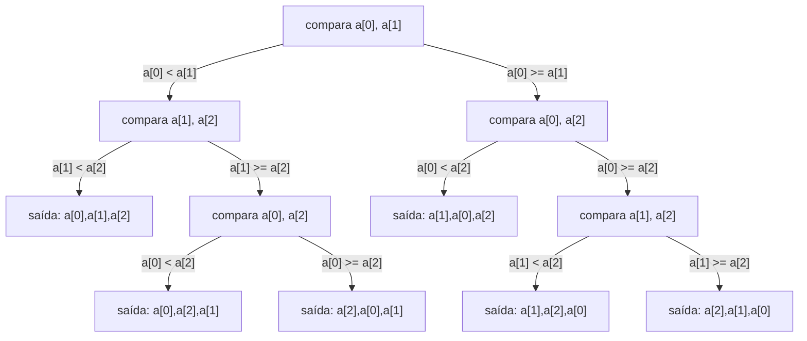

## Objetivos de Aprendizagem

- Modelar qualquer algoritmo de ordenação baseado em comparação como uma árvore de decisão binária, e explicar o que cada nó interno e cada folha representa.
- Explicar por que a árvore de decisão de uma ordenação por comparação correta precisa de pelo menos `n!` folhas, para uma entrada de `n` elementos distintos.
- Derivar o limite inferior de pior caso `Ω(n log n)` a partir do fato de `n!` folhas e da altura de uma árvore binária, usando a aproximação de Stirling.
- Distinguir esse limite inferior, que se aplica apenas a ordenações baseadas em comparação, de algoritmos (como counting sort) que ordenam sem comparar elementos.
- Explicar por que o limite superior `O(n log n)` do merge sort, junto com esse limite inferior, significa que merge sort é assintoticamente ótimo entre ordenações por comparação, não meramente rápido.

## Contexto e Motivação

Todo algoritmo de ordenação coberto até agora neste currículo, bubble, selection, insertion, e agora merge sort, foi analisado a partir de uma única direção: um limite superior, uma prova de que o algoritmo nunca faz mais que uma certa quantidade de trabalho. O limite superior `O(n log n)` do merge sort, resolvido por completo no conceito pré-requisito, levanta uma pergunta óbvia seguinte que nenhuma quantidade de análise adicional de limite superior pode responder: `O(n log n)` é de fato o melhor que ordenação pode alcançar, ou existe algum algoritmo baseado em comparação mais esperto ainda não descoberto que poderia fazer melhor? Responder essa pergunta exige um tipo completamente diferente de argumento, não "aqui está um algoritmo, e aqui está por que é rápido", mas "aqui está por que *nenhum* algoritmo de um certo tipo pode possivelmente ser mais rápido, não importa quão esperto seja o design". Isso é um **limite inferior**, e é um tipo de afirmação genuinamente diferente, e geralmente mais difícil, do que qualquer coisa provada sobre o próprio merge sort.

O argumento que este conceito desenvolve, o argumento da árvore de decisão, é uma das provas de impossibilidade mais limpas no cânone introdutório de algoritmos, coberto em forma essencialmente idêntica no curso de Sedgewick & Wayne, no 6.006 do MIT, e nas diretrizes curriculares do ACM/IEEE CS2013 para algoritmos e complexidade. Ele mostra que *qualquer* algoritmo que ordena puramente comparando pares de elementos, o que inclui toda ordenação coberta neste currículo até agora, e de fato inclui a esmagadora maioria dos algoritmos de ordenação de propósito geral usados na prática, deve fazer pelo menos `Ω(n log n)` comparações no pior caso. Combinado com o limite superior `O(n log n)` do merge sort, isso fecha a pergunta definitivamente: merge sort (e qualquer outra ordenação por comparação `O(n log n)`) não é meramente um bom algoritmo que acontece de rodar razoavelmente rápido, é assintoticamente *ótimo*, no sentido estrito de que nenhum algoritmo baseado em comparação, por mais esperto que seja o design, pode fazer melhor no pior caso. Essa distinção, "rápido" versus "provavelmente tão rápido quanto qualquer algoritmo desse tipo pode possivelmente ser", é exatamente o que uma prova de limite inferior, e só uma prova de limite inferior, pode estabelecer.

## Teoria Central

### Modelando uma ordenação por comparação como uma árvore de decisão

Qualquer algoritmo de ordenação baseado em comparação, rodando sobre `n` elementos distintos, pode ser modelado como uma **árvore de decisão binária**: cada **nó interno** representa uma comparação que o algoritmo faz entre dois elementos (digamos, "`items[i] < items[j]`?"), com seus dois filhos representando os dois resultados possíveis (verdadeiro ou falso) e a sequência de comparações adicionais que o algoritmo faria em seguida em cada caso. Cada **folha** representa um ponto onde o algoritmo reuniu informação suficiente de suas comparações até então para se comprometer com uma ordenação de saída específica, uma permutação específica da entrada original.



Este diagrama esboça uma árvore de decisão para ordenar 3 elementos: todo caminho raiz-para-folha corresponde a uma sequência específica de resultados de comparação que o algoritmo poderia observar em alguma entrada, e a folha no fim desse caminho é a ordenação de saída à qual o algoritmo se compromete uma vez que viu exatamente aqueles resultados. Crucialmente, isso é um modelo do *comportamento* do algoritmo, não uma estrutura de dados que o algoritmo constrói explicitamente em tempo de execução, o algoritmo nunca constrói essa árvore ele mesmo, mas suas comparações e ramificações traçam um caminho raiz-para-folha através dela em toda execução, e esse caminho é totalmente determinado pela entrada específica dada. A árvore acima tem exatamente 6 folhas, uma para cada uma das `3! = 6` ordenações possíveis de 3 elementos distintos, o que não é coincidência, e é exatamente o fato sobre o qual o resto deste conceito se constrói.

### Por que a árvore precisa de pelo menos `n!` folhas

Para uma ordenação por comparação ser *correta*, ela deve produzir uma ordenação de saída diferente para toda diferente ordenação relativa possível dos elementos de entrada, se a mesma folha fosse alcançada para duas permutações subjacentes diferentes da entrada, o algoritmo produziria a ordenação idêntica para ambas, e pelo menos uma dessas saídas seria necessariamente errada (já que as duas permutações de entrada diferentes exigem duas ordenações de saída corretas diferentes... mais precisamente, já que o algoritmo só vê os resultados das comparações, uma sequência distinta de resultados de comparação é necessária para distinguir cada uma das `n!` ordenações relativas possíveis com as quais a entrada poderia ter chegado). Existem exatamente `n!` permutações distintas de `n` elementos distintos, `n!` formas distintas em que a entrada poderia estar ordenada, cada uma exigindo que o algoritmo a encaminhe para sua própria folha distinta. Então:

```
número de folhas ≥ n!
```

Este é o núcleo combinatório inteiro do argumento: uma árvore de decisão modelando corretamente uma ordenação por comparação sobre `n` elementos precisa de *pelo menos* `n!` folhas, uma para toda permutação de entrada que precisa ser corretamente identificada e encaminhada para sua saída corretamente ordenada.

### Da contagem de folhas para a altura da árvore: o argumento de profundidade

Uma árvore binária de altura `h` tem no máximo `2^h` folhas, cada nível abaixo da raiz no máximo dobra o número de nós, então `h` níveis de duplicação começando de 1 raiz dá no máximo `2^h` folhas no fundo. Combinado com o requisito de `n!` folhas:

```
2^h ≥ número de folhas ≥ n!
```

Tomando `log2` de ambos os lados:

```
h ≥ log2(n!)
```

A altura da árvore de decisão é exatamente o número de pior caso de comparações que o algoritmo faz, o caminho raiz-para-folha mais longo é a sequência de comparações sobre qualquer entrada que exija mais comparações para determinar. Então essa desigualdade diz diretamente: **qualquer ordenação por comparação correta faz pelo menos `log2(n!)` comparações no pior caso.**

### A aproximação de Stirling: `log2(n!)` é `Θ(n log n)`

`log2(n!)` ainda não está em uma forma fechada familiar, mas pode ser limitada usando a aproximação de Stirling, que afirma (sem derivá-la aqui, esse é um resultado padrão de combinatória, enunciado em vez de provado, exatamente como a abordagem mais leve de árvore de recursão deste currículo para recorrências enunciou em vez de provar completamente o Teorema Mestre):

```
n! ≈ (n/e)^n √(2πn)
```

Tomando `log2` de ambos os lados e mantendo só o termo dominante: `log2(n!) ≈ n·log2(n) - n·log2(e) + O(log n) = Θ(n log n)`. Então o limite inferior na altura da árvore, `h ≥ log2(n!)`, se torna:

```
h = Ω(n log n)
```

**Qualquer algoritmo de ordenação baseado em comparação faz pelo menos `Ω(n log n)` comparações no pior caso.** Este é o resultado principal, e é um limite inferior sobre uma *classe* inteira de algoritmos, toda forma possível de ordenar por comparações, não só os algoritmos específicos que este currículo cobriu, o que é exatamente o que o torna uma prova de impossibilidade genuína em vez de uma observação sobre um algoritmo.

### Por que isso não se aplica a todo algoritmo de ordenação

A fundação inteira do argumento é que a única fonte de informação do algoritmo sobre a entrada são comparações par-a-par, todo ramo na árvore de decisão é um resultado de comparação, e nada mais. Um algoritmo que extrai informação de sua entrada de alguma outra forma, por exemplo, counting sort, que usa o valor real de cada elemento diretamente para calcular sua posição final, em vez de compará-lo contra outros elementos, não é modelado por essa árvore de decisão de forma alguma, e o limite `Ω(n log n)` simplesmente não se aplica a ele. Counting sort alcança tempo `O(n + k)` (onde `k` é o intervalo de valores possíveis), que pode ser assintoticamente *mais rápido* que `n log n` quando `k` é pequeno, e isso não é uma contradição do limite inferior, porque counting sort não é uma ordenação por comparação no sentido que este argumento exige.

## Exemplos Resolvidos

### Exemplo 1 — contando folhas e confirmando `n! ≤ 2^h` para `n = 3`

**Problema:** Para a árvore de decisão esboçada na Teoria Central (ordenando 3 elementos), confirme que a contagem de folhas combina com `3!` e encontre sua altura.

**Contagem de folhas.** A árvore tem 6 folhas (`L1` até `L6`), uma para cada ordenação de saída mostrada. `3! = 3 × 2 × 1 = 6`. Combina exatamente, para `n = 3`, essa árvore específica alcança a contagem mínima possível de folhas, sem nenhuma folha desperdiçada em um resultado impossível ou duplicado.

**Altura.** O caminho raiz-para-folha mais longo é `R → N1 → N3 → L2` (ou `L3`), 3 arestas, então altura `h = 3`. Verifique a desigualdade: `2^h = 2^3 = 8 ≥ 6 = 3!`, satisfeita, com folga (essa árvore específica não é perfeitamente balanceada, então não atinge o limite `2^h ≥ n!` tão justamente quanto uma árvore ótima faria, mas a desigualdade ainda vale como exigido).

**Compare contra o limite.** `log2(3!) = log2(6) ≈ 2.585`, então o limite inferior garante `h ≥ 2.585`, significando `h ≥ 3` já que altura deve ser um inteiro, e de fato a altura real dessa árvore, 3, combina exatamente com esse limite arredondado para cima, mostrando que o limite é justo (alcançável) mesmo nesse tamanho pequeno.

### Exemplo 2 — por que `n!` folhas distintas são verdadeiramente necessárias, por contradição explícita

**Problema:** Suponha que um algoritmo de ordenação proposto para `n = 3` elementos `[a, b, c]` tivesse uma árvore de decisão com apenas 5 folhas em vez de 6. Explique concretamente por que este algoritmo não pode ser correto.

**Raciocínio.** Existem `3! = 6` ordenações relativas distintas com as quais os três elementos de entrada poderiam chegar (todas as seis permutações de `a, b, c` por rank relativo). Se a árvore de decisão tem apenas 5 folhas, então pelo princípio da casa dos pombos, pelo menos duas dessas seis permutações de entrada distintas devem ser encaminhadas para a *mesma* folha, significando que o algoritmo seguiria uma sequência idêntica de resultados de comparação para ambas, e portanto se comprometeria com a ordenação de saída idêntica para ambas. Mas duas permutações distintas da entrada exigem duas saídas corretamente ordenadas distintas (já que ordenar um arranjo já quase ordenado de forma diferente de um quase reverso deve produzir resultados diferentes a menos que as duas entradas por acaso fossem idênticas, o que não são, pela suposição de ordenações relativas distintas), então pelo menos uma das duas entradas compartilhando aquela folha deve ser ordenada *incorretamente* por esse algoritmo. Uma árvore de 5 folhas para `n = 3` não pode ser a árvore de decisão de um algoritmo de ordenação correto, confirmando concretamente por que o requisito de `n!` folhas na Teoria Central não é meramente um limite inferior conveniente mas uma necessidade estrita para correção.

### Exemplo 3 — aplicando o limite para confirmar a otimalidade do merge sort

**Problema:** A recorrência do merge sort, resolvida no conceito pré-requisito, dá `T(n) = Θ(n log n)`. Use o limite inferior da árvore de decisão para afirmar precisamente em que sentido isso torna merge sort "ótimo".

**O limite superior.** Merge sort (e seu passo de merge) é baseado em comparação, toda decisão que faz sobre ordem relativa vem de comparar `left[i] <= right[j]`, uma comparação par-a-par por vez, então é uma instância válida da classe de algoritmos à qual o limite inferior deste conceito se aplica. Seu tempo de execução de pior caso, `O(n log n)`, foi derivado por completo via árvore de recursão no conceito pré-requisito.

**O limite inferior.** Este conceito estabelece que *qualquer* ordenação baseada em comparação precisa de `Ω(n log n)` comparações no pior caso, um limite que vale para merge sort, para toda ordenação quadrática coberta anteriormente, e para toda ordenação por comparação ainda não inventada.

**Conclusão.** O limite superior do merge sort (`O(n log n)`) e o limite inferior universal (`Ω(n log n)`) se encontram exatamente, na mesma taxa de crescimento. Isso significa que merge sort não é simplesmente "um algoritmo rápido que acontece de funcionar bem", é assintoticamente ótimo entre *todos* os algoritmos de ordenação baseados em comparação, no sentido estrito de que nenhuma ordenação por comparação, por mais esperto que seja o design, pode melhorar sua taxa de crescimento no pior caso. Essa é uma afirmação fundamentalmente mais forte do que qualquer coisa que uma análise de limite superior sozinha, por mais cuidadosa que fosse, poderia jamais estabelecer por si só.

## Equívocos Comuns e Armadilhas

- **"Isso prova que nenhum algoritmo de ordenação pode jamais vencer `O(n log n)`."** O limite se aplica especificamente a ordenações *baseadas em comparação*, algoritmos cujo único acesso à entrada são comparações par-a-par. Counting sort, radix sort, e outros algoritmos que usam os valores reais dos elementos diretamente (não só comparações entre eles) não são cobertos por este argumento de forma alguma, e alguns genuinamente vencem `Θ(n log n)` sob as condições certas (intervalo de chave pequeno, por exemplo), o limite inferior é sobre uma *classe* de algoritmos, não sobre ordenação em geral.
- **"A árvore de decisão é algo que o algoritmo de fato constrói enquanto roda."** A árvore é um modelo usado para *analisar* o comportamento de pior caso do algoritmo, não uma estrutura que qualquer ordenação por comparação real constrói, algoritmos reais como merge sort fazem comparações e ramificam baseado em seus resultados exatamente como a árvore descreve, mas nunca enumeram explicitamente a árvore inteira; a árvore existe apenas na prova, traçando todo caminho raiz-para-folha possível que as comparações do algoritmo real poderiam tomar através de toda entrada possível.
- **"`n!` folhas significa que a árvore deve ter exatamente `n!` folhas."** O requisito, do argumento da casa dos pombos do Exemplo 2, é um *limite inferior*: correção exige *pelo menos* `n!` folhas (para que nenhuma duas permutações distintas sejam forçadas a compartilhar uma saída), mas uma árvore real pode ter mais folhas que esse mínimo, por exemplo, se alguns caminhos raiz-para-folha nunca são de fato alcançáveis por nenhuma entrada, ou se o algoritmo simplesmente não é tão eficiente quanto poderia ser. `n!` é o mínimo que a árvore de qualquer ordenação por comparação correta deve alcançar, não uma contagem exata que toda árvore assim atinge.
- **"Já que isso é um limite de pior caso, não diz nada útil sobre desempenho típico ou médio."** O limite `Ω(n log n)` diz respeito especificamente ao *pior* caso, o caminho raiz-para-folha mais longo, e uma versão cuidadosa do mesmo argumento de árvore de decisão (usando um argumento de média sobre todas as `n!` folhas em vez de apenas o único caminho mais longo) de fato mostra que o número *médio* de comparações também é `Ω(n log n)`, embora esse argumento mais completo seja deixado para um tratamento mais avançado; o que é coberto aqui é especificamente o limite de pior caso, e não deve ser silenciosamente assumido como também sendo uma afirmação puramente sobre o melhor caso, que pode ser muito melhor para algumas ordenações por comparação (insertion sort roda em `O(n)` em entrada já ordenada, por exemplo) sem contradizer esse limite de pior caso de forma alguma.

## Resumo

Modelar qualquer algoritmo de ordenação baseado em comparação como uma árvore de decisão binária, nós internos como comparações, folhas como ordenações de saída comprometidas, transforma uma pergunta sobre uma classe inteira de algoritmos em um argumento concreto de contagem: correção exige pelo menos `n!` folhas, uma para toda permutação distinta da entrada que deve ser encaminhada para sua própria saída correta, já que menos folhas forçariam duas permutações diferentes a compartilhar uma saída pelo princípio da casa dos pombos. Uma árvore binária com pelo menos `n!` folhas deve ter altura pelo menos `log2(n!)`, que a aproximação de Stirling mostra ser `Θ(n log n)`, estabelecendo que nenhuma ordenação baseada em comparação pode fazer melhor que `Ω(n log n)` comparações no pior caso, para qualquer algoritmo desse tipo, descoberto ou não. Combinado com o limite superior `O(n log n)` do merge sort do conceito pré-requisito, isso fecha o ciclo definitivamente: a taxa de crescimento do merge sort não é apenas boa, é assintoticamente ótima entre ordenações por comparação, e nenhum algoritmo baseado em comparação mais esperto poderia jamais melhorá-la no pior caso, embora algoritmos que não dependem puramente de comparações, como counting sort, não sejam limitados por este argumento de forma alguma.

## Documentation Links

- [Sedgewick & Wayne — Algorithms Lectures (Princeton)](https://algs4.cs.princeton.edu/lectures/) — doc
- [ACM/IEEE CS2013 — Algorithms and Complexity Knowledge Area](https://csed.acm.org/cs2013-version/) — doc
