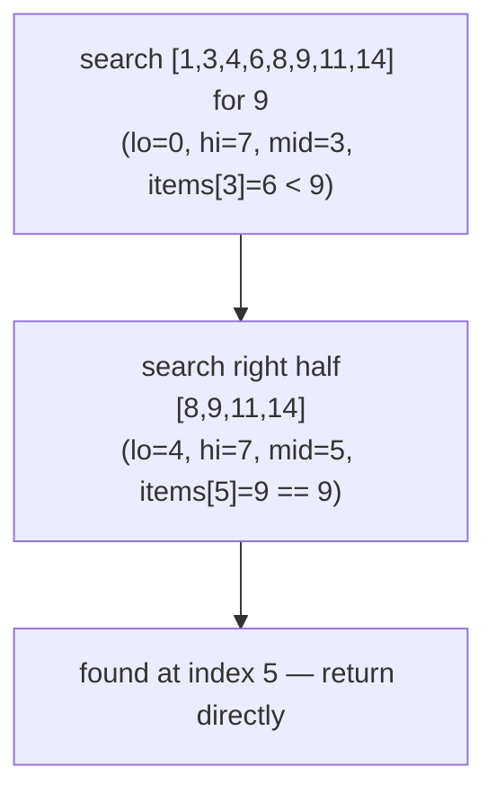
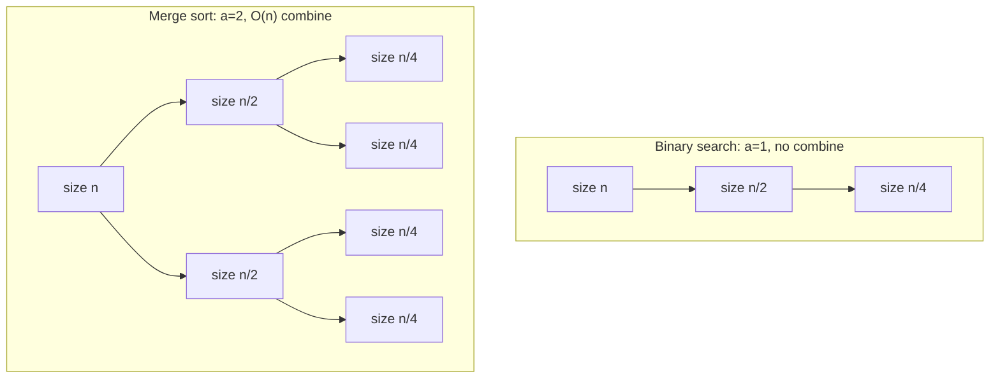

## Learning Objectives

- Describe the three-step shape of divide-and-conquer — divide, conquer, combine — and identify each step in a given algorithm.
- Distinguish divide-and-conquer, as a deliberate algorithm-design strategy, from recursion in general, and explain how the former is a disciplined special case of the latter.
- Trace binary search as a first, minimal instance of the pattern, and explain why it has essentially no "combine" step.
- Recognize the two-subproblem, real-combine-work shape that fuller divide-and-conquer algorithms exhibit, in preparation for merge sort.
- Predict, for a candidate problem, whether it looks divide-and-conquer shaped, by checking for a natural way to split it into smaller independent instances of itself.

## Context & Motivation

Recursion, as a technique, only requires two ingredients: a base case simple enough to answer directly, and a recursive case that hands off a strictly smaller version of the same problem, trusting the smaller call to come back with a correct answer. Nothing in that definition says anything about *how* the problem should be made smaller, or about what should happen to the smaller answer once it comes back. A function that recurses on `n - 1` and a function that recurses on `n / 2` are both, technically, recursive — but they behave very differently, and the difference matters enormously once problem sizes grow large. Divide-and-conquer is what happens when that "how smaller, and what then" question is answered in a specific, deliberate way: split the problem into pieces that are each a fraction of the original size (not just one unit smaller), solve each piece by recursing, and then do some explicit work to stitch the pieces' answers back into an answer for the whole. It is recursion, studied not as a way to write a function, but as a strategy for designing an *algorithm* — one whose running time can be analyzed on its own terms, using the shape of the split.

This distinction is exactly why divide-and-conquer earns its own name and its own body of theory in the algorithms literature that MIT's 6.006 and Sedgewick & Wayne's course both organize around: recursion answers "can this function call itself correctly?", while divide-and-conquer answers "how fast does this whole algorithm run, given how it splits its input?" The second question has a real, general answer — it is exactly what the next concept, solving recurrences, is built to compute — but only once an algorithm actually has the divide-and-conquer shape: a genuine reduction in problem size at every recursive call, worked out from *how much* smaller each subproblem is and *how many* subproblems there are, plus whatever non-recursive work is spent dividing and combining.

The canonical divide-and-conquer template has three named steps, and naming them precisely is what makes the strategy teachable and reusable across completely different problems:

1. **Divide** the problem instance into one or more smaller instances of the *same* problem.
2. **Conquer** each smaller instance, recursively, until reaching a base case simple enough to solve directly.
3. **Combine** the subproblems' solutions into a solution for the original, undivided problem.

Binary search, covered here first, is a deliberately minimal illustration: it divides, and it conquers, but its "combine" step is close to nothing at all — a single subproblem is chosen, and its answer *is* the final answer, no stitching required. The next concept in this sequence, merge sort, is the fuller pattern: two subproblems recursed into independently, and a real, linear-time combine step (the merge) needed to produce the final sorted result from the two sorted halves. Seeing the minimal case first makes the general template's three steps concrete before the harder case adds real combining work on top.

## Core Theory

### The three-step template, precisely

A divide-and-conquer algorithm, applied to a problem instance of size `n`, does the following:

- **Divide**: split the instance into `a` subproblems (`a ≥ 1`), each of size roughly `n / b` for some `b ≥ 1` (subproblems need not literally be equal-sized, but the canonical shape assumes they are, or nearly so).
- **Conquer**: solve each of the `a` subproblems by applying the *same* algorithm recursively, until a subproblem is small enough (typically size 1, or some small constant) to be answered directly — the base case.
- **Combine**: merge the `a` solved subproblems' answers into an answer for the original instance, doing some amount of extra, non-recursive work to do so.

This is exactly the recursive shape from the prerequisite recursion concept — a base case, and a recursive case that hands off smaller instances of the same problem — with two extra commitments layered on top: the smaller instances are a genuine *fraction* of the original size (not merely one unit smaller, as in `factorial(n - 1)`), and there is a named, explicit combine step whose own cost has to be accounted for separately from the recursive calls. Both commitments matter for analysis: fractional shrinkage is what produces the logarithmic number of "levels" that solving recurrences will exploit, and an explicit combine cost is exactly the extra term (often written `O(n)`, or more generally `f(n)`) that gets added to the recursive calls' cost in a divide-and-conquer recurrence.

### Binary search as a first instance: `a = 1`, minimal combine

Binary search, applied to a sorted array, is divide-and-conquer with the simplest possible values for each step:

```python
def binary_search(items, target, lo=0, hi=None):
    if hi is None:
        hi = len(items) - 1
    if lo > hi:                       # base case — search space is empty
        return -1
    mid = (lo + hi) // 2
    if items[mid] == target:          # base case — found it
        return mid
    elif items[mid] < target:
        return binary_search(items, target, mid + 1, hi)   # divide: keep only the right half
    else:
        return binary_search(items, target, lo, mid - 1)   # divide: keep only the left half

binary_search([1, 3, 4, 6, 8, 9, 11, 14], 9)   # 5
```

- **Divide**: compare `target` against the middle element, and use that single comparison to discard *half* the remaining search space — the array conceptually splits into a left half and a right half, but only one of them is kept.
- **Conquer**: recurse into exactly one of the two halves — `a = 1` subproblem, of size roughly `n / 2`.
- **Combine**: nothing to do. Whatever answer the one recursive call returns *is* the final answer — there is no second subproblem's result to merge it with.

This is why binary search is a useful first example precisely because it is *almost too simple* to look like the general template: with only one subproblem and no combining, it can be mistaken for "just recursion." What makes it a genuine instance of divide-and-conquer, rather than an arbitrary recursive function, is that each call operates on a problem instance that is a fraction (`~1/2`) of the previous one's size — the defining commitment of the strategy — even though the "combine" step happens to be trivial here.



### Why two subproblems and real combining change everything

Binary search's `a = 1`, no-combine shape gives a recurrence of roughly `T(n) = T(n/2) + O(1)` — one recursive call, plus constant work per level. Merge sort's shape, previewed here and solved in full in the next two concepts, is `a = 2`: two subproblems, each of size `n/2`, *and* an explicit merge step that costs `O(n)` — proportional to the combined size of the two halves being merged, because every element has to be looked at once during the merge. That single difference — one subproblem with free combining, versus two subproblems with linear-cost combining — is exactly what separates an `O(log n)` algorithm from an `O(n log n)` one, and working out *why* precisely that difference produces those two different growth rates is the entire content of solving recurrences, the next concept in this sequence.



### Recognizing candidate divide-and-conquer problems

A problem is a plausible candidate for this strategy when it has a natural way to be split into smaller, independent instances of *itself* — not merely a smaller version of some auxiliary quantity (as in `factorial(n - 1)`, which shrinks `n` by one but isn't "splitting" anything), and not a split into pieces that depend on each other in a way that prevents solving them independently. Sorting an array splits cleanly into sorting two halves independently, because a sorted left half and a sorted right half can always be merged regardless of what values either one contains. Searching a sorted array splits cleanly into searching one half, because the sortedness guarantees the target cannot be in the discarded half. Many problems do *not* split this cleanly — computing a running total that depends on every prior element in order, for instance, has no independent subproblems to hand off in parallel — and recognizing that absence is just as important as recognizing when the pattern does apply.

## Worked Examples

### Example 1 — identifying divide, conquer, and combine in binary search

**Problem:** For the call `binary_search([2, 5, 7, 8, 11, 12, 16, 19], 12)`, trace the divide-and-conquer steps explicitly.

**Divide.** `lo=0, hi=7`, so `mid=3`, `items[3]=8`. Since `8 < 12`, the target must be in the right half if it's present at all — the array conceptually splits into `[2,5,7,8]` (discarded) and `[11,12,16,19]` (kept).

**Conquer.** Recurse with `lo=4, hi=7`. Now `mid=5`, `items[5]=12`, which equals the target — base case reached, return index `5` directly.

**Combine.** There is nothing to combine: the single recursive call's answer (`5`) is passed straight back up as the final answer, unchanged. This confirms the `a=1`, trivial-combine shape described in Core Theory.

### Example 2 — a problem that looks recursive but is not divide-and-conquer

**Problem:** Consider computing the sum of an array via `array_sum(items) = items[0] + array_sum(items[1:])`, with `array_sum([]) = 0`. Is this divide-and-conquer?

**Check the divide step.** Each call shrinks the array by exactly one element (`items[1:]` has length `n - 1`, not `n/2`) — this is the same "one smaller" shape as `factorial(n - 1)`, not a fractional split. There is only ever one subproblem, and it is smaller by a constant amount, not a constant *factor*.

**Conclusion.** This is straightforward recursion, not divide-and-conquer — it fits the base-case/recursive-case template from the prerequisite recursion concept, but not the extra commitment (fractional shrinkage) that divide-and-conquer requires. Its running time is `O(n)`, linear in the number of one-at-a-time reductions, with none of the logarithmic-levels structure that fractional splitting produces. Contrasting this against binary search makes the distinguishing feature concrete: the *rate* at which the problem shrinks, not merely that it shrinks.

### Example 3 — sketching a two-subproblem, real-combine candidate

**Problem:** Given an array of numbers, find both its maximum and its minimum value. Sketch a divide-and-conquer approach and identify its three steps.

**Divide.** Split the array into a left half and a right half, each of size roughly `n/2`.

**Conquer.** Recursively find the (max, min) pair for the left half, and independently the (max, min) pair for the right half — two subproblems, `a = 2`, each of size `n/2`.

**Combine.** The overall maximum is the larger of the two halves' maxima; the overall minimum is the smaller of the two halves' minima — a constant amount of work (two comparisons) regardless of `n`, since only the four already-computed extreme values need to be compared, not the whole array again.

This example sits between binary search and merge sort in shape: like merge sort, it has two genuine subproblems (`a = 2`); unlike merge sort, its combine step costs only `O(1)`, not `O(n)`, because combining two (max, min) pairs needs no per-element work at all. Recognizing this middle case reinforces that "how many subproblems" and "how expensive is combining" are two independent knobs the algorithm designer controls, and different combinations of them produce genuinely different running times once solved.

## Common Misconceptions & Pitfalls

- **"Any recursive function is divide-and-conquer."** As Example 2 shows, a function that reduces its input by a constant amount per call (like `array_sum` or `factorial`) is recursive but not divide-and-conquer — the defining commitment is a *fractional* reduction in size (`n/2`, `n/3`, …), which is what produces a logarithmic number of levels rather than a linear one. All divide-and-conquer algorithms are recursive; not all recursive algorithms are divide-and-conquer.
- **"The combine step is always expensive, or always free."** Example 3's max/min problem shows a genuine two-subproblem split with an `O(1)` combine step, while merge sort (next concept) needs an `O(n)` combine step for the same two-subproblem shape. The cost of combining depends entirely on the specific problem, not on the number of subproblems being combined.
- **"Binary search doesn't really count as divide-and-conquer because it only makes one recursive call."** The template does not require more than one subproblem — `a = 1` is a valid, if minimal, instance. What makes binary search divide-and-conquer is the fractional shrinkage of the search space at each step, not the number of recursive calls made.
- **"Divide-and-conquer always means splitting into exactly two equal halves."** The general template allows `a` subproblems of size roughly `n/b` for any `a, b ≥ 1` — two equal halves is the most common shape in the algorithms this curriculum covers next (merge sort), but three-way splits, unequal splits, and other configurations are equally valid instances of the same three-step pattern.

## Summary

Divide-and-conquer names a specific, disciplined way of using recursion as an algorithm-design strategy: divide a problem into smaller instances of itself, conquer each recursively, and combine their solutions into an answer for the whole. What distinguishes it from recursion in general is that the division is fractional — subproblems of size roughly `n/b`, not merely `n` reduced by a constant — which is exactly what produces a logarithmic number of recursive "levels" rather than a linear one. Binary search illustrates the minimal case: one subproblem (`a = 1`) and an essentially free combine step, since the single recursive call's answer is the final answer. Fuller instances, previewed here and worked out in the concepts that follow, involve multiple subproblems and real combining work — merge sort's two subproblems and linear-time merge being the canonical example, whose recurrence and running time the next two concepts derive in full.

## Documentation Links

- [MIT 6.006 — Syllabus (OCW)](https://ocw.mit.edu/courses/6-006-introduction-to-algorithms-spring-2020/pages/syllabus/) — doc
- [Sedgewick & Wayne — Algorithms Lectures (Princeton)](https://algs4.cs.princeton.edu/lectures/) — doc
