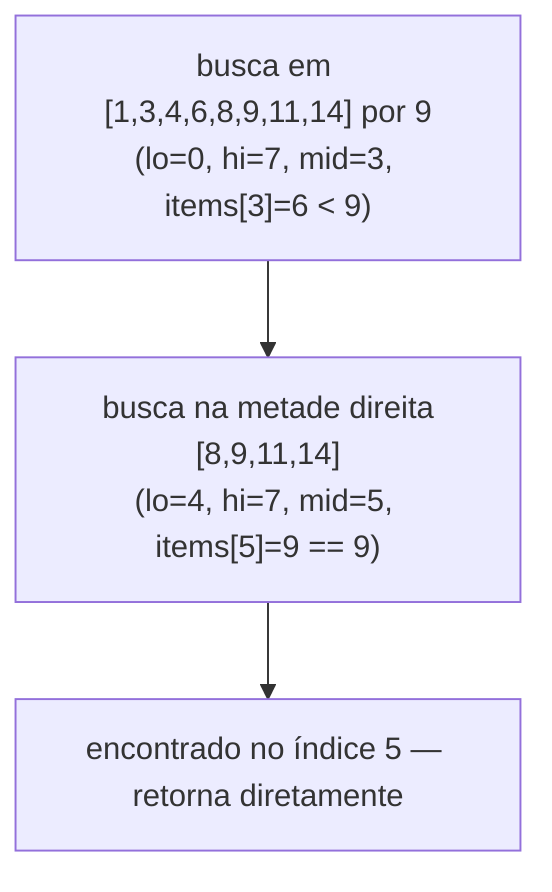
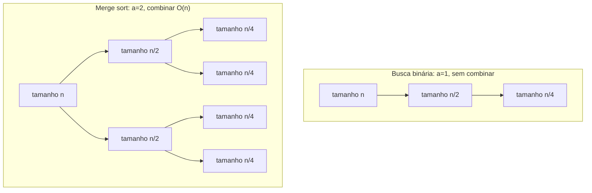

## Objetivos de Aprendizagem

- Descrever o formato de três passos de dividir para conquistar, dividir, conquistar, combinar, e identificar cada passo em um algoritmo dado.
- Distinguir dividir para conquistar, como uma estratégia deliberada de design de algoritmo, de recursão em geral, e explicar como a primeira é um caso especial disciplinado da segunda.
- Rastrear busca binária como uma primeira instância mínima do padrão, e explicar por que ela essencialmente não tem passo de "combinar".
- Reconhecer o formato de dois subproblemas com trabalho real de combinação que algoritmos mais completos de dividir para conquistar exibem, em preparação para merge sort.
- Prever, para um problema candidato, se ele parece ter o formato de dividir para conquistar, verificando se há uma forma natural de dividi-lo em instâncias menores e independentes de si mesmo.

## Contexto e Motivação

Recursão, como técnica, exige apenas dois ingredientes: um caso base simples o suficiente para responder diretamente, e um caso recursivo que repassa uma versão estritamente menor do mesmo problema, confiando que a chamada menor volte com uma resposta correta. Nada nessa definição diz algo sobre *como* o problema deve ser diminuído, ou sobre o que deve acontecer com a resposta menor quando ela voltar. Uma função que recursa em `n - 1` e uma função que recursa em `n / 2` são ambas, tecnicamente, recursivas, mas se comportam de formas muito diferentes, e a diferença importa enormemente conforme os tamanhos de problema crescem. Dividir para conquistar é o que acontece quando essa pergunta de "quanto menor, e o que fazer depois" é respondida de uma forma específica e deliberada: divida o problema em pedaços que sejam cada um uma fração do tamanho original (não apenas uma unidade menor), resolva cada pedaço recursando, e depois faça algum trabalho explícito para costurar as respostas dos pedaços de volta em uma resposta para o todo. É recursão, estudada não como uma forma de escrever uma função, mas como uma estratégia para projetar um *algoritmo*, uma cujo tempo de execução pode ser analisado em seus próprios termos, usando o formato da divisão.

Essa distinção é exatamente por que dividir para conquistar ganha seu próprio nome e seu próprio corpo de teoria na literatura de algoritmos em torno da qual tanto o 6.006 do MIT quanto o curso de Sedgewick & Wayne se organizam: recursão responde "essa função pode chamar a si mesma corretamente?", enquanto dividir para conquistar responde "quão rápido este algoritmo inteiro roda, dado como ele divide sua entrada?" A segunda pergunta tem uma resposta real e geral, é exatamente o que o próximo conceito, resolvendo recorrências, é construído para calcular, mas só uma vez que um algoritmo de fato tem o formato de dividir para conquistar: uma redução genuína no tamanho do problema em toda chamada recursiva, calculada a partir de *quanto* menor cada subproblema é e *quantos* subproblemas existem, mais qualquer trabalho não recursivo gasto dividindo e combinando.

O modelo canônico de dividir para conquistar tem três passos nomeados, e nomeá-los precisamente é o que torna a estratégia ensinável e reutilizável através de problemas completamente diferentes:

1. **Dividir** a instância do problema em uma ou mais instâncias menores do *mesmo* problema.
2. **Conquistar** cada instância menor, recursivamente, até alcançar um caso base simples o suficiente para resolver diretamente.
3. **Combinar** as soluções dos subproblemas em uma solução para o problema original, não dividido.

Busca binária, coberta aqui primeiro, é uma ilustração deliberadamente mínima: ela divide, e ela conquista, mas seu passo de "combinar" é próximo de nada: um único subproblema é escolhido, e sua resposta *é* a resposta final, nenhuma costura necessária. O próximo conceito nesta sequência, merge sort, é o padrão mais completo: dois subproblemas recursados independentemente, e um passo de combinação real, de tempo linear (o merge) necessário para produzir o resultado ordenado final a partir das duas metades ordenadas. Ver o caso mínimo primeiro torna os três passos do modelo geral concretos antes que o caso mais difícil adicione trabalho real de combinação por cima.

## Teoria Central

### O modelo de três passos, precisamente

Um algoritmo de dividir para conquistar, aplicado a uma instância de problema de tamanho `n`, faz o seguinte:

- **Dividir**: divide a instância em `a` subproblemas (`a ≥ 1`), cada um de tamanho aproximadamente `n / b` para algum `b ≥ 1` (subproblemas não precisam ser literalmente de mesmo tamanho, mas o formato canônico assume que são, ou quase).
- **Conquistar**: resolve cada um dos `a` subproblemas aplicando o *mesmo* algoritmo recursivamente, até que um subproblema seja pequeno o suficiente (tipicamente tamanho 1, ou alguma constante pequena) para ser respondido diretamente, o caso base.
- **Combinar**: mescla as respostas dos `a` subproblemas resolvidos em uma resposta para a instância original, fazendo alguma quantidade de trabalho extra, não recursivo, para isso.

Este é exatamente o formato recursivo do conceito de recursão pré-requisito, um caso base, e um caso recursivo que repassa instâncias menores do mesmo problema, com dois compromissos extras adicionados por cima: as instâncias menores são uma *fração* genuína do tamanho original (não meramente uma unidade menor, como em `factorial(n - 1)`), e há um passo de combinação nomeado e explícito cujo próprio custo tem que ser contabilizado separadamente das chamadas recursivas. Ambos os compromissos importam para a análise: encolhimento fracionário é o que produz o número logarítmico de "níveis" que resolver recorrências vai explorar, e um custo de combinação explícito é exatamente o termo extra (frequentemente escrito `O(n)`, ou mais geralmente `f(n)`) que é adicionado ao custo das chamadas recursivas em uma recorrência de dividir para conquistar.

### Busca binária como uma primeira instância: `a = 1`, combinação mínima

Busca binária, aplicada a um array ordenado, é dividir para conquistar com os valores mais simples possíveis para cada passo:

```python
def binary_search(items, target, lo=0, hi=None):
    if hi is None:
        hi = len(items) - 1
    if lo > hi:                       # caso base — espaço de busca vazio
        return -1
    mid = (lo + hi) // 2
    if items[mid] == target:          # caso base — encontrado
        return mid
    elif items[mid] < target:
        return binary_search(items, target, mid + 1, hi)   # dividir: mantém só a metade direita
    else:
        return binary_search(items, target, lo, mid - 1)   # dividir: mantém só a metade esquerda

binary_search([1, 3, 4, 6, 8, 9, 11, 14], 9)   # 5
```

- **Dividir**: compara `target` contra o elemento do meio, e usa essa única comparação para descartar *metade* do espaço de busca restante, o array conceitualmente se divide em uma metade esquerda e uma metade direita, mas só uma delas é mantida.
- **Conquistar**: recursa em exatamente uma das duas metades, `a = 1` subproblema, de tamanho aproximadamente `n / 2`.
- **Combinar**: nada a fazer. Qualquer que seja a resposta que a única chamada recursiva retorne *é* a resposta final, não há resultado de um segundo subproblema para mesclar com ela.

Isso é por que busca binária é um bom primeiro exemplo precisamente porque é *quase simples demais* para parecer com o modelo geral: com apenas um subproblema e nenhuma combinação, pode ser confundida com "apenas recursão". O que a torna uma instância genuína de dividir para conquistar, em vez de uma função recursiva arbitrária, é que cada chamada opera sobre uma instância de problema que é uma fração (`~1/2`) do tamanho da anterior, o compromisso definidor da estratégia, mesmo que o passo de "combinar" aconteça de ser trivial aqui.



### Por que dois subproblemas e combinação real mudam tudo

O formato de busca binária, `a = 1`, sem combinar, dá uma recorrência de aproximadamente `T(n) = T(n/2) + O(1)`, uma chamada recursiva, mais trabalho constante por nível. O formato do merge sort, adiantado aqui e resolvido por completo nos próximos dois conceitos, é `a = 2`: dois subproblemas, cada um de tamanho `n/2`, *e* um passo explícito de merge que custa `O(n)`, proporcional ao tamanho combinado das duas metades sendo mescladas, porque todo elemento tem que ser olhado uma vez durante o merge. Essa única diferença, um subproblema com combinação de graça, versus dois subproblemas com combinação de custo linear, é exatamente o que separa um algoritmo `O(log n)` de um `O(n log n)`, e descobrir *por que* precisamente essa diferença produz essas duas taxas de crescimento diferentes é o conteúdo inteiro de resolver recorrências, o próximo conceito nesta sequência.



### Reconhecendo problemas candidatos a dividir para conquistar

Um problema é um candidato plausível para essa estratégia quando tem uma forma natural de ser dividido em instâncias menores e independentes de *si mesmo*, não meramente uma versão menor de alguma quantidade auxiliar (como em `factorial(n - 1)`, que encolhe `n` em um mas não está "dividindo" nada), e não uma divisão em pedaços que dependem uns dos outros de uma forma que impede resolvê-los independentemente. Ordenar um array se divide de forma limpa em ordenar duas metades independentemente, porque uma metade esquerda ordenada e uma metade direita ordenada sempre podem ser mescladas independentemente de quais valores qualquer uma delas contenha. Buscar em um array ordenado se divide de forma limpa em buscar em uma metade, porque a ordenação garante que o alvo não pode estar na metade descartada. Muitos problemas *não* se dividem de forma tão limpa, calcular um total corrente que depende de todo elemento anterior em ordem, por exemplo, não tem subproblemas independentes para repassar em paralelo, e reconhecer essa ausência é tão importante quanto reconhecer quando o padrão se aplica.

## Exemplos Resolvidos

### Exemplo 1 — identificando dividir, conquistar e combinar em busca binária

**Problema:** Para a chamada `binary_search([2, 5, 7, 8, 11, 12, 16, 19], 12)`, rastreie os passos de dividir para conquistar explicitamente.

**Dividir.** `lo=0, hi=7`, então `mid=3`, `items[3]=8`. Como `8 < 12`, o alvo deve estar na metade direita se estiver presente, o array conceitualmente se divide em `[2,5,7,8]` (descartado) e `[11,12,16,19]` (mantido).

**Conquistar.** Recursa com `lo=4, hi=7`. Agora `mid=5`, `items[5]=12`, que é igual ao alvo, caso base alcançado, retorna o índice `5` diretamente.

**Combinar.** Não há nada a combinar: a resposta da única chamada recursiva (`5`) é repassada diretamente para cima como a resposta final, inalterada. Isso confirma o formato `a=1`, combinação trivial, descrito na Teoria Central.

### Exemplo 2 — um problema que parece recursivo mas não é dividir para conquistar

**Problema:** Considere calcular a soma de um array via `array_sum(items) = items[0] + array_sum(items[1:])`, com `array_sum([]) = 0`. Isso é dividir para conquistar?

**Verifique o passo de dividir.** Cada chamada encolhe o array em exatamente um elemento (`items[1:]` tem comprimento `n - 1`, não `n/2`), esse é o mesmo formato "um a menos" de `factorial(n - 1)`, não uma divisão fracionária. Sempre há apenas um subproblema, e ele é menor por uma quantidade constante, não por um *fator* constante.

**Conclusão.** Isso é recursão direta, não dividir para conquistar, se encaixa no modelo de caso-base/caso-recursivo do conceito de recursão pré-requisito, mas não no compromisso extra (encolhimento fracionário) que dividir para conquistar exige. Seu tempo de execução é `O(n)`, linear no número de reduções de uma unidade por vez, sem nenhuma da estrutura de níveis logarítmicos que a divisão fracionária produz. Contrastar isso com busca binária torna a característica distintiva concreta: a *taxa* na qual o problema encolhe, não meramente o fato de que encolhe.

### Exemplo 3 — esboçando um candidato de dois subproblemas com combinação real

**Problema:** Dado um array de números, encontre tanto seu valor máximo quanto seu mínimo. Esboce uma abordagem de dividir para conquistar e identifique seus três passos.

**Dividir.** Divide o array em uma metade esquerda e uma metade direita, cada uma de tamanho aproximadamente `n/2`.

**Conquistar.** Encontra recursivamente o par (máx, mín) para a metade esquerda, e independentemente o par (máx, mín) para a metade direita, dois subproblemas, `a = 2`, cada um de tamanho `n/2`.

**Combinar.** O máximo geral é o maior entre os máximos das duas metades; o mínimo geral é o menor entre os mínimos das duas metades, uma quantidade constante de trabalho (duas comparações) independentemente de `n`, já que apenas os quatro valores extremos já calculados precisam ser comparados, não o array inteiro de novo.

Este exemplo fica entre busca binária e merge sort em formato: como merge sort, tem dois subproblemas genuínos (`a = 2`); diferente de merge sort, seu passo de combinar custa apenas `O(1)`, não `O(n)`, porque combinar dois pares (máx, mín) não precisa de nenhum trabalho por elemento. Reconhecer esse caso intermediário reforça que "quantos subproblemas" e "quão caro é combinar" são dois controles independentes que o projetista do algoritmo controla, e combinações diferentes deles produzem tempos de execução genuinamente diferentes uma vez resolvidos.

## Equívocos Comuns e Armadilhas

- **"Qualquer função recursiva é dividir para conquistar."** Como o Exemplo 2 mostra, uma função que reduz sua entrada por uma quantidade constante por chamada (como `array_sum` ou `factorial`) é recursiva mas não dividir para conquistar, o compromisso definidor é uma redução *fracionária* no tamanho (`n/2`, `n/3`, ...), que é o que produz um número logarítmico de níveis em vez de um linear. Todo algoritmo de dividir para conquistar é recursivo; nem todo algoritmo recursivo é dividir para conquistar.
- **"O passo de combinar é sempre caro, ou sempre de graça."** O problema de máx/mín do Exemplo 3 mostra uma divisão genuína de dois subproblemas com um passo de combinar `O(1)`, enquanto merge sort (próximo conceito) precisa de um passo de combinar `O(n)` para o mesmo formato de dois subproblemas. O custo de combinar depende inteiramente do problema específico, não do número de subproblemas sendo combinados.
- **"Busca binária não conta de verdade como dividir para conquistar porque só faz uma chamada recursiva."** O modelo não exige mais de um subproblema, `a = 1` é uma instância válida, ainda que mínima. O que torna busca binária dividir para conquistar é o encolhimento fracionário do espaço de busca a cada passo, não o número de chamadas recursivas feitas.
- **"Dividir para conquistar sempre significa dividir em exatamente duas metades iguais."** O modelo geral permite `a` subproblemas de tamanho aproximadamente `n/b` para qualquer `a, b ≥ 1`, duas metades iguais é o formato mais comum nos algoritmos que este currículo cobre em seguida (merge sort), mas divisões em três, divisões desiguais, e outras configurações são instâncias igualmente válidas do mesmo padrão de três passos.

## Resumo

Dividir para conquistar nomeia uma forma específica e disciplinada de usar recursão como uma estratégia de design de algoritmo: divida um problema em instâncias menores de si mesmo, conquiste cada uma recursivamente, e combine suas soluções em uma resposta para o todo. O que a distingue de recursão em geral é que a divisão é fracionária, subproblemas de tamanho aproximadamente `n/b`, não meramente `n` reduzido por uma constante, o que é exatamente o que produz um número logarítmico de "níveis" recursivos em vez de um linear. Busca binária ilustra o caso mínimo: um subproblema (`a = 1`) e um passo de combinar essencialmente de graça, já que a resposta da única chamada recursiva é a resposta final. Instâncias mais completas, adiantadas aqui e resolvidas nos conceitos que seguem, envolvem múltiplos subproblemas e trabalho real de combinação, os dois subproblemas e o merge de tempo linear do merge sort sendo o exemplo canônico, cuja recorrência e tempo de execução os próximos dois conceitos derivam por completo.

## Documentation Links

- [MIT 6.006 — Syllabus (OCW)](https://ocw.mit.edu/courses/6-006-introduction-to-algorithms-spring-2020/pages/syllabus/) — doc
- [Sedgewick & Wayne — Algorithms Lectures (Princeton)](https://algs4.cs.princeton.edu/lectures/) — doc
