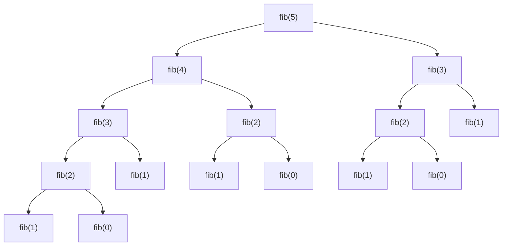

## Learning Objectives

- Define the two properties — overlapping subproblems and optimal substructure — that together qualify a problem for dynamic programming.
- Demonstrate, with a concrete call tree, why naive recursive Fibonacci recomputes the same subproblem exponentially many times.
- Explain why optimal substructure alone, or overlapping subproblems alone, is not sufficient — both must hold together.
- Recognize, given a new problem statement, whether it plausibly exhibits both defining properties.
- Distinguish dynamic programming from divide-and-conquer by whether the subproblems a recursive solution generates actually overlap.

## Context & Motivation

Divide-and-conquer, met earlier in this course, splits a problem into smaller subproblems, solves each one independently, and combines the results — and it works beautifully as long as those subproblems really are independent, sharing no work between them. Merge sort's two halves never touch the same data; nothing is repeated. But not every problem that yields naturally to a recursive breakdown has that property. Sometimes a recursive definition, though perfectly correct, spawns the *same* subproblem again and again along different branches of its recursion — and each time, the naive solution recomputes it from scratch, oblivious to having already done that exact work moments before. This is exactly the situation the recursion concept flagged and set aside for later: naive recursive Fibonacci was shown to compute `fibonacci(2)` twice just within `fibonacci(4)`, and the note there was that "far more times for larger n" — a cost "an iterative version naturally avoids." Dynamic programming is the systematic answer to that observation: a way of recognizing when a recursive solution's repeated work can be eliminated, and a pair of techniques (memoization and tabulation, covered in the next two concepts) for eliminating it while keeping the recursive definition's correctness intact.

The name itself is a historical accident — "programming" here means "planning" or "tabulating," in the sense used by Richard Bellman when he coined the term in the 1950s, not "writing code." Bellman was working on multistage decision processes for the U.S. Air Force, and needed a name that wouldn't alarm funders skeptical of anything sounding like abstract mathematical research; "dynamic programming" sounded productive and impressive without revealing much. The name has stuck ever since, even though it has nothing to do with programming languages, and everything to do with the mathematical structure explored in this concept.

What makes dynamic programming worth a formal name, rather than just "smart recursion," is that it applies to a genuinely identifiable *class* of problems, characterizable by two precise properties, both of which must hold. Recognizing whether a new problem has both properties — before writing a single line of code — is the single most important skill this concept aims to build, because it is the difference between correctly reaching for dynamic programming when it applies, and either missing an opportunity to speed up an exponential solution, or wrongly assuming DP applies to a problem where naive recursion's repeated calls are not actually solving the same subproblem at all.

## Core Theory

### Overlapping subproblems

A problem exhibits **overlapping subproblems** when a straightforward recursive solution calls itself on the *exact same input* more than once, along different paths of its recursion. The canonical illustration is naive recursive Fibonacci:

```python
def fib(n):
    if n <= 1:
        return n
    return fib(n - 1) + fib(n - 2)
```

Tracing `fib(5)` by hand exposes the redundancy directly:



`fib(3)` appears twice in this tree (once under `fib(5)` directly, once under `fib(4)`); `fib(2)` appears three times (under both copies of `fib(3)`, and directly under `fib(4)`); `fib(1)` and `fib(0)` each appear even more often, at the leaves. Every one of those repeated calls recomputes the identical answer from scratch, because the naive function has no memory of having already solved that exact subproblem. The total number of calls made by `fib(n)` grows like the Fibonacci sequence itself grows — roughly `φⁿ` where `φ ≈ 1.618`, i.e., genuinely exponential, `O(2ⁿ)` as a coarser bound — even though there are only `n + 1` *distinct* subproblems (`fib(0)` through `fib(n)`) anywhere in that entire tree. That gap — exponentially many calls, but only linearly many distinct subproblems — is precisely what "overlapping subproblems" means, and precisely what makes eliminating the repetition (the subject of the next two concepts) so dramatically valuable.

Contrast this with merge sort's recursion: `mergeSort(A[0:4])` and `mergeSort(A[4:8])` are called once each, on genuinely disjoint halves of the array — no call in that recursion tree is ever repeated with identical arguments. Merge sort's subproblems do not overlap, which is exactly why divide-and-conquer's "solve each independently" approach loses nothing by treating them as separate: there is no repeated work to eliminate.

### Optimal substructure

A problem has **optimal substructure** when an optimal solution to the whole problem can be constructed directly from optimal solutions to its subproblems. For Fibonacci this is definitional — `fib(n)` simply *is* `fib(n-1) + fib(n-2)`, so the correct answer to the big problem is built by combining the correct answers to the smaller ones. More interestingly, this property holds for optimization problems too: the shortest path from vertex `s` to vertex `t` that passes through vertex `v` is built from the shortest path from `s` to `v` plus the shortest path from `v` to `t` — an optimal solution decomposes into optimal solutions to its pieces, not just *some* solution to its pieces.

Optimal substructure is what justifies solving each subproblem once, and combining those solutions — rather than needing to consider every possible way subproblems could interact. Without it, having the optimal answer to every subproblem in hand would not be enough to construct the optimal answer to the full problem, because the best combination might not be built from the individually-best pieces at all.

### Both properties are required together

Dynamic programming applies precisely when *both* properties hold simultaneously — and it is worth being explicit about why neither one alone is enough:

- **Optimal substructure without overlapping subproblems** describes divide-and-conquer exactly. Merge sort has optimal substructure (a fully sorted array is built from two fully sorted halves), but no overlap — so there is no redundant work to save by caching, and a plain divide-and-conquer recursion is already as efficient as it can be. Adding memoization here would waste memory tracking subproblems that are never revisited.
- **Overlapping subproblems without optimal substructure** is rarer as a clean textbook example, but the point generalizes: if the best global answer cannot actually be assembled from the best answers to the pieces — for instance, the *longest simple path* between two vertices in a general graph does not decompose this way, because gluing together two optimal sub-paths can create a path that revisits a vertex and is no longer simple — then caching subproblem answers doesn't help, because those cached answers aren't the building blocks the final answer needs. Recomputation might be fast to eliminate, but the resulting cached values don't compose into a correct final solution.

Only when a problem has overlapping subproblems (so there is real redundant work worth eliminating) *and* optimal substructure (so eliminating that redundancy via cached subproblem answers still yields the correct final answer) does dynamic programming apply as a genuine technique, rather than either an unnecessary complication or an incorrect shortcut.

## Worked Examples

### Example 1 — verifying both properties for Fibonacci

**Problem:** Confirm explicitly that `fib(n)` has both overlapping subproblems and optimal substructure.

**Overlapping subproblems.** Shown directly in the Core Theory diagram: `fib(5)`'s recursion tree computes `fib(3)` twice and `fib(2)` three times, despite there being only 6 distinct subproblems (`fib(0)` through `fib(5)`) in the entire computation.

**Optimal substructure.** `fib(n) = fib(n-1) + fib(n-2)` is not an approximation or a heuristic combination — it is the exact defining recurrence. The (unique, in this case) correct value of the whole problem is built by directly adding the correct values of the two subproblems. Both properties hold, so Fibonacci is a valid — if almost too simple — candidate for DP.

### Example 2 — checking a new problem against the two properties

**Problem:** Given a grid, count the number of distinct paths from the top-left to the bottom-right corner, moving only right or down at each step (the same problem the recursion concept's Example 3 introduced). Does this problem qualify for dynamic programming?

**Overlapping subproblems.** The naive recursive solution, `count_paths(r, c) = count_paths(r-1, c) + count_paths(r, c-1)`, reaches the same `(r, c)` cell along many different paths through the grid — for instance, cell `(2, 2)` is reached both via `(1,2)→(2,2)` and via `(2,1)→(2,2)`, and every deeper cell is reachable through even more distinct routes. The number of distinct `(r, c)` pairs is only `O(rows × cols)`, but the naive recursion's total call count grows combinatorially — genuine overlap.

**Optimal substructure.** The total path count into `(r, c)` is exactly the path count into `(r-1, c)` plus the path count into `(r, c-1)` — again, a direct, exact composition, not an approximation. Both properties hold, so this problem is a valid DP candidate — memoization or tabulation (next two concepts) will turn its exponential naive recursion into an `O(rows × cols)` solution.

### Example 3 — a problem where the check fails

**Problem:** In a weighted graph that may contain cycles, find the *longest simple path* (a path visiting no vertex twice) between two vertices `s` and `t`. Does dynamic programming's standard approach apply directly?

**Overlapping subproblems.** Yes, superficially — a recursive exploration of paths from `s` will revisit the same intermediate vertex `v` along many different routes.

**Optimal substructure — check carefully.** Suppose the longest simple path from `s` to `t` passes through `v`. Is it necessarily built from the longest simple path from `s` to `v` combined with the longest simple path from `v` to `t`? Not in general: the longest simple `s`-to-`v` path might use vertices that the longest simple `v`-to-`t` path also needs, and gluing the two together could revisit a vertex — producing something that is no longer a *simple* path at all, and so isn't a valid solution to the original problem. The "optimal" pieces don't compose into a valid, let alone optimal, whole. This is why longest-simple-path is NP-hard in general, while shortest path (where this composition issue does not arise, because a shortest path can never benefit from revisiting a vertex) is efficiently solvable by DP-based algorithms — the structural difference between the two problems is exactly this failure of optimal substructure.

## Common Misconceptions & Pitfalls

- **"Any recursive function that calls itself more than once has overlapping subproblems."** Merge sort's recursion also branches into two calls per level, but `mergeSort(A[0:4])` and `mergeSort(A[4:8])` are never the same call — no argument is ever repeated across the whole tree. Branching alone doesn't create overlap; overlap requires the *same* subproblem to recur.
- **"If a problem has optimal substructure, DP will speed it up."** Merge sort has optimal substructure but no overlap — there's nothing to cache, and treating it as a DP problem would only add unneeded bookkeeping over what plain divide-and-conquer already does optimally.
- **"Overlapping subproblems is enough on its own — just cache everything."** The longest-simple-path example shows caching subproblem answers doesn't help when those answers don't compose into a valid whole solution; blindly memoizing a recursive solution to a problem lacking optimal substructure produces a fast but *wrong* algorithm.
- **"Dynamic programming is a totally different technique from recursion."** It is not — as the next concept makes explicit, memoization is the exact same recursive function already familiar, with one small addition. DP is best understood as "recursion, once you've confirmed the two properties hold, plus a way to eliminate the redundant work."

## Summary

A problem qualifies for dynamic programming exactly when it has both overlapping subproblems — a naive recursive solution calls itself on identical arguments repeatedly, as naive Fibonacci's call tree demonstrates concretely, recomputing `fib(3)` twice and `fib(2)` three times for `fib(5)` alone — and optimal substructure — an optimal solution to the whole problem is built directly from optimal solutions to its subproblems. Neither property alone is sufficient: optimal substructure without overlap describes divide-and-conquer, where there is no redundant work worth caching; overlapping subproblems without optimal substructure (as in longest simple path) means caching subproblem answers produces a fast but incorrect algorithm, because those answers don't compose into a valid whole. Recognizing both properties together, before writing any code, is the prerequisite skill the next two concepts build directly on top of.

## Documentation Links

- [MIT 6.006 — Lecture Notes (OCW)](https://ocw.mit.edu/courses/6-006-introduction-to-algorithms-spring-2020/pages/lecture-notes/) — doc
- [ACM/IEEE CS2013 — Algorithms and Complexity Knowledge Area](https://csed.acm.org/cs2013-version/) — doc
