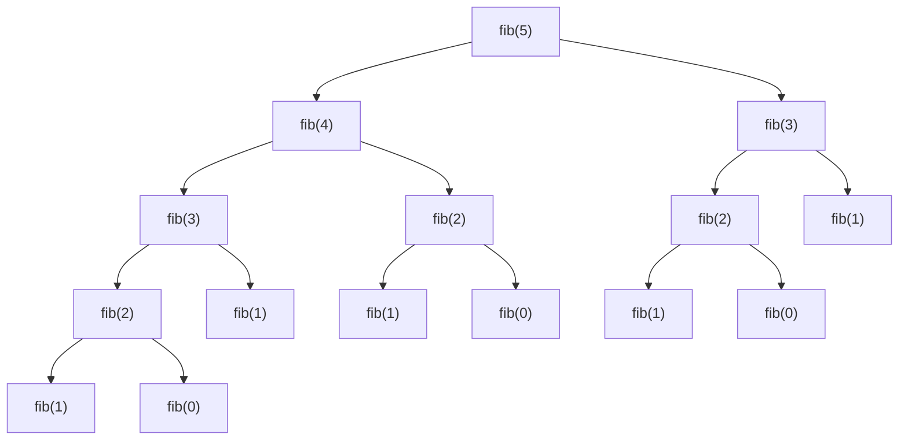

## Objetivos de Aprendizagem

- Definir as duas propriedades, subproblemas sobrepostos e subestrutura ótima, que juntas qualificam um problema para programação dinâmica.
- Demonstrar, com uma árvore de chamada concreta, por que Fibonacci recursivo ingênuo recalcula o mesmo subproblema exponencialmente muitas vezes.
- Explicar por que subestrutura ótima sozinha, ou subproblemas sobrepostos sozinhos, não é suficiente, ambas devem valer juntas.
- Reconhecer, dado o enunciado de um novo problema, se ele plausivelmente exibe ambas as propriedades definidoras.
- Distinguir programação dinâmica de dividir para conquistar pelo fato de os subproblemas que uma solução recursiva gera de fato se sobreporem ou não.

## Contexto e Motivação

Dividir para conquistar, encontrado anteriormente neste curso, divide um problema em subproblemas menores, resolve cada um independentemente, e combina os resultados, e funciona lindamente enquanto esses subproblemas são realmente independentes, sem compartilhar trabalho entre si. As duas metades do merge sort nunca tocam os mesmos dados; nada é repetido. Mas nem todo problema que se rende naturalmente a uma decomposição recursiva tem essa propriedade. Às vezes uma definição recursiva, embora perfeitamente correta, gera o *mesmo* subproblema repetidamente ao longo de ramos diferentes de sua recursão, e toda vez, a solução ingênua o recalcula do zero, alheia a já ter feito exatamente aquele trabalho momentos antes. Essa é exatamente a situação que o conceito de recursão sinalizou e deixou de lado para depois: Fibonacci recursivo ingênuo foi mostrado calcular `fibonacci(2)` duas vezes só dentro de `fibonacci(4)`, e a nota ali foi que "muitas mais vezes para n maiores", um custo "que uma versão iterativa naturalmente evita." Programação dinâmica é a resposta sistemática a essa observação: uma forma de reconhecer quando o trabalho repetido de uma solução recursiva pode ser eliminado, e um par de técnicas (memoização e tabulação, cobertas nos próximos dois conceitos) para eliminá-lo mantendo a correção da definição recursiva intacta.

O próprio nome é um acidente histórico, "programação" aqui significa "planejamento" ou "tabulação", no sentido usado por Richard Bellman quando cunhou o termo nos anos 1950, não "escrever código." Bellman estava trabalhando em processos de decisão multiestágio para a Força Aérea dos EUA, e precisava de um nome que não alarmasse financiadores céticos de qualquer coisa que soasse como pesquisa matemática abstrata; "programação dinâmica" soava produtivo e impressionante sem revelar muito. O nome perdurou desde então, mesmo que não tenha nada a ver com linguagens de programação, e tudo a ver com a estrutura matemática explorada neste conceito.

O que torna programação dinâmica digna de um nome formal, em vez de apenas "recursão esperta", é que se aplica a uma *classe* genuinamente identificável de problemas, caracterizável por duas propriedades precisas, ambas as quais devem valer. Reconhecer se um novo problema tem ambas as propriedades, antes de escrever uma única linha de código, é a habilidade mais importante que este conceito visa construir, porque é a diferença entre corretamente recorrer a programação dinâmica quando se aplica, e ou perder uma oportunidade de acelerar uma solução exponencial, ou assumir erroneamente que DP se aplica a um problema onde as chamadas repetidas da recursão ingênua não estão de fato resolvendo o mesmo subproblema de forma alguma.

## Teoria Central

### Subproblemas sobrepostos

Um problema exibe **subproblemas sobrepostos** quando uma solução recursiva direta chama a si mesma sobre a *mesma entrada exata* mais de uma vez, ao longo de caminhos diferentes de sua recursão. A ilustração canônica é Fibonacci recursivo ingênuo:

```python
def fib(n):
    if n <= 1:
        return n
    return fib(n - 1) + fib(n - 2)
```

Rastrear `fib(5)` manualmente expõe a redundância diretamente:



`fib(3)` aparece duas vezes nessa árvore (uma vez sob `fib(5)` diretamente, uma vez sob `fib(4)`); `fib(2)` aparece três vezes (sob ambas as cópias de `fib(3)`, e diretamente sob `fib(4)`); `fib(1)` e `fib(0)` cada um aparece ainda mais vezes, nas folhas. Toda uma dessas chamadas repetidas recalcula a resposta idêntica do zero, porque a função ingênua não tem memória de já ter resolvido aquele exato subproblema. O número total de chamadas feitas por `fib(n)` cresce como a própria sequência de Fibonacci cresce, aproximadamente `φⁿ` onde `φ ≈ 1.618`, ou seja, genuinamente exponencial, `O(2ⁿ)` como um limite mais grosseiro, mesmo que existam apenas `n + 1` subproblemas *distintos* (`fib(0)` até `fib(n)`) em qualquer lugar naquela árvore inteira. Essa lacuna, exponencialmente muitas chamadas, mas só linearmente muitos subproblemas distintos, é precisamente o que "subproblemas sobrepostos" significa, e precisamente o que torna eliminar a repetição (o assunto dos próximos dois conceitos) tão dramaticamente valioso.

Contraste isso com a recursão do merge sort: `mergeSort(A[0:4])` e `mergeSort(A[4:8])` são chamados uma vez cada, sobre metades genuinamente disjuntas do array, nenhuma chamada naquela árvore de recursão é jamais repetida com argumentos idênticos. Os subproblemas do merge sort não se sobrepõem, que é exatamente por que a abordagem "resolva cada um independentemente" de dividir para conquistar não perde nada tratando-os como separados: não há trabalho repetido para eliminar.

### Subestrutura ótima

Um problema tem **subestrutura ótima** quando uma solução ótima ao problema inteiro pode ser construída diretamente a partir de soluções ótimas a seus subproblemas. Para Fibonacci isso é definicional, `fib(n)` simplesmente *é* `fib(n-1) + fib(n-2)`, então a resposta correta ao problema grande é construída combinando as respostas corretas às menores. Mais interessantemente, essa propriedade vale para problemas de otimização também: o caminho mais curto do vértice `s` ao vértice `t` que passa pelo vértice `v` é construído a partir do caminho mais curto de `s` a `v` mais o caminho mais curto de `v` a `t`, uma solução ótima se decompõe em soluções ótimas a suas partes, não apenas *alguma* solução a suas partes.

Subestrutura ótima é o que justifica resolver cada subproblema uma vez, e combinar essas soluções, em vez de precisar considerar toda forma possível de subproblemas interagirem. Sem ela, ter a resposta ótima a todo subproblema à mão não seria suficiente para construir a resposta ótima ao problema completo, porque a melhor combinação poderia não ser construída a partir das peças individualmente melhores de forma alguma.

### Ambas as propriedades são exigidas juntas

Programação dinâmica se aplica precisamente quando *ambas* as propriedades valem simultaneamente, e vale a pena ser explícito sobre por que nenhuma das duas sozinha basta:

- **Subestrutura ótima sem subproblemas sobrepostos** descreve dividir para conquistar exatamente. Merge sort tem subestrutura ótima (um array completamente ordenado é construído a partir de duas metades completamente ordenadas), mas nenhuma sobreposição, então não há trabalho redundante que valha a pena economizar por cache, e uma recursão simples de dividir para conquistar já é tão eficiente quanto pode ser. Adicionar memoização aqui desperdiçaria memória rastreando subproblemas que nunca são revisitados.
- **Subproblemas sobrepostos sem subestrutura ótima** é mais raro como um exemplo limpo de livro-texto, mas o ponto generaliza: se a melhor resposta global não pode de fato ser montada a partir das melhores respostas às peças, por exemplo, o *caminho simples mais longo* entre dois vértices em um grafo geral não se decompõe dessa forma, porque colar dois subcaminhos ótimos juntos pode criar um caminho que revisita um vértice e não é mais simples, então armazenar em cache respostas de subproblema não ajuda, porque aquelas respostas em cache não são os blocos de construção que a resposta final precisa. Recálculo pode ser rápido de eliminar, mas os valores em cache resultantes não se compõem em uma solução final correta.

Só quando um problema tem subproblemas sobrepostos (então há trabalho redundante real valendo a pena eliminar) *e* subestrutura ótima (então eliminar aquela redundância via respostas de subproblema em cache ainda produz a resposta final correta) programação dinâmica se aplica como uma técnica genuína, em vez de ou uma complicação desnecessária ou um atalho incorreto.

## Exemplos Resolvidos

### Exemplo 1 — verificando ambas as propriedades para Fibonacci

**Problema:** Confirme explicitamente que `fib(n)` tem tanto subproblemas sobrepostos quanto subestrutura ótima.

**Subproblemas sobrepostos.** Mostrado diretamente no diagrama da Teoria Central: a árvore de recursão de `fib(5)` calcula `fib(3)` duas vezes e `fib(2)` três vezes, apesar de existirem apenas 6 subproblemas distintos (`fib(0)` até `fib(5)`) na computação inteira.

**Subestrutura ótima.** `fib(n) = fib(n-1) + fib(n-2)` não é uma aproximação ou uma combinação heurística, é a recorrência definidora exata. O (único, neste caso) valor correto do problema inteiro é construído somando diretamente os valores corretos dos dois subproblemas. Ambas as propriedades valem, então Fibonacci é um candidato válido, ainda que quase simples demais, para DP.

### Exemplo 2 — verificando um novo problema contra as duas propriedades

**Problema:** Dado um grid, conte o número de caminhos distintos do canto superior esquerdo ao canto inferior direito, movendo apenas para a direita ou para baixo a cada passo (o mesmo problema que o Exemplo 3 do conceito de recursão introduziu). Esse problema se qualifica para programação dinâmica?

**Subproblemas sobrepostos.** A solução recursiva ingênua, `count_paths(r, c) = count_paths(r-1, c) + count_paths(r, c-1)`, alcança a mesma célula `(r, c)` através de muitos caminhos diferentes pelo grid, por exemplo, a célula `(2, 2)` é alcançada tanto via `(1,2)→(2,2)` quanto via `(2,1)→(2,2)`, e toda célula mais profunda é alcançável através de ainda mais rotas distintas. O número de pares distintos `(r, c)` é apenas `O(linhas × colunas)`, mas a contagem total de chamada da recursão ingênua cresce combinatoriamente, sobreposição genuína.

**Subestrutura ótima.** A contagem de caminho total até `(r, c)` é exatamente a contagem de caminho até `(r-1, c)` mais a contagem de caminho até `(r, c-1)`, de novo, uma composição direta, exata, não uma aproximação. Ambas as propriedades valem, então este problema é um candidato válido de DP, memoização ou tabulação (próximos dois conceitos) transformará sua recursão ingênua exponencial em uma solução `O(linhas × colunas)`.

### Exemplo 3 — um problema onde a verificação falha

**Problema:** Em um grafo ponderado que pode conter ciclos, encontre o *caminho simples mais longo* (um caminho visitando nenhum vértice duas vezes) entre dois vértices `s` e `t`. A abordagem padrão de programação dinâmica se aplica diretamente?

**Subproblemas sobrepostos.** Sim, superficialmente, uma exploração recursiva de caminhos a partir de `s` revisitará o mesmo vértice intermediário `v` ao longo de muitas rotas diferentes.

**Subestrutura ótima, verifique cuidadosamente.** Suponha que o caminho simples mais longo de `s` a `t` passe por `v`. Ele necessariamente é construído a partir do caminho simples mais longo de `s` a `v` combinado com o caminho simples mais longo de `v` a `t`? Não em geral: o caminho simples `s`-para-`v` mais longo pode usar vértices que o caminho simples `v`-para-`t` mais longo também precisa, e colar os dois juntos poderia revisitar um vértice, produzindo algo que não é mais um caminho *simples* de forma alguma, e portanto não é uma solução válida para o problema original. As peças "ótimas" não se compõem em um todo válido, quanto mais ótimo. Isso é por que caminho-simples-mais-longo é NP-difícil em geral, enquanto caminho mais curto (onde essa questão de composição não surge, porque um caminho mais curto nunca pode se beneficiar de revisitar um vértice) é eficientemente solucionável por algoritmos baseados em DP, a diferença estrutural entre os dois problemas é exatamente essa falha de subestrutura ótima.

## Equívocos Comuns e Armadilhas

- **"Qualquer função recursiva que chama a si mesma mais de uma vez tem subproblemas sobrepostos."** A recursão do merge sort também se ramifica em duas chamadas por nível, mas `mergeSort(A[0:4])` e `mergeSort(A[4:8])` nunca são a mesma chamada, nenhum argumento é jamais repetido através da árvore inteira. Ramificação sozinha não cria sobreposição; sobreposição exige que o *mesmo* subproblema recorra.
- **"Se um problema tem subestrutura ótima, DP o acelerará."** Merge sort tem subestrutura ótima mas nenhuma sobreposição, não há nada para cachear, e tratá-lo como um problema de DP só adicionaria contabilidade desnecessária sobre o que dividir para conquistar simples já faz de forma ótima.
- **"Subproblemas sobrepostos é suficiente sozinho, apenas cacheie tudo."** O exemplo de caminho-simples-mais-longo mostra que cachear respostas de subproblema não ajuda quando essas respostas não se compõem em uma solução total válida; memoizar cegamente uma solução recursiva para um problema sem subestrutura ótima produz um algoritmo rápido mas *errado*.
- **"Programação dinâmica é uma técnica totalmente diferente de recursão."** Não é, como o próximo conceito torna explícito, memoização é a mesmíssima função recursiva já familiar, com uma pequena adição. DP é melhor entendida como "recursão, uma vez que você confirmou que as duas propriedades valem, mais uma forma de eliminar o trabalho redundante."

## Resumo

Um problema se qualifica para programação dinâmica exatamente quando tem tanto subproblemas sobrepostos, uma solução recursiva ingênua chama a si mesma sobre argumentos idênticos repetidamente, como a árvore de chamada de Fibonacci ingênuo demonstra concretamente, recalculando `fib(3)` duas vezes e `fib(2)` três vezes para `fib(5)` sozinho, quanto subestrutura ótima, uma solução ótima ao problema inteiro é construída diretamente a partir de soluções ótimas a seus subproblemas. Nenhuma propriedade sozinha é suficiente: subestrutura ótima sem sobreposição descreve dividir para conquistar, onde não há trabalho redundante valendo cache; subproblemas sobrepostos sem subestrutura ótima (como em caminho simples mais longo) significa que cachear respostas de subproblema produz um algoritmo rápido mas incorreto, porque essas respostas não se compõem em um todo válido. Reconhecer ambas as propriedades juntas, antes de escrever qualquer código, é a habilidade pré-requisito sobre a qual os próximos dois conceitos se constroem diretamente.

## Documentation Links

- [MIT 6.006 — Lecture Notes (OCW)](https://ocw.mit.edu/courses/6-006-introduction-to-algorithms-spring-2020/pages/lecture-notes/) — doc
- [ACM/IEEE CS2013 — Algorithms and Complexity Knowledge Area](https://csed.acm.org/cs2013-version/) — doc
