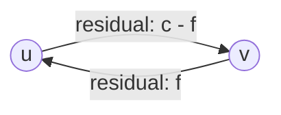

## Learning Objectives

- Define the residual graph of a flow network: the remaining forward capacity plus a backward "undo" edge for every unit of flow already sent.
- Define an augmenting path: any path from source to sink in the residual graph, and explain why finding one always means the current flow is not yet maximum.
- Execute the Ford-Fulkerson method by hand: repeatedly find an augmenting path, push flow equal to its bottleneck capacity, update the residual graph, and repeat until no path remains.
- Explain precisely what a backward residual edge means and why it is necessary for correctness, not just an optimization.
- Recognize the method's termination condition directly in a residual graph: once the sink is unreachable from the source, no further augmenting path exists and the current flow is returned.

## Context & Motivation

The previous concept defined what a valid flow is and what "maximum" means, but gave no way to actually find one. A tempting first idea is purely greedy: repeatedly find any path from source to sink with spare capacity, push as much flow along it as that path allows, and stop once no such path exists. This idea is nearly right, and it is exactly the shape of the method Lester Ford and Delbert Fulkerson formalized in 1956, but it has one subtlety that, if skipped, produces a method that gets stuck at a flow that is not actually maximum: the method needs a way to "change its mind" about flow already committed to an edge, undoing part of an earlier choice if a better overall arrangement becomes visible later. That mechanism, a backward edge representing "flow that could be reduced," is what this concept builds carefully, since getting it wrong is the single most common source of an incorrect from-scratch max-flow implementation.

## Core Theory

### The residual graph: what capacity remains, in both directions

Given a flow network with some current valid flow `f` (initially all zero), the **residual graph** `G_f` captures exactly how much additional flow could still be pushed, in either direction, along every edge:

- For every original edge `(u, v)` with capacity `c(u, v)` and current flow `f(u, v)`, the residual graph includes a **forward residual edge** `(u, v)` with residual capacity `c(u, v) - f(u, v)`, the unused capacity still available in the original direction.
- The residual graph also includes a **backward residual edge** `(v, u)` with residual capacity `f(u, v)`, exactly the amount of flow currently sent along `(u, v)`, representing the ability to *undo* up to that much of it.

An edge with residual capacity 0 is simply omitted from `G_f` (there is nothing left to push along it in that direction). Note that a single original edge `(u, v)` with some flow already on it contributes *two* edges to the residual graph: a forward edge with whatever capacity remains unused, and a backward edge with capacity equal to the flow already sent, letting the method "give back" some of that flow later if doing so unlocks a better overall arrangement.

### Why the backward edge is necessary, not merely convenient

The backward edge is not an optimization or a bookkeeping convenience, it is required for correctness. Consider a network where an early augmenting path sends flow along edge `(u, v)`, but a later, better arrangement would actually route *less* flow through `(u, v)` and more through some alternate route, freeing up `(u, v)`'s capacity to help elsewhere. Without a backward edge representing "reduce the flow on `(u, v)`," the method would have no way to reach that better arrangement once it had committed to the earlier choice, since forward-only residual edges can never decrease flow already assigned to an edge. The backward edge is precisely the method's way of not being permanently bound by an early, locally-reasonable-looking choice that turns out, in hindsight, to be part of a suboptimal global arrangement, exactly the kind of correction a purely greedy, forward-only method could never make.

### An augmenting path, and pushing flow along it

An **augmenting path** is simply any path from `s` to `t` in the residual graph `G_f` (using forward and backward residual edges alike). Its **bottleneck capacity** is the minimum residual capacity among all edges on that path, exactly the same "weakest link" idea already familiar from other graph problems, the most that can be pushed along the entire path is limited by whichever single edge on it has the least room left.

Pushing flow along an augmenting path means, for every edge on the path: if it is a forward residual edge `(u, v)`, increase `f(u, v)` by the bottleneck amount; if it is a backward residual edge `(v, u)` (meaning the path is using the "undo" option on original edge `(u, v)`), decrease `f(u, v)` by the bottleneck amount instead. After this update, the residual graph is recomputed from the new flow, and the process repeats: find another augmenting path in the new residual graph, push flow along it, recompute, until no augmenting path from `s` to `t` remains at all.

### The Ford-Fulkerson method, stated in full

1. Initialize `f(u, v) = 0` for every edge.
2. While an augmenting path `p` exists from `s` to `t` in the residual graph `G_f`: compute `p`'s bottleneck capacity, push that much flow along `p` (updating forward and backward flows as described above), and recompute `G_f`.
3. When no augmenting path remains, the current flow `f` is returned as the (as the next concept proves) maximum flow.

This is called a **method** rather than a fully specified **algorithm** deliberately: nothing here specifies *which* augmenting path to pick when several exist, only that the loop continues as long as at least one exists. Different path-selection rules give genuinely different concrete algorithms (the next concept covers one specific, well-behaved choice), but every one of them shares this identical outer loop and terminates for the identical reason: no augmenting path remains.

## Worked Examples

### Example 1: one full pass: finding an augmenting path and pushing flow

**Problem:** On the network from the previous concept (`s→A: 16`, `s→B: 13`, `A→B: 10`, `A→C: 12`, `B→A: 4`, `B→D: 14`, `C→D: 9`, `C→t: 7`, `D→t: 20`), starting from the all-zero flow, find one augmenting path and push flow along it.

**Finding a path:** With no flow yet, every original edge's forward residual capacity equals its full capacity, and no backward edges exist yet (since `f = 0` everywhere). The path `s → A → C → t` is available, with residual capacities 16, 12, and 7 respectively.

**Bottleneck:** `min(16, 12, 7) = 7`.

**Pushing flow:** Set `f(s,A) = 7`, `f(A,C) = 7`, `f(C,t) = 7`. Recomputing the residual graph: `s→A` now has forward residual `16 - 7 = 9` and a new backward edge `A→s` with residual `7`; similarly for `A→C` (forward residual `12 - 7 = 5`, backward `C→A` residual `7`) and `C→t` (forward residual `7 - 7 = 0`, so this forward edge disappears from `G_f`, backward `t→C` residual `7`).

### Example 2: running the method to completion and verifying termination

**Problem:** Continuing from Example 1's residual graph, keep finding augmenting paths until none remain, and verify the final flow's value against the total capacity of some cut separating `s` from `t`.

**Path 2:** `s → B → D → t`, residuals 13, 14, 20, bottleneck `min(13,14,20) = 13`. Push: `f(s,B) = 13`, `f(B,D) = 13`, `f(D,t) = 13`.

**Path 3:** `s → A → C → D → t`, residuals `9, 5, 9, 7` (`D→t`'s residual is now `20-13=7`), bottleneck `5`. Push: `f(s,A) = 12`, `f(A,C) = 12` (now saturated), `f(C,D) = 5`, `f(D,t) = 18`.

**Path 4:** `s → A → B → D → t`, residuals `4` (on `s→A`), `10` (on `A→B`, untouched so far), `1` (on `B→D`, since `14-13=1`), `2` (on `D→t`, since `7-5=2`), bottleneck `1`. Push: `f(s,A) = 13`, `f(A,B) = 1`, `f(B,D) = 14` (now saturated), `f(D,t) = 19`.

**Checking for a fifth path:** Computing which vertices are reachable from `s` in the resulting residual graph: `s → A` still has residual `3`, so `A` is reachable; from `A`, `A → B` still has residual `9`, so `B` is reachable; but `A → C` is saturated (residual `0`) and `B → D` is saturated (residual `0`), so neither `C`, `D`, nor `t` is reachable from `s` at all. No augmenting path exists, so the method terminates with `|f| = f(s,A) + f(s,B) = 13 + 13 = 26`.

**Verifying against a cut:** The reachable set `{s, A, B}` versus the unreachable set `{C, D, t}` defines a cut whose crossing edges are exactly `A→C` (capacity 12) and `B→D` (capacity 14), since every other edge either stays within one side or points from the unreachable side back toward the reachable one. This cut's total capacity is `12 + 14 = 26`, exactly matching the flow's value, which is not a coincidence: it is precisely the relationship the next concept proves holds in general.

## Common Misconceptions & Pitfalls

- **"A backward residual edge represents flow moving in the reverse direction physically."** It represents the *option to reduce* flow already committed in the forward direction, not any physical reverse flow; using a backward edge in an augmenting path decreases `f(u,v)`, it does not create a new, separate flow from `v` to `u`.
- **"Since the method greedily pushes flow along whatever path it finds first, an unlucky early choice can permanently prevent reaching the true maximum flow."** This is exactly what the backward edge mechanism guards against: whenever an early commitment does turn out to block a better global arrangement, a later augmenting path can always partially or fully undo it by routing through the corresponding backward edge. Example 2's particular run happened to reach the maximum using only forward edges (an artifact of that network and that order of path choices, not a general guarantee), but the *availability* of the backward edge, not its use in any one specific run, is what the next concept's max-flow min-cut theorem shows guarantees correctness regardless of path order.
- **"Ford-Fulkerson specifies exactly which augmenting path to use at each step."** It deliberately does not, that is why it is called a method rather than a single algorithm; any path-selection rule that keeps finding augmenting paths until none remain is a valid instantiation, though different rules can differ dramatically in how many iterations they need (the next concept's Edmonds-Karp algorithm is one specific, provably efficient choice).
- **"Once no augmenting path exists, more flow might still theoretically be pushable, the algorithm just failed to find it."** The next concept proves rigorously that "no augmenting path remains" and "the flow is maximum" are exactly equivalent statements, not merely a heuristic stopping condition, via the max-flow min-cut theorem.

## Summary

The residual graph tracks, for every original edge, both the unused forward capacity and a backward "undo" edge equal to the flow already sent, and an augmenting path is any source-to-sink path through this residual graph, forward and backward edges alike. The Ford-Fulkerson method repeatedly finds an augmenting path, pushes flow equal to its bottleneck capacity (increasing flow on forward residual edges used, decreasing it on backward residual edges used), and recomputes the residual graph, stopping only when no augmenting path remains. The backward edge is not an optional refinement, it is what lets the method correct an early, locally reasonable commitment that turns out to block a better global arrangement, exactly the correction a purely forward-only greedy method could never make, even on a run like Example 2's that happens not to need it. Example 2 also shows the method's termination condition in action: once no vertex on the sink's side of a cut is reachable from the source in the residual graph, the flow's value already equals that cut's total capacity, a numerical coincidence in this one example that the next concept proves is never actually a coincidence at all, via one of the most elegant duality results in algorithmic graph theory: the max-flow min-cut theorem.

## Documentation Links

- [Ford, L. R., & Fulkerson, D. R. (1956). "Maximal Flow Through a Network." Canadian Journal of Mathematics.](https://www.cambridge.org/core/journals/canadian-journal-of-mathematics/article/maximal-flow-through-a-network/): paper
- [MIT 6.006 - Lecture Notes (OCW)](https://ocw.mit.edu/courses/6-006-introduction-to-algorithms-spring-2020/pages/lecture-notes/): doc
