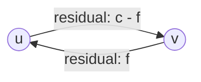

## Objetivos de Aprendizagem

- Definir o grafo residual de uma rede de fluxo: a capacidade direta restante mais uma aresta reversa de "desfazer" para toda unidade de fluxo já enviada.
- Definir um caminho de aumento: qualquer caminho da fonte ao sumidouro no grafo residual, e explicar por que encontrar um sempre significa que o fluxo atual ainda não é máximo.
- Executar o método de Ford-Fulkerson manualmente: repetidamente encontrar um caminho de aumento, empurrar fluxo igual à sua capacidade de gargalo, atualizar o grafo residual, e repetir até que nenhum caminho reste.
- Explicar precisamente o que uma aresta residual reversa significa e por que ela é necessária para a corretude, não apenas uma otimização.
- Reconhecer a condição de término do método diretamente em um grafo residual: uma vez que o sumidouro está inalcançável a partir da fonte, nenhum caminho de aumento adicional existe e o fluxo atual é retornado.

## Contexto e Motivação

O conceito anterior definiu o que é um fluxo válido e o que "máximo" significa, mas não deu nenhuma forma de de fato encontrar um. Uma primeira ideia tentadora é puramente gulosa: repetidamente encontrar qualquer caminho da fonte ao sumidouro com capacidade sobrando, empurrar tanto fluxo quanto esse caminho permitir, e parar quando não existir mais tal caminho. Essa ideia está quase certa, e é exatamente o formato do método que Lester Ford e Delbert Fulkerson formalizaram em 1956, mas tem uma sutileza que, se ignorada, produz um método que fica preso em um fluxo que não é de fato máximo: o método precisa de uma forma de "mudar de ideia" sobre fluxo já comprometido em uma aresta, desfazendo parte de uma escolha anterior se um arranjo geral melhor se tornar visível depois. Esse mecanismo, uma aresta reversa representando "fluxo que poderia ser reduzido", é o que este conceito constrói com cuidado, já que errá-lo é a fonte mais comum de uma implementação incorreta de fluxo máximo feita do zero.

## Teoria Central

### O grafo residual: qual capacidade resta, em ambas as direções

Dada uma rede de fluxo com algum fluxo válido atual `f` (inicialmente todo zero), o **grafo residual** `G_f` captura exatamente quanto fluxo adicional ainda poderia ser empurrado, em qualquer direção, ao longo de toda aresta:

- Para toda aresta original `(u, v)` com capacidade `c(u, v)` e fluxo atual `f(u, v)`, o grafo residual inclui uma **aresta residual direta** `(u, v)` com capacidade residual `c(u, v) - f(u, v)`, a capacidade não usada ainda disponível na direção original.
- O grafo residual também inclui uma **aresta residual reversa** `(v, u)` com capacidade residual `f(u, v)`, exatamente a quantidade de fluxo atualmente enviada por `(u, v)`, representando a capacidade de *desfazer* até essa quantidade dele.

Uma aresta com capacidade residual 0 é simplesmente omitida de `G_f` (não há nada mais para empurrar por ela naquela direção). Note que uma única aresta original `(u, v)` com algum fluxo já nela contribui *duas* arestas para o grafo residual: uma aresta direta com o que quer que reste de capacidade não usada, e uma aresta reversa com capacidade igual ao fluxo já enviado, deixando o método "devolver" parte desse fluxo depois se isso destravar um arranjo geral melhor.

### Por que a aresta reversa é necessária, não apenas conveniente

A aresta reversa não é uma otimização ou uma conveniência de contabilidade, ela é exigida para a corretude. Considere uma rede onde um caminho de aumento inicial envia fluxo pela aresta `(u, v)`, mas um arranjo posterior e melhor na verdade rotearia *menos* fluxo por `(u, v)` e mais por alguma rota alternativa, liberando a capacidade de `(u, v)` para ajudar em outro lugar. Sem uma aresta reversa representando "reduza o fluxo em `(u, v)`", o método não teria como alcançar esse arranjo melhor uma vez que já tivesse se comprometido com a escolha anterior, já que arestas residuais apenas diretas nunca conseguem diminuir o fluxo já atribuído a uma aresta. A aresta reversa é precisamente a forma do método de não ficar permanentemente preso a uma escolha inicial que parecia razoável mas que, em retrospecto, acaba fazendo parte de um arranjo global subótimo, exatamente o tipo de correção que um método puramente guloso e só-direto jamais conseguiria fazer.

### Um caminho de aumento, e empurrando fluxo por ele

Um **caminho de aumento** é simplesmente qualquer caminho de `s` a `t` no grafo residual `G_f` (usando arestas residuais diretas e reversas igualmente). Sua **capacidade de gargalo** é a capacidade residual mínima entre todas as arestas naquele caminho, exatamente a mesma ideia de "elo mais fraco" já familiar de outros problemas de grafo, o máximo que pode ser empurrado por todo o caminho é limitado por qualquer aresta única nele que tenha menos espaço restante.

Empurrar fluxo por um caminho de aumento significa, para toda aresta no caminho: se é uma aresta residual direta `(u, v)`, aumente `f(u, v)` pela quantidade de gargalo; se é uma aresta residual reversa `(v, u)` (significando que o caminho está usando a opção de "desfazer" na aresta original `(u, v)`), diminua `f(u, v)` pela quantidade de gargalo em vez disso. Depois dessa atualização, o grafo residual é recalculado a partir do novo fluxo, e o processo se repete: encontre outro caminho de aumento no novo grafo residual, empurre fluxo por ele, recalcule, até que nenhum caminho de aumento de `s` a `t` reste.

### O método de Ford-Fulkerson, enunciado por completo

1. Inicialize `f(u, v) = 0` para toda aresta.
2. Enquanto um caminho de aumento `p` existir de `s` a `t` no grafo residual `G_f`: calcule a capacidade de gargalo de `p`, empurre essa quantidade de fluxo por `p` (atualizando fluxos diretos e reversos como descrito acima), e recalcule `G_f`.
3. Quando nenhum caminho de aumento restar, o fluxo atual `f` é retornado como (conforme o próximo conceito prova) o fluxo máximo.

Isso é chamado de **método** em vez de um **algoritmo** totalmente especificado deliberadamente: nada aqui especifica *qual* caminho de aumento escolher quando vários existem, apenas que o laço continua enquanto pelo menos um existir. Regras diferentes de seleção de caminho dão algoritmos concretos genuinamente diferentes (o próximo conceito cobre uma escolha específica e bem-comportada), mas cada um deles compartilha esse mesmo laço externo e termina pela mesma razão idêntica: nenhum caminho de aumento resta.

## Exemplos Resolvidos

### Exemplo 1: uma passada completa, encontrando um caminho de aumento e empurrando fluxo

**Problema:** Na rede do conceito anterior (`s→A: 16`, `s→B: 13`, `A→B: 10`, `A→C: 12`, `B→A: 4`, `B→D: 14`, `C→D: 9`, `C→t: 7`, `D→t: 20`), partindo do fluxo todo zero, encontre um caminho de aumento e empurre fluxo por ele.

**Encontrando um caminho:** Sem fluxo ainda, a capacidade residual direta de toda aresta original é igual à sua capacidade completa, e nenhuma aresta reversa existe ainda (já que `f = 0` em toda parte). O caminho `s → A → C → t` está disponível, com capacidades residuais 16, 12 e 7 respectivamente.

**Gargalo:** `min(16, 12, 7) = 7`.

**Empurrando fluxo:** Defina `f(s,A) = 7`, `f(A,C) = 7`, `f(C,t) = 7`. Recalculando o grafo residual: `s→A` agora tem residual direta `16 - 7 = 9` e uma nova aresta reversa `A→s` com residual `7`; similarmente para `A→C` (residual direta `12 - 7 = 5`, reversa `C→A` residual `7`) e `C→t` (residual direta `7 - 7 = 0`, então essa aresta direta desaparece de `G_f`, reversa `t→C` residual `7`).

### Exemplo 2: rodando o método até completar e verificando a terminação

**Problema:** Continuando do grafo residual do Exemplo 1, continue encontrando caminhos de aumento até que nenhum reste, e verifique o valor final do fluxo contra a capacidade total de algum corte separando `s` de `t`.

**Caminho 2:** `s → B → D → t`, residuais 13, 14, 20, gargalo `min(13,14,20) = 13`. Empurre: `f(s,B) = 13`, `f(B,D) = 13`, `f(D,t) = 13`.

**Caminho 3:** `s → A → C → D → t`, residuais `9, 5, 9, 7` (a residual de `D→t` agora é `20-13=7`), gargalo `5`. Empurre: `f(s,A) = 12`, `f(A,C) = 12` (agora saturada), `f(C,D) = 5`, `f(D,t) = 18`.

**Caminho 4:** `s → A → B → D → t`, residuais `4` (em `s→A`), `10` (em `A→B`, intocada até agora), `1` (em `B→D`, já que `14-13=1`), `2` (em `D→t`, já que `7-5=2`), gargalo `1`. Empurre: `f(s,A) = 13`, `f(A,B) = 1`, `f(B,D) = 14` (agora saturada), `f(D,t) = 19`.

**Verificando um quinto caminho:** Calculando quais vértices são alcançáveis a partir de `s` no grafo residual resultante: `s → A` ainda tem residual `3`, então `A` é alcançável; a partir de `A`, `A → B` ainda tem residual `9`, então `B` é alcançável; mas `A → C` está saturada (residual `0`) e `B → D` está saturada (residual `0`), então nem `C`, `D`, nem `t` são alcançáveis a partir de `s` de forma alguma. Nenhum caminho de aumento existe, então o método termina com `|f| = f(s,A) + f(s,B) = 13 + 13 = 26`.

**Verificando contra um corte:** O conjunto alcançável `{s, A, B}` contra o conjunto inalcançável `{C, D, t}` define um corte cujas arestas de cruzamento são exatamente `A→C` (capacidade 12) e `B→D` (capacidade 14), já que toda outra aresta ou fica dentro de um lado ou aponta do lado inalcançável de volta para o alcançável. A capacidade total desse corte é `12 + 14 = 26`, correspondendo exatamente ao valor do fluxo, o que não é coincidência: é precisamente a relação que o próximo conceito prova valer em geral.

## Equívocos Comuns e Armadilhas

- **"Uma aresta residual reversa representa fluxo se movendo na direção reversa fisicamente."** Ela representa a *opção de reduzir* fluxo já comprometido na direção direta, não nenhum fluxo reverso físico; usar uma aresta reversa em um caminho de aumento diminui `f(u,v)`, não cria um novo fluxo separado de `v` para `u`.
- **"Já que o método empurra fluxo gulosamente por qualquer caminho que encontrar primeiro, uma escolha inicial azarada pode impedir permanentemente alcançar o verdadeiro fluxo máximo."** Isso é exatamente o que o mecanismo de aresta reversa evita: sempre que um comprometimento inicial de fato acaba bloqueando um arranjo global melhor, um caminho de aumento posterior sempre pode desfazê-lo parcial ou totalmente roteando pela aresta reversa correspondente. A execução específica do Exemplo 2 aconteceu de alcançar o máximo usando só arestas diretas (um artefato daquela rede e daquela ordem de escolhas de caminho, não uma garantia geral), mas a *disponibilidade* da aresta reversa, não seu uso em uma execução específica, é o que o teorema do fluxo máximo/corte mínimo do próximo conceito mostra que garante corretude independente da ordem dos caminhos.
- **"Ford-Fulkerson especifica exatamente qual caminho de aumento usar em cada passo."** Ele deliberadamente não especifica, é por isso que é chamado de método em vez de um único algoritmo; qualquer regra de seleção de caminho que continue encontrando caminhos de aumento até que nenhum reste é uma instanciação válida, embora regras diferentes possam diferir dramaticamente em quantas iterações precisam (o algoritmo de Edmonds-Karp do próximo conceito é uma escolha específica e comprovadamente eficiente).
- **"Uma vez que nenhum caminho de aumento existe, mais fluxo ainda poderia teoricamente ser empurrável, o algoritmo só falhou em encontrá-lo."** O próximo conceito prova rigorosamente que "nenhum caminho de aumento resta" e "o fluxo é máximo" são afirmações exatamente equivalentes, não apenas uma condição de parada heurística, via o teorema do fluxo máximo/corte mínimo.

## Resumo

O grafo residual acompanha, para toda aresta original, tanto a capacidade direta não usada quanto uma aresta reversa de "desfazer" igual ao fluxo já enviado, e um caminho de aumento é qualquer caminho de fonte a sumidouro através desse grafo residual, arestas diretas e reversas igualmente. O método de Ford-Fulkerson repetidamente encontra um caminho de aumento, empurra fluxo igual à sua capacidade de gargalo (aumentando fluxo em arestas residuais diretas usadas, diminuindo em arestas residuais reversas usadas), e recalcula o grafo residual, parando somente quando nenhum caminho de aumento resta. A aresta reversa não é um refinamento opcional, é o que permite ao método corrigir um comprometimento inicial e localmente razoável que acaba bloqueando um arranjo global melhor, exatamente a correção que um método puramente guloso e só-direto jamais conseguiria fazer, mesmo em uma execução como a do Exemplo 2 que aconteceu de não precisar dela. O Exemplo 2 também mostra a condição de término do método em ação: uma vez que nenhum vértice do lado do sumidouro de um corte é alcançável a partir da fonte no grafo residual, o valor do fluxo já é igual à capacidade total daquele corte, uma coincidência numérica neste único exemplo que o próximo conceito prova nunca ser de fato uma coincidência, via um dos resultados de dualidade mais elegantes em toda a teoria algorítmica de grafos: o teorema do fluxo máximo/corte mínimo.

## Documentation Links

- [Ford, L. R., & Fulkerson, D. R. (1956). "Maximal Flow Through a Network." Canadian Journal of Mathematics.](https://www.cambridge.org/core/journals/canadian-journal-of-mathematics/article/maximal-flow-through-a-network/): paper
- [MIT 6.006 - Lecture Notes (OCW)](https://ocw.mit.edu/courses/6-006-introduction-to-algorithms-spring-2020/pages/lecture-notes/): doc
