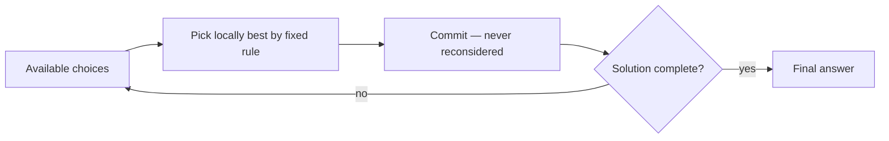

## Learning Objectives

- State the greedy strategy in general terms: build a solution incrementally, always choosing the locally best-looking option, and never reconsider that choice.
- Apply a greedy coin-change rule to a concrete denomination set and amount, and identify precisely where the resulting answer is suboptimal.
- Explain why a greedy strategy being wrong for one denomination set does not mean greedy is wrong for every problem — the correctness of a greedy rule depends on the specific problem's structure.
- Distinguish "greedy produces a valid solution" from "greedy produces an optimal solution," and explain why the first does not imply the second.

## Context & Motivation

Every algorithmic paradigm studied so far in this cluster — divide-and-conquer, merge sort, quicksort — commits to a strategy and then proves, once, that the strategy achieves what it claims to achieve. Greedy algorithms are appealing for exactly the opposite reason at first glance: they require no elaborate strategy at all. A **greedy algorithm** builds up a solution one piece at a time, and at each step simply takes whichever available choice looks best *right now*, according to some straightforward local criterion — the largest coin, the cheapest edge, the earliest deadline — and then never revisits that choice again, no matter what happens later. It is, in a real sense, the laziest possible algorithmic strategy: no backtracking, no lookahead, no reconsideration.

That simplicity is a genuine double-edged sword, and understanding both edges is the entire point of this concept. Some problems have a remarkable property: the greedy, locally-best choice at every step really does combine into a globally optimal overall solution — and when that property holds, a greedy algorithm is often the simplest, fastest, most elegant correct algorithm available for the problem, no dynamic programming or exhaustive search required. But *other* problems, that can look deceptively similar on the surface, simply do not have this property — the locally best choice at some step actively closes off the path to the actual optimal solution, and a greedy algorithm applied to such a problem produces an answer that is not just imperfect but *provably, systematically* wrong. The two situations look identical from the outside — a short, simple loop that keeps picking the best-looking option — and there is no way to tell which situation you are in just by running the algorithm and eyeballing the output on a few test cases. Telling them apart requires an actual proof, one direction or the other, which is exactly why the next concept in this cluster exists: to demonstrate, completely and rigorously, what it looks like to establish that a specific greedy rule is correct. This concept's job is to make sure that proof feels necessary rather than academic — by showing, concretely, a case where skipping it would have produced a wrong answer with total confidence.

## Core Theory

### The general greedy strategy

A greedy algorithm for a problem that builds a solution incrementally (a set, a sequence, a subset of choices) follows this template:

1. At each step, consider the choices currently available.
2. Select whichever choice is best according to some fixed, local criterion (largest, cheapest, earliest, etc.) — evaluated only using information available *right now*, never by considering how this choice affects the remaining steps.
3. Commit to that choice permanently — no backtracking, no revisiting it later even if a subsequent step reveals the earlier choice was a mistake.
4. Repeat until the solution is complete.

Note precisely what this template does *not* include: any mechanism for checking whether the accumulating sequence of local choices is still on track toward a globally optimal answer. That check is exactly what is missing, and exactly what must be supplied separately, by a proof specific to the problem at hand.

### A worked counterexample: coin change with denominations {1, 3, 4}

Consider the **coin-change problem**: given a set of coin denominations and a target amount, find the *minimum number of coins* that sum to that amount (assuming unlimited coins of each denomination are available). The natural greedy rule is: at each step, use the **largest denomination that does not exceed the remaining amount**, and repeat.

Take denominations `{1, 3, 4}` and target amount `6`.

**Greedy's trace.** Remaining amount = 6. Largest denomination ≤ 6 is `4` — use it. Remaining amount = 6 − 4 = 2. Largest denomination ≤ 2 is `1` (since 3 and 4 both exceed 2) — use it. Remaining amount = 2 − 1 = 1. Largest denomination ≤ 1 is `1` — use it. Remaining amount = 0, done.

Greedy's answer: `4 + 1 + 1` — **3 coins**.

**The actual optimal answer.** `3 + 3 = 6`, using exactly **2 coins**.

Greedy did not fail to find *a* valid combination of coins summing to 6 — `4 + 1 + 1` genuinely sums to 6, and is a perfectly valid way to make change. Greedy failed to find the *minimum-coin* combination, which is the actual problem being asked. This is the crucial distinction the Learning Objectives call out: greedy produced a valid solution, but not an optimal one — and it did so not through a coding bug, but through a structurally correct execution of exactly the greedy rule as specified.

### Diagnosing why this greedy rule fails here

The greedy rule's local criterion — "use the largest denomination that fits" — implicitly assumes that using a bigger coin now can never be worse than using a smaller one, because the remaining amount will always be "just as easy" to finish optimally regardless of which coin was used to make progress toward it. That assumption is false for `{1, 3, 4}`: using the `4` at the first step reduces the remaining amount to `2`, and `2` happens to be an awkward amount for this coin set — it requires two separate `1`-coins, because no single coin or pair of larger coins sums to exactly 2. Had greedy instead used a `3` first (a smaller, "worse-looking" local choice), the remaining amount would have been `3`, which this coin set handles perfectly with a single additional `3`-coin. The locally best choice at step one actively steered the algorithm into a remaining subproblem that is harder, in coin count, than the subproblem a different first choice would have left behind — exactly the failure mode a greedy algorithm cannot detect, because it never looks past the immediate choice to check what subproblem that choice leaves behind.

### Greedy is not universally wrong — it depends on the problem

It is essential not to overcorrect from this counterexample into "greedy algorithms are unreliable and should be avoided." The identical greedy rule — always use the largest denomination that fits — is, in fact, **provably optimal** for the everyday denominations `{1, 5, 10, 25}` (US coins) or `{1, 2, 5, 10, 20, 50}` (many other currencies): for those specific denomination sets, it can be shown that no combination of smaller coins ever beats the greedy choice. The lesson is not "avoid greedy" — it is "greedy's correctness is a property of the specific problem (here, the specific denomination set), and that property must be established, not assumed." The very next concept in this cluster demonstrates exactly what establishing it looks like, for a different, cleanly provable greedy problem (activity selection) — building the rigorous habit that this concept's counterexample is designed to motivate.

## Worked Examples

### Example 1 — a second denomination set where greedy also fails

**Problem:** Using denominations `{1, 10, 25}`, find the minimum number of coins for amount `30` using the greedy rule, and compare against the true optimum.

**Greedy's trace.** Remaining = 30. Largest ≤ 30 is `25` — use it, remaining = 5. Largest ≤ 5 is `1` — use it, four more times (`5` divided by `1`, one coin per step): remaining goes 5→4→3→2→1→0, using five `1`-coins.

Greedy's answer: `25 + 1×5` = **6 coins**.

**Optimum.** `10 + 10 + 10 = 30` — **3 coins**.

This confirms the counterexample from Core Theory is not a one-off artifact of the specific numbers `{1,3,4}` and `6` — the same style of failure (a large coin now stranding the remainder in an awkward amount for the coin set) recurs with a structurally similar but numerically different denomination set, reinforcing that the issue is a genuine structural weakness of the greedy rule for *arbitrary* denomination sets, not a coincidence tied to one specific input.

### Example 2 — where the same greedy rule succeeds, and why

**Problem:** Using denominations `{1, 5, 10, 25}` (standard US coins), find the minimum number of coins for amount `30`.

**Greedy's trace.** Remaining = 30. Largest ≤ 30 is `25` — use it, remaining = 5. Largest ≤ 5 is `5` — use it, remaining = 0.

Greedy's answer: `25 + 5` = **2 coins**.

**Checking optimality.** Could 1 coin suffice? No single denomination equals 30. Could some other combination of 2 coins do it? The only 2-coin sums available are pairs from `{1,5,10,25}`: the largest possible 2-coin sum not exceeding 30 using distinct pairings — `25+5=30` — matches exactly, and no other 2-coin combination reaches 30 (`10+10=20`, `25+1` combinations don't reach 30 either without a third coin). So 2 coins is optimal, and greedy found it. The structural reason this coin set behaves well (and `{1,3,4}` does not) is a genuine, provable property of how each denomination relates to the others — it is not addressed in full generality here, but the concrete contrast between Example 1's failure and this success is exactly the point: the same algorithm, unchanged, succeeds on one input family and fails on another, and nothing about *running* the algorithm reveals which situation you're in.

### Example 3 — a non-numeric illustration: greedy interval covering gone wrong (informal)

**Problem:** Suppose a greedy rule for some scheduling variant says "always pick whichever remaining option removes the most other options from consideration" (a "maximize immediate impact" heuristic, as opposed to the earliest-finish-time rule used correctly in the next concept). Sketch, informally, why this kind of "looks locally powerful" rule is not automatically trustworthy either.

**Reasoning.** A choice that eliminates many competitors right now might eliminate precisely the competitors that would have combined well together later, while leaving behind a much smaller set of remaining, mutually incompatible options. This is the same underlying failure mode as the coin-change counterexample, generalized: any greedy criterion that evaluates a choice only by its *immediate* effect, without any guarantee about the *downstream* subproblem it leaves behind, is exposed to exactly this kind of trap — which is precisely why the correct greedy rule for activity selection (picking by earliest finish time, not by any measure of "impact") needs its own dedicated proof in the next concept, rather than being accepted just because it sounds plausible.

## Common Misconceptions & Pitfalls

- **"If a greedy algorithm produces a valid answer, it must be a reasonably good one."** The coin-change counterexample refutes this directly — `4+1+1` is a completely valid way to make 6 cents, using real coins that really sum to the target, and yet it is objectively worse (50% more coins) than the true optimum. Validity and optimality are different properties, and a greedy algorithm's output should never be assumed optimal without a specific correctness argument for that specific problem.
- **"Greedy failed here, so greedy algorithms are just unreliable heuristics, not real algorithms."** Example 2 shows the identical rule succeeding, provably, on a different denomination set. The correct lesson is narrower and more useful: greedy's correctness is a per-problem property that must be established, not a universal trait of the greedy style, and plenty of well-known problems (activity selection, Huffman coding, minimum spanning trees via Kruskal's or Prim's algorithm) do have provably correct greedy solutions.
- **"Testing greedy against a few examples is enough to trust it."** Because greedy's failure depends on the specific structure of the denominations (or, in general, the specific problem instance), a greedy rule can appear to work correctly on several test cases and still be wrong in general — as `{1,3,4}` demonstrates for the single amount `6`, while the same rule happens to work fine for many other amounts with that same coin set (e.g., amount 8: greedy gives `4+4`, 2 coins, which is optimal). Passing spot checks is not a substitute for a proof.
- **"A greedy rule that 'sounds reasonable' is probably fine."** Example 3's "maximize immediate impact" rule sounds at least as reasonable as "always take the earliest-finishing option" — yet only the latter is provably correct for activity selection, precisely the subject of the next concept. Plausibility is not evidence.

## Summary

A greedy algorithm builds a solution incrementally, always taking whichever choice looks locally best by some fixed criterion, and never reconsidering that choice — a strategy notable for its simplicity, and sometimes for being provably optimal, but with no built-in mechanism to check whether local choices are compatible with global optimality. The coin-change problem with denominations `{1, 3, 4}` and target `6` demonstrates this concretely: the greedy "always use the largest fitting coin" rule produces `4+1+1` (3 coins), while the true optimum is `3+3` (2 coins) — a genuine, structural failure, not a coding mistake, caused by the greedy choice stranding the remaining amount in an awkward spot for that coin set. The same rule is, however, provably correct for other, more common denomination sets — meaning greedy's correctness is a property of the specific problem, established or refuted by proof, never assumed from a rule simply "sounding reasonable" or passing a handful of test cases. This is exactly the discipline the next concept applies rigorously to a different greedy problem, activity selection, where the corresponding greedy rule genuinely is correct — and is proved to be so.

## Documentation Links

- [ACM/IEEE CS2013 — Algorithms and Complexity Knowledge Area](https://csed.acm.org/cs2013-version/) — doc
- [Sedgewick & Wayne — Algorithms Lectures (Princeton)](https://algs4.cs.princeton.edu/lectures/) — doc
