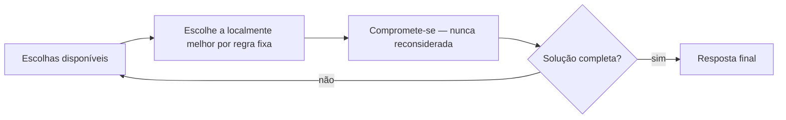

## Objetivos de Aprendizagem

- Enunciar a estratégia gulosa em termos gerais: construir uma solução incrementalmente, sempre escolhendo a opção que parece localmente melhor, e nunca reconsiderar essa escolha.
- Aplicar uma regra gulosa de troco de moedas a um conjunto de denominações e quantia concretos, e identificar precisamente onde a resposta resultante é subótima.
- Explicar por que uma estratégia gulosa estar errada para um conjunto de denominações não significa que gulosa está errada para todo problema, a correção de uma regra gulosa depende da estrutura específica do problema.
- Distinguir "guloso produz uma solução válida" de "guloso produz uma solução ótima", e explicar por que a primeira não implica a segunda.

## Contexto e Motivação

Todo paradigma algorítmico estudado até agora neste grupo, dividir para conquistar, merge sort, quicksort, se compromete com uma estratégia e depois prova, uma vez, que a estratégia alcança o que afirma alcançar. Algoritmos gulosos são atraentes por exatamente a razão oposta à primeira vista: não exigem nenhuma estratégia elaborada de forma alguma. Um **algoritmo guloso** constrói uma solução um pedaço de cada vez, e a cada passo simplesmente toma qualquer escolha disponível que pareça melhor *agora mesmo*, de acordo com algum critério local direto, a maior moeda, a aresta mais barata, o prazo mais próximo, e depois nunca revisita essa escolha de novo, não importa o que aconteça depois. É, em um sentido real, a estratégia algorítmica mais preguiçosa possível: sem retrocesso, sem antecipação, sem reconsideração.

Essa simplicidade é uma faca de dois gumes genuína, e entender ambos os gumes é o ponto inteiro deste conceito. Alguns problemas têm uma propriedade notável: a escolha gulosa, localmente melhor, a cada passo de fato se combina em uma solução geral globalmente ótima, e quando essa propriedade vale, um algoritmo guloso é frequentemente o algoritmo correto mais simples, mais rápido, mais elegante disponível para o problema, nenhuma programação dinâmica ou busca exaustiva necessária. Mas *outros* problemas, que podem parecer enganosamente similares na superfície, simplesmente não têm essa propriedade, a escolha localmente melhor em algum passo ativamente fecha o caminho para a solução ótima real, e um algoritmo guloso aplicado a tal problema produz uma resposta que não é apenas imperfeita mas *comprovadamente, sistematicamente* errada. As duas situações parecem idênticas de fora, um laço curto e simples que continua escolhendo a opção que parece melhor, e não há forma de dizer em qual situação você está apenas rodando o algoritmo e observando a saída em alguns casos de teste. Distingui-las exige uma prova real, em uma direção ou outra, que é exatamente por que o próximo conceito deste grupo existe: para demonstrar, completa e rigorosamente, como é estabelecer que uma regra gulosa específica é correta. O trabalho deste conceito é garantir que essa prova pareça necessária em vez de acadêmica, mostrando, concretamente, um caso onde pulá-la teria produzido uma resposta errada com confiança total.

## Teoria Central

### A estratégia gulosa geral

Um algoritmo guloso para um problema que constrói uma solução incrementalmente (um conjunto, uma sequência, um subconjunto de escolhas) segue este modelo:

1. Em cada passo, considere as escolhas atualmente disponíveis.
2. Selecione a escolha que é melhor de acordo com algum critério fixo, local (maior, mais barata, mais cedo, etc.), avaliada usando apenas informação disponível *agora mesmo*, nunca considerando como essa escolha afeta os passos restantes.
3. Comprometa-se com essa escolha permanentemente, sem retrocesso, sem revisitá-la depois mesmo que um passo subsequente revele que a escolha anterior foi um erro.
4. Repita até a solução estar completa.

Note precisamente o que este modelo *não* inclui: qualquer mecanismo para verificar se a sequência acumulada de escolhas locais ainda está no caminho certo em direção a uma resposta globalmente ótima. Essa verificação é exatamente o que está faltando, e exatamente o que deve ser fornecido separadamente, por uma prova específica ao problema em questão.

### Um contraexemplo resolvido: troco de moedas com denominações {1, 3, 4}

Considere o **problema de troco de moedas**: dado um conjunto de denominações de moeda e uma quantia alvo, encontre o *número mínimo de moedas* que somam essa quantia (assumindo que moedas ilimitadas de cada denominação estão disponíveis). A regra gulosa natural é: em cada passo, use a **maior denominação que não exceda a quantia restante**, e repita.

Tome as denominações `{1, 3, 4}` e quantia alvo `6`.

**Rastreamento da gulosa.** Quantia restante = 6. Maior denominação ≤ 6 é `4`, use-a. Quantia restante = 6 − 4 = 2. Maior denominação ≤ 2 é `1` (já que 3 e 4 ambas excedem 2), use-a. Quantia restante = 2 − 1 = 1. Maior denominação ≤ 1 é `1`, use-a. Quantia restante = 0, feito.

Resposta da gulosa: `4 + 1 + 1`, **3 moedas**.

**A resposta ótima real.** `3 + 3 = 6`, usando exatamente **2 moedas**.

A gulosa não falhou em encontrar *uma* combinação válida de moedas somando 6, `4 + 1 + 1` genuinamente soma 6, e é uma forma perfeitamente válida de dar troco. A gulosa falhou em encontrar a combinação de *número mínimo de moedas*, que é o problema real sendo perguntado. Esta é a distinção crucial que os Objetivos de Aprendizagem destacam: guloso produziu uma solução válida, mas não uma ótima, e o fez não através de um bug de código, mas através de uma execução estruturalmente correta de exatamente a regra gulosa como especificada.

### Diagnosticando por que essa regra gulosa falha aqui

O critério local da regra gulosa, "use a maior denominação que cabe", implicitamente assume que usar uma moeda maior agora nunca pode ser pior que usar uma menor, porque a quantia restante sempre será "igualmente fácil" de terminar de forma ótima independentemente de qual moeda foi usada para progredir em direção a ela. Essa suposição é falsa para `{1, 3, 4}`: usar o `4` no primeiro passo reduz a quantia restante para `2`, e `2` acontece de ser uma quantia estranha para este conjunto de moedas, exige duas moedas `1` separadas, porque nenhuma moeda única ou par de moedas maiores soma exatamente 2. Se guloso tivesse usado um `3` primeiro (uma escolha local menor, "de aparência pior"), a quantia restante teria sido `3`, que este conjunto de moedas trata perfeitamente com uma única moeda `3` adicional. A escolha localmente melhor no passo um ativamente direcionou o algoritmo para um subproblema restante que é mais difícil, em contagem de moedas, do que o subproblema que uma primeira escolha diferente teria deixado para trás, exatamente o modo de falha que um algoritmo guloso não pode detectar, porque nunca olha além da escolha imediata para verificar que subproblema aquela escolha deixa para trás.

### Guloso não é universalmente errado, depende do problema

É essencial não corrigir demais a partir deste contraexemplo para "algoritmos gulosos não são confiáveis e devem ser evitados." A regra gulosa idêntica, sempre use a maior denominação que cabe, é, de fato, **comprovadamente ótima** para as denominações cotidianas `{1, 5, 10, 25}` (moedas dos EUA) ou `{1, 2, 5, 10, 20, 50}` (muitas outras moedas): para esses conjuntos de denominações específicos, pode-se mostrar que nenhuma combinação de moedas menores jamais vence a escolha gulosa. A lição não é "evite guloso", é "a correção de guloso é uma propriedade do problema específico (aqui, o conjunto de denominações específico), e essa propriedade deve ser estabelecida, não assumida." O próprio próximo conceito deste grupo demonstra exatamente como é estabelecê-la, para um problema guloso diferente, limpamente demonstrável (seleção de atividades), construindo o hábito rigoroso que o contraexemplo deste conceito é projetado para motivar.

## Exemplos Resolvidos

### Exemplo 1 — um segundo conjunto de denominações onde guloso também falha

**Problema:** Usando denominações `{1, 10, 25}`, encontre o número mínimo de moedas para a quantia `30` usando a regra gulosa, e compare contra o verdadeiro ótimo.

**Rastreamento da gulosa.** Restante = 30. Maior ≤ 30 é `25`, use-a, restante = 5. Maior ≤ 5 é `1`, use-a, mais quatro vezes (`5` dividido por `1`, uma moeda por passo): restante vai 5→4→3→2→1→0, usando cinco moedas `1`.

Resposta da gulosa: `25 + 1×5` = **6 moedas**.

**Ótimo.** `10 + 10 + 10 = 30`, **3 moedas**.

Isso confirma que o contraexemplo da Teoria Central não é um artefato isolado dos números específicos `{1,3,4}` e `6`, o mesmo estilo de falha (uma moeda grande agora encalhando o restante em uma quantia estranha para o conjunto de moedas) recorre com um conjunto de denominações estruturalmente similar mas numericamente diferente, reforçando que o problema é uma fraqueza estrutural genuína da regra gulosa para conjuntos de denominações *arbitrários*, não uma coincidência ligada a uma entrada específica.

### Exemplo 2 — onde a mesma regra gulosa tem sucesso, e por quê

**Problema:** Usando denominações `{1, 5, 10, 25}` (moedas padrão dos EUA), encontre o número mínimo de moedas para a quantia `30`.

**Rastreamento da gulosa.** Restante = 30. Maior ≤ 30 é `25`, use-a, restante = 5. Maior ≤ 5 é `5`, use-a, restante = 0.

Resposta da gulosa: `25 + 5` = **2 moedas**.

**Verificando otimalidade.** 1 moeda bastaria? Nenhuma denominação única iguala 30. Alguma outra combinação de 2 moedas conseguiria? As únicas somas de 2 moedas disponíveis são pares de `{1,5,10,25}`: a maior soma possível de 2 moedas não excedendo 30 usando pareamentos distintos, `25+5=30`, combina exatamente, e nenhuma outra combinação de 2 moedas alcança 30 (`10+10=20`, combinações `25+1` também não alcançam 30 sem uma terceira moeda). Então 2 moedas é ótimo, e guloso o encontrou. A razão estrutural pela qual este conjunto de moedas se comporta bem (e `{1,3,4}` não) é uma propriedade genuína, demonstrável, de como cada denominação se relaciona com as outras, não é abordada em generalidade completa aqui, mas o contraste concreto entre a falha do Exemplo 1 e esse sucesso é exatamente o ponto: o mesmo algoritmo, inalterado, tem sucesso em uma família de entrada e falha em outra, e nada sobre *rodar* o algoritmo revela em qual situação você está.

### Exemplo 3 — uma ilustração não numérica: cobertura de intervalo gulosa dando errado (informal)

**Problema:** Suponha que uma regra gulosa para alguma variante de agendamento diga "sempre escolha qualquer opção restante que remova mais outras opções da consideração" (uma heurística de "maximizar impacto imediato", ao contrário da regra de tempo-de-término-mais-cedo usada corretamente no próximo conceito). Esboce, informalmente, por que esse tipo de regra que "parece localmente poderosa" também não é automaticamente confiável.

**Raciocínio.** Uma escolha que elimina muitos competidores agora mesmo poderia eliminar precisamente os competidores que teriam se combinado bem juntos depois, deixando para trás um conjunto muito menor de opções restantes, mutuamente incompatíveis. Este é o mesmo modo de falha subjacente do contraexemplo de troco de moedas, generalizado: qualquer critério guloso que avalia uma escolha apenas por seu efeito *imediato*, sem nenhuma garantia sobre o subproblema *posterior* que deixa para trás, está exposto exatamente a esse tipo de armadilha, que é precisamente por que a regra gulosa correta para seleção de atividades (escolher pelo tempo de término mais cedo, não por alguma medida de "impacto") precisa de sua própria prova dedicada no próximo conceito, em vez de ser aceita apenas porque soa plausível.

## Equívocos Comuns e Armadilhas

- **"Se um algoritmo guloso produz uma resposta válida, deve ser uma razoavelmente boa."** O contraexemplo de troco de moedas refuta isso diretamente, `4+1+1` é uma forma completamente válida de fazer 6 centavos, usando moedas reais que realmente somam o alvo, e ainda assim é objetivamente pior (50% mais moedas) que o verdadeiro ótimo. Validade e otimalidade são propriedades diferentes, e a saída de um algoritmo guloso nunca deveria ser assumida ótima sem um argumento de correção específico para aquele problema específico.
- **"Guloso falhou aqui, então algoritmos gulosos são apenas heurísticas não confiáveis, não algoritmos reais."** O Exemplo 2 mostra a regra idêntica tendo sucesso, comprovadamente, em um conjunto de denominações diferente. A lição correta é mais estreita e mais útil: a correção de guloso é uma propriedade por problema que deve ser estabelecida, não um traço universal do estilo guloso, e muitos problemas bem conhecidos (seleção de atividades, codificação de Huffman, árvores geradoras mínimas via os algoritmos de Kruskal ou Prim) de fato têm soluções gulosas comprovadamente corretas.
- **"Testar guloso contra alguns exemplos é suficiente para confiar nele."** Porque a falha de guloso depende da estrutura específica das denominações (ou, em geral, da instância específica do problema), uma regra gulosa pode parecer funcionar corretamente em vários casos de teste e ainda estar errada em geral, como `{1,3,4}` demonstra para a única quantia `6`, enquanto a mesma regra acontece de funcionar bem para muitas outras quantias com esse mesmo conjunto de moedas (por exemplo, quantia 8: guloso dá `4+4`, 2 moedas, que é ótimo). Passar em verificações pontuais não é substituto para uma prova.
- **"Uma regra gulosa que 'soa razoável' provavelmente está bem."** A regra "maximizar impacto imediato" do Exemplo 3 soa pelo menos tão razoável quanto "sempre pegar a opção que termina mais cedo", e ainda assim só a última é comprovadamente correta para seleção de atividades, precisamente o assunto do próximo conceito. Plausibilidade não é evidência.

## Resumo

Um algoritmo guloso constrói uma solução incrementalmente, sempre tomando a escolha que parece localmente melhor por algum critério fixo, e nunca reconsiderando essa escolha, uma estratégia notável por sua simplicidade, e às vezes por ser comprovadamente ótima, mas sem nenhum mecanismo embutido para verificar se as escolhas locais são compatíveis com otimalidade global. O problema de troco de moedas com denominações `{1, 3, 4}` e alvo `6` demonstra isso concretamente: a regra gulosa "sempre use a maior moeda que cabe" produz `4+1+1` (3 moedas), enquanto o verdadeiro ótimo é `3+3` (2 moedas), uma falha genuína, estrutural, não um erro de código, causada pela escolha gulosa encalhando a quantia restante em um ponto estranho para aquele conjunto de moedas. A mesma regra é, no entanto, comprovadamente correta para outros conjuntos de denominações mais comuns, significando que a correção de guloso é uma propriedade do problema específico, estabelecida ou refutada por prova, nunca assumida por uma regra simplesmente "soar razoável" ou passar em um punhado de casos de teste. Essa é exatamente a disciplina que o próximo conceito aplica rigorosamente a um problema guloso diferente, seleção de atividades, onde a regra gulosa correspondente é genuinamente correta, e é provada como tal.

## Documentation Links

- [ACM/IEEE CS2013 — Algorithms and Complexity Knowledge Area](https://csed.acm.org/cs2013-version/) — doc
- [Sedgewick & Wayne — Algorithms Lectures (Princeton)](https://algs4.cs.princeton.edu/lectures/) — doc
