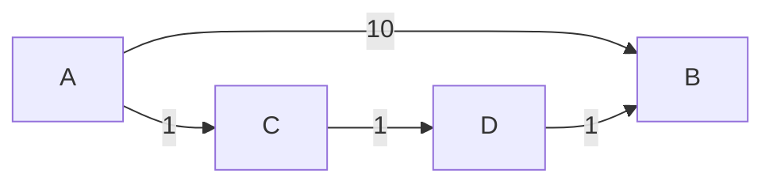
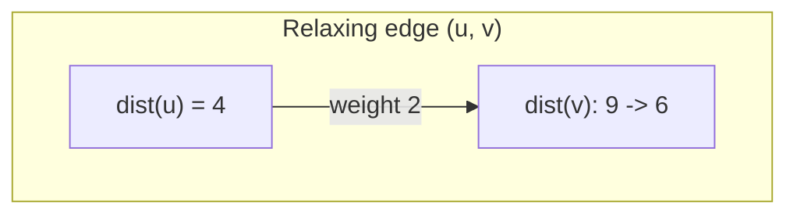

## Learning Objectives

- State precisely what "shortest path" means once edges carry weights, and explain why this is a different problem than the one BFS solves.
- Construct a concrete example where the fewest-edges path and the minimum-total-weight path between two vertices are different paths.
- Define the "relaxation" operation on an edge, and explain its role as the shared mechanism behind every weighted shortest-path algorithm.
- Explain the tentative-distance invariant relaxation maintains, and why it never assigns a distance shorter than any true shortest path.
- Identify why the choice of *which* edges to relax, and in *what order*, is exactly what distinguishes the algorithms built on top of relaxation.

## Context & Motivation

Every traversal covered so far — BFS, DFS, and the components/topological-sort results built on top of them — has operated on graphs where every edge counts equally: an edge is just present or absent, and "distance" means number of edges traversed. Most real applications of shortest-path reasoning are not like this. A road network's edges have different lengths and travel times; a flight-booking graph's edges have different prices; a network-routing graph's edges have different latencies. In every one of these, "the shortest path" plainly should mean the path of least *total cost*, not the path using the fewest hops — and once edges carry weights, these two notions come apart completely, which means BFS's shortest-path guarantee, however carefully proved, simply stops applying.

This topic is deliberately a "setup" topic with no full algorithm of its own — its job is to state the weighted shortest-path problem with enough precision that the next three topics (Dijkstra's algorithm, Bellman-Ford, and DAG shortest paths) can each be understood as a variation on one shared idea, rather than three unrelated tricks to memorize separately. That shared idea is **relaxation**: maintaining, for every vertex, a running "best distance found so far" from the source, and updating it whenever a cheaper path is discovered through some edge. Every weighted shortest-path algorithm in this curriculum is relaxation, applied with a different strategy for choosing which edges to relax and in what order — understanding relaxation itself, once, here, is what makes the differences between those algorithms legible rather than mysterious.

## Core Theory

### Why fewest edges and minimum weight are different problems

Consider a directed graph with edges A→B (weight 10), A→C (weight 1), C→D (weight 1), D→B (weight 1). The path A→B uses a single edge; the path A→C→D→B uses three edges. BFS, which counts only edges, would report A→B as the shorter path (1 edge versus 3). But by total weight, A→B costs 10, while A→C→D→B costs 1+1+1 = 3 — the three-edge path is actually cheaper. Whenever edge weights vary, the path with fewer edges can easily cost more overall than a path with more, cheaper edges — so the two notions of "shortest" are simply answering different questions, and an algorithm built for one gives no guarantee whatsoever about the other.



### The weighted shortest-path problem, precisely

Given a directed (or undirected, treated as directed edges in both directions) graph G = (V, E) with a weight function w assigning a real number to every edge, and a source vertex s, the **single-source shortest-paths problem** asks: for every vertex v reachable from s, find the minimum possible total weight, summed over the edges, among all paths from s to v. (For now, assume all edge weights are non-negative — the case explored first, by Dijkstra's algorithm next; negative weights, and the complications they introduce, are the specific concern of the topic after that.)

### Relaxation: the shared mechanism

Every algorithm that follows maintains a **tentative distance** array `dist[v]` for every vertex — initialized to `dist[source] = 0` and `dist[v] = ∞` for every other vertex, representing "the best upper bound found so far on the true shortest distance to v," which only ever decreases as the algorithm progresses. The single operation every one of these algorithms performs, over and over, on individual edges, is **relaxation**:

```python
def relax(dist, parent, u, v, weight):
    if dist[u] + weight < dist[v]:
        dist[v] = dist[u] + weight
        parent[v] = u
        return True   # an improvement was made
    return False
```

Relaxing edge (u, v) asks a single question: "does going through u give a cheaper route to v than whatever is currently recorded?" If so, `dist[v]` is updated (relaxed downward) to this cheaper value, and u is recorded as v's predecessor on this better path. If not, nothing changes — the edge (u, v) simply doesn't offer an improvement over what's already known.

### The relaxation invariant

At every point during any algorithm built from relaxation, two facts hold, and they hold regardless of which edges have been relaxed so far or in what order: `dist[v]` is never smaller than the true shortest-path distance from s to v (relaxation only ever assigns `dist[v]` a value equal to `dist[u] + weight` for some *actual* path reaching u with cost `dist[u]`, extended by one real edge — so `dist[v]` always corresponds to the cost of *some* real path, and no real path can be cheaper than the true shortest one); and once `dist[v]` reaches the true shortest-path distance, relaxing any further edge into v can never make it worse (relaxation only ever decreases `dist[v]`, never increases it). Together, these mean that repeatedly relaxing edges can only ever tighten `dist[v]` toward the truth, never overshoot past it and never regress once it arrives — the entire question every algorithm in this cluster answers differently is simply: *which edges to relax, and in what order, to guarantee every `dist[v]` reaches its true value, and how quickly.*



Here, before relaxation, `dist[v] = 9` (some earlier, more expensive path was found); relaxing the edge (u, v) with weight 2, given `dist[u] = 4`, finds `4 + 2 = 6 < 9`, so `dist[v]` is lowered to 6 and v's predecessor is updated to u.

## Worked Examples

### Example 1 — confirming fewest-edges and minimum-weight diverge, by direct calculation

**Problem:** Using the graph A→B (10), A→C (1), C→D (1), D→B (1) from Core Theory, compute both the fewest-edges path and the minimum-weight path from A to B, and confirm they differ.

**Fewest edges (what BFS would report).** A→B directly: 1 edge. A→C→D→B: 3 edges. BFS reports A→B (1 edge) as shortest.

**Minimum weight.** A→B directly: total weight 10. A→C→D→B: total weight 1+1+1 = 3. The minimum-weight path is A→C→D→B, at cost 3 — despite using three times as many edges as the direct route.

**Conclusion.** The two notions of "shortest" disagree on this graph: BFS's answer (A→B, 1 edge) is not the minimum-weight answer (A→C→D→B, weight 3). This is exactly why a dedicated family of algorithms is needed once weights enter the picture.

### Example 2 — tracing relaxation converge to the correct answer, regardless of edge order

**Problem:** Using the same graph, initialize `dist[A] = 0` and all others to infinity, and relax the four edges in two different orders. Confirm both orders eventually produce the correct `dist[B] = 3`.

**Order 1: A→B, A→C, C→D, D→B (in that sequence).**
Relax A→B (weight 10): `dist[B]` = 0+10 = 10 (improved from ∞).
Relax A→C (weight 1): `dist[C]` = 0+1 = 1 (improved from ∞).
Relax C→D (weight 1): `dist[D]` = 1+1 = 2 (improved from ∞).
Relax D→B (weight 1): candidate 2+1 = 3 < 10 (current `dist[B]`) — update `dist[B]` = 3.
Final: `dist[B] = 3`. Correct.

**Order 2: D→B, C→D, A→C, A→B (reversed sequence — note D→B is relaxed before `dist[D]` is even known).**
Relax D→B (weight 1): `dist[D]` is still ∞, so `dist[D] + 1 = ∞`, not an improvement over `dist[B] = ∞` — no change (∞ is not less than ∞).
Relax C→D (weight 1): `dist[C]` is still ∞ too — no change.
Relax A→C (weight 1): `dist[A] + 1 = 0 + 1 = 1 < ∞` — update `dist[C] = 1`.
Relax A→B (weight 10): `dist[A] + 10 = 10 < ∞` — update `dist[B] = 10`.

After one full pass in this order, `dist[B] = 10`, `dist[C] = 1`, `dist[D]` still ∞ — *not yet correct*, since D→B and C→D were relaxed too early, before their inputs were ready. **This is the key lesson:** relaxing edges in an arbitrary, unstructured order can require *multiple full passes* before every distance converges (a second pass, relaxing C→D and D→B again, would now correctly propagate `dist[C] = 1` into `dist[D] = 2` and then into `dist[B] = 3`). The tentative-distance invariant guarantees relaxation never gives a *wrong* (too-small) answer at any point, but it says nothing about *how many relaxations* are needed before every value is correct — that efficiency question is exactly what separates the algorithms that follow: Dijkstra's algorithm chooses an order (always relax the next cheapest vertex first) that guarantees each vertex needs its edges relaxed only once; Bellman-Ford, more conservatively, simply relaxes every edge repeatedly, enough times to guarantee convergence regardless of order.

## Common Misconceptions & Pitfalls

- **"Since BFS already finds shortest paths, it should work on weighted graphs too, just by summing weights along whatever path it finds."** BFS's traversal order is driven entirely by edge count, never by weight — it has no mechanism at all for preferring a cheaper multi-edge path over an expensive single edge, as Example 1 demonstrates directly. Running BFS and then separately summing weights along the path it happens to output does not produce the minimum-weight path; it only reports the weight of whichever path BFS's edge-count-driven exploration happened to find first.
- **"Relaxing an edge always changes `dist[v]`."** Relaxation is explicitly conditional — it only updates `dist[v]` when a strict improvement is found (`dist[u] + weight < dist[v]`); most relaxations, especially later in an algorithm's run once most distances have already converged, find no improvement and change nothing. This is by design, not a special case to handle separately.
- **"Once `dist[v]` is set to some finite value, it must already be the true shortest distance."** As Example 2's second edge order shows, a finite `dist[v]` can still be an overestimate that a later relaxation improves further — `dist[v] = 10` after one pass was not the true answer, 3. Only once no further relaxation can improve any `dist[v]` (a fixed point has been reached) can every value be trusted as final — and how quickly that fixed point is guaranteed to be reached is precisely what differs between Dijkstra's algorithm, Bellman-Ford, and the DAG-specific method.
- **"Negative edge weights just make the arithmetic trickier, not conceptually different."** Negative weights break a structural assumption several algorithms depend on — specifically, that a vertex's shortest distance, once some threshold of relaxation has occurred, can never improve further. This assumption underlies Dijkstra's algorithm specifically, and its failure in the presence of negative weights is the entire motivation for Bellman-Ford, covered two topics from here.

## Summary

Once edges carry weights, "shortest path" means minimum total weight, not minimum edge count — the two questions can have entirely different answers on the same graph, so BFS's guarantee, built entirely around edge count, simply does not transfer. Every algorithm that solves the weighted problem is built from the same primitive operation, relaxation: maintaining a tentative distance for every vertex, initialized to infinity except the source, and lowering it whenever a cheaper path through some edge is found. Relaxation alone guarantees tentative distances never undershoot the truth and never regress once correct, but says nothing about how many relaxations, in what order, are needed to guarantee every distance actually reaches its true value — that efficiency question, and the different answers to it, is exactly what distinguishes Dijkstra's algorithm, Bellman-Ford, and DAG shortest paths, each covered next.

## Documentation Links

- [MIT 6.006 — Lecture Notes (OCW)](https://ocw.mit.edu/courses/6-006-introduction-to-algorithms-spring-2020/pages/lecture-notes/) — doc
- [Sedgewick & Wayne — Algorithms Lectures (Princeton)](https://algs4.cs.princeton.edu/lectures/) — doc
