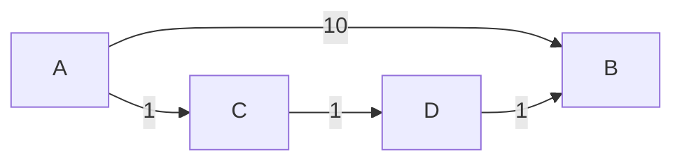
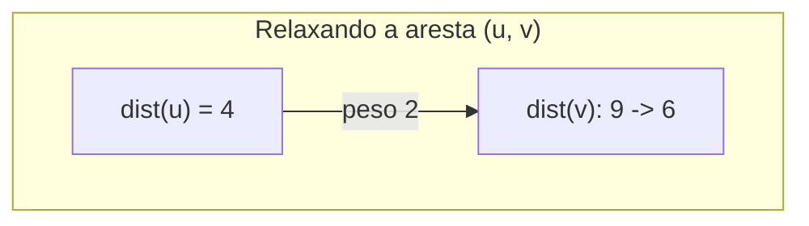

## Objetivos de Aprendizagem

- Enunciar precisamente o que "caminho mais curto" significa uma vez que arestas carregam pesos, e explicar por que isso é um problema diferente do que BFS resolve.
- Construir um exemplo concreto onde o caminho de menos arestas e o caminho de peso total mínimo entre dois vértices são caminhos diferentes.
- Definir a operação de "relaxamento" em uma aresta, e explicar seu papel como o mecanismo compartilhado por trás de todo algoritmo de caminho mais curto ponderado.
- Explicar o invariante de distância tentativa que relaxamento mantém, e por que nunca atribui uma distância mais curta que qualquer caminho mais curto verdadeiro.
- Identificar por que a escolha de *quais* arestas relaxar, e em *que ordem*, é exatamente o que distingue os algoritmos construídos sobre relaxamento.

## Contexto e Motivação

Toda travessia coberta até agora, BFS, DFS, e os resultados de componentes/ordenação-topológica construídos sobre elas, operou em grafos onde toda aresta conta igualmente: uma aresta está simplesmente presente ou ausente, e "distância" significa número de arestas percorridas. A maioria das aplicações reais de raciocínio sobre caminho mais curto não é assim. As arestas de uma rede rodoviária têm comprimentos e tempos de viagem diferentes; as arestas de um grafo de reserva de voos têm preços diferentes; as arestas de um grafo de roteamento de rede têm latências diferentes. Em cada um desses, "o caminho mais curto" claramente deveria significar o caminho de menor *custo total*, não o caminho usando menos saltos, e uma vez que arestas carregam pesos, essas duas noções se separam completamente, o que significa que a garantia de caminho mais curto de BFS, por mais cuidadosamente provada que seja, simplesmente para de se aplicar.

Este tópico é deliberadamente um tópico de "preparação" sem nenhum algoritmo completo próprio, seu trabalho é enunciar o problema de caminho mais curto ponderado com precisão suficiente para que os próximos três tópicos (algoritmo de Dijkstra, Bellman-Ford, e caminhos mais curtos em DAG) possam cada um ser entendido como uma variação de uma ideia compartilhada, em vez de três truques não relacionados para memorizar separadamente. Essa ideia compartilhada é **relaxamento**: manter, para todo vértice, uma "melhor distância encontrada até agora" corrente a partir da fonte, e atualizá-la sempre que um caminho mais barato é descoberto através de alguma aresta. Todo algoritmo de caminho mais curto ponderado neste currículo é relaxamento, aplicado com uma estratégia diferente para escolher quais arestas relaxar e em que ordem, entender o próprio relaxamento, uma vez, aqui, é o que torna as diferenças entre esses algoritmos legíveis em vez de misteriosas.

## Teoria Central

### Por que menos arestas e peso mínimo são problemas diferentes

Considere um grafo direcionado com arestas A→B (peso 10), A→C (peso 1), C→D (peso 1), D→B (peso 1). O caminho A→B usa uma única aresta; o caminho A→C→D→B usa três arestas. BFS, que só conta arestas, relataria A→B como o caminho mais curto (1 aresta versus 3). Mas por peso total, A→B custa 10, enquanto A→C→D→B custa 1+1+1 = 3, o caminho de três arestas é na verdade mais barato. Sempre que pesos de aresta variam, o caminho com menos arestas pode facilmente custar mais no total que um caminho com mais arestas, mais baratas, então as duas noções de "mais curto" estão simplesmente respondendo perguntas diferentes, e um algoritmo construído para uma não dá nenhuma garantia sobre a outra.



### O problema de caminho mais curto ponderado, precisamente

Dado um grafo direcionado (ou não direcionado, tratado como arestas direcionadas em ambas as direções) G = (V, E) com uma função de peso w atribuindo um número real a toda aresta, e um vértice fonte s, o **problema de caminhos mais curtos de fonte única** pede: para todo vértice v alcançável a partir de s, encontre o peso total mínimo possível, somado sobre as arestas, entre todos os caminhos de s a v. (Por ora, assuma que todos os pesos de aresta são não negativos, o caso explorado primeiro, pelo algoritmo de Dijkstra em seguida; pesos negativos, e as complicações que introduzem, são a preocupação específica do tópico depois desse.)

### Relaxamento: o mecanismo compartilhado

Todo algoritmo que segue mantém um array de **distância tentativa** `dist[v]` para todo vértice, inicializado com `dist[fonte] = 0` e `dist[v] = ∞` para todo outro vértice, representando "o melhor limite superior encontrado até agora na distância mais curta verdadeira até v," que só jamais diminui conforme o algoritmo progride. A única operação que cada um desses algoritmos realiza, repetidamente, em arestas individuais, é **relaxamento**:

```python
def relax(dist, parent, u, v, weight):
    if dist[u] + weight < dist[v]:
        dist[v] = dist[u] + weight
        parent[v] = u
        return True   # uma melhoria foi feita
    return False
```

Relaxar a aresta (u, v) faz uma única pergunta: "passar por u dá uma rota mais barata para v do que o que quer que esteja registrado atualmente?" Se sim, `dist[v]` é atualizado (relaxado para baixo) para esse valor mais barato, e u é registrado como o predecessor de v neste caminho melhor. Se não, nada muda, a aresta (u, v) simplesmente não oferece uma melhoria sobre o que já é conhecido.

### O invariante de relaxamento

Em todo ponto durante qualquer algoritmo construído a partir de relaxamento, dois fatos valem, e valem independentemente de quais arestas foram relaxadas até agora ou em que ordem: `dist[v]` nunca é menor que a distância verdadeira de caminho mais curto de s a v (relaxamento só jamais atribui a `dist[v]` um valor igual a `dist[u] + peso` para algum caminho *real* alcançando u com custo `dist[u]`, estendido por uma aresta real, então `dist[v]` sempre corresponde ao custo de *algum* caminho real, e nenhum caminho real pode ser mais barato que o verdadeiro mais curto); e uma vez que `dist[v]` alcança a distância verdadeira de caminho mais curto, relaxar qualquer aresta adicional em v nunca pode torná-la pior (relaxamento só jamais diminui `dist[v]`, nunca aumenta). Juntos, esses significam que relaxar arestas repetidamente só jamais pode apertar `dist[v]` em direção à verdade, nunca ultrapassá-la e nunca regredir uma vez que chega, a pergunta inteira que todo algoritmo deste grupo responde de forma diferente é simplesmente: *quais arestas relaxar, e em que ordem, para garantir que todo `dist[v]` alcance seu valor verdadeiro, e quão rapidamente.*



Aqui, antes do relaxamento, `dist[v] = 9` (algum caminho anterior, mais caro, foi encontrado); relaxar a aresta (u, v) com peso 2, dado `dist[u] = 4`, encontra `4 + 2 = 6 < 9`, então `dist[v]` é abaixado para 6 e o predecessor de v é atualizado para u.

## Exemplos Resolvidos

### Exemplo 1 — confirmando que menos-arestas e peso-mínimo divergem, por cálculo direto

**Problema:** Usando o grafo A→B (10), A→C (1), C→D (1), D→B (1) da Teoria Central, calcule tanto o caminho de menos arestas quanto o caminho de peso mínimo de A a B, e confirme que diferem.

**Menos arestas (o que BFS relataria).** A→B diretamente: 1 aresta. A→C→D→B: 3 arestas. BFS relata A→B (1 aresta) como o mais curto.

**Peso mínimo.** A→B diretamente: peso total 10. A→C→D→B: peso total 1+1+1 = 3. O caminho de peso mínimo é A→C→D→B, a custo 3, apesar de usar três vezes mais arestas que a rota direta.

**Conclusão.** As duas noções de "mais curto" discordam neste grafo: a resposta de BFS (A→B, 1 aresta) não é a resposta de peso mínimo (A→C→D→B, peso 3). Isso é exatamente por que uma família dedicada de algoritmos é necessária uma vez que pesos entram em cena.

### Exemplo 2 — rastreando relaxamento convergindo para a resposta correta, independentemente da ordem de aresta

**Problema:** Usando o mesmo grafo, inicialize `dist[A] = 0` e todos os outros como infinito, e relaxe as quatro arestas em duas ordens diferentes. Confirme que ambas as ordens eventualmente produzem a resposta correta `dist[B] = 3`.

**Ordem 1: A→B, A→C, C→D, D→B (nessa sequência).**
Relaxa A→B (peso 10): `dist[B]` = 0+10 = 10 (melhorado de ∞).
Relaxa A→C (peso 1): `dist[C]` = 0+1 = 1 (melhorado de ∞).
Relaxa C→D (peso 1): `dist[D]` = 1+1 = 2 (melhorado de ∞).
Relaxa D→B (peso 1): candidato 2+1 = 3 < 10 (`dist[B]` atual), atualiza `dist[B]` = 3.
Final: `dist[B] = 3`. Correto.

**Ordem 2: D→B, C→D, A→C, A→B (sequência invertida, note que D→B é relaxada antes mesmo de `dist[D]` ser conhecido).**
Relaxa D→B (peso 1): `dist[D]` ainda é ∞, então `dist[D] + 1 = ∞`, não é melhoria sobre `dist[B] = ∞`, sem mudança (∞ não é menor que ∞).
Relaxa C→D (peso 1): `dist[C]` ainda é ∞ também, sem mudança.
Relaxa A→C (peso 1): `dist[A] + 1 = 0 + 1 = 1 < ∞`, atualiza `dist[C] = 1`.
Relaxa A→B (peso 10): `dist[A] + 10 = 10 < ∞`, atualiza `dist[B] = 10`.

Depois de uma passagem completa nessa ordem, `dist[B] = 10`, `dist[C] = 1`, `dist[D]` ainda ∞, *ainda não correto*, já que D→B e C→D foram relaxadas cedo demais, antes que suas entradas estivessem prontas. **Esta é a lição chave:** relaxar arestas em uma ordem arbitrária, não estruturada, pode exigir *múltiplas passagens completas* antes que toda distância convirja (uma segunda passagem, relaxando C→D e D→B de novo, agora propagaria corretamente `dist[C] = 1` em `dist[D] = 2` e depois em `dist[B] = 3`). O invariante de distância tentativa garante que relaxamento nunca dá uma resposta *errada* (subestimada) em nenhum ponto, mas não diz nada sobre *quantos relaxamentos* são necessários antes que todo valor esteja correto, essa pergunta de eficiência é exatamente o que separa os algoritmos que seguem: o algoritmo de Dijkstra escolhe uma ordem (sempre relaxa o próximo vértice mais barato primeiro) que garante que cada vértice precisa de suas arestas relaxadas apenas uma vez; Bellman-Ford, mais conservadoramente, simplesmente relaxa toda aresta repetidamente, o suficiente para garantir convergência independentemente da ordem.

## Equívocos Comuns e Armadilhas

- **"Já que BFS já encontra caminhos mais curtos, deveria funcionar em grafos ponderados também, só somando pesos ao longo de qualquer caminho que encontre."** A ordem de travessia de BFS é inteiramente movida por contagem de arestas, nunca por peso, não tem nenhum mecanismo de forma alguma para preferir um caminho de múltiplas arestas mais barato sobre uma única aresta cara, como o Exemplo 1 demonstra diretamente. Rodar BFS e depois separadamente somar pesos ao longo do caminho que acontece de produzir não produz o caminho de peso mínimo; só relata o peso de qualquer caminho que a exploração de BFS movida por contagem de arestas aconteceu de encontrar primeiro.
- **"Relaxar uma aresta sempre muda `dist[v]`."** Relaxamento é explicitamente condicional, só atualiza `dist[v]` quando uma melhoria estrita é encontrada (`dist[u] + peso < dist[v]`); a maioria dos relaxamentos, especialmente mais tarde na execução de um algoritmo uma vez que a maioria das distâncias já convergiu, não encontra melhoria e não muda nada. Isso é por design, não um caso especial a tratar separadamente.
- **"Uma vez que `dist[v]` é definido para algum valor finito, já deve ser a distância mais curta verdadeira."** Como a segunda ordem de aresta do Exemplo 2 mostra, um `dist[v]` finito ainda pode ser uma superestimativa que um relaxamento posterior melhora ainda mais, `dist[v] = 10` depois de uma passagem não era a resposta verdadeira, 3. Só uma vez que nenhum relaxamento adicional pode melhorar nenhum `dist[v]` (um ponto fixo foi alcançado) todo valor pode ser confiado como final, e quão rapidamente esse ponto fixo é garantido ser alcançado é precisamente o que difere entre o algoritmo de Dijkstra, Bellman-Ford, e o método específico para DAG.
- **"Pesos de aresta negativos só tornam a aritmética mais complicada, não conceitualmente diferente."** Pesos negativos quebram uma suposição estrutural da qual vários algoritmos dependem, especificamente, que a distância mais curta de um vértice, uma vez que algum limiar de relaxamento ocorreu, nunca pode melhorar mais. Essa suposição sustenta o algoritmo de Dijkstra especificamente, e sua falha na presença de pesos negativos é a motivação inteira para Bellman-Ford, coberto dois tópicos a partir daqui.

## Resumo

Uma vez que arestas carregam pesos, "caminho mais curto" significa peso total mínimo, não contagem mínima de arestas, as duas perguntas podem ter respostas inteiramente diferentes no mesmo grafo, então a garantia de BFS, construída inteiramente em torno de contagem de arestas, simplesmente não se transfere. Todo algoritmo que resolve o problema ponderado é construído a partir da mesma operação primitiva, relaxamento: manter uma distância tentativa para todo vértice, inicializada em infinito exceto a fonte, e diminuí-la sempre que um caminho mais barato através de alguma aresta é encontrado. Relaxamento sozinho garante que distâncias tentativas nunca subestimam a verdade e nunca regridem uma vez corretas, mas não diz nada sobre quantos relaxamentos, em que ordem, são necessários para garantir que toda distância de fato alcance seu valor verdadeiro, essa pergunta de eficiência, e as diferentes respostas a ela, é exatamente o que distingue o algoritmo de Dijkstra, Bellman-Ford, e caminhos mais curtos em DAG, cada um coberto em seguida.

## Documentation Links

- [MIT 6.006 — Lecture Notes (OCW)](https://ocw.mit.edu/courses/6-006-introduction-to-algorithms-spring-2020/pages/lecture-notes/) — doc
- [Sedgewick & Wayne — Algorithms Lectures (Princeton)](https://algs4.cs.princeton.edu/lectures/) — doc
