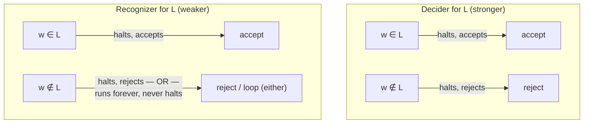
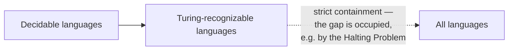

## Learning Objectives

- Define what it means for a Turing machine to *decide* a language, and distinguish this from what it means to *recognize* one.
- Explain, with a concrete construction, why every decidable language is Turing-recognizable.
- Explain, with a concrete construction, why the converse fails — a recognizable language need not be decidable.
- Identify the specific asymmetry (halting on "yes" instances but possibly looping on "no" instances) that makes recognizable-but-undecidable languages possible at all.
- Classify a given informally-described language as decidable, recognizable-but-not-known-decidable, or neither, based on what kind of machine can be built for it.

## Context & Motivation

The previous concept fixed, with full precision, what it means for a Turing machine to accept, reject, or loop forever on an input. That three-way split turns out to support two genuinely different, and easily conflated, notions of what it means for a language to be "solved" by a machine. The stronger notion — a machine that always halts, and always answers correctly, accept or reject, on every possible input — is what most people mean intuitively by "there's an algorithm for this." The weaker notion — a machine that correctly says "yes" on every string that belongs to the language, but is allowed to either reject *or* run forever without ever answering on a string that does not belong — is subtler, easy to overlook, and turns out to be exactly the notion needed to describe some of the most important undecidable problems in the field, starting with the Halting Problem itself in the very next concept in this track.

This distinction is not a technicality invented to make the theory harder — it reflects something real and unavoidable about mechanical computation. There exist languages for which no machine can be built that always halts and always answers correctly — and yet a machine *can* be built that always answers correctly *when the answer is yes*, simply failing to terminate when the answer would be no. That such a gap is even possible, let alone actually occupied by important problems, is one of the most consequential facts in this entire discipline: it means "no algorithm decides this" and "there's no way to make any progress on this at all" are not the same statement. A recognizer for an undecidable language is not nothing — it is a real, useful, half-working procedure — it is simply not a decider. Sipser's treatment of computability (traced in MIT's 18.404 and Stanford's CS154, both cited throughout this track) builds the entire subsequent argument for the Halting Problem's undecidability on exactly this distinction, which is why it is worth understanding thoroughly, and in its own right, before that argument is given.

## Core Theory

### Decidable languages

A language L is **decidable** (also called **recursive**, in older terminology) if there exists a Turing machine M such that:

- M halts on **every** input w (no input ever causes M to loop forever), and
- M accepts w if w ∈ L, and M rejects w if w ∉ L.

Such an M is called a **decider** for L. Crucially, a decider gives a *complete* answer on every conceivable input, with a guaranteed termination bound (even if that bound isn't known in advance) — there is never a case where you feed a decider some input and simply wait without any guarantee of ever getting an answer.

### Turing-recognizable languages

A language L is **Turing-recognizable** (also called **recursively enumerable**, in older terminology) if there exists a Turing machine M such that:

- M accepts w if and only if w ∈ L.

Note carefully what this does *not* require: nothing is said about what M does on an input w ∉ L. M might reject w, or M might simply run forever, never halting at all. Both behaviors are permitted equally by this definition — a **recognizer** is only obligated to behave correctly, and to eventually announce that behavior by halting, on the "yes" instances.

### Every decidable language is Turing-recognizable

**Claim.** If L is decidable, then L is Turing-recognizable.

**Argument.** Suppose M decides L — M halts on every input, accepting exactly the strings in L and rejecting exactly the strings not in L. Then M itself already satisfies the definition of a recognizer for L: it accepts w whenever w ∈ L (that requirement is identical in both definitions). The only thing the recognizer definition permits that the decider definition doesn't require is looping on non-members — but a decider is not *forced* to loop on non-members, it is simply not forbidden from behaving even better (i.e., always halting). So M, unmodified, already recognizes L. No construction is even needed here — being a decider is a strictly stronger guarantee that automatically implies the weaker one.

This gives the containment **Decidable ⊆ Turing-recognizable**: every decidable language is recognizable, with the identical machine serving both roles.

### Not every recognizable language is decidable — the halt-and-simulate asymmetry

The converse containment fails, and the reason it fails is the single most important idea in this concept: it is possible to build a machine that correctly recognizes a language by **simulating** some other computational process and accepting if-and-only-if that process eventually halts and signals a "yes" — but the simulation itself has no way to distinguish "the process I'm watching is still working, just needs more time" from "the process I'm watching will never finish." If the underlying process does eventually finish with a "yes," the simulator eventually notices and accepts — correctly, and after some finite (if unpredictable) amount of time. But if the underlying process runs forever, the simulator, faithfully mirroring it step by step, also runs forever — it cannot reliably conclude "this will never finish" and switch to rejecting instead, because from the simulator's vantage point at any given moment, "still going" and "going forever" look identical; there is no general way to tell them apart from the outside.

This is exactly the asymmetry that makes recognizable-but-undecidable languages possible: a recognizer only has to succeed, and eventually say so, on the "yes" side; on the "no" side, it is allowed to fail forever, silently, without ever admitting it will never succeed. A decider, by contrast, must resolve *every* input, including every "no" input, within some finite time — and it is precisely this stronger, symmetric requirement (must eventually halt on both sides) that some languages fail to satisfy, even while a one-sided recognizer for them exists. (The next concept in this track, the Halting Problem, makes this fully concrete: "does this specific Turing machine halt on this specific input" is recognizable by exactly this halt-and-simulate technique — simulate the machine, and accept if it halts — yet is proved, by a diagonalization argument, to be undecidable; no machine can *also* correctly and reliably say "no, it never halts" in finite time for every non-halting instance.)

## Worked Examples

### Example 1 — a straightforward decidable language

**Problem:** Show that L_even = { w ∈ {0,1}\* : w has an even number of 1's } is decidable (this reuses the machine from the previous concept in this track).

**Argument.** The two-state machine from that concept (q_even/q_odd tracking parity while scanning left to right) halts on every input — every step either moves the head one cell to the right toward the end of a finite string, or (once a blank is reached) halts immediately in q_accept or q_reject depending on the current state. There is no input on which this machine loops: the number of steps taken is always exactly the length of w, plus one to detect the blank. Since it halts on every input and answers correctly (accept exactly the even-parity strings, reject exactly the odd-parity ones), it is a decider, and L_even is decidable — and therefore, by the containment argument above, also Turing-recognizable, using this identical machine.

### Example 2 — the "does this TM halt on this input" language is recognizable

**Problem:** Let HALT = { ⟨M, w⟩ : M is a Turing machine, and M halts when run on input w }. Argue informally that HALT is Turing-recognizable.

**Construction (the halt-and-simulate recognizer).** Build a machine U that, on input ⟨M, w⟩, simulates M running on w step by step (this is an informal sketch — the machinery for one machine to simulate another by reading its description is exactly the kind of encoding this track deliberately keeps out of scope; only the *behavior* being described matters here). Two cases:

- If M halts on w (whether by accepting or rejecting — HALT only asks about halting, not about M's answer), then at some finite step of the simulation, U observes this halt, and U itself halts and accepts ⟨M, w⟩.
- If M never halts on w, U's simulation of M also never halts — U faithfully mirrors every step M would take, and if that sequence is infinite, so is U's.

This U is exactly a recognizer for HALT by the formal definition: U accepts ⟨M, w⟩ whenever ⟨M, w⟩ ∈ HALT (i.e., whenever M does halt on w) — and on inputs where ⟨M, w⟩ ∉ HALT (M never halts on w), U simply runs forever, which the recognizer definition explicitly permits. Notice this construction gives no way at all to *decide* HALT using this same idea — there is no finite amount of simulated time after which "M hasn't halted yet" can be safely converted into "M will never halt," since for any finite amount of simulated time, some machines really would halt just one step later. (Whether some entirely different technique — not simulation — could decide HALT is exactly the question the Halting Problem concept, next in this track, answers definitively: no, provably, by diagonalization.) This is the halt-and-simulate asymmetry from Core Theory made completely concrete: recognized because "yes" instances are always eventually caught by direct simulation; not (this way, at least) decided, because "no" instances give the simulator no finite signal to act on.

### Example 3 — classifying an informally described language

**Problem:** Let L = { n : n is a positive integer such that some run of n consecutive 7's appears somewhere in the decimal expansion of π }. (This is a real, if famously hard, open question in mathematics — it is not currently known whether every finite run length n eventually appears in π's digits.) Classify L as best as current knowledge allows.

**Reasoning.** L is Turing-recognizable: build a machine that, on input n, starts computing the digits of π one at a time (this is a fully mechanical, terminating process at each step — computing the k-th digit of π is itself decidable and takes some finite, if growing, amount of time) and scans the digits produced so far for a run of n consecutive 7's; the moment such a run is found, halt and accept. If n does have such a run somewhere in π, this machine eventually finds it (since it checks longer and longer prefixes of π's digits without bound) and accepts — correctly recognizing every n ∈ L. But if no such run of length n ever occurs anywhere in π's infinite decimal expansion, this machine runs forever, checking longer and longer prefixes without ever finding what isn't there — exactly the halt-and-simulate asymmetry again, this time arising from an open mathematical question rather than from self-reference. Whether L is *decidable* is unknown, because it is not currently known whether the underlying question ("does every n eventually appear as a run-length in π") always resolves one way or the other in a way that could be exploited by some entirely different (non-searching) algorithm. This example illustrates that the recognizable-not-known-decidable gap isn't only inhabited by exotic, self-referential constructions like the Halting Problem — it can show up wherever "search forward and stop when found" is the only known technique, and no argument bounds how long the search might need to run.

## Common Misconceptions & Pitfalls

- **"Recognizable just means 'decidable but slower.'"** No amount of extra time turns a recognizer for an undecidable language into a decider — the issue in Example 2 is not that U is inefficient, it is that no finite amount of simulated time can ever be safely interpreted as "M will never halt," for any M. Speed is irrelevant; the gap is about the *existence* of a terminating procedure at all on the "no" side, not the cost of one that already exists.
- **"If I can't find a decider after trying, the language must not be decidable."** Not being decidable and not yet knowing a decider are very different claims. Some languages are provably undecidable (the Halting Problem, proved next in this track); others, like Example 3's language about π, are simply open — nobody currently knows whether a decider exists, and "recognizable, decidability unknown" is a legitimate, stable classification in its own right, not a placeholder for "undecidable, just not yet proven."
- **"A recognizer that rejects instead of looping on every non-member is basically the same as a decider."** By the formal definitions, a recognizer that happens to always halt (accepting members, rejecting everyone else) *is* a decider — the two definitions coincide exactly when the machine never loops. The subtlety in this concept only matters for recognizers that genuinely do loop on some non-members; a recognizer built to always halt on both sides is not an example of the gap at all, it's simply a decider described awkwardly.
- **"Every language is either decidable or recognizable — there's no third category."** There is a third, larger category still: languages that are not even Turing-recognizable — no machine accepts exactly their members either, not even one permitted to loop on non-members. The containments are strict at both stages: decidable ⊊ Turing-recognizable ⊊ all languages. This concept establishes the first strict containment; the fact that some languages fail to be recognizable at all is a separate, further fact (touched on when the Halting Problem's complement is examined, later in this track), not something this concept alone asserts.

## Summary

A Turing machine **decides** a language if it halts on every input and always answers correctly — accept exactly the members, reject exactly the non-members. A Turing machine **recognizes** a language if it accepts exactly the members, but is permitted to either reject or loop forever on non-members, with no obligation to ever announce a "no." Every decider is trivially already a recognizer, giving **Decidable ⊆ Turing-recognizable** — but the reverse fails, because a recognizer only needs a finite-time signal for "yes" instances, and some languages (the Halting Problem chief among them, via the halt-and-simulate construction: simulate the machine in question, and accept the moment it halts) provably admit such a one-sided signal without admitting any way to reliably detect "no" in finite time as well. This asymmetry — catching every "yes" eventually, while potentially running forever on every "no" — is the precise mechanism that makes recognizable-but-undecidable languages possible, and it is exactly the gap the Halting Problem, the next concept in this track, is proved to occupy.

## Documentation Links

- [MIT 18.404/6.5400 — Course Information (Sipser)](https://math.mit.edu/~sipser/18404/info.pdf) — doc
- [Stanford CS154 — Course Home](https://cs154.stanford.edu/) — doc
