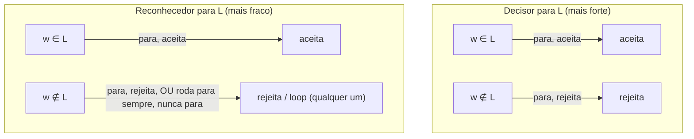
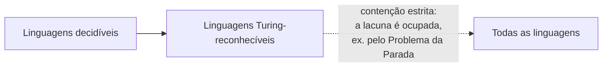

## Objetivos de Aprendizagem

- Definir o que significa uma máquina de Turing *decidir* uma linguagem, e distinguir isso do que significa *reconhecer* uma.
- Explicar, com uma construção concreta, por que toda linguagem decidível é Turing-reconhecível.
- Explicar, com uma construção concreta, por que a recíproca falha, uma linguagem reconhecível não precisa ser decidível.
- Identificar a assimetria específica (parar em instâncias "sim" mas possivelmente rodar em loop em instâncias "não") que torna possíveis de forma alguma linguagens reconhecíveis-mas-indecidíveis.
- Classificar uma linguagem descrita informalmente como decidível, reconhecível-mas-não-conhecida-como-decidível, ou nenhuma das duas, com base em que tipo de máquina pode ser construída para ela.

## Contexto e Motivação

O conceito anterior fixou, com precisão total, o que significa uma máquina de Turing aceitar, rejeitar, ou rodar para sempre em uma entrada. Aquela divisão em três acaba sustentando duas noções genuinamente diferentes, e facilmente confundidas, do que significa uma linguagem ser "resolvida" por uma máquina. A noção mais forte, uma máquina que sempre para, e sempre responde corretamente, aceita ou rejeita, em toda entrada possível, é o que a maioria das pessoas quer dizer intuitivamente com "existe um algoritmo para isto." A noção mais fraca, uma máquina que corretamente diz "sim" em toda string que pertence à linguagem, mas tem permissão para ou rejeitar *ou* rodar para sempre sem jamais responder em uma string que não pertence, é mais sutil, fácil de ignorar, e acaba sendo exatamente a noção necessária para descrever alguns dos problemas indecidíveis mais importantes desta área, começando com o próprio Problema da Parada no próximo conceito desta trilha.

Essa distinção não é uma tecnicalidade inventada para tornar a teoria mais difícil, ela reflete algo real e inevitável sobre computação mecânica. Existem linguagens para as quais nenhuma máquina pode ser construída que sempre para e sempre responde corretamente, e ainda assim uma máquina *pode* ser construída que sempre responde corretamente *quando a resposta é sim*, simplesmente falhando em terminar quando a resposta seria não. Que tal lacuna seja sequer possível, e mais ainda de fato ocupada por problemas importantes, é um dos fatos mais consequentes nesta disciplina inteira: significa que "nenhum algoritmo decide isto" e "não há como fazer nenhum progresso nisto de forma alguma" não são a mesma afirmação. Um reconhecedor para uma linguagem indecidível não é nada, é um procedimento real, útil, meio-funcional, ele simplesmente não é um decisor. O tratamento de Sipser sobre computabilidade (seguido no 18.404 do MIT e no CS154 de Stanford, ambos citados ao longo desta trilha) constrói o argumento subsequente inteiro para a indecidibilidade do Problema da Parada exatamente sobre esta distinção, o que é por que vale a pena entendê-la completamente, e em seu próprio direito, antes que aquele argumento seja dado.

## Teoria Central

### Linguagens decidíveis

Uma linguagem L é **decidível** (também chamada **recursiva**, em terminologia mais antiga) se existe uma máquina de Turing M tal que:

- M para em **toda** entrada w (nenhuma entrada jamais faz M rodar para sempre em loop), e
- M aceita w se w ∈ L, e M rejeita w se w ∉ L.

Tal M é chamada de **decisor** para L. Crucialmente, um decisor dá uma resposta *completa* em toda entrada concebível, com um limite de terminação garantido (mesmo que aquele limite não seja conhecido de antemão), nunca há um caso onde você entrega a um decisor alguma entrada e simplesmente espera sem nenhuma garantia de algum dia obter uma resposta.

### Linguagens Turing-reconhecíveis

Uma linguagem L é **Turing-reconhecível** (também chamada **recursivamente enumerável**, em terminologia mais antiga) se existe uma máquina de Turing M tal que:

- M aceita w se e somente se w ∈ L.

Note cuidadosamente o que isso *não* exige: nada é dito sobre o que M faz em uma entrada w ∉ L. M pode rejeitar w, ou M pode simplesmente rodar para sempre, nunca parando de forma alguma. Ambos os comportamentos são permitidos igualmente por esta definição, um **reconhecedor** só é obrigado a se comportar corretamente, e eventualmente anunciar aquele comportamento parando, nas instâncias "sim."

### Toda linguagem decidível é Turing-reconhecível

**Afirmação.** Se L é decidível, então L é Turing-reconhecível.

**Argumento.** Suponha que M decide L, M para em toda entrada, aceitando exatamente as strings em L e rejeitando exatamente as strings que não estão em L. Então M em si já satisfaz a definição de um reconhecedor para L: ela aceita w sempre que w ∈ L (aquele requisito é idêntico em ambas as definições). A única coisa que a definição de reconhecedor permite que a definição de decisor não exige é rodar em loop em não-membros, mas um decisor não é *forçado* a rodar em loop em não-membros, ele simplesmente não é proibido de se comportar ainda melhor (ou seja, sempre parar). Então M, sem modificação, já reconhece L. Nenhuma construção é sequer necessária aqui, ser um decisor é uma garantia estritamente mais forte que automaticamente implica a mais fraca.

Isso dá a contenção **Decidível ⊆ Turing-reconhecível**: toda linguagem decidível é reconhecível, com a máquina idêntica servindo ambos os papéis.

### Nem toda linguagem reconhecível é decidível: a assimetria parar-e-simular

A contenção recíproca falha, e a razão pela qual falha é a ideia mais importante deste conceito: é possível construir uma máquina que corretamente reconhece uma linguagem **simulando** algum outro processo computacional e aceitando se-e-somente-se aquele processo eventualmente para e sinaliza um "sim", mas a própria simulação não tem como distinguir "o processo que estou observando ainda está trabalhando, só precisa de mais tempo" de "o processo que estou observando nunca vai terminar." Se o processo subjacente de fato termina com um "sim", o simulador eventualmente percebe e aceita, corretamente, depois de alguma quantidade finita (se imprevisível) de tempo. Mas se o processo subjacente roda para sempre, o simulador, espelhando-o fielmente passo a passo, também roda para sempre, ele não consegue concluir de forma confiável "isto nunca vai terminar" e trocar para rejeitar em vez disso, porque do ponto de vista do simulador em qualquer momento dado, "ainda continuando" e "continuando para sempre" parecem idênticos; não há forma geral de distingui-los de fora.

Esta é exatamente a assimetria que torna possíveis linguagens reconhecíveis-mas-indecidíveis: um reconhecedor só precisa ter sucesso, e eventualmente dizer isso, do lado "sim"; do lado "não", ele tem permissão para falhar para sempre, silenciosamente, sem jamais admitir que nunca vai ter sucesso. Um decisor, em contraste, precisa resolver *toda* entrada, incluindo toda entrada "não", dentro de algum tempo finito, e é precisamente este requisito mais forte, simétrico (precisa eventualmente parar em ambos os lados) que algumas linguagens falham em satisfazer, mesmo enquanto um reconhecedor unilateral para elas existe. (O próximo conceito nesta trilha, o Problema da Parada, torna isto totalmente concreto: "esta máquina de Turing específica para nesta entrada específica" é reconhecível por exatamente essa técnica de parar-e-simular, simule a máquina, e aceite se ela para, ainda assim é demonstrado, por um argumento de diagonalização, ser indecidível; nenhuma máquina consegue *também* corretamente e confiavelmente dizer "não, ela nunca para" em tempo finito para toda instância que não para.)

## Exemplos Resolvidos

### Exemplo 1: uma linguagem decidível direta

**Problema:** Mostre que L_even = { w ∈ {0,1}* : w tem um número par de 1's } é decidível (isso reutiliza a máquina do conceito anterior nesta trilha).

**Argumento.** A máquina de dois estados daquele conceito (q_even/q_odd rastreando paridade enquanto varre da esquerda para a direita) para em toda entrada, todo passo ou move a cabeça uma célula para a direita em direção ao fim de uma string finita, ou (uma vez que um branco é alcançado) para imediatamente em q_accept ou q_reject dependendo do estado corrente. Não há entrada na qual esta máquina roda em loop: o número de passos dados é sempre exatamente o comprimento de w, mais um para detectar o branco. Já que ela para em toda entrada e responde corretamente (aceita exatamente as strings de paridade par, rejeita exatamente as de paridade ímpar), ela é um decisor, e L_even é decidível, e portanto, pelo argumento de contenção acima, também Turing-reconhecível, usando esta máquina idêntica.

### Exemplo 2: a linguagem "esta MT para nesta entrada" é reconhecível

**Problema:** Seja HALT = { ⟨M, w⟩ : M é uma máquina de Turing, e M para quando rodada na entrada w }. Argumente informalmente que HALT é Turing-reconhecível.

**Construção (o reconhecedor parar-e-simular).** Construa uma máquina U que, na entrada ⟨M, w⟩, simula M rodando em w passo a passo (este é um esboço informal, a maquinaria para uma máquina simular outra lendo sua descrição é exatamente o tipo de codificação que esta trilha deliberadamente mantém fora de escopo; só o *comportamento* sendo descrito importa aqui). Dois casos:

- Se M para em w (seja aceitando ou rejeitando, HALT só pergunta sobre parar, não sobre a resposta de M), então em algum passo finito da simulação, U observa essa parada, e U mesma para e aceita ⟨M, w⟩.
- Se M nunca para em w, a simulação de M feita por U também nunca para, U espelha fielmente todo passo que M daria, e se aquela sequência é infinita, a de U também é.

Esta U é exatamente um reconhecedor para HALT pela definição formal: U aceita ⟨M, w⟩ sempre que ⟨M, w⟩ ∈ HALT (ou seja, sempre que M de fato para em w), e em entradas onde ⟨M, w⟩ ∉ HALT (M nunca para em w), U simplesmente roda para sempre, o que a definição de reconhecedor permite explicitamente. Note que esta construção não dá nenhuma forma de *decidir* HALT usando esta mesma ideia, não há quantidade finita de tempo simulado depois da qual "M ainda não parou" pode ser convertido com segurança em "M nunca vai parar", já que para qualquer quantidade finita de tempo simulado, algumas máquinas realmente parariam só um passo depois. (Se alguma técnica inteiramente diferente, não simulação, poderia decidir HALT é exatamente a pergunta que o conceito do Problema da Parada, a seguir nesta trilha, responde definitivamente: não, comprovadamente, por diagonalização.) Isso é a assimetria parar-e-simular da Teoria Central tornada completamente concreta: reconhecida porque instâncias "sim" são sempre eventualmente capturadas por simulação direta; não decidida (desta forma, ao menos), porque instâncias "não" não dão ao simulador nenhum sinal finito sobre o qual agir.

### Exemplo 3: classificando uma linguagem descrita informalmente

**Problema:** Seja L = { n : n é um inteiro positivo tal que alguma sequência de n 7's consecutivos aparece em algum lugar na expansão decimal de π }. (Esta é uma questão real, embora famosamente difícil, em aberto em matemática, não é atualmente conhecido se todo comprimento finito de sequência n eventualmente aparece nos dígitos de π.) Classifique L da melhor forma que o conhecimento atual permite.

**Raciocínio.** L é Turing-reconhecível: construa uma máquina que, na entrada n, começa computando os dígitos de π um de cada vez (este é um processo totalmente mecânico, que termina a cada passo, computar o k-ésimo dígito de π é ele mesmo decidível e leva alguma quantidade finita, embora crescente, de tempo) e varre os dígitos produzidos até agora procurando uma sequência de n 7's consecutivos; no momento em que tal sequência é encontrada, para e aceita. Se n de fato tem tal sequência em algum lugar em π, esta máquina eventualmente a encontra (já que ela checa prefixos cada vez mais longos dos dígitos de π sem limite) e aceita, reconhecendo corretamente todo n ∈ L. Mas se nenhuma sequência de comprimento n jamais ocorre em lugar nenhum na expansão decimal infinita de π, esta máquina roda para sempre, checando prefixos cada vez mais longos sem jamais encontrar o que não está lá, exatamente a assimetria parar-e-simular de novo, desta vez surgindo de uma questão matemática em aberto em vez de auto-referência. Se L é *decidível* é desconhecido, porque não é atualmente conhecido se a questão subjacente ("todo n eventualmente aparece como um comprimento de sequência em π") sempre se resolve de uma forma ou de outra de uma maneira que poderia ser explorada por algum algoritmo inteiramente diferente (que não busca). Este exemplo ilustra que a lacuna reconhecível-não-conhecida-como-decidível não é habitada só por construções exóticas, auto-referenciais como o Problema da Parada, ela pode aparecer onde quer que "busque adiante e pare quando encontrar" seja a única técnica conhecida, e nenhum argumento limite quanto tempo a busca pode precisar rodar.

## Equívocos Comuns e Armadilhas

- **"Reconhecível só significa 'decidível mas mais lento'."** Nenhuma quantidade de tempo extra transforma um reconhecedor para uma linguagem indecidível em um decisor, a questão no Exemplo 2 não é que U seja ineficiente, é que nenhuma quantidade finita de tempo simulado pode jamais ser interpretada com segurança como "M nunca vai parar", para qualquer M. Velocidade é irrelevante; a lacuna é sobre a *existência* de um procedimento que termina de forma alguma do lado "não", não o custo de um que já existe.
- **"Se eu não consigo encontrar um decisor depois de tentar, a linguagem deve não ser decidível."** Não ser decidível e ainda não conhecer um decisor são afirmações muito diferentes. Algumas linguagens são comprovadamente indecidíveis (o Problema da Parada, demonstrado a seguir nesta trilha); outras, como a linguagem sobre π do Exemplo 3, são simplesmente em aberto, ninguém atualmente sabe se um decisor existe, e "reconhecível, decidibilidade desconhecida" é uma classificação legítima, estável em seu próprio direito, não um espaço reservado para "indecidível, só ainda não demonstrado."
- **"Um reconhecedor que rejeita em vez de rodar em loop em todo não-membro é basicamente o mesmo que um decisor."** Pelas definições formais, um reconhecedor que acontece de sempre parar (aceitando membros, rejeitando todos os demais) *é* um decisor, as duas definições coincidem exatamente quando a máquina nunca roda em loop. A sutileza deste conceito só importa para reconhecedores que genuinamente rodam em loop em alguns não-membros; um reconhecedor construído para sempre parar em ambos os lados não é um exemplo da lacuna de forma alguma, é simplesmente um decisor descrito de forma estranha.
- **"Toda linguagem é ou decidível ou reconhecível, não há terceira categoria."** Há uma terceira categoria, ainda maior: linguagens que não são sequer Turing-reconhecíveis, nenhuma máquina aceita exatamente seus membros também, nem mesmo uma com permissão para rodar em loop em não-membros. As contenções são estritas em ambos os estágios: decidível ⊊ Turing-reconhecível ⊊ todas as linguagens. Este conceito estabelece a primeira contenção estrita; o fato de que algumas linguagens falham em ser sequer reconhecíveis é um fato separado, adicional (tocado quando o complemento do Problema da Parada é examinado, mais adiante nesta trilha), não algo que este conceito sozinho afirma.

## Resumo

Uma máquina de Turing **decide** uma linguagem se para em toda entrada e sempre responde corretamente, aceita exatamente os membros, rejeita exatamente os não-membros. Uma máquina de Turing **reconhece** uma linguagem se aceita exatamente os membros, mas tem permissão para ou rejeitar ou rodar para sempre em loop em não-membros, sem nenhuma obrigação de jamais anunciar um "não." Todo decisor já é trivialmente um reconhecedor, dando **Decidível ⊆ Turing-reconhecível**, mas o inverso falha, porque um reconhecedor só precisa de um sinal em tempo finito para instâncias "sim", e algumas linguagens (o Problema da Parada em primeiro lugar, via a construção parar-e-simular: simule a máquina em questão, e aceite no momento em que ela para) comprovadamente admitem tal sinal unilateral sem admitir nenhuma forma de detectar "não" de forma confiável em tempo finito também. Esta assimetria, capturar todo "sim" eventualmente, enquanto potencialmente roda para sempre em todo "não", é o mecanismo preciso que torna possíveis linguagens reconhecíveis-mas-indecidíveis, e é exatamente a lacuna que o Problema da Parada, o próximo conceito nesta trilha, é demonstrado ocupar.

## Documentation Links

- [MIT 18.404/6.5400: Course Information (Sipser)](https://math.mit.edu/~sipser/18404/info.pdf): doc
- [Stanford CS154: Course Home](https://cs154.stanford.edu/): doc
