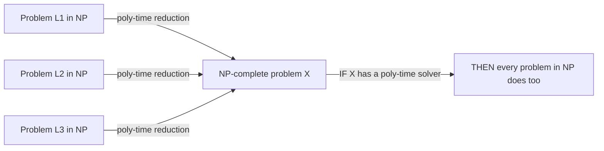
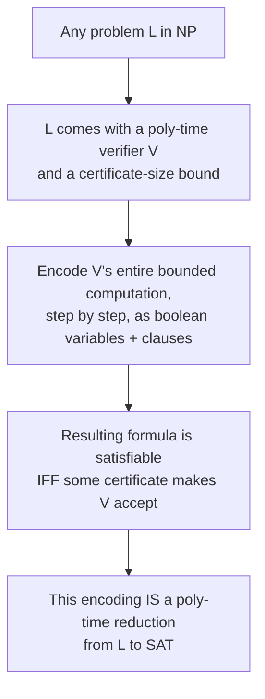

## Learning Objectives

- Define NP-completeness precisely, using both required conditions: membership in NP, and NP-hardness via polynomial-time reduction.
- Explain what it means for one problem to be "at least as hard as every other problem in NP."
- State the Cook-Levin theorem and explain its significance as the first proof that any NP-complete problem exists at all.
- Sketch the intuition behind Cook-Levin's proof — encoding a verifier's computation as a boolean formula — without reproducing its full technical construction.
- Explain why Cook-Levin, once established, changes the strategy for proving further problems NP-complete (previewing the next concept).

## Context & Motivation

The previous concept left NP populated with several concrete problems — SAT, Hamiltonian cycle, graph 3-colorability — each with a polynomial-time verifier, and none with a known polynomial-time solver. It's natural to ask whether these problems are all equally hard, or whether some might be secretly easier than others, discoverable by a clever enough algorithm. NP-completeness is the concept that answers a version of this question directly: it identifies a specific subset of NP problems that are, in a precise and provable sense, the *hardest* problems in the entire class — every other problem in NP can be transformed into any one of them, using only a polynomial-time transformation. If even one NP-complete problem turned out to have a polynomial-time solution, every problem in NP would too, collapsing P and NP into the same class. This is what makes NP-completeness the load-bearing concept of the entire discipline: it's the mechanism by which a single hard problem's difficulty (or, hypothetically, its ease) propagates to every other problem in NP at once.

But this definition raises an immediate, awkward question: how could anyone ever prove a problem is at least as hard as *every* problem in NP, when NP contains infinitely many problems, most of which haven't even been invented yet? Proving "problem X is NP-hard" by checking every problem in NP one at a time is obviously not a workable strategy. The Cook-Levin theorem, proved independently by Stephen Cook and Leonid Levin in the early 1970s, is the result that broke this apparent impossibility open: it exhibited one single problem — SAT — and proved, directly from the definition of what a nondeterministic polynomial-time verifier even *is*, that every problem in NP reduces to it. This was a genuinely surprising, foundational result at the time, and it remains the seed from which the entire practical theory of NP-completeness grows: once one NP-complete problem is nailed down, as the next concept shows, proving a second one NP-complete becomes dramatically easier.

It's worth being upfront about scope here: Cook-Levin's actual proof is a real, technical, and fairly involved piece of mathematics — reasoning carefully about an arbitrary nondeterministic Turing machine's computation and encoding its entire behavior as a giant boolean formula requires real care with tape symbols, head positions, and transition rules encoded as clauses. This concept states the theorem and sketches the genuine idea behind why it's true, deliberately without carrying out that full technical construction — the payoff of understanding *what* Cook-Levin buys you and *why* the idea works is worth far more, at this stage, than reproducing the full proof, and the next concept is where the real depth in this discipline gets spent: on actually *using* NP-completeness via reductions, once one instance of it is taken as given.

## Core Theory

### Defining NP-completeness

A decision problem X is **NP-complete** if both of the following hold:

1. **X is in NP** — a proposed solution to X can be verified in polynomial time (as defined in the previous concept).
2. **X is NP-hard** — every problem L in NP can be reduced to X in polynomial time. A polynomial-time reduction from L to X is a polynomial-time-computable function f that transforms any input w of L into an input f(w) of X, such that w is a YES-instance of L if and only if f(w) is a YES-instance of X.

The second condition is what makes X "at least as hard as anything in NP": if X had a polynomial-time solving algorithm, then *every* problem L in NP would too — given an instance w of L, compute f(w) in polynomial time, then solve X on f(w) in polynomial time, and the answer for w is exactly the answer for f(w). The whole two-step process (reduce, then solve) is still polynomial time, because a polynomial composed with a polynomial is still a polynomial (the same composition fact used in the P concept). So an NP-complete problem is a single point of maximal leverage: solve one in polynomial time, and P = NP follows for the entire class at once; fail to find a polynomial-time solution for even one, after enough sustained effort, and that's evidence (not proof) that P ≠ NP.

### The Cook-Levin theorem

**Theorem (Cook, 1971; Levin, independently, 1973).** SAT — the boolean satisfiability problem — is NP-complete.

SAT's membership in NP was already established in the previous concept (a proposed variable assignment is checkable in polynomial time by direct substitution). The genuinely hard, historic half of this theorem is NP-hardness: proving that *every* problem in NP — Hamiltonian cycle, 3-colorability, and every problem anyone will ever define that has a polynomial-time verifier — reduces to SAT in polynomial time. What makes this remarkable is that it was proved for an unbounded, not-yet-enumerated collection of problems all at once, by reasoning about the *shared structure* every NP problem has: a polynomial-time verifier.

### Sketching the intuition, without the full proof

The core idea, stated at the level this concept intends (a real sketch, not a full derivation): every problem L in NP comes, by definition, with a polynomial-time verifier V and a certificate size bound. For any fixed input w to L, "does there exist a certificate c such that V(w, c) accepts" is a question entirely about the *behavior of a fixed computation* — the verifier V, run on input w together with a not-yet-known certificate c, executing for a bounded (polynomial) number of steps. The insight Cook and Levin each had, independently, was that any such bounded computation — the entire trace of a Turing machine's tape contents, head position, and state, step by step, for a polynomial number of steps — can be encoded as a giant boolean formula, built out of variables like "cell i of the tape contains symbol s at time step t" and "the head is at position p at time step t," together with clauses enforcing that consecutive time steps are consistent with V's actual transition rules, that the machine starts in its initial configuration, and that it ends in an accepting configuration. This formula is satisfiable — some assignment to all those variables makes it TRUE — exactly when there is some certificate c that makes V(w, c) accept, which is exactly the definition of w being a YES-instance of L. Constructing this formula from w takes time polynomial in the size of w and V's running time, so the whole transformation is itself a valid polynomial-time reduction.

This is genuinely the shape of the real argument, and it is also genuinely a large undertaking to carry out rigorously — pinning down exactly which clauses enforce "the transition table was followed correctly" at every single time step, for an arbitrary verifier V, is where the bulk of the technical proof lives. That full construction is intentionally not developed here; what matters at this stage is that the reduction exists, is computable in polynomial time, and gives every problem in NP a foothold into SAT — which is precisely why SAT gets to be called the *first known* NP-complete problem, and why everything built on top of it in the next concept works.

### Why Cook-Levin changes the strategy going forward

Before Cook-Levin, proving any problem NP-hard meant reducing *every* problem in NP to it directly — an apparently hopeless task, since NP contains infinitely many problems. After Cook-Levin, that task only needs to be done once, for SAT. To prove a *new* problem Y is NP-hard, it now suffices to reduce one already-known NP-complete problem (SAT, to start) to Y — because if every L in NP already reduces to SAT, and SAT reduces to Y, then (reductions compose, exactly like polynomial-time algorithms do) every L in NP reduces to Y as well, through SAT as an intermediate step. This chaining is exactly the mechanism the next concept develops in full, with a complete, concrete worked reduction.

## Worked Examples

### Example 1 — checking the two conditions of NP-completeness abstractly

**Problem:** Suppose a new decision problem Z is shown to be in NP, and a polynomial-time reduction from SAT to Z is constructed. Does this establish that Z is NP-complete?

**Reasoning.** NP-completeness requires both conditions from Core Theory: Z ∈ NP (given, directly, in this problem) and Z is NP-hard. NP-hardness requires *every* problem in NP to reduce to Z in polynomial time — but only a reduction from SAT specifically was constructed. By the chaining argument in Core Theory, this is nonetheless sufficient: since Cook-Levin already guarantees every L in NP reduces to SAT, and SAT now reduces to Z, composing the two reductions gives a polynomial-time reduction from every L in NP to Z. So yes — a single reduction from SAT (not from every problem in NP individually) is enough to establish NP-hardness, and therefore NP-completeness, once Cook-Levin is taken as already proved. This is the precise mechanism the next concept will use directly, repeatedly, on concrete problems.

### Example 2 — applying the Cook-Levin sketch to a tiny concrete verifier

**Problem:** Illustrate the Cook-Levin intuition on a deliberately small case: a verifier V that, given a 3-bit string, accepts if and only if the certificate (also a 3-bit string) is bitwise-equal to the input. What would the encoding sketch produce here?

**Reasoning.** Following the sketch in Core Theory: V's computation, for a fixed 3-bit input w = w₁w₂w₃, involves reading a proposed 3-bit certificate c = c₁c₂c₃ and comparing bit by bit. Encoding this as a boolean formula introduces variables for each certificate bit (c₁, c₂, c₃ — these play the role of the unknowns the formula must decide), and clauses enforcing "cᵢ agrees with wᵢ" for each of the three positions — for a fixed input bit wᵢ = 1, the clause is simply cᵢ; for wᵢ = 0, the clause is ¬cᵢ. The overall formula is the AND of these three clauses (or their negations, matching w). This formula is satisfiable by exactly one assignment: c = w itself — mirroring exactly that V accepts exactly one certificate, the one equal to w. This tiny case is nowhere near the generality of a real NP verifier's step-by-step tape computation, but it shows concretely what "encode a verifier's decision as satisfiability of a formula built from the verifier's own logic" means in miniature, without requiring the full, general machinery.

### Example 3 — why NP-hardness alone is not NP-completeness

**Problem:** A problem W is known to require at least exponential time to solve (this has actually been proven for W, unlike the merely-conjectured hardness of SAT), and every problem in NP reduces to it in polynomial time. Is W necessarily NP-complete?

**Reasoning.** W satisfies the NP-hardness condition (every L in NP reduces to it), but NP-completeness also requires W ∈ NP — W itself must have a polynomial-time verifier. A problem that is provably exponential-time-hard could, in principle, be so hard that it isn't even efficiently verifiable — meaning it could fail to be in NP at all, making it NP-hard without being NP-complete. (Such problems genuinely exist one level up in the complexity hierarchy, beyond the scope developed in this discipline.) This distinguishes NP-hard from NP-complete precisely: NP-complete means NP-hard *and* in NP; NP-hard alone only means "at least as hard as everything in NP," without any promise that it's also efficiently checkable itself.

## Common Misconceptions & Pitfalls

- **"Cook-Levin proves SAT is hard to solve."** Cook-Levin proves SAT is NP-*hard* — that every problem in NP reduces to it — and that SAT is in NP. Neither of these is the same claim as "no polynomial-time algorithm for SAT exists"; that stronger claim is exactly the unproven P ≠ NP conjecture. Cook-Levin is a real, proven theorem; "SAT requires exponential time" remains, to this day, an open conjecture, not a proven fact — conflating the two overstates what Cook-Levin actually established.
- **"Since the full Cook-Levin proof isn't given here, the theorem is being treated as unproven or hand-waved."** This concept is explicit that the reason the full technical construction is skipped is a pedagogical choice about where to spend depth, not a gap in the actual mathematics — Cook-Levin is a completely rigorous, historically real, peer-reviewed theorem. The sketch above (encoding a bounded computation as a satisfiability instance) captures the genuine idea; the omitted material is the careful bookkeeping of exactly which clauses enforce which transition rules, not some missing conceptual leap.
- **"NP-hard and NP-complete mean the same thing."** As Example 3 shows directly, NP-hardness is only one of the two required conditions — a problem can be NP-hard without being in NP at all (if it's even harder than everything in NP), in which case it's NP-hard but not NP-complete. NP-completeness is the more specific claim: NP-hard *and* itself a member of NP.
- **"Cook-Levin means only SAT can be used as the 'base case' for future NP-hardness proofs."** Cook-Levin establishes SAT as the *first* known NP-complete problem, but as previewed in Core Theory (and developed fully next), reductions compose — so once other problems are shown NP-complete via reduction from SAT, any one of *them* can equally serve as the starting point for reducing to some further new problem. SAT is historically first, not permanently the only valid starting point.

## Summary

A problem is NP-complete when it belongs to NP and every problem in NP reduces to it in polynomial time — making it a single point of maximal leverage for the entire class: a polynomial-time solution to one NP-complete problem would yield one for all of NP. The Cook-Levin theorem is the historic result establishing that at least one such problem exists at all: SAT is NP-complete, proved by showing that any nondeterministic polynomial-time verifier's bounded computation, for any problem in NP, can be encoded as a boolean formula that is satisfiable exactly when a valid certificate exists. That encoding is a genuinely technical piece of mathematics, sketched here at the level of its core idea and deliberately not carried out in full detail — a real, proven, historic theorem, not something silently skipped. Its practical payoff, developed fully in the next concept, is that proving a *new* problem NP-complete no longer requires reducing every problem in NP to it from scratch — a single polynomial-time reduction from SAT (or from any problem already known to be NP-complete) suffices, because reductions chain.

## Documentation Links

- [MIT 18.404/6.5400 — Course Information (Sipser)](https://math.mit.edu/~sipser/18404/info.pdf) — doc
- [Stanford CS154 — Course Home](https://cs154.stanford.edu/) — doc
