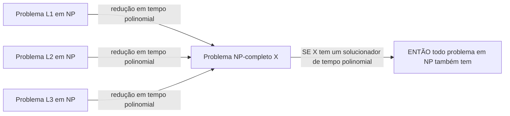
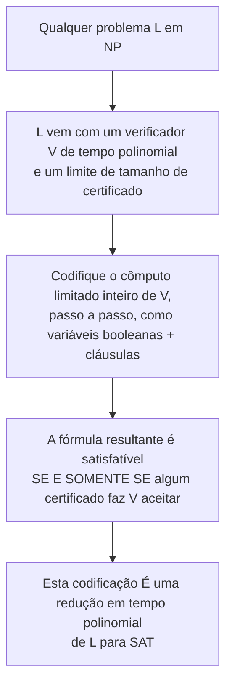

## Objetivos de Aprendizagem

- Definir NP-completude com precisão, usando ambas as condições exigidas: associação a NP, e NP-dificuldade via redução em tempo polinomial.
- Explicar o que significa um problema ser "ao menos tão difícil quanto todo outro problema em NP."
- Enunciar o teorema de Cook-Levin e explicar sua significância como a primeira prova de que qualquer problema NP-completo sequer existe.
- Esboçar a intuição por trás da prova de Cook-Levin, codificando o cômputo de um verificador como uma fórmula booleana, sem reproduzir sua construção técnica completa.
- Explicar por que Cook-Levin, uma vez estabelecido, muda a estratégia para demonstrar mais problemas NP-completos (antecipando o próximo conceito).

## Contexto e Motivação

O conceito anterior deixou NP povoada com vários problemas concretos, SAT, ciclo Hamiltoniano, 3-colorabilidade de grafo, cada um com um verificador de tempo polinomial, e nenhum com um solucionador de tempo polinomial conhecido. É natural perguntar se esses problemas são todos igualmente difíceis, ou se alguns poderiam ser secretamente mais fáceis que outros, descobrível por um algoritmo esperto o suficiente. NP-completude é o conceito que responde a uma versão dessa pergunta diretamente: identifica um subconjunto específico de problemas NP que são, em um sentido preciso e demonstrável, os problemas *mais difíceis* de toda a classe, todo outro problema em NP pode ser transformado em qualquer um deles, usando só uma transformação de tempo polinomial. Se até mesmo um problema NP-completo se revelasse ter uma solução de tempo polinomial, todo problema em NP também teria, colapsando P e NP na mesma classe. Isto é o que torna NP-completude o conceito estrutural de toda a disciplina: é o mecanismo pelo qual a dificuldade (ou, hipoteticamente, a facilidade) de um único problema difícil se propaga para todo outro problema em NP de uma vez.

Mas esta definição levanta uma pergunta imediata, incômoda: como alguém poderia jamais demonstrar que um problema é ao menos tão difícil quanto *todo* problema em NP, quando NP contém infinitamente muitos problemas, a maioria dos quais nem sequer foi inventada ainda? Demonstrar "o problema X é NP-difícil" checando todo problema em NP um de cada vez obviamente não é uma estratégia viável. O teorema de Cook-Levin, demonstrado independentemente por Stephen Cook e Leonid Levin no início dos anos 1970, é o resultado que abriu essa impossibilidade aparente: ele exibiu um único problema, SAT, e demonstrou, diretamente a partir da definição do que um verificador de tempo polinomial não-determinístico sequer *é*, que todo problema em NP se reduz a ele. Este foi um resultado genuinamente surpreendente, fundacional na época, e continua sendo a semente da qual toda a teoria prática de NP-completude cresce: uma vez que um problema NP-completo é estabelecido, como o próximo conceito mostra, demonstrar um segundo NP-completo se torna dramaticamente mais fácil.

Vale a pena ser direto sobre o escopo aqui: a prova real de Cook-Levin é um pedaço de matemática real, técnico, e bastante envolvido, raciocinar cuidadosamente sobre o cômputo de uma máquina de Turing não-determinística arbitrária e codificar seu comportamento inteiro como uma fórmula booleana gigante exige cuidado real com símbolos de fita, posições de cabeça, e regras de transição codificadas como cláusulas. Este conceito enuncia o teorema e esboça a ideia genuína por trás de por que ele é verdadeiro, deliberadamente sem realizar aquela construção técnica completa, o retorno de entender *o quê* Cook-Levin lhe compra e *por que* a ideia funciona vale muito mais, neste estágio, que reproduzir a prova completa, e o próximo conceito é onde a profundidade real desta disciplina é gasta: em de fato *usar* NP-completude via reduções, uma vez que uma instância dela é tomada como dada.

## Teoria Central

### Definindo NP-completude

Um problema de decisão X é **NP-completo** se ambos os seguintes valem:

1. **X está em NP**, uma solução proposta para X pode ser verificada em tempo polinomial (como definido no conceito anterior).
2. **X é NP-difícil**, todo problema L em NP pode ser reduzido a X em tempo polinomial. Uma redução em tempo polinomial de L para X é uma função f computável em tempo polinomial que transforma qualquer entrada w de L em uma entrada f(w) de X, tal que w é uma instância-SIM de L se e somente se f(w) é uma instância-SIM de X.

A segunda condição é o que torna X "ao menos tão difícil quanto qualquer coisa em NP": se X tivesse um algoritmo de solução em tempo polinomial, então *todo* problema L em NP também teria, dada uma instância w de L, compute f(w) em tempo polinomial, depois resolva X em f(w) em tempo polinomial, e a resposta para w é exatamente a resposta para f(w). O processo de dois passos inteiro (reduzir, depois resolver) ainda é tempo polinomial, porque um polinômio composto com um polinômio ainda é um polinômio (o mesmo fato de composição usado no conceito de P). Então um problema NP-completo é um único ponto de alavancagem máxima: resolva um em tempo polinomial, e P = NP segue para a classe inteira de uma vez; falhe em encontrar uma solução de tempo polinomial para até mesmo um, depois de esforço sustentado suficiente, e isso é evidência (não prova) de que P ≠ NP.

### O teorema de Cook-Levin

**Teorema (Cook, 1971; Levin, independentemente, 1973).** SAT, o problema de satisfatibilidade booleana, é NP-completo.

A associação de SAT a NP já foi estabelecida no conceito anterior (uma atribuição de variável proposta é checável em tempo polinomial por substituição direta). A metade genuinamente difícil, histórica, deste teorema é NP-dificuldade: demonstrar que *todo* problema em NP, ciclo Hamiltoniano, 3-colorabilidade, e todo problema que alguém algum dia venha a definir que tenha um verificador de tempo polinomial, se reduz a SAT em tempo polinomial. O que torna isto notável é que foi demonstrado para uma coleção não limitada, ainda não enumerada, de problemas de uma vez, raciocinando sobre a *estrutura compartilhada* que todo problema NP tem: um verificador de tempo polinomial.

### Esboçando a intuição, sem a prova completa

A ideia central, enunciada no nível que este conceito pretende (um esboço real, não uma derivação completa): todo problema L em NP vem, por definição, com um verificador de tempo polinomial V e um limite de tamanho de certificado. Para qualquer entrada fixa w para L, "existe um certificado c tal que V(w, c) aceita" é uma pergunta inteiramente sobre o *comportamento de um cômputo fixo*, o verificador V, rodado na entrada w junto com um certificado c ainda desconhecido, executando por um número limitado (polinomial) de passos. A percepção que Cook e Levin cada um teve, independentemente, foi que qualquer tal cômputo limitado, o rastro inteiro do conteúdo de fita, posição de cabeça, e estado de uma máquina de Turing, passo a passo, por um número polinomial de passos, pode ser codificado como uma fórmula booleana gigante, construída a partir de variáveis como "a célula i da fita contém o símbolo s no instante t" e "a cabeça está na posição p no instante t," junto com cláusulas impondo que instantes consecutivos são consistentes com as regras de transição reais de V, que a máquina começa em sua configuração inicial, e que ela termina em uma configuração de aceitação. Esta fórmula é satisfatível, alguma atribuição a todas essas variáveis a torna VERDADEIRA, exatamente quando existe algum certificado c que faz V(w, c) aceitar, o que é exatamente a definição de w ser uma instância-SIM de L. Construir esta fórmula a partir de w leva tempo polinomial no tamanho de w e no tempo de execução de V, então a transformação inteira é ela mesma uma redução válida em tempo polinomial.

Esta é genuinamente a forma do argumento real, e também é genuinamente um grande empreendimento realizá-lo rigorosamente, fixar exatamente quais cláusulas impõem "a tabela de transição foi seguida corretamente" a cada único instante, para um verificador V arbitrário, é onde a maior parte da prova técnica vive. Aquela construção completa é intencionalmente não desenvolvida aqui; o que importa neste estágio é que a redução existe, é computável em tempo polinomial, e dá a todo problema em NP um ponto de apoio em SAT, o que é precisamente por que SAT recebe o título de o *primeiro problema NP-completo conhecido*, e por que tudo construído em cima dele no próximo conceito funciona.

### Por que Cook-Levin muda a estratégia daqui em diante

Antes de Cook-Levin, demonstrar que qualquer problema é NP-difícil significava reduzir *todo* problema em NP a ele diretamente, uma tarefa aparentemente sem esperança, já que NP contém infinitamente muitos problemas. Depois de Cook-Levin, aquela tarefa só precisa ser feita uma vez, para SAT. Para demonstrar que um problema *novo* Y é NP-difícil, agora basta reduzir um problema já conhecido como NP-completo (SAT, para começar) a Y, porque se todo L em NP já se reduz a SAT, e SAT se reduz a Y, então (reduções se compõem, exatamente como algoritmos de tempo polinomial fazem) todo L em NP se reduz a Y também, através de SAT como um passo intermediário. Este encadeamento é exatamente o mecanismo que o próximo conceito desenvolve por completo, com uma redução resolvida, completa, concreta.

## Exemplos Resolvidos

### Exemplo 1: checando as duas condições de NP-completude abstratamente

**Problema:** Suponha que um problema de decisão novo Z é mostrado como estando em NP, e uma redução em tempo polinomial de SAT para Z é construída. Isso estabelece que Z é NP-completo?

**Raciocínio.** NP-completude exige ambas as condições da Teoria Central: Z ∈ NP (dado, diretamente, neste problema) e Z é NP-difícil. NP-dificuldade exige que *todo* problema em NP se reduza a Z em tempo polinomial, mas só uma redução de SAT especificamente foi construída. Pelo argumento de encadeamento da Teoria Central, isso é ainda assim suficiente: já que Cook-Levin já garante que todo L em NP se reduz a SAT, e SAT agora se reduz a Z, compor as duas reduções dá uma redução em tempo polinomial de todo L em NP para Z. Então sim, uma única redução de SAT (não de todo problema em NP individualmente) é suficiente para estabelecer NP-dificuldade, e portanto NP-completude, uma vez que Cook-Levin é tomado como já demonstrado. Este é o mecanismo preciso que o próximo conceito vai usar diretamente, repetidamente, em problemas concretos.

### Exemplo 2: aplicando o esboço de Cook-Levin a um verificador concreto minúsculo

**Problema:** Ilustre a intuição de Cook-Levin em um caso deliberadamente pequeno: um verificador V que, dada uma string de 3 bits, aceita se e somente se o certificado (também uma string de 3 bits) é bit-a-bit igual à entrada. O que o esboço de codificação produziria aqui?

**Raciocínio.** Seguindo o esboço da Teoria Central: o cômputo de V, para uma entrada fixa de 3 bits w = w₁w₂w₃, envolve ler um certificado proposto de 3 bits c = c₁c₂c₃ e comparar bit a bit. Codificar isso como uma fórmula booleana introduz variáveis para cada bit de certificado (c₁, c₂, c₃, estas desempenham o papel das incógnitas que a fórmula precisa decidir), e cláusulas impondo "cᵢ concorda com wᵢ" para cada uma das três posições, para um bit de entrada fixo wᵢ = 1, a cláusula é simplesmente cᵢ; para wᵢ = 0, a cláusula é ¬cᵢ. A fórmula geral é o E dessas três cláusulas (ou suas negações, correspondendo a w). Esta fórmula é satisfatível por exatamente uma atribuição: c = w em si, espelhando exatamente que V aceita exatamente um certificado, aquele igual a w. Este caso minúsculo está longe da generalidade do cômputo de fita passo a passo de um verificador NP real, mas mostra concretamente o que "codifique a decisão de um verificador como satisfatibilidade de uma fórmula construída a partir da própria lógica do verificador" significa em miniatura, sem exigir a maquinaria completa, geral.

### Exemplo 3: por que NP-dificuldade sozinha não é NP-completude

**Problema:** Um problema W é conhecido como exigindo ao menos tempo exponencial para resolver (isto foi de fato demonstrado para W, diferente da dificuldade meramente conjecturada de SAT), e todo problema em NP se reduz a ele em tempo polinomial. W é necessariamente NP-completo?

**Raciocínio.** W satisfaz a condição de NP-dificuldade (todo L em NP se reduz a ele), mas NP-completude também exige W ∈ NP, o próprio W precisa ter um verificador de tempo polinomial. Um problema que é comprovadamente difícil-em-tempo-exponencial poderia, em princípio, ser tão difícil que nem sequer é eficientemente verificável, significando que poderia falhar em estar em NP de forma alguma, tornando-o NP-difícil sem ser NP-completo. (Tais problemas genuinamente existem um nível acima na hierarquia de complexidade, além do escopo desenvolvido nesta disciplina.) Isso distingue NP-difícil de NP-completo precisamente: NP-completo significa NP-difícil *e* em NP; NP-difícil sozinho só significa "ao menos tão difícil quanto tudo em NP," sem nenhuma promessa de que também é eficientemente checável em si.

## Equívocos Comuns e Armadilhas

- **"Cook-Levin demonstra que SAT é difícil de resolver."** Cook-Levin demonstra que SAT é NP-*difícil*, que todo problema em NP se reduz a ele, e que SAT está em NP. Nenhuma dessas é a mesma afirmação que "nenhum algoritmo de tempo polinomial para SAT existe"; essa afirmação mais forte é exatamente a conjectura não demonstrada P ≠ NP. Cook-Levin é um teorema real, demonstrado; "SAT exige tempo exponencial" permanece, até hoje, uma conjectura em aberto, não um fato demonstrado, confundir os dois superestima o que Cook-Levin de fato estabeleceu.
- **"Já que a prova completa de Cook-Levin não é dada aqui, o teorema está sendo tratado como não demonstrado ou passado por cima."** Este conceito é explícito de que a razão pela qual a construção técnica completa é pulada é uma escolha pedagógica sobre onde gastar profundidade, não uma lacuna na matemática real, Cook-Levin é um teorema completamente rigoroso, historicamente real, revisado por pares. O esboço acima (codificar um cômputo limitado como uma instância de satisfatibilidade) captura a ideia genuína; o material omitido é a contabilidade cuidadosa de exatamente quais cláusulas impõem quais regras de transição, não algum salto conceitual faltando.
- **"NP-difícil e NP-completo significam a mesma coisa."** Como o Exemplo 3 mostra diretamente, NP-dificuldade é só uma das duas condições exigidas, um problema pode ser NP-difícil sem estar em NP de forma alguma (se for até mais difícil que tudo em NP), caso em que é NP-difícil mas não NP-completo. NP-completude é a afirmação mais específica: NP-difícil *e* ele mesmo um membro de NP.
- **"Cook-Levin significa que só SAT pode ser usado como o 'caso base' para futuras provas de NP-dificuldade."** Cook-Levin estabelece SAT como o *primeiro* problema NP-completo conhecido, mas como antecipado na Teoria Central (e desenvolvido por completo a seguir), reduções se compõem, então uma vez que outros problemas são mostrados NP-completos via redução de SAT, qualquer um *deles* pode igualmente servir como ponto de partida para reduzir a algum problema novo adicional. SAT é historicamente primeiro, não permanentemente o único ponto de partida válido.

## Resumo

Um problema é NP-completo quando pertence a NP e todo problema em NP se reduz a ele em tempo polinomial, tornando-o um único ponto de alavancagem máxima para a classe inteira: uma solução de tempo polinomial para um problema NP-completo produziria uma para todo NP. O teorema de Cook-Levin é o resultado histórico estabelecendo que ao menos um tal problema existe de forma alguma: SAT é NP-completo, demonstrado mostrando que o cômputo limitado de qualquer verificador de tempo polinomial não-determinístico, para qualquer problema em NP, pode ser codificado como uma fórmula booleana que é satisfatível exatamente quando um certificado válido existe. Aquela codificação é um pedaço genuinamente técnico de matemática, esboçado aqui no nível de sua ideia central e deliberadamente não realizado em detalhe completo, um teorema real, demonstrado, histórico, não algo silenciosamente pulado. Seu retorno prático, desenvolvido por completo no próximo conceito, é que demonstrar um problema *novo* NP-completo não exige mais reduzir todo problema em NP a ele do zero, uma única redução em tempo polinomial de SAT (ou de qualquer problema já conhecido como NP-completo) basta, porque reduções se encadeiam.

## Documentation Links

- [MIT 18.404/6.5400: Course Information (Sipser)](https://math.mit.edu/~sipser/18404/info.pdf): doc
- [Stanford CS154: Course Home](https://cs154.stanford.edu/): doc
