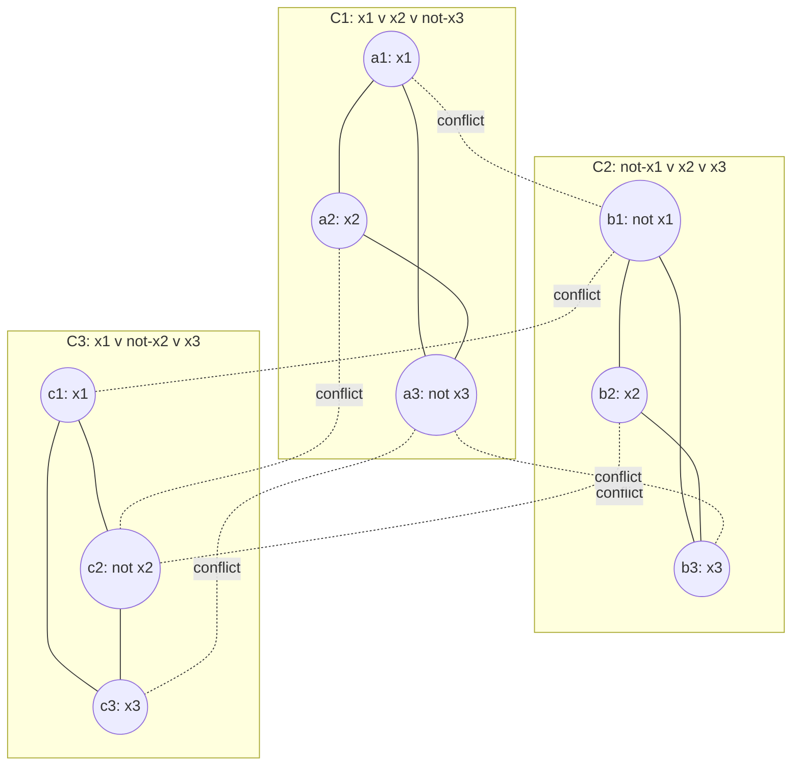

## Learning Objectives

- Explain why a single polynomial-time reduction from an already-known NP-complete problem suffices to prove a new problem NP-complete.
- State the Independent Set decision problem precisely.
- Construct, in full, the standard polynomial-time reduction from 3-SAT to Independent Set.
- Verify both directions of the reduction's correctness: a satisfying assignment yields an independent set of the required size, and vice versa.
- Recognize this reduction as an instance of the same "reduce a known-hard problem to a new one" technique already used to prove problems undecidable, now transferred to the polynomial-time setting.

## Context & Motivation

The previous concept established Cook-Levin's theorem — SAT is NP-complete — and closed with a preview: once *one* NP-complete problem exists, proving a *second* problem NP-complete no longer requires reducing every problem in NP to it directly. It only requires a single polynomial-time reduction from SAT (or from any problem already known to be NP-complete) to the new problem, because reductions chain — every problem in NP already reduces to SAT, so if SAT also reduces to the new problem, the whole chain composes into a valid reduction from every problem in NP.

This is the same intellectual move you already used earlier in this discipline to prove new problems undecidable, without repeating Turing's diagonalization argument from scratch each time: reduce a problem already known to be impossible (the Halting Problem) to the new problem, and the new problem inherits the impossibility. The mechanism transfers here essentially unchanged, with one adjustment demanded by working in polynomial time rather than in the world of pure decidability: the reduction itself has to be computable in polynomial time, not merely computable at all, since an exponential-time reduction wouldn't preserve the "efficiently solvable" property being tracked.

This concept is where that mechanism gets used for real, on a specific, well-documented, classic case: reducing 3-SAT (boolean satisfiability restricted to formulas where every clause has exactly three literals — itself NP-complete, by a short, standard reduction from general SAT) to **Independent Set**, a graph problem that, on its face, looks nothing like a boolean formula at all. Watching that gap get bridged, concretely and completely, is the entire point — this is not a sketch of "such a reduction exists," the way Cook-Levin's full construction was intentionally left as a sketch; this is the actual transformation, built step by step, with both directions of correctness checked directly.

## Core Theory

### The problem being reduced to: Independent Set

An **independent set** in an undirected graph G = (V, E) is a subset S ⊆ V such that no two vertices in S are connected by an edge. The **Independent Set decision problem** asks: given a graph G and an integer k, does G contain an independent set of size at least k? This problem is in NP — a proposed set S of vertices is verified in polynomial time by checking |S| ≥ k and that no edge connects any two vertices in S, both linear-time checks in the size of G.

### 3-SAT, briefly

A **3-CNF formula** is a boolean formula written as an AND of clauses, where each clause is an OR of exactly three literals (a variable or its negation) — for example, (x₁ ∨ x₂ ∨ ¬x₃) ∧ (¬x₁ ∨ x₂ ∨ x₃). **3-SAT** asks whether such a formula has a satisfying assignment. 3-SAT is itself NP-complete — a standard, short corollary of Cook-Levin obtained by reducing general SAT to 3-SAT (any clause with more or fewer than three literals can be mechanically rewritten as an equivalent set of exactly-three-literal clauses, using extra variables where needed) — so it can be used, exactly as SAT could, as the known-hard starting point for a new reduction.

### The reduction, constructed in full

Given a 3-CNF formula φ with k clauses C₁, …, C_k, each containing exactly three literals, construct a graph G as follows:

1. **For each clause Cᵢ, create a triangle of three vertices** — one vertex per literal appearing in that clause — with all three pairwise edges present (so within a single clause's triangle, no two of its three vertices can both be chosen into an independent set; picking a triangle's vertex "uses up" that whole triangle).
2. **Add a conflict edge between any two vertices, in different clauses, that represent a literal and its negation** — a vertex labeled x in one clause's triangle gets an edge to a vertex labeled ¬x in another clause's triangle, wherever both occur in φ.
3. **Set k (the target independent-set size) equal to the number of clauses.**

This construction takes time polynomial in the size of φ: it examines each of the 3k literal occurrences once to build triangles (O(k) work) and compares each pair of literal occurrences to detect negation-conflicts (O(k²) work, still polynomial) — well within the bound a valid reduction requires.

### Why the reduction is correct, in both directions

**If φ is satisfiable, G has an independent set of size k.** Take a satisfying assignment. In every clause, at least one literal is TRUE under this assignment (that's what "satisfying" means for an OR of three literals) — pick exactly one TRUE literal per clause, and select its corresponding vertex. This selects exactly k vertices, one per triangle. No two selected vertices can be connected by a triangle edge, since at most one vertex is chosen per triangle. No two selected vertices can be connected by a conflict edge either: a conflict edge only joins a literal and its negation, and a single assignment cannot make both a literal and its negation TRUE simultaneously — so two selected (TRUE) literals are never a contradictory pair. The selected k vertices are therefore an independent set of size k.

**If G has an independent set of size k, φ is satisfiable.** Since each of the k triangles contributes at most one vertex to any independent set (triangle vertices are mutually adjacent), an independent set of size exactly k must contain exactly one vertex from every triangle — one literal chosen per clause. Because no two chosen vertices are joined by a conflict edge, no chosen literal contradicts another chosen literal — so setting every chosen literal to TRUE (and any variable that never appears among the chosen literals to either value, arbitrarily) is a consistent assignment. Every clause has its chosen literal set TRUE, so every clause evaluates to TRUE, so φ is satisfied.

Both directions hold, and the transformation runs in polynomial time, so this is a valid polynomial-time reduction from 3-SAT to Independent Set — establishing, combined with 3-SAT's own NP-completeness, that Independent Set is NP-hard. Since Independent Set is also in NP (shown above), **Independent Set is NP-complete.**

## Worked Examples

### Example 1 — running the full construction on a concrete formula

**Problem:** Let φ = (x₁ ∨ x₂ ∨ ¬x₃) ∧ (¬x₁ ∨ x₂ ∨ x₃) ∧ (x₁ ∨ ¬x₂ ∨ x₃). Build G and find k.

**Construction.** Three clauses, so k = 3 and G has 9 vertices in 3 triangles: {a1=x₁, a2=x₂, a3=¬x₃}, {b1=¬x₁, b2=x₂, b3=x₃}, {c1=x₁, c2=¬x₂, c3=x₃} (matching the diagram in Core Theory). Triangle edges as shown. Conflict edges: x₁ occurs at a1 and c1, ¬x₁ occurs at b1 → edges a1–b1, c1–b1. x₂ occurs at a2 and b2, ¬x₂ occurs at c2 → edges a2–c2, b2–c2. x₃ occurs at b3 and c3, ¬x₃ occurs at a3 → edges a3–b3, a3–c3.

**Solving φ directly (to check against the graph).** Try x₁ = TRUE, x₂ = TRUE, x₃ = TRUE: C1 = T∨T∨F = TRUE; C2 = F∨T∨T = TRUE; C3 = T∨F∨T = TRUE. φ is satisfied.

**Reading off the corresponding independent set.** Per the correctness proof, pick one TRUE literal per clause: C1's true literals are x₁ (a1) and x₂ (a2) — pick a1. C2's true literals are x₂ (b2) and x₃ (b3) — pick b2. C3's true literals are x₁ (c1) and x₃ (c3) — pick c1. Candidate set {a1, b2, c1}. Check: no triangle edges between them (all from different triangles). Check conflict edges: a1–b1 exists but b1 isn't selected; c1–b1 exists but b1 isn't selected; no conflict edge connects a1, b2, or c1 to each other directly. {a1, b2, c1} is independent, and has size 3 = k, exactly as the reduction's correctness argument guarantees.

### Example 2 — an unsatisfiable formula yields no independent set of size k

**Problem:** Let ψ = (x₁) ∧ (¬x₁) — simplified to single-literal clauses for clarity (the same idea scales to three-literal clauses; imagine each padded with two always-false literals for a genuine 3-CNF version). This is unsatisfiable (x₁ can't be both TRUE and FALSE). Confirm the corresponding graph has no independent set of size 2.

**Reasoning.** Two clauses, k = 2, two vertices: p (labeled x₁), q (labeled ¬x₁), with a conflict edge p–q (same variable, opposite literals, different clauses). Any independent set of size 2 would have to include both p and q — but they're joined by an edge, so they can never both be selected. The maximum independent set here has size 1, not 2 — matching ψ's unsatisfiability exactly, as the reduction's contrapositive guarantees: no independent set of size k exists precisely because no satisfying assignment exists.

### Example 3 — why the reduction direction matters

**Problem:** Explain why the reduction must go FROM 3-SAT TO Independent Set, and not the other direction, for this to establish Independent Set is NP-hard.

**Reasoning.** NP-hardness of Independent Set requires showing every problem in NP (via 3-SAT, already known NP-complete) reduces TO Independent Set — i.e., an efficient Independent Set solver could be repurposed to efficiently solve 3-SAT. The direction built above does exactly this: transform a 3-SAT instance into an Independent Set instance whose answer matches. Reducing in the opposite direction (Independent Set instances into 3-SAT instances) would instead be relevant to showing 3-SAT is "at least as hard as Independent Set" — the reverse claim — and would not, on its own, establish anything about Independent Set's hardness relative to all of NP. Getting the direction backwards is a common construction error; the rule to check is always "does solving the target let me solve the known-hard source," which only holds for the direction actually constructed here.

## Common Misconceptions & Pitfalls

- **"The reduction just needs to show the two problems are 'similar' or 'related.'"** A valid NP-hardness reduction is a specific, formal object: a polynomial-time-computable function mapping every instance of the source problem to an instance of the target problem, such that YES-instances map to YES-instances and NO-instances map to NO-instances (both directions, as Examples 1 and 2 check explicitly) — not a loose analogy. The 3-SAT-to-Independent-Set construction above satisfies this exactly: triangle vertices force "at most one literal per clause," conflict edges force "no contradictory pair," and both correctness directions were verified, not merely asserted.
- **"Getting the reduction direction backwards is a minor detail."** As Example 3 shows, the direction is the entire substance of the argument — a reduction has to go from the already-known-hard problem to the new problem, so that an efficient solver for the new problem could be repurposed to efficiently solve the known-hard one. Building the transformation in the opposite direction proves a different (and, for the purpose of establishing NP-hardness of the new problem, useless) claim.
- **"An independent set of size k in the constructed graph could pick two vertices from the same triangle, as long as they're not literal-negations of each other."** Triangle edges connect *every* pair of vertices within a clause's triangle, regardless of what literals they represent — two same-clause vertices are always adjacent by construction, so an independent set can never contain two vertices from the same triangle. This is precisely why an independent set of size exactly k (the number of clauses) must take exactly one vertex per triangle, never zero and never two from the same one.
- **"Since 3-SAT was used here, the same graph construction proves general SAT reduces to Independent Set directly."** The construction relies specifically on each clause having exactly three literals, to build a triangle (three mutually exclusive choices per clause). A clause with two literals or with five literals doesn't map onto "at most one vertex selectable" the same way, so this particular construction is 3-SAT-specific — general SAT is first reduced to 3-SAT (a separate, standard transformation), and only then to Independent Set via this construction.

## Summary

Once one problem (SAT, via Cook-Levin) is known NP-complete, proving a new problem NP-complete requires only a single polynomial-time reduction from an already-known NP-complete problem — the same "reduce a known-hard problem to a new one" strategy already used for undecidability, now carried out with the added requirement that the reduction itself run in polynomial time. This concept carried that strategy out in full: 3-SAT (itself NP-complete via a standard reduction from SAT) reduces to Independent Set by turning each clause into a triangle of mutually exclusive literal-vertices and connecting contradictory literals across clauses with conflict edges, so that an independent set of size k (the clause count) corresponds exactly to a satisfying assignment — verified in both directions, not merely asserted. Combined with Independent Set's own membership in NP, this establishes Independent Set as NP-complete, and the same triangle-plus-conflict-edge technique, or ones like it, is exactly how the enormous, real catalog of known NP-complete problems has been built up, one reduction at a time, ever since Cook-Levin supplied the first foothold.

## Documentation Links

- [Stanford CS154 — Course Home](https://cs154.stanford.edu/) — doc
- [ACM/IEEE CS2013 — Full Curriculum Site](https://csed.acm.org/cs2013-version/) — doc
