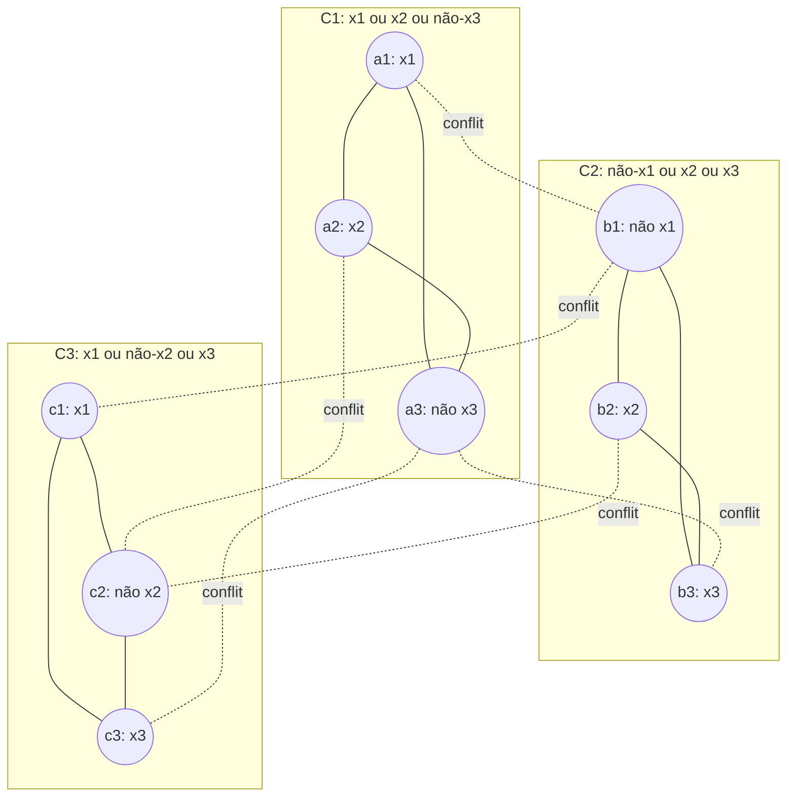

## Objetivos de Aprendizagem

- Explicar por que uma única redução em tempo polinomial de um problema já conhecido como NP-completo basta para demonstrar que um problema novo é NP-completo.
- Enunciar o problema de decisão do Conjunto Independente com precisão.
- Construir, por completo, a redução padrão em tempo polinomial de 3-SAT para Conjunto Independente.
- Verificar ambas as direções da correção da redução: uma atribuição satisfatória produz um conjunto independente do tamanho exigido, e vice-versa.
- Reconhecer esta redução como uma instância da mesma técnica de "reduza um problema já conhecido como difícil para um novo" já usada para demonstrar problemas indecidíveis, agora transferida para o cenário de tempo polinomial.

## Contexto e Motivação

O conceito anterior estabeleceu o teorema de Cook-Levin, SAT é NP-completo, e encerrou com uma antecipação: uma vez que *um* problema NP-completo existe, demonstrar que um *segundo* problema é NP-completo não exige mais reduzir todo problema em NP a ele diretamente. Só exige uma única redução em tempo polinomial de SAT (ou de qualquer problema já conhecido como NP-completo) para o problema novo, porque reduções se encadeiam, todo problema em NP já se reduz a SAT, então se SAT também se reduz ao problema novo, a cadeia inteira se compõe em uma redução válida de todo problema em NP.

Este é o mesmo movimento intelectual que você já usou antes nesta disciplina para demonstrar problemas novos indecidíveis, sem repetir o argumento de diagonalização de Turing do zero a cada vez: reduza um problema já conhecido como impossível (o Problema da Parada) para o problema novo, e o problema novo herda a impossibilidade. O mecanismo se transfere aqui essencialmente inalterado, com um ajuste exigido por trabalhar em tempo polinomial em vez de no mundo de decidibilidade pura: a própria redução precisa ser computável em tempo polinomial, não só computável de forma alguma, já que uma redução de tempo exponencial não preservaria a propriedade de "eficientemente solucionável" sendo rastreada.

Este conceito é onde aquele mecanismo é usado de verdade, em um caso clássico específico, bem documentado: reduzir 3-SAT (satisfatibilidade booleana restrita a fórmulas onde toda cláusula tem exatamente três literais, ela mesma NP-completa, por uma redução curta, padrão, de SAT geral) para **Conjunto Independente**, um problema de grafo que, à primeira vista, não se parece em nada com uma fórmula booleana. Ver aquela lacuna sendo transposta, concreta e completamente, é o ponto inteiro, isto não é um esboço de "tal redução existe", da forma que a construção completa de Cook-Levin foi intencionalmente deixada como um esboço; esta é a transformação real, construída passo a passo, com ambas as direções de correção checadas diretamente.

## Teoria Central

### O problema para o qual reduzimos: Conjunto Independente

Um **conjunto independente** em um grafo não direcionado G = (V, E) é um subconjunto S ⊆ V tal que nenhum dois vértices em S são conectados por uma aresta. O **problema de decisão do Conjunto Independente** pergunta: dado um grafo G e um inteiro k, G contém um conjunto independente de tamanho ao menos k? Este problema está em NP, um conjunto proposto S de vértices é verificado em tempo polinomial checando |S| ≥ k e que nenhuma aresta conecta quaisquer dois vértices em S, ambas checagens de tempo linear no tamanho de G.

### 3-SAT, brevemente

Uma **fórmula 3-CNF** é uma fórmula booleana escrita como um E de cláusulas, onde cada cláusula é um OU de exatamente três literais (uma variável ou sua negação), por exemplo, (x₁ ∨ x₂ ∨ ¬x₃) ∧ (¬x₁ ∨ x₂ ∨ x₃). **3-SAT** pergunta se tal fórmula tem uma atribuição satisfatória. 3-SAT em si é NP-completa, um corolário curto, padrão, de Cook-Levin obtido reduzindo SAT geral para 3-SAT (qualquer cláusula com mais ou menos que três literais pode ser mecanicamente reescrita como um conjunto equivalente de cláusulas de exatamente-três-literais, usando variáveis extras onde necessário), então pode ser usada, exatamente como SAT poderia, como o ponto de partida já conhecido como difícil para uma redução nova.

### A redução, construída por completo

Dada uma fórmula 3-CNF φ com k cláusulas C₁, …, C_k, cada uma contendo exatamente três literais, construa um grafo G da seguinte forma:

1. **Para cada cláusula Cᵢ, crie um triângulo de três vértices**, um vértice por literal aparecendo naquela cláusula, com todas as três arestas par-a-par presentes (então dentro de um único triângulo de cláusula, nenhum dois de seus três vértices podem ambos ser escolhidos para um conjunto independente; escolher o vértice de um triângulo "usa" aquele triângulo inteiro).
2. **Adicione uma aresta de conflito entre quaisquer dois vértices, em cláusulas diferentes, que representam um literal e sua negação**, um vértice rotulado x no triângulo de uma cláusula recebe uma aresta para um vértice rotulado ¬x no triângulo de outra cláusula, onde quer que ambos ocorram em φ.
3. **Defina k (o tamanho alvo do conjunto independente) igual ao número de cláusulas.**

Esta construção leva tempo polinomial no tamanho de φ: ela examina cada uma das 3k ocorrências de literal uma vez para construir triângulos (trabalho O(k)) e compara cada par de ocorrências de literal para detectar conflitos de negação (trabalho O(k²), ainda polinomial), bem dentro do limite que uma redução válida exige.

### Por que a redução é correta, em ambas as direções

**Se φ é satisfatível, G tem um conjunto independente de tamanho k.** Pegue uma atribuição satisfatória. Em toda cláusula, ao menos um literal é VERDADEIRO sob esta atribuição (é isso que "satisfatória" significa para um OU de três literais), escolha exatamente um literal VERDADEIRO por cláusula, e selecione seu vértice correspondente. Isso seleciona exatamente k vértices, um por triângulo. Nenhum dois vértices selecionados podem ser conectados por uma aresta de triângulo, já que no máximo um vértice é escolhido por triângulo. Nenhum dois vértices selecionados podem ser conectados por uma aresta de conflito também: uma aresta de conflito só junta um literal e sua negação, e uma única atribuição não pode tornar tanto um literal quanto sua negação VERDADEIROS simultaneamente, então dois literais selecionados (VERDADEIROS) nunca são um par contraditório. Os k vértices selecionados são portanto um conjunto independente de tamanho k.

**Se G tem um conjunto independente de tamanho k, φ é satisfatível.** Já que cada um dos k triângulos contribui no máximo um vértice para qualquer conjunto independente (vértices de triângulo são mutuamente adjacentes), um conjunto independente de tamanho exatamente k precisa conter exatamente um vértice de todo triângulo, um literal escolhido por cláusula. Porque nenhum dois vértices escolhidos são unidos por uma aresta de conflito, nenhum literal escolhido contradiz outro literal escolhido, então definir todo literal escolhido como VERDADEIRO (e qualquer variável que nunca aparece entre os literais escolhidos para qualquer valor, arbitrariamente) é uma atribuição consistente. Toda cláusula tem seu literal escolhido definido como VERDADEIRO, então toda cláusula avalia para VERDADEIRO, então φ é satisfeita.

Ambas as direções valem, e a transformação roda em tempo polinomial, então esta é uma redução válida em tempo polinomial de 3-SAT para Conjunto Independente, estabelecendo, combinado com a própria NP-completude de 3-SAT, que Conjunto Independente é NP-difícil. Já que Conjunto Independente também está em NP (mostrado acima), **Conjunto Independente é NP-completo.**

## Exemplos Resolvidos

### Exemplo 1: rodando a construção completa em uma fórmula concreta

**Problema:** Seja φ = (x₁ ∨ x₂ ∨ ¬x₃) ∧ (¬x₁ ∨ x₂ ∨ x₃) ∧ (x₁ ∨ ¬x₂ ∨ x₃). Construa G e encontre k.

**Construção.** Três cláusulas, então k = 3 e G tem 9 vértices em 3 triângulos: {a1=x₁, a2=x₂, a3=¬x₃}, {b1=¬x₁, b2=x₂, b3=x₃}, {c1=x₁, c2=¬x₂, c3=x₃} (correspondendo ao diagrama na Teoria Central). Arestas de triângulo como mostrado. Arestas de conflito: x₁ ocorre em a1 e c1, ¬x₁ ocorre em b1 → arestas a1-b1, c1-b1. x₂ ocorre em a2 e b2, ¬x₂ ocorre em c2 → arestas a2-c2, b2-c2. x₃ ocorre em b3 e c3, ¬x₃ ocorre em a3 → arestas a3-b3, a3-c3.

**Resolvendo φ diretamente (para checar contra o grafo).** Tente x₁ = VERDADEIRO, x₂ = VERDADEIRO, x₃ = VERDADEIRO: C1 = V∨V∨F = VERDADEIRO; C2 = F∨V∨V = VERDADEIRO; C3 = V∨F∨V = VERDADEIRO. φ é satisfeita.

**Lendo o conjunto independente correspondente.** Pela prova de correção, escolha um literal VERDADEIRO por cláusula: os literais verdadeiros de C1 são x₁ (a1) e x₂ (a2), escolha a1. Os literais verdadeiros de C2 são x₂ (b2) e x₃ (b3), escolha b2. Os literais verdadeiros de C3 são x₁ (c1) e x₃ (c3), escolha c1. Conjunto candidato {a1, b2, c1}. Checando: nenhuma aresta de triângulo entre eles (todos de triângulos diferentes). Checando arestas de conflito: a1-b1 existe mas b1 não é selecionado; c1-b1 existe mas b1 não é selecionado; nenhuma aresta de conflito conecta a1, b2, ou c1 uns aos outros diretamente. {a1, b2, c1} é independente, e tem tamanho 3 = k, exatamente como o argumento de correção da redução garante.

### Exemplo 2: uma fórmula insatisfatível não produz nenhum conjunto independente de tamanho k

**Problema:** Seja ψ = (x₁) ∧ (¬x₁), simplificada para cláusulas de um único literal por clareza (a mesma ideia escala para cláusulas de três literais; imagine cada uma preenchida com dois literais sempre-falsos para uma versão 3-CNF genuína). Isto é insatisfatível (x₁ não pode ser tanto VERDADEIRO quanto FALSO). Confirme que o grafo correspondente não tem nenhum conjunto independente de tamanho 2.

**Raciocínio.** Duas cláusulas, k = 2, dois vértices: p (rotulado x₁), q (rotulado ¬x₁), com uma aresta de conflito p-q (mesma variável, literais opostos, cláusulas diferentes). Qualquer conjunto independente de tamanho 2 teria que incluir tanto p quanto q, mas eles são unidos por uma aresta, então nunca podem ambos ser selecionados. O conjunto independente máximo aqui tem tamanho 1, não 2, correspondendo exatamente à insatisfatibilidade de ψ, como a contrapositiva da redução garante: nenhum conjunto independente de tamanho k existe precisamente porque nenhuma atribuição satisfatória existe.

### Exemplo 3: por que a direção da redução importa

**Problema:** Explique por que a redução precisa ir DE 3-SAT PARA Conjunto Independente, e não na outra direção, para isso estabelecer que Conjunto Independente é NP-difícil.

**Raciocínio.** NP-dificuldade de Conjunto Independente exige mostrar que todo problema em NP (via 3-SAT, já conhecido como NP-completo) se reduz PARA Conjunto Independente, ou seja, um solucionador eficiente de Conjunto Independente poderia ser reaproveitado para resolver 3-SAT eficientemente. A direção construída acima faz exatamente isso: transforma uma instância de 3-SAT em uma instância de Conjunto Independente cuja resposta corresponde. Reduzir na direção oposta (instâncias de Conjunto Independente em instâncias de 3-SAT) seria em vez disso relevante para mostrar que "3-SAT é ao menos tão difícil quanto Conjunto Independente", a afirmação reversa, e não estabeleceria, por si só, nada sobre a dificuldade de Conjunto Independente relativa a todo NP. Errar a direção é um erro de construção comum; a regra a checar é sempre "resolver o alvo me deixa resolver a fonte já conhecida como difícil", o que só vale para a direção de fato construída aqui.

## Equívocos Comuns e Armadilhas

- **"A redução só precisa mostrar que os dois problemas são 'similares' ou 'relacionados'."** Uma redução válida de NP-dificuldade é um objeto específico, formal: uma função computável em tempo polinomial mapeando toda instância do problema fonte para uma instância do problema alvo, tal que instâncias-SIM mapeiam para instâncias-SIM e instâncias-NÃO mapeiam para instâncias-NÃO (ambas as direções, como os Exemplos 1 e 2 checam explicitamente), não uma analogia solta. A construção de 3-SAT-para-Conjunto-Independente acima satisfaz isso exatamente: vértices de triângulo forçam "no máximo um literal por cláusula," arestas de conflito forçam "nenhum par contraditório," e ambas as direções de correção foram verificadas, não meramente afirmadas.
- **"Errar a direção da redução é um detalhe menor."** Como o Exemplo 3 mostra, a direção é a substância inteira do argumento, uma redução precisa ir do problema já conhecido como difícil para o problema novo, de forma que um solucionador eficiente para o problema novo pudesse ser reaproveitado para resolver eficientemente o já conhecido como difícil. Construir a transformação na direção oposta demonstra uma afirmação diferente (e, para o propósito de estabelecer NP-dificuldade do problema novo, inútil).
- **"Um conjunto independente de tamanho k no grafo construído poderia escolher dois vértices do mesmo triângulo, contanto que não sejam negações-literais um do outro."** Arestas de triângulo conectam *todo* par de vértices dentro do triângulo de uma cláusula, independentemente de quais literais representam, dois vértices da mesma cláusula são sempre adjacentes por construção, então um conjunto independente nunca pode conter dois vértices do mesmo triângulo. Isto é precisamente por que um conjunto independente de tamanho exatamente k (o número de cláusulas) precisa pegar exatamente um vértice por triângulo, nunca zero e nunca dois do mesmo.
- **"Já que 3-SAT foi usada aqui, a mesma construção de grafo demonstra que SAT geral se reduz a Conjunto Independente diretamente."** A construção depende especificamente de cada cláusula ter exatamente três literais, para construir um triângulo (três escolhas mutuamente exclusivas por cláusula). Uma cláusula com dois literais ou com cinco literais não mapeia para "no máximo um vértice selecionável" da mesma forma, então esta construção específica é específica de 3-SAT, SAT geral é primeiro reduzida a 3-SAT (uma transformação separada, padrão), e só depois para Conjunto Independente via esta construção.

## Resumo

Uma vez que um problema (SAT, via Cook-Levin) é conhecido como NP-completo, demonstrar que um problema novo é NP-completo exige só uma única redução em tempo polinomial de um problema já conhecido como NP-completo, a mesma estratégia de "reduza um problema já conhecido como difícil para um novo" já usada para indecidibilidade, agora realizada com o requisito adicional de que a própria redução rode em tempo polinomial. Este conceito realizou essa estratégia por completo: 3-SAT (ela mesma NP-completa via uma redução padrão de SAT) se reduz a Conjunto Independente transformando cada cláusula em um triângulo de vértices-literal mutuamente exclusivos e conectando literais contraditórios através de cláusulas com arestas de conflito, de forma que um conjunto independente de tamanho k (a contagem de cláusulas) corresponde exatamente a uma atribuição satisfatória, verificado em ambas as direções, não meramente afirmado. Combinado com a própria associação de Conjunto Independente a NP, isso estabelece Conjunto Independente como NP-completo, e a mesma técnica de triângulo-mais-aresta-de-conflito, ou similares a ela, é exatamente como o catálogo enorme, real, de problemas NP-completos conhecidos foi construído, uma redução de cada vez, desde que Cook-Levin forneceu o primeiro ponto de apoio.

## Documentation Links

- [Stanford CS154: Course Home](https://cs154.stanford.edu/): doc
- [ACM/IEEE CS2013: Full Curriculum Site](https://csed.acm.org/cs2013-version/): doc
