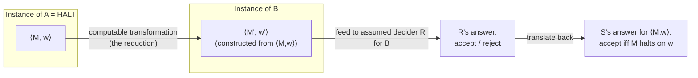
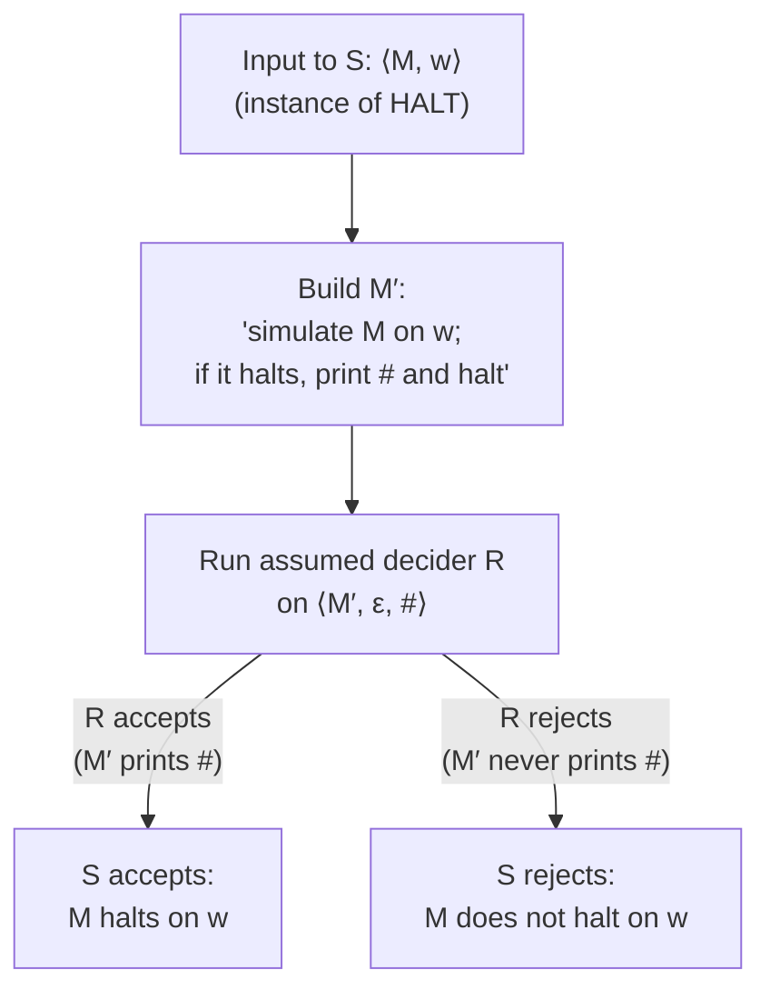

## Learning Objectives

- Explain the general reduction technique for proving undecidability: assume the new problem is decidable, then use its decider to build a decider for a known-undecidable problem.
- State precisely what it means to "reduce" one problem to another in this context, and why the direction of the reduction matters.
- Construct, in full, a reduction from HALT to a specific new problem (whether a machine ever prints a given symbol), and explain each step of the constructed machine.
- Distinguish this reduction-based proof strategy from repeating a diagonalization argument from scratch, and explain why the former is preferred whenever available.
- Apply the reduction template to recognize, for a new problem statement, which known-undecidable problem is the natural candidate to reduce from.

## Context & Motivation

Having proved once, in full diagonalization detail, that the Halting Problem is undecidable, the natural next question is: what about the dozens of other "does this program do X" questions that show up constantly in practice — does this program ever print "error," does it ever access this memory location, does it accept the empty string, does it halt on every input? Redoing Turing's self-referential construction from scratch for each of these would be exhausting and, worse, would obscure the fact that these questions are all undecidable for essentially the *same underlying reason* — they all secretly encode the same difficulty that HALT already encodes. The reduction technique is the tool that makes this precise: instead of building a new, bespoke contradiction for each new problem, you show that any hypothetical decider for the new problem could be repurposed, with a small amount of extra machinery, into a decider for HALT — and since HALT is already known to be undecidable, that repurposing is itself the contradiction, reused wholesale rather than reinvented.

This is the single most common proof technique used throughout the remainder of this discipline, appearing again (with essentially the same skeleton but a polynomial-time constraint bolted on) when this course later covers proving new problems NP-complete by reduction from an already-known NP-complete problem. Learning the reduction pattern here, in its undecidability form, is therefore not just about clearing the specific problems in this concept's worked examples — it is about internalizing a proof template that recurs, structurally unchanged, at every later stage of the course. Stanford's CS154 and MIT's 18.404 both introduce reductions immediately after the Halting Problem for exactly this reason: it is far more valuable, pedagogically, to see the *pattern* once clearly than to see ten independent diagonalization arguments.

The logical backbone of a reduction proof is still, at heart, the same proof-by-contradiction shape used for HALT itself: to show a new problem B is undecidable, assume for contradiction that B *is* decidable — call its decider R — and then show that R can be used as a subroutine inside a machine that decides HALT. Since HALT is already proven undecidable, a decider for HALT cannot exist, so the machine just built cannot exist either, so the assumption that produced it (that R exists) must be false. B is therefore undecidable. The only new ingredient, compared to the Halting Problem's own proof, is that the "known-false statement" reached at the end is no longer a self-referential paradox built from scratch — it is simply "HALT is decidable," which was already established to be false in the previous concept, and can now be cited rather than re-derived.

## Core Theory

### The general reduction-for-undecidability template

To prove a language B is undecidable using a reduction from a language A already known to be undecidable (most commonly A = HALT):

1. Assume, for contradiction, that B is decidable — let R be a Turing machine that decides B.
2. Using R as a subroutine, construct a Turing machine S that decides A. S will typically work by taking an instance of A, transforming it (computably) into an instance of B, running R on that transformed instance, and translating R's answer back into an answer for the original instance of A.
3. If the transformation and translation are both correct — S accepts exactly the instances of A that should be accepted, and rejects exactly the instances that should be rejected, and S always halts (because R always halts, being a decider, and the transformation step is a simple, always-halting computation) — then S decides A.
4. But A (e.g., HALT) is already known to be undecidable, so no such S can exist.
5. Since every step of constructing S from R is valid whenever R exists, the only assumption that can be blamed is step 1 — so no decider R for B can exist. B is undecidable.

The crucial engineering step is (2): building the actual transformation from an instance of A to an instance of B. This is called a **mapping reduction** (or many-one reduction) from A to B, often written A ≤ₘ B, and it must itself be computable — some Turing machine, given an instance of A, must be able to compute the corresponding instance of B in finite time, independent of R. Note carefully the direction: A ≤ₘ B means A reduces to B, which is used to conclude that B is *at least as hard as* A — if B were decidable, that decidability would "flow backward" through the reduction to make A decidable too. Reducing in the wrong direction (showing B ≤ₘ A instead) proves nothing about B's undecidability; it would instead let a decider for A (if one existed) decide B, which is not the contradiction wanted here.

### Worked reduction: HALT ≤ₘ "does M ever print a particular symbol"

Define PRINT = {⟨M, w, s⟩ : M is a Turing machine, w is a string, s is a tape symbol, and M prints s at some point during its computation on w}. Claim: PRINT is undecidable.

**Proof.** Suppose, for contradiction, that PRINT is decidable, via a decider R that, on input ⟨M, w, s⟩, always halts and correctly accepts iff M prints s at some point when run on w.

Using R, construct a machine S that decides HALT as follows. S takes as input ⟨M, w⟩ (an instance of HALT) and does the following:

1. Construct (this is a purely mechanical, always-halting rewriting step — no simulation involved) a new Turing machine M′, described as: "On any input, first run M on w exactly as M itself would (ignoring M′'s own input entirely and simply simulating M on the fixed string w baked into M′'s description); if and when this simulation halts, print the special symbol # (a symbol M never otherwise uses, chosen fresh) and then halt." Note M′ is built purely by editing M's description — no actual execution of M happens during this construction step.
2. Run R on input ⟨M′, w, #⟩ (any fixed input works for M′'s second argument, e.g. the empty string, since M′ ignores its own input).
3. If R accepts ⟨M′, ε, #⟩ (meaning M′ prints # at some point), S accepts. If R rejects, S rejects.

**Correctness.** M′ prints # if and only if M′'s simulation of M on w reaches the print-# step, which happens if and only if that simulation halts, which happens if and only if M halts on w. So R's answer on ⟨M′, ε, #⟩ is accept exactly when M halts on w — which is exactly the answer HALT requires for ⟨M, w⟩. S therefore always halts (constructing M′ is a finite mechanical step, and R itself always halts, being assumed a decider) and always answers correctly, so S decides HALT.

But HALT is already known to be undecidable (proved in the previous concept). A decider for HALT cannot exist. Since S was built entirely mechanically from R with no additional assumptions, R itself cannot exist. Therefore PRINT is undecidable. ∎

### A second illustration: reducing to "does M accept the empty string"

Define E_TM = {⟨M⟩ : M is a Turing machine and L(M) = ∅} (M accepts no strings at all). It is instructive to see the same skeleton applied with a slightly different transformation. Assume for contradiction a decider R for E_TM exists. Build S deciding HALT on input ⟨M, w⟩ by constructing M″: "On input x, ignore x; simulate M on w; if that halts, accept." Then L(M″) is either {all strings} (if M halts on w, since M″ accepts every input after the simulation completes) or ∅ (if M never halts on w, since M″ never finishes checking, so it accepts nothing). Running R on ⟨M″⟩ and *flipping* the answer (R accepts, i.e. L(M″) = ∅, exactly when M does *not* halt on w) gives a correct decider for HALT — again a contradiction, so E_TM is undecidable. The transformation is different in its details from the PRINT case, but the shape — build a new machine that "wraps" M and w so that the new problem's answer tracks whether M halts on w — is identical.

### Why reductions dominate over re-deriving diagonalization

Every reduction proof ultimately still rests on the original diagonalization argument for HALT — it is not a separate, independent source of undecidability, but a way of *transporting* the one already-proved impossibility to new problems via a purely mechanical transformation step. The payoff is that the transformation (step 2 in the template) is usually a short, concrete, checkable piece of machine-building — as seen in both worked reductions above — whereas re-deriving a self-referential contradiction from scratch for every new problem would require finding a new paradoxical self-application each time, which is far harder to construct and far harder to verify. Reductions convert an open-ended "invent a new contradiction" problem into a closed, mechanical "build a translating machine" problem.

## Worked Examples

### Example 1 — the full PRINT reduction, traced on a concrete instance

**Problem:** Suppose M is a machine that loops forever on every input (never halts, never prints anything), and w is any string. Trace what S computes on ⟨M, w⟩ using the PRINT reduction above, assuming R behaves as specified.

**Trace.** S builds M′: "simulate M on w; if it halts, print # and halt." Since M loops forever on w by assumption, M′'s simulation of M on w never completes, so M′ never reaches the print-# instruction — M′ simply loops forever on every input, printing nothing, ever. R, examining ⟨M′, ε, #⟩, correctly determines that M′ never prints # (since M′'s language of "things it ever prints" is empty), and rejects. S therefore rejects ⟨M, w⟩ — correctly, since M does not halt on w. This matches HALT's required answer exactly.

### Example 2 — checking the reduction direction

**Problem:** A student proposes instead to reduce PRINT to HALT (i.e., build a PRINT-decider out of an assumed HALT-decider) and claims this also proves PRINT undecidable. Is this valid, and if not, why not?

**Reasoning.** Reducing PRINT to HALT would show: if HALT is decidable, then PRINT is decidable. Since HALT is known to be *undecidable* — its hypothesis is false — this implication is true but vacuous; it establishes nothing about PRINT at all (a false hypothesis makes any implication trivially true, and trivially useless as a proof tool here). To prove PRINT undecidable, the reduction must run the other direction: HALT ≤ₘ PRINT, i.e., "if PRINT is decidable, then HALT is decidable" — this is the one that, combined with "HALT is undecidable," yields the needed contradiction "PRINT is decidable ⟹ (false)," forcing PRINT to be undecidable. The direction is not a minor bookkeeping detail; reducing the wrong way produces a logically true but completely unhelpful statement.

### Example 3 — recognizing which known problem to reduce from

**Problem:** A new language is proposed: NEVER-LOOPS = {⟨M⟩ : M halts on every input w}. Sketch, at a high level, why HALT is the natural problem to reduce from, and what the transformation should look like (a full formal proof is not required here — just the shape of the argument).

**Reasoning.** NEVER-LOOPS asks a "does M always halt" question, which smells like a direct descendant of "does M halt on this one input" — the natural move is to build, from an arbitrary HALT instance ⟨M, w⟩, a new machine M‴ whose "halts on every input" behavior exactly tracks "does M halt on w": for instance, M‴ could be defined as "on any input x, ignore x, and simulate M on the fixed string w." Then M‴ halts on every input if and only if M halts on w (either M‴'s single simulation halts, in which case M‴ halts on literally every input since it always runs the identical simulation regardless of x, or it never halts, in which case M‴ never halts on any input). Assuming a decider for NEVER-LOOPS, running it on ⟨M‴⟩ then answers exactly whether M halts on w — reducing HALT to NEVER-LOOPS, and (following the same contradiction template as the PRINT proof) showing NEVER-LOOPS is undecidable too.

## Common Misconceptions & Pitfalls

- **"A reduction from A to B means you run a decider for A to help decide B."** It is the reverse: a reduction A ≤ₘ B is used together with an *assumed* decider for B to build a decider for A. The known-undecidable problem (A) is the one whose non-existent decider gets constructed; the transformation converts A-instances into B-instances, not the other way around.
- **"Building M′ inside the reduction actually requires running M to see what it does."** M′ is constructed purely by editing M's description (splicing in a new "print #" instruction after M's own halting states, say) — this is a fixed, mechanical, always-halting text-manipulation step, entirely separate from ever simulating or executing M. Confusing "constructing a description of a machine that would simulate M" with "actually running M" is the most common way students break a reduction proof's correctness.
- **"Since PRINT reduces from HALT, PRINT and HALT are the same problem in disguise."** A mapping reduction only shows that a decider for the target problem could be repurposed to decide the source problem — it establishes a hardness relationship (B is at least as hard as A), not an equivalence; PRINT and HALT are different languages, over different encodings, and the reduction says nothing about whether PRINT ≤ₘ HALT also holds.
- **"Getting the reduction direction backward just makes the proof a little weaker, not wrong."** As Example 2 shows, reducing in the wrong direction does not weaken the argument — it produces a statement that is true but proves nothing, because its hypothesis (a decider for the known-undecidable problem) is already known false, making the whole implication vacuous rather than merely less useful.
- **"Every property of a Turing machine can be shown undecidable by some reduction from HALT."** This is true for essentially all non-trivial semantic (behavioral) properties, as the next concept generalizes via Rice's Theorem — but purely syntactic properties of a machine's description (e.g., "does M's description contain at least 5 states") are typically decidable by direct inspection and need no reduction at all; not every question about a Turing machine is a candidate for this technique.

## Summary

To prove a new language B undecidable without repeating a diagonalization argument from scratch, assume for contradiction that B is decidable via some machine R, then use R as a subroutine to construct a machine S that decides an already-known-undecidable language (typically HALT) — the reduction itself is a computable transformation from instances of the known problem into instances of B, whose correctness must be verified in both directions (accept maps to accept, reject maps to reject). Since the known problem is already proved undecidable, S cannot exist, so R cannot exist, so B is undecidable. This was worked through in full for PRINT = {⟨M, w, s⟩ : M prints s on input w}, by constructing M′ = "simulate M on w, then print s and halt," and sketched again for E_TM and NEVER-LOOPS — in each case, the specific transformation differs, but the overall contradiction template is identical, and always ultimately traces back to the one, original diagonalization argument for HALT. Getting the reduction's direction right (reducing FROM the known-undecidable problem TO the new one) is the single most important and most commonly mishandled detail in applying this technique.

## Documentation Links

- [Stanford CS154 — Course Home](https://cs154.stanford.edu/) — doc
- [MIT 18.404/6.5400 — Course Information (Sipser)](https://math.mit.edu/~sipser/18404/info.pdf) — doc
