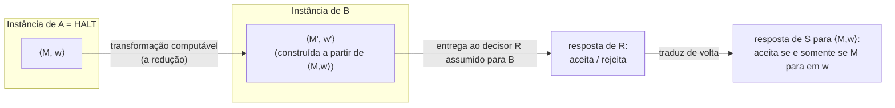
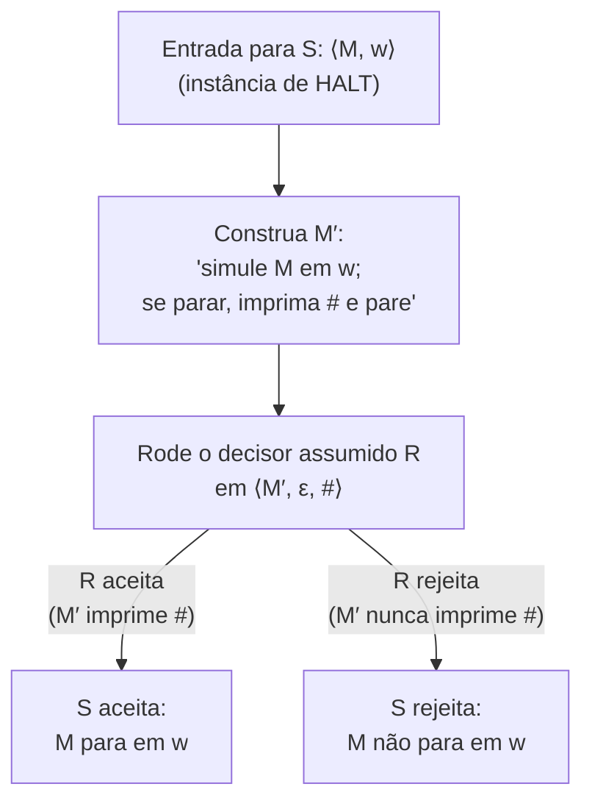

## Objetivos de Aprendizagem

- Explicar a técnica geral de redução para demonstrar indecidibilidade: assuma que o problema novo é decidível, depois use seu decisor para construir um decisor para um problema já conhecido como indecidível.
- Enunciar precisamente o que significa "reduzir" um problema a outro neste contexto, e por que a direção da redução importa.
- Construir, por completo, uma redução de HALT para um problema novo específico (se uma máquina algum dia imprime um dado símbolo), e explicar cada passo da máquina construída.
- Distinguir esta estratégia de prova baseada em redução de repetir um argumento de diagonalização do zero, e explicar por que a primeira é preferida sempre que disponível.
- Aplicar o modelo de redução para reconhecer, para um novo enunciado de problema, qual problema já conhecido como indecidível é o candidato natural do qual reduzir.

## Contexto e Motivação

Tendo demonstrado uma vez, em detalhe completo de diagonalização, que o Problema da Parada é indecidível, a próxima pergunta natural é: e as dezenas de outras perguntas "este programa faz X" que aparecem constantemente na prática, este programa algum dia imprime "erro", ele algum dia acessa esta localização de memória, ele aceita a string vazia, ele para em toda entrada? Refazer a construção autorreferencial de Turing do zero para cada uma dessas seria exaustivo e, pior, obscureceria o fato de que essas perguntas são todas indecidíveis essencialmente pela *mesma razão subjacente*, todas elas secretamente codificam a mesma dificuldade que HALT já codifica. A técnica de redução é a ferramenta que torna isso preciso: em vez de construir uma contradição nova, sob medida, para cada problema novo, você mostra que qualquer decisor hipotético para o problema novo poderia ser reaproveitado, com uma pequena quantidade de maquinaria extra, em um decisor para HALT, e já que HALT já é conhecida como indecidível, aquele reaproveitamento é ele mesmo a contradição, reutilizada por completo em vez de reinventada.

Esta é a técnica de prova mais comum usada ao longo do resto desta disciplina, aparecendo novamente (com essencialmente o mesmo esqueleto mas uma restrição de tempo polinomial acoplada) quando este curso mais adiante cobre demonstrar novos problemas NP-completos por redução de um problema NP-completo já conhecido. Aprender o padrão de redução aqui, em sua forma de indecidibilidade, portanto não é só sobre resolver os problemas específicos nos exemplos resolvidos deste conceito, é sobre internalizar um modelo de prova que recorre, estruturalmente inalterado, em todo estágio posterior do curso. Tanto o CS154 de Stanford quanto o 18.404 do MIT introduzem reduções imediatamente depois do Problema da Parada por exatamente essa razão: é muito mais valioso, pedagogicamente, ver o *padrão* uma vez com clareza do que ver dez argumentos de diagonalização independentes.

A espinha dorsal lógica de uma prova por redução ainda é, no fundo, a mesma forma de prova por contradição usada para o próprio HALT: para mostrar que um problema novo B é indecidível, assuma por contradição que B *é* decidível, chame seu decisor de R, e depois mostre que R pode ser usada como uma sub-rotina dentro de uma máquina que decide HALT. Já que HALT já é demonstrada indecidível, um decisor para HALT não pode existir, então a máquina recém-construída também não pode existir, então a suposição que a produziu (que R existe) precisa ser falsa. B é portanto indecidível. O único ingrediente novo, comparado com a própria prova do Problema da Parada, é que a "afirmação conhecida como falsa" alcançada no final não é mais um paradoxo autorreferencial construído do zero, é simplesmente "HALT é decidível", o que já foi estabelecido como falso no conceito anterior, e agora pode ser citado em vez de re-derivado.

## Teoria Central

### O modelo geral de redução-para-indecidibilidade

Para demonstrar que uma linguagem B é indecidível usando uma redução de uma linguagem A já conhecida como indecidível (mais comumente A = HALT):

1. Assuma, por contradição, que B é decidível, seja R uma máquina de Turing que decide B.
2. Usando R como uma sub-rotina, construa uma máquina de Turing S que decide A. S tipicamente vai funcionar pegando uma instância de A, transformando-a (computavelmente) em uma instância de B, rodando R naquela instância transformada, e traduzindo a resposta de R de volta em uma resposta para a instância original de A.
3. Se a transformação e a tradução são ambas corretas, S aceita exatamente as instâncias de A que deveriam ser aceitas, e rejeita exatamente as instâncias que deveriam ser rejeitadas, e S sempre para (porque R sempre para, sendo um decisor, e o passo de transformação é uma computação simples, que sempre para), então S decide A.
4. Mas A (ex., HALT) já é conhecida como indecidível, então nenhuma tal S pode existir.
5. Já que todo passo de construir S a partir de R é válido sempre que R existe, a única suposição que pode ser culpada é o passo 1, então nenhum decisor R para B pode existir. B é indecidível.

O passo de engenharia crucial é o (2): construir a transformação real de uma instância de A para uma instância de B. Isto é chamado de **redução de mapeamento** (ou redução muitos-para-um) de A para B, frequentemente escrita A ≤ₘ B, e ela mesma precisa ser computável, alguma máquina de Turing, dada uma instância de A, precisa conseguir computar a instância correspondente de B em tempo finito, independentemente de R. Note cuidadosamente a direção: A ≤ₘ B significa que A se reduz a B, o que é usado para concluir que B é *ao menos tão difícil quanto* A, se B fosse decidível, aquela decidibilidade "fluiria de volta" através da redução para tornar A também decidível. Reduzir na direção errada (mostrando B ≤ₘ A em vez disso) não demonstra nada sobre a indecidibilidade de B; em vez disso deixaria um decisor para A (se um existisse) decidir B, o que não é a contradição desejada aqui.

### Redução resolvida: HALT ≤ₘ "M algum dia imprime um símbolo específico"

Defina PRINT = {⟨M, w, s⟩ : M é uma máquina de Turing, w é uma string, s é um símbolo de fita, e M imprime s em algum ponto durante sua computação em w}. Afirmação: PRINT é indecidível.

**Prova.** Suponha, por contradição, que PRINT é decidível, via um decisor R que, na entrada ⟨M, w, s⟩, sempre para e corretamente aceita se e somente se M imprime s em algum ponto quando rodada em w.

Usando R, construa uma máquina S que decide HALT da seguinte forma. S recebe como entrada ⟨M, w⟩ (uma instância de HALT) e faz o seguinte:

1. Construa (este é um passo de reescrita puramente mecânico, que sempre para, sem simulação envolvida) uma nova máquina de Turing M′, descrita como: "Em qualquer entrada, primeiro rode M em w exatamente como o próprio M faria (ignorando a própria entrada de M′ inteiramente e simplesmente simulando M na string fixa w embutida na descrição de M′); se e quando esta simulação parar, imprima o símbolo especial # (um símbolo que M nunca usa de outra forma, escolhido novo) e depois pare." Note que M′ é construída puramente editando a descrição de M, nenhuma execução real de M acontece durante este passo de construção.
2. Rode R na entrada ⟨M′, w, #⟩ (qualquer entrada fixa funciona para o segundo argumento de M′, ex. a string vazia, já que M′ ignora sua própria entrada).
3. Se R aceita ⟨M′, ε, #⟩ (significando que M′ imprime # em algum ponto), S aceita. Se R rejeita, S rejeita.

**Correção.** M′ imprime # se e somente se a simulação de M em w feita por M′ alcança o passo de imprimir-#, o que acontece se e somente se aquela simulação para, o que acontece se e somente se M para em w. Então a resposta de R em ⟨M′, ε, #⟩ é aceita exatamente quando M para em w, o que é exatamente a resposta que HALT exige para ⟨M, w⟩. S portanto sempre para (construir M′ é um passo mecânico finito, e a própria R sempre para, sendo assumida como um decisor) e sempre responde corretamente, então S decide HALT.

Mas HALT já é conhecida como indecidível (demonstrado no conceito anterior). Um decisor para HALT não pode existir. Já que S foi construída inteiramente mecanicamente a partir de R sem suposições adicionais, a própria R não pode existir. Portanto PRINT é indecidível. ∎

### Uma segunda ilustração: reduzindo para "M aceita a string vazia"

Defina E_TM = {⟨M⟩ : M é uma máquina de Turing e L(M) = ∅} (M não aceita nenhuma string de forma alguma). É instrutivo ver o mesmo esqueleto aplicado com uma transformação ligeiramente diferente. Assuma por contradição que um decisor R para E_TM existe. Construa S decidindo HALT na entrada ⟨M, w⟩ construindo M″: "Na entrada x, ignore x; simule M em w; se aquilo parar, aceite." Então L(M″) é ou {todas as strings} (se M para em w, já que M″ aceita toda entrada depois que a simulação completa) ou ∅ (se M nunca para em w, já que M″ nunca termina de checar, então não aceita nada). Rodar R em ⟨M″⟩ e *inverter* a resposta (R aceita, ou seja L(M″) = ∅, exatamente quando M *não* para em w) dá um decisor correto para HALT, novamente uma contradição, então E_TM é indecidível. A transformação é diferente em seus detalhes do caso PRINT, mas a forma, construir uma máquina nova que "envolve" M e w de forma que a resposta do problema novo rastreie se M para em w, é idêntica.

### Por que reduções dominam sobre re-derivar diagonalização

Toda prova por redução em última instância ainda se apoia no argumento de diagonalização original para HALT, não é uma fonte separada, independente, de indecidibilidade, mas uma forma de *transportar* a única impossibilidade já demonstrada para problemas novos via um passo de transformação puramente mecânico. O retorno é que a transformação (passo 2 no modelo) é geralmente um pedaço curto, concreto, verificável de construção de máquina, como visto em ambas as reduções resolvidas acima, enquanto re-derivar uma contradição autorreferencial do zero para cada problema novo exigiria encontrar uma nova autoaplicação paradoxal a cada vez, o que é muito mais difícil de construir e muito mais difícil de verificar. Reduções convertem um problema aberto de "invente uma contradição nova" em um problema fechado, mecânico, de "construa uma máquina tradutora."

## Exemplos Resolvidos

### Exemplo 1: a redução PRINT completa, rastreada em uma instância concreta

**Problema:** Suponha que M é uma máquina que roda para sempre em loop em toda entrada (nunca para, nunca imprime nada), e w é qualquer string. Rastreie o que S computa em ⟨M, w⟩ usando a redução PRINT acima, assumindo que R se comporta conforme especificado.

**Rastro.** S constrói M′: "simule M em w; se parar, imprima # e pare." Já que M roda para sempre em loop em w por suposição, a simulação de M em w feita por M′ nunca completa, então M′ nunca alcança a instrução imprimir-#, M′ simplesmente roda para sempre em loop em toda entrada, nunca imprimindo nada. R, examinando ⟨M′, ε, #⟩, corretamente determina que M′ nunca imprime # (já que a linguagem de M′ de "coisas que algum dia imprime" é vazia), e rejeita. S portanto rejeita ⟨M, w⟩, corretamente, já que M não para em w. Isso corresponde exatamente à resposta que HALT exige.

### Exemplo 2: checando a direção da redução

**Problema:** Um aluno propõe em vez disso reduzir PRINT a HALT (ou seja, construir um decisor-PRINT a partir de um decisor-HALT assumido) e afirma que isso também demonstra PRINT indecidível. Isso é válido, e se não, por quê?

**Raciocínio.** Reduzir PRINT a HALT mostraria: se HALT é decidível, então PRINT é decidível. Já que HALT é conhecida como *indecidível*, sua hipótese é falsa, esta implicação é verdadeira mas vazia; ela não estabelece nada sobre PRINT de forma alguma (uma hipótese falsa torna qualquer implicação trivialmente verdadeira, e trivialmente inútil como ferramenta de prova aqui). Para demonstrar PRINT indecidível, a redução precisa correr na outra direção: HALT ≤ₘ PRINT, ou seja, "se PRINT é decidível, então HALT é decidível", esta é a que, combinada com "HALT é indecidível", produz a contradição necessária "PRINT é decidível ⟹ (falso)", forçando PRINT a ser indecidível. A direção não é um detalhe menor de contabilidade; reduzir na direção errada produz uma afirmação logicamente verdadeira mas completamente inútil.

### Exemplo 3: reconhecendo de qual problema conhecido reduzir

**Problema:** Uma linguagem nova é proposta: NEVER-LOOPS = {⟨M⟩ : M para em toda entrada w}. Esboce, em alto nível, por que HALT é o problema natural do qual reduzir, e como a transformação deveria parecer (uma prova formal completa não é exigida aqui, só a forma do argumento).

**Raciocínio.** NEVER-LOOPS faz uma pergunta "M sempre para", o que tem cheiro de uma descendente direta de "M para nesta única entrada", o movimento natural é construir, a partir de uma instância arbitrária de HALT ⟨M, w⟩, uma máquina nova M‴ cujo comportamento "para em toda entrada" rastreia exatamente "M para em w": por exemplo, M‴ poderia ser definida como "em qualquer entrada x, ignore x, e simule M na string fixa w." Então M‴ para em toda entrada se e somente se M para em w (ou a única simulação de M‴ para, caso em que M‴ para em literalmente toda entrada já que sempre roda a simulação idêntica independentemente de x, ou nunca para, caso em que M‴ nunca para em nenhuma entrada). Assumindo um decisor para NEVER-LOOPS, rodá-lo em ⟨M‴⟩ então responde exatamente se M para em w, reduzindo HALT a NEVER-LOOPS, e (seguindo o mesmo modelo de contradição da prova PRINT) mostrando que NEVER-LOOPS também é indecidível.

## Equívocos Comuns e Armadilhas

- **"Uma redução de A para B significa que você roda um decisor para A para ajudar a decidir B."** É o inverso: uma redução A ≤ₘ B é usada junto com um decisor *assumido* para B para construir um decisor para A. O problema já conhecido como indecidível (A) é aquele cujo decisor inexistente é construído; a transformação converte instâncias de A em instâncias de B, não o contrário.
- **"Construir M′ dentro da redução de fato exige rodar M para ver o que ela faz."** M′ é construída puramente editando a descrição de M (emendando uma instrução nova "imprima #" depois dos próprios estados de parada de M, digamos), este é um passo de manipulação de texto fixo, mecânico, que sempre para, inteiramente separado de jamais simular ou executar M. Confundir "construir a descrição de uma máquina que simularia M" com "de fato rodar M" é a forma mais comum de alunos quebrarem a correção de uma prova por redução.
- **"Já que PRINT se reduz de HALT, PRINT e HALT são o mesmo problema disfarçado."** Uma redução de mapeamento só mostra que um decisor para o problema alvo poderia ser reaproveitado para decidir o problema fonte, ela estabelece uma relação de dificuldade (B é ao menos tão difícil quanto A), não uma equivalência; PRINT e HALT são linguagens diferentes, sobre codificações diferentes, e a redução não diz nada sobre se PRINT ≤ₘ HALT também vale.
- **"Errar a direção da redução só torna a prova um pouco mais fraca, não errada."** Como o Exemplo 2 mostra, reduzir na direção errada não enfraquece o argumento, produz uma afirmação verdadeira mas que não demonstra nada, porque sua hipótese (um decisor para o problema já conhecido como indecidível) já é conhecida como falsa, tornando a implicação inteira vazia em vez de meramente menos útil.
- **"Toda propriedade de uma máquina de Turing pode ser mostrada indecidível por alguma redução de HALT."** Isto é verdade para essencialmente todas as propriedades semânticas (comportamentais) não triviais, como o próximo conceito generaliza via o Teorema de Rice, mas propriedades puramente sintáticas da descrição de uma máquina (ex., "a descrição de M contém ao menos 5 estados") são tipicamente decidíveis por inspeção direta e não precisam de nenhuma redução de forma alguma; nem toda pergunta sobre uma máquina de Turing é uma candidata para esta técnica.

## Resumo

Para demonstrar uma linguagem nova B indecidível sem repetir um argumento de diagonalização do zero, assuma por contradição que B é decidível via alguma máquina R, depois use R como uma sub-rotina para construir uma máquina S que decide uma linguagem já conhecida como indecidível (tipicamente HALT), a própria redução é uma transformação computável de instâncias do problema conhecido em instâncias de B, cuja correção precisa ser verificada em ambas as direções (aceita mapeia para aceita, rejeita mapeia para rejeita). Já que o problema conhecido já é demonstrado indecidível, S não pode existir, então R não pode existir, então B é indecidível. Isso foi trabalhado por completo para PRINT = {⟨M, w, s⟩ : M imprime s na entrada w}, construindo M′ = "simule M em w, depois imprima s e pare", e esboçado novamente para E_TM e NEVER-LOOPS, em cada caso, a transformação específica difere, mas o modelo de contradição geral é idêntico, e sempre em última instância remonta ao único argumento de diagonalização original para HALT. Acertar a direção da redução (reduzindo DO problema já conhecido como indecidível PARA o novo) é o detalhe único mais importante e mais comumente errado ao aplicar esta técnica.

## Documentation Links

- [Stanford CS154: Course Home](https://cs154.stanford.edu/): doc
- [MIT 18.404/6.5400: Course Information (Sipser)](https://math.mit.edu/~sipser/18404/info.pdf): doc
