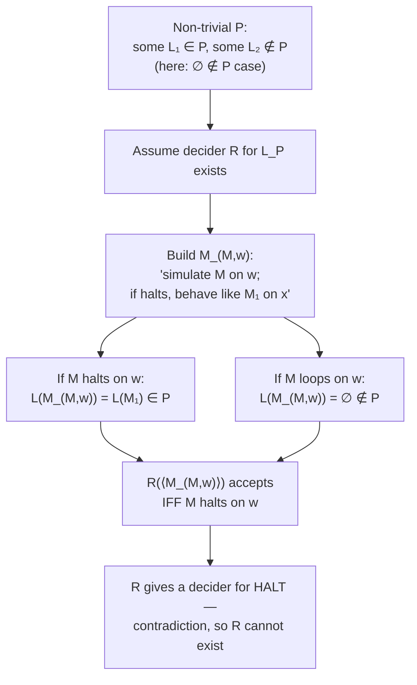
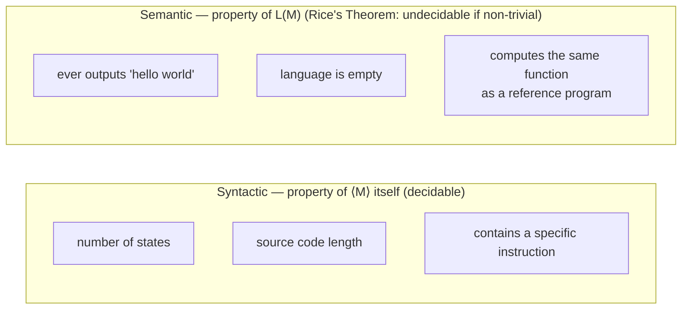

## Learning Objectives

- State Rice's Theorem precisely, including the exact meaning of "non-trivial" and "property of the language a machine recognizes."
- Distinguish a semantic (behavioral) property of a Turing machine's language from a syntactic property of the machine's own description, with concrete examples of each.
- Apply Rice's Theorem to instantly classify a list of realistic program-behavior questions as undecidable, without constructing a fresh reduction for each one.
- Explain, with a specific counterexample, why Rice's Theorem does not make every question about a program undecidable.
- Connect Rice's Theorem back to the reduction technique by sketching, at a high level, why its proof is itself a reduction from HALT.

## Context & Motivation

By this point in the course, a pattern has emerged that should feel almost suspicious: question after question about what a program actually *does* — does it ever print a certain string, does it accept the empty string, does it halt on every input — turns out to be undecidable, each time provable by essentially the same reduction-from-HALT skeleton with a different transformation bolted on. Rice's Theorem is the payoff of noticing that pattern all the way through: instead of treating each new "is this decidable?" question as requiring its own bespoke reduction, Rice's Theorem proves, once and for all, that an entire sweeping category of such questions is undecidable, as a single theorem. It is, in a real sense, the reduction technique's own generalization — a reduction template so uniform that it can be executed once, abstractly, for every property fitting a precise description, rather than once per property.

This matters immensely in practice, not just in theory: it is the formal reason software verification tools can never be fully general. A tool that claims to determine, for an arbitrary program, whether it "ever crashes," "always terminates," "computes the same function as some reference implementation," or "never leaks a particular piece of data" is attempting to decide a non-trivial semantic property of that program's behavior — and Rice's Theorem says, immediately and without needing a new proof, that no such tool can exist in full generality. Real static analyzers and verifiers survive this fact not by contradicting it, but by giving up completeness: they either restrict themselves to a narrower class of programs, tolerate some false positives or false negatives, or refuse to answer ("unknown") on cases they cannot resolve. Stanford's CS154 and the ACM/IEEE CS2013 curriculum guidelines both treat Rice's Theorem as the natural capstone of the undecidability sequence for exactly this reason: it is the single result that most directly explains why "just write a program that checks the program" is not a viable general strategy for any question about behavior, however the question is phrased.

The theorem's full power comes with a precise and easy-to-misapply boundary, which is the most important thing to get exactly right in this concept: Rice's Theorem applies only to properties of the *language* a machine recognizes — that is, properties of its actual input/output behavior across all possible inputs — and says nothing whatsoever about properties of the machine's *description* itself (its source code, its number of states, whether it contains a particular instruction). This distinction, semantic versus syntactic, is not a technicality; it is the exact line the theorem draws, and confusing the two sides of it is the single most common way students misapply the result, either by wrongly declaring something undecidable that a direct algorithm handles trivially, or by failing to recognize a genuinely undecidable semantic property because it was phrased in behavioral-sounding language.

## Core Theory

### Precise statement of Rice's Theorem

Let P be a property of Turing-recognizable languages — that is, P is a set of Turing-recognizable languages (formally, P ⊆ {L : L is Turing-recognizable}), and for a machine M, we say "M has property P" to mean L(M) ∈ P, where L(M) is the language M recognizes. Call P **trivial** if either P is empty (no recognizable language has the property) or P contains every recognizable language (every recognizable language has the property); otherwise call P **non-trivial** — meaning there exists at least one recognizable language with the property and at least one recognizable language without it.

**Theorem (Rice).** For any non-trivial property P of recognizable languages, the language

L_P = {⟨M⟩ : L(M) ∈ P}

is undecidable.

In words: any yes/no question about the language a Turing machine recognizes — provided the question is not trivially always-yes or always-no — cannot be decided by any algorithm that inspects the machine's description. The theorem says nothing about a *fixed, specific* machine's property (that is either simply true or simply false, not a decidability question at all); it is a statement about the impossibility of a single general algorithm that correctly answers the question for *every* machine handed to it.

### Sketch of why the theorem holds (a reduction from HALT)

The proof follows exactly the reduction template from the previous concept, executed once, generically. Assume for contradiction that L_P is decidable via some decider R. Since P is non-trivial, there exist a recognizable language L₁ ∈ P and a recognizable language L₂ ∉ P; let M₁ be a machine with L(M₁) = L₁. (Two cases arise depending on whether the empty language ∅ is in P or not; the standard proof handles the case ∅ ∉ P by reducing from HALT as follows — the case ∅ ∈ P is symmetric, using P's complement.) Suppose ∅ ∉ P, and let M₁ be a machine with L(M₁) ∈ P.

Build a machine S that decides HALT: on input ⟨M, w⟩, S constructs a new machine M_{M,w} defined as: "on input x, first simulate M on w; if that simulation halts, then simulate M₁ on x and accept iff M₁ accepts x." Now observe:

- if M halts on w, then M_{M,w}'s simulation of M on w completes, so M_{M,w} goes on to behave exactly like M₁ on every input x — so L(M_{M,w}) = L(M₁) ∈ P;
- if M does not halt on w, then M_{M,w}'s simulation of M on w never completes for any x, so M_{M,w} never reaches the M₁-simulation step for any input — so L(M_{M,w}) = ∅ ∉ P (using the case assumption).

So running R on ⟨M_{M,w}⟩ answers exactly whether M halts on w: R accepts iff L(M_{M,w}) ∈ P iff M halts on w. S is therefore a decider for HALT — contradicting HALT's undecidability. So R cannot exist, and L_P is undecidable. This is the same reduction skeleton as the PRINT and E_TM proofs in the previous concept, just executed abstractly against an arbitrary non-trivial P rather than one concrete property.

### Properties Rice's Theorem instantly rules out

Because the theorem requires no new construction per property — only checking non-triviality — it immediately settles an entire list of realistic questions as undecidable, each corresponding to a non-trivial property P of the recognized language:

- **"Does this program ever output the string 'hello world'?"** P = {languages L : some computation accepting under M outputs 'hello world' at some point} is non-trivial (some machines do, some don't) — undecidable.
- **"Is this program's language empty (does it accept nothing at all)?"** P = {∅} is non-trivial (the language of a machine that immediately rejects everything is ∅; the language of a machine that accepts everything is not) — undecidable. (This is exactly E_TM from the previous concept, now seen as one instance of Rice's Theorem rather than a one-off reduction.)
- **"Does this program halt on all inputs?"** P = {languages L : L is decided, i.e., some total machine recognizes L, versus properties tied to total halting}. Care is needed in how this is phrased as a language property versus a machine property, but the closely related question "does this specific machine halt on every input" corresponds to a different, related, but distinct famous undecidable problem (sometimes called TOTAL or the "totality problem") that is not itself literally an instance of Rice's Theorem as stated — Rice's Theorem concerns properties of the *language recognized*, and "always halts" is a statement about the *machine's behavior as a procedure* that happens to align with language properties only indirectly; the totality problem is undecidable by its own reduction from HALT, structurally similar but worth keeping mentally distinct from a pure Rice's-Theorem application.
- **"Does this program compute the same function as some fixed reference program?"** P = {L : L = L(reference)} is non-trivial whenever some machine matches the reference language and some machine does not (almost always the case) — undecidable.
- **"Does this program ever access a particular memory location / call a particular subroutine, as observed through its accept/reject behavior on some encoding of that condition"** — whenever this is phrased as a genuine property of the recognized language, non-triviality gives undecidability immediately.

### What Rice's Theorem does NOT cover

The theorem's hypothesis is specifically "a property of the language L(M)" — a property of the machine's *behavior across all inputs* — not a property of the machine's *textual description*. Consider: **"Does this program's source code have more than 100 lines?"** This is decidable — trivially so, by an algorithm that simply reads M's description, counts lines (or states, or transitions, however "lines" is encoded), and answers directly, with no simulation of M's behavior on any input required at all. This property is not of the form L_P for any property P of languages, because two machines with wildly different descriptions (one 50 lines, one 500 lines) can recognize the exact same language — "more than 100 lines" is not even well-defined as a function of L(M) alone, since it depends on which particular machine (among possibly infinitely many with the same language) is being asked about. Similarly decidable, for the same reason: "does this program's code contain the string 'goto'," "how many states does this machine have," "is this machine's description syntactically well-formed." All of these are answered by inspecting the encoding ⟨M⟩ directly, never by reasoning about what M does when run — which is exactly the boundary Rice's Theorem does not cross.

## Worked Examples

### Example 1 — classifying a property as trivial or non-trivial

**Problem:** Let P = {L : L is Turing-recognizable} (i.e., P is simply "the language is recognizable at all"). Is L_P undecidable by Rice's Theorem?

**Reasoning.** Check triviality first: does *every* recognizable language belong to P? By definition of P here, yes — every language under consideration in this context is already required to be Turing-recognizable, so P contains all of them. P is trivial (it is the "contains everything" case), so Rice's Theorem's hypothesis is not met, and the theorem says nothing about L_P. (In fact, "is L(M) recognizable" is not even a meaningful yes/no question to ask about an arbitrary M in this setting, since every Turing machine recognizes some recognizable language by definition — this example mainly illustrates why checking triviality first, before reaching for the theorem, is a genuine and necessary step, not a formality.)

### Example 2 — applying Rice's Theorem to a new property directly

**Problem:** Let P = {L : L is finite} (the language recognized contains only finitely many strings). Is "does M recognize a finite language" decidable?

**Reasoning.** Check non-triviality: there exists a machine recognizing a finite language (e.g., a machine that accepts only the string "a" and rejects everything else — L = {"a"}, which is finite) and a machine recognizing an infinite language (e.g., a machine that accepts every string — L = Σ*, infinite). Both exist, so P is non-trivial. By Rice's Theorem, L_P = {⟨M⟩ : L(M) is finite} is undecidable — no algorithm can, in general, determine whether an arbitrary Turing machine's recognized language is finite or infinite, and this required no new reduction to be constructed by hand; checking non-triviality was the entire job.

### Example 3 — distinguishing a semantic property from a syntactic-sounding one that is secretly semantic

**Problem:** Is "does this Turing machine's transition table contain an unreachable state (a state that can never actually be entered on any input)?" decidable, undecidable via Rice's Theorem, or neither?

**Reasoning.** This question looks syntactic at first glance — "reachability in the transition table" sounds like it could be answered by inspecting the table directly, the way counting states or checking for a specific instruction can be. But whether a state is reachable depends on what inputs actually drive the machine there, which is a question about the machine's *dynamic behavior*, not simply its static text — and in general, determining reachability of an arbitrary state requires reasoning equivalent to simulating the machine's behavior across all inputs. This is not literally an instance of L_P for a property of L(M) as Rice's Theorem is stated (reachability of a specific named state is a property of the machine, not purely of the language it recognizes — two machines with identical descriptions except for one unreachable state clearly recognize the same language, so this property is not even well-defined as a function of L(M) alone, similar to the "100 lines" example). The honest classification is: it superficially resembles a syntactic check but actually requires behavioral reasoning, and is undecidable by a direct reduction from HALT (not literally Rice's Theorem, which requires the property to depend only on L(M)) — this example is included specifically to show that "looks syntactic" and "is actually syntactic" are not the same thing, and the safe test is always: does changing M's behavior on some input, while possibly changing its description, change whether the property holds? If yes, it is at least behavior-sensitive and needs care; if the property is a genuine function of L(M) alone and non-trivial, Rice's Theorem applies directly.

## Common Misconceptions & Pitfalls

- **"Rice's Theorem makes every interesting question about a program undecidable, full stop."** It applies only to non-trivial properties of the language recognized — genuinely syntactic properties of the program's own text (line count, state count, whether a specific string literal appears in the source) remain decidable by direct inspection, as the "100 lines" example shows concretely; Rice's Theorem has a precise scope, not an unlimited one.
- **"A property is trivial only if it's obviously silly, like 'is this machine a Turing machine.'"** Triviality is a precise technical condition — P is trivial exactly when it holds for every recognizable language or for none — and some properties that sound meaningful are nonetheless trivial in this sense (Example 1's "is the language recognizable" is trivially true of everything under consideration), so checking triviality is a real, necessary step, not a formality to skip.
- **"If a question is phrased about the program's code, it must be syntactic and therefore decidable."** Example 3 shows the opposite trap: "does this state ever get entered" is phrased in terms of the transition table, but answering it in general requires reasoning about the machine's behavior across all inputs, not just reading the table — phrasing is not a reliable guide; the real test is whether the answer is a function of L(M) alone (or otherwise depends on runtime behavior), not how the question happens to be worded.
- **"Rice's Theorem and the totality problem ('does M halt on all inputs') are the same result."** They are closely related — both undecidable, both provable by reduction from HALT — but "halts on all inputs" is a statement about the machine's behavior as a halting procedure, not literally a property of the recognized language L(M) in the sense Rice's Theorem requires; treating every "does M always do X" question as an automatic instance of Rice's Theorem, without checking that X is really a well-defined function of L(M) alone, is a common overreach.
- **"Since Rice's Theorem proves undecidability instantly, no actual reduction is happening — it's a different kind of proof."** The proof of Rice's Theorem itself is a reduction from HALT, executed once, generically, for an arbitrary non-trivial P — using the theorem to classify a new property does not require redoing that reduction, but the theorem's own justification rests on exactly the reduction technique from the previous concept, not a separate proof strategy.

## Summary

Rice's Theorem states that for any non-trivial property P of Turing-recognizable languages — one true for some recognizable languages and false for others — the language L_P = {⟨M⟩ : L(M) ∈ P} is undecidable, and its proof is itself a single, generic reduction from HALT, built by constructing a machine that behaves like a fixed P-satisfying machine exactly when a given M halts on a given w. This single theorem instantly classifies a wide range of realistic behavioral questions as undecidable — does a program ever output a specific string, is its language empty, does it compute the same function as a reference implementation — without needing a fresh reduction built by hand for each one. Its scope is precise and easy to misapply at the boundary: it covers only genuine properties of the language a machine recognizes (semantic, behavioral properties), never properties of the machine's own description (syntactic properties like source-code length or state count), which remain ordinarily decidable by direct inspection; and some behavior-sounding questions (like whether a specific state is ever reached, or whether a machine halts on every input) require care to classify correctly, since they are not always literally functions of L(M) alone even when they smell semantic.

## Documentation Links

- [Stanford CS154 — Course Home](https://cs154.stanford.edu/) — doc
- [ACM/IEEE CS2013 — Full Curriculum Site](https://csed.acm.org/cs2013-version/) — doc
