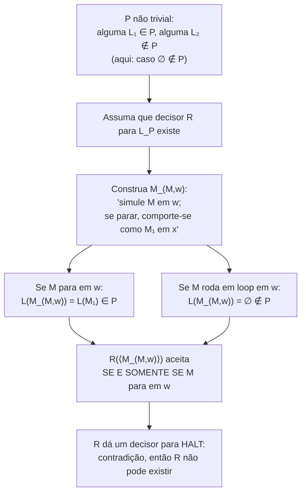
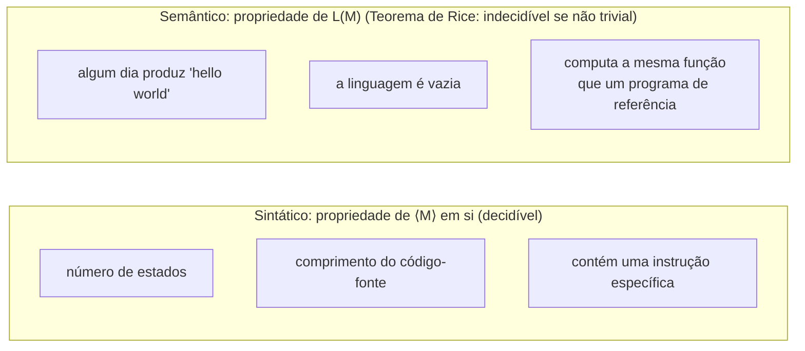

## Objetivos de Aprendizagem

- Enunciar o Teorema de Rice com precisão, incluindo o significado exato de "não trivial" e "propriedade da linguagem que uma máquina reconhece."
- Distinguir uma propriedade semântica (comportamental) da linguagem de uma máquina de Turing de uma propriedade sintática da própria descrição da máquina, com exemplos concretos de cada uma.
- Aplicar o Teorema de Rice para classificar instantaneamente uma lista de perguntas realistas sobre comportamento de programa como indecidíveis, sem construir uma redução nova para cada uma.
- Explicar, com um contraexemplo específico, por que o Teorema de Rice não torna toda pergunta sobre um programa indecidível.
- Conectar o Teorema de Rice de volta à técnica de redução esboçando, em alto nível, por que sua prova é ela mesma uma redução de HALT.

## Contexto e Motivação

Neste ponto do curso, um padrão emergiu que deveria parecer quase suspeito: pergunta após pergunta sobre o que um programa realmente *faz*, ele algum dia imprime uma certa string, ele aceita a string vazia, ele para em toda entrada, acaba sendo indecidível, cada vez demonstrável por essencialmente o mesmo esqueleto de redução-de-HALT com uma transformação diferente acoplada. O Teorema de Rice é o retorno de notar aquele padrão até o fim: em vez de tratar cada pergunta nova de "isto é decidível?" como exigindo sua própria redução sob medida, o Teorema de Rice demonstra, de uma vez por todas, que uma categoria inteira, ampla, de tais perguntas é indecidível, como um único teorema. É, em um sentido real, a própria generalização da técnica de redução, um modelo de redução tão uniforme que pode ser executado uma vez, abstratamente, para toda propriedade que se encaixe em uma descrição precisa, em vez de uma vez por propriedade.

Isso importa imensamente na prática, não só na teoria: é a razão formal pela qual ferramentas de verificação de software nunca podem ser totalmente gerais. Uma ferramenta que afirma determinar, para um programa arbitrário, se ele "algum dia trava," "sempre termina," "computa a mesma função que alguma implementação de referência," ou "nunca vaza um dado pedaço de informação" está tentando decidir uma propriedade semântica não trivial do comportamento daquele programa, e o Teorema de Rice diz, imediatamente e sem precisar de uma prova nova, que nenhuma tal ferramenta pode existir em plena generalidade. Analisadores estáticos e verificadores reais sobrevivem a esse fato não o contradizendo, mas desistindo de completude: eles ou se restringem a uma classe mais estreita de programas, toleram alguns falsos positivos ou falsos negativos, ou se recusam a responder ("desconhecido") em casos que não conseguem resolver. Tanto o CS154 de Stanford quanto as diretrizes curriculares ACM/IEEE CS2013 tratam o Teorema de Rice como o encerramento natural da sequência de indecidibilidade por exatamente essa razão: é o único resultado que mais diretamente explica por que "só escreva um programa que checa o programa" não é uma estratégia geral viável para nenhuma pergunta sobre comportamento, não importa como a pergunta seja formulada.

O poder completo do teorema vem com uma fronteira precisa e fácil de aplicar mal, que é a coisa mais importante para acertar exatamente neste conceito: o Teorema de Rice se aplica só a propriedades da *linguagem* que uma máquina reconhece, ou seja, propriedades de seu comportamento real de entrada/saída através de todas as entradas possíveis, e não diz absolutamente nada sobre propriedades da *descrição* da própria máquina (seu código-fonte, seu número de estados, se contém uma instrução específica). Essa distinção, semântica versus sintática, não é uma tecnicalidade; é a linha exata que o teorema traça, e confundir os dois lados dela é a forma mais comum de alunos aplicarem mal o resultado, seja declarando erroneamente algo indecidível que um algoritmo direto trata trivialmente, ou falhando em reconhecer uma propriedade semântica genuinamente indecidível porque foi formulada em linguagem de aparência comportamental.

## Teoria Central

### Enunciado preciso do Teorema de Rice

Seja P uma propriedade de linguagens Turing-reconhecíveis, ou seja, P é um conjunto de linguagens Turing-reconhecíveis (formalmente, P ⊆ {L : L é Turing-reconhecível}), e para uma máquina M, dizemos "M tem a propriedade P" para significar L(M) ∈ P, onde L(M) é a linguagem que M reconhece. Chame P de **trivial** se ou P é vazia (nenhuma linguagem reconhecível tem a propriedade) ou P contém toda linguagem reconhecível (toda linguagem reconhecível tem a propriedade); caso contrário chame P de **não trivial**, significando que existe ao menos uma linguagem reconhecível com a propriedade e ao menos uma linguagem reconhecível sem ela.

**Teorema (Rice).** Para qualquer propriedade não trivial P de linguagens reconhecíveis, a linguagem

L_P = {⟨M⟩ : L(M) ∈ P}

é indecidível.

Em palavras: qualquer pergunta sim/não sobre a linguagem que uma máquina de Turing reconhece, desde que a pergunta não seja trivialmente sempre-sim ou sempre-não, não pode ser decidida por nenhum algoritmo que inspecione a descrição da máquina. O teorema não diz nada sobre a propriedade de uma máquina *fixa, específica* (isso é ou simplesmente verdadeiro ou simplesmente falso, nem sequer uma pergunta de decidibilidade); é uma afirmação sobre a impossibilidade de um único algoritmo geral que responda corretamente a pergunta para *toda* máquina entregue a ele.

### Esboço de por que o teorema vale (uma redução de HALT)

A prova segue exatamente o modelo de redução do conceito anterior, executado uma vez, genericamente. Assuma por contradição que L_P é decidível via algum decisor R. Já que P é não trivial, existe uma linguagem reconhecível L₁ ∈ P e uma linguagem reconhecível L₂ ∉ P; seja M₁ uma máquina com L(M₁) = L₁. (Dois casos surgem dependendo de se a linguagem vazia ∅ está em P ou não; a prova padrão trata o caso ∅ ∉ P reduzindo de HALT da seguinte forma, o caso ∅ ∈ P é simétrico, usando o complemento de P.) Suponha ∅ ∉ P, e seja M₁ uma máquina com L(M₁) ∈ P.

Construa uma máquina S que decide HALT: na entrada ⟨M, w⟩, S constrói uma máquina nova M_{M,w} definida como: "na entrada x, primeiro simule M em w; se aquela simulação parar, então simule M₁ em x e aceite se e somente se M₁ aceita x." Agora observe:

- se M para em w, então a simulação de M em w feita por M_{M,w} completa, então M_{M,w} passa a se comportar exatamente como M₁ em toda entrada x, então L(M_{M,w}) = L(M₁) ∈ P;
- se M não para em w, então a simulação de M em w feita por M_{M,w} nunca completa para nenhum x, então M_{M,w} nunca alcança o passo de simulação-M₁ para nenhuma entrada, então L(M_{M,w}) = ∅ ∉ P (usando a suposição do caso).

Então rodar R em ⟨M_{M,w}⟩ responde exatamente se M para em w: R aceita se e somente se L(M_{M,w}) ∈ P se e somente se M para em w. S é portanto um decisor para HALT, contradizendo a indecidibilidade de HALT. Então R não pode existir, e L_P é indecidível. Este é o mesmo esqueleto de redução das provas de PRINT e E_TM no conceito anterior, só executado abstratamente contra um P não trivial arbitrário em vez de uma propriedade concreta.

### Propriedades que o Teorema de Rice instantaneamente descarta

Já que o teorema não exige nenhuma construção nova por propriedade, só checar não-trivialidade, ele imediatamente resolve uma lista inteira de perguntas realistas como indecidíveis, cada uma correspondendo a uma propriedade não trivial P da linguagem reconhecida:

- **"Este programa algum dia produz a string 'hello world'?"** P = {linguagens L : alguma computação aceitando sob M produz 'hello world' em algum ponto} é não trivial (algumas máquinas produzem, outras não), indecidível.
- **"A linguagem deste programa é vazia (ele não aceita nada de forma alguma)?"** P = {∅} é não trivial (a linguagem de uma máquina que imediatamente rejeita tudo é ∅; a linguagem de uma máquina que aceita tudo não é), indecidível. (Isto é exatamente E_TM do conceito anterior, agora visto como uma instância do Teorema de Rice em vez de uma redução isolada.)
- **"Este programa para em todas as entradas?"** P = {linguagens L : L é decidida, ou seja, alguma máquina total reconhece L, versus propriedades ligadas a parada total}. Cuidado é necessário em como isso é formulado como uma propriedade de linguagem versus uma propriedade de máquina, mas a pergunta intimamente relacionada "esta máquina específica para em toda entrada" corresponde a um problema indecidível famoso, diferente, relacionado, mas distinto (às vezes chamado TOTAL ou o "problema da totalidade") que não é ele mesmo literalmente uma instância do Teorema de Rice como enunciado, o Teorema de Rice trata de propriedades da *linguagem reconhecida*, e "sempre para" é uma afirmação sobre o *comportamento da máquina como um procedimento* que só se alinha com propriedades de linguagem indiretamente; o problema da totalidade é indecidível por sua própria redução de HALT, estruturalmente similar mas que vale a pena manter mentalmente distinto de uma aplicação pura do Teorema de Rice.
- **"Este programa computa a mesma função que algum programa de referência fixo?"** P = {L : L = L(referência)} é não trivial sempre que alguma máquina corresponde à linguagem de referência e alguma máquina não (quase sempre o caso), indecidível.
- **"Este programa algum dia acessa uma localização de memória específica / chama uma sub-rotina específica, conforme observado através de seu comportamento de aceitar/rejeitar em alguma codificação daquela condição"**, sempre que isso é formulado como uma propriedade genuína da linguagem reconhecida, não-trivialidade dá indecidibilidade imediatamente.

### O que o Teorema de Rice NÃO cobre

A hipótese do teorema é especificamente "uma propriedade da linguagem L(M)", uma propriedade do *comportamento da máquina através de todas as entradas*, não uma propriedade da *descrição textual* da máquina. Considere: **"O código-fonte deste programa tem mais de 100 linhas?"** Isso é decidível, trivialmente, por um algoritmo que simplesmente lê a descrição de M, conta linhas (ou estados, ou transições, seja como "linhas" for codificado), e responde diretamente, sem nenhuma simulação do comportamento de M em nenhuma entrada sendo exigida de forma alguma. Esta propriedade não é da forma L_P para nenhuma propriedade P de linguagens, porque duas máquinas com descrições radicalmente diferentes (uma com 50 linhas, outra com 500 linhas) podem reconhecer exatamente a mesma linguagem, "mais de 100 linhas" nem sequer é bem definida como uma função de L(M) sozinha, já que depende de qual máquina particular (dentre possivelmente infinitas com a mesma linguagem) está sendo perguntada. Similarmente decidível, pela mesma razão: "o código deste programa contém a string 'goto'," "quantos estados esta máquina tem," "a descrição desta máquina é sintaticamente bem formada." Todas essas são respondidas inspecionando a codificação ⟨M⟩ diretamente, nunca raciocinando sobre o que M faz quando rodada, o que é exatamente a fronteira que o Teorema de Rice não cruza.

## Exemplos Resolvidos

### Exemplo 1: classificando uma propriedade como trivial ou não trivial

**Problema:** Seja P = {L : L é Turing-reconhecível} (ou seja, P é simplesmente "a linguagem é reconhecível de forma alguma"). L_P é indecidível pelo Teorema de Rice?

**Raciocínio.** Checa a trivialidade primeiro: *toda* linguagem reconhecível pertence a P? Pela definição de P aqui, sim, toda linguagem sob consideração neste contexto já é exigida a ser Turing-reconhecível, então P contém todas elas. P é trivial (é o caso "contém tudo"), então a hipótese do Teorema de Rice não é satisfeita, e o teorema não diz nada sobre L_P. (De fato, "L(M) é reconhecível" nem sequer é uma pergunta sim/não significativa de se fazer sobre um M arbitrário neste contexto, já que toda máquina de Turing reconhece alguma linguagem reconhecível por definição, este exemplo principalmente ilustra por que checar trivialidade primeiro, antes de recorrer ao teorema, é um passo genuíno e necessário, não uma formalidade.)

### Exemplo 2: aplicando o Teorema de Rice a uma propriedade nova diretamente

**Problema:** Seja P = {L : L é finita} (a linguagem reconhecida contém só finitamente muitas strings). "M reconhece uma linguagem finita" é decidível?

**Raciocínio.** Checa não-trivialidade: existe uma máquina reconhecendo uma linguagem finita (ex., uma máquina que aceita só a string "a" e rejeita tudo mais, L = {"a"}, que é finita) e uma máquina reconhecendo uma linguagem infinita (ex., uma máquina que aceita toda string, L = Σ*, infinita). Ambas existem, então P é não trivial. Pelo Teorema de Rice, L_P = {⟨M⟩ : L(M) é finita} é indecidível, nenhum algoritmo consegue, em geral, determinar se a linguagem reconhecida de uma máquina de Turing arbitrária é finita ou infinita, e isso não exigiu que nenhuma redução nova fosse construída à mão; checar não-trivialidade foi o trabalho inteiro.

### Exemplo 3: distinguindo uma propriedade semântica de uma de aparência sintática que é secretamente semântica

**Problema:** "A tabela de transição desta máquina de Turing contém um estado inalcançável (um estado que nunca pode de fato ser alcançado em nenhuma entrada)?" é decidível, indecidível via o Teorema de Rice, ou nenhum dos dois?

**Raciocínio.** Esta pergunta parece sintática à primeira vista, "alcançabilidade na tabela de transição" soa como algo que poderia ser respondido inspecionando a tabela diretamente, da forma que contar estados ou checar uma instrução específica pode. Mas se um estado é alcançável depende de quais entradas de fato levam a máquina até lá, o que é uma pergunta sobre o *comportamento dinâmico* da máquina, não simplesmente seu texto estático, e em geral, determinar a alcançabilidade de um estado arbitrário exige raciocínio equivalente a simular o comportamento da máquina através de todas as entradas. Isto não é literalmente uma instância de L_P para uma propriedade de L(M) como o Teorema de Rice é enunciado (alcançabilidade de um estado específico nomeado é uma propriedade da máquina, não puramente da linguagem que ela reconhece, duas máquinas com descrições idênticas exceto por um estado inalcançável claramente reconhecem a mesma linguagem, então esta propriedade nem sequer é bem definida como uma função de L(M) sozinha, similar ao exemplo das "100 linhas"). A classificação honesta é: superficialmente se assemelha a uma checagem sintática mas na verdade exige raciocínio comportamental, e é indecidível por uma redução direta de HALT (não literalmente o Teorema de Rice, que exige que a propriedade dependa só de L(M)), este exemplo é incluído especificamente para mostrar que "parece sintático" e "é de fato sintático" não são a mesma coisa, e o teste seguro é sempre: mudar o comportamento de M em alguma entrada, enquanto possivelmente muda sua descrição, muda se a propriedade vale? Se sim, é ao menos sensível a comportamento e precisa de cuidado; se a propriedade é uma função genuína de L(M) sozinha e não trivial, o Teorema de Rice se aplica diretamente.

## Equívocos Comuns e Armadilhas

- **"O Teorema de Rice torna toda pergunta interessante sobre um programa indecidível, ponto final."** Ele se aplica só a propriedades não triviais da linguagem reconhecida, propriedades genuinamente sintáticas do próprio texto do programa (contagem de linhas, contagem de estados, se uma string literal específica aparece no código-fonte) permanecem decidíveis por inspeção direta, como o exemplo das "100 linhas" mostra concretamente; o Teorema de Rice tem um escopo preciso, não ilimitado.
- **"Uma propriedade é trivial só se é obviamente boba, tipo 'esta máquina é uma máquina de Turing'."** Trivialidade é uma condição técnica precisa, P é trivial exatamente quando vale para toda linguagem reconhecível ou para nenhuma, e algumas propriedades que soam significativas são ainda assim triviais nesse sentido (o "a linguagem é reconhecível" do Exemplo 1 é trivialmente verdadeiro de tudo sob consideração), então checar trivialidade é um passo real, necessário, não uma formalidade a pular.
- **"Se uma pergunta é formulada sobre o código do programa, ela precisa ser sintática e portanto decidível."** O Exemplo 3 mostra a armadilha oposta: "este estado algum dia é alcançado" é formulado em termos da tabela de transição, mas respondê-lo em geral exige raciocínio sobre o comportamento da máquina através de todas as entradas, não só ler a tabela, formulação não é um guia confiável; o teste real é se a resposta é uma função de L(M) sozinha (ou de outra forma depende de comportamento em tempo de execução), não como a pergunta acontece de ser formulada.
- **"O Teorema de Rice e o problema da totalidade ('M para em todas as entradas') são o mesmo resultado."** Eles são intimamente relacionados, ambos indecidíveis, ambos demonstráveis por redução de HALT, mas "para em todas as entradas" é uma afirmação sobre o comportamento da máquina como um procedimento de parada, não literalmente uma propriedade da linguagem reconhecida L(M) no sentido que o Teorema de Rice exige; tratar toda pergunta "M sempre faz X" como uma instância automática do Teorema de Rice, sem checar que X é de fato uma função bem definida de L(M) sozinha, é um excesso comum.
- **"Já que o Teorema de Rice demonstra indecidibilidade instantaneamente, nenhuma redução real está acontecendo, é um tipo diferente de prova."** A prova do próprio Teorema de Rice é uma redução de HALT, executada uma vez, genericamente, para um P não trivial arbitrário, usar o teorema para classificar uma propriedade nova não exige refazer aquela redução, mas a própria justificativa do teorema se apoia exatamente na técnica de redução do conceito anterior, não uma estratégia de prova separada.

## Resumo

O Teorema de Rice afirma que para qualquer propriedade não trivial P de linguagens Turing-reconhecíveis, uma verdadeira para algumas linguagens reconhecíveis e falsa para outras, a linguagem L_P = {⟨M⟩ : L(M) ∈ P} é indecidível, e sua prova é ela mesma uma única redução genérica de HALT, construída construindo uma máquina que se comporta como uma máquina fixa que satisfaz P exatamente quando um dado M para em um dado w. Este único teorema instantaneamente classifica uma ampla gama de perguntas comportamentais realistas como indecidíveis, um programa algum dia produz uma string específica, sua linguagem é vazia, ele computa a mesma função que uma implementação de referência, sem precisar de uma redução nova construída à mão para cada uma. Seu escopo é preciso e fácil de aplicar mal na fronteira: cobre só propriedades genuínas da linguagem que uma máquina reconhece (propriedades semânticas, comportamentais), nunca propriedades da própria descrição da máquina (propriedades sintáticas como comprimento de código-fonte ou contagem de estados), que permanecem ordinariamente decidíveis por inspeção direta; e algumas perguntas de aparência comportamental (como se um estado específico algum dia é alcançado, ou se uma máquina para em toda entrada) exigem cuidado para classificar corretamente, já que nem sempre são literalmente funções de L(M) sozinha mesmo quando têm cheiro semântico.

## Documentation Links

- [Stanford CS154: Course Home](https://cs154.stanford.edu/): doc
- [ACM/IEEE CS2013: Full Curriculum Site](https://csed.acm.org/cs2013-version/): doc
