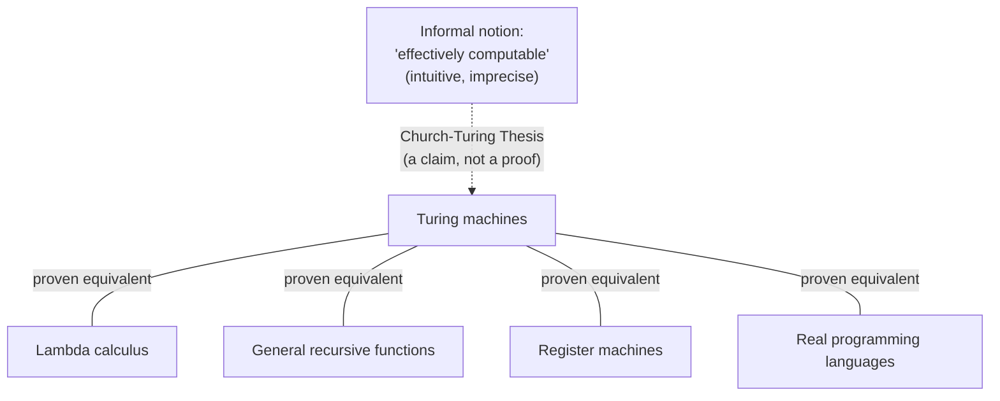

## Learning Objectives

- State the Church-Turing thesis precisely, distinguishing what it claims from what it does not claim.
- Explain why the thesis is called a *thesis* rather than a *theorem*, in terms of the informal-to-formal gap it bridges.
- Identify at least three independently proposed formal models of computation and explain why their proven equivalence to the Turing machine functions as evidence for the thesis.
- Distinguish the Church-Turing thesis from claims about physical realizability or efficiency (it is a claim about *what* is computable at all, not about how fast or with what resources).
- Explain the historical role Turing's and Church's independent 1936 work played in giving "algorithm" a mathematically precise meaning for the first time.

## Context & Motivation

Before 1936, the word "algorithm" had a perfectly serviceable informal meaning — a step-by-step procedure a person could carry out, mechanically, to solve a problem — but no *mathematical* meaning at all. Mathematicians of the late 19th and early 20th century had run into problems that seemed to demand a precise answer to "is there an algorithm for this?" — most urgently David Hilbert's *Entscheidungsproblem* (the "decision problem"), which asked whether some mechanical procedure could determine, for any statement in first-order logic, whether that statement is provable. Answering "no, there is no such procedure" is a very different kind of claim than answering "yes, here is one" — to show a procedure exists, you just exhibit it; to show *no* procedure can possibly exist, you need to reason about the entire space of all possible procedures, and for that you first need a mathematically exact definition of what a "procedure" even is. Nobody had one.

In 1936, working independently and unaware of each other's efforts, Alonzo Church and Alan Turing each proposed a formal answer. Church proposed that "effectively computable" be identified with functions definable in the **lambda calculus** (a formal system for defining functions via substitution). Turing proposed an entirely different-looking formal device — an idealized machine with an infinite tape, a movable head, and a finite table of rules — and argued, by directly analyzing how a human "computer" (in the original sense: a person following a fixed method with pencil and paper) actually carries out a computation step by step, that this machine captures exactly the same intuitive notion. This course traces the Turing-machine formulation, both because it is the one most directly used throughout the rest of computability and complexity theory, and because Turing's argument for why his machine captures the informal notion — breaking a human computation down into atomic steps: read a symbol, consult a finite mental state, write a symbol, move attention — is unusually persuasive on its own terms.

What makes this genuinely foundational, rather than a historical curiosity, is that essentially every claim made in this entire discipline — decidability, recognizability, the Halting Problem, complexity classes, NP-completeness — is a claim about Turing machines specifically, and the entire enterprise is only meaningful to the extent that "Turing machine" really does capture "any mechanical procedure whatsoever." If some other, more powerful notion of "algorithm" existed that Turing machines could not simulate, then a proof that "no Turing machine solves problem X" would say nothing about whether some other kind of procedure might. The Church-Turing thesis is the single claim standing between "no Turing machine can decide the Halting Problem" (a precise, provable, mathematical fact, covered later in this track) and "no algorithm, in the fullest everyday sense of that word, can decide whether a program halts" (the sweeping, informal conclusion people actually care about). Everything downstream rests on this bridge holding.

## Core Theory

### The thesis, stated precisely

> **Church-Turing Thesis.** Every function that is intuitively "effectively computable" — computable by some mechanical, step-by-step procedure carried out by a human or machine, using a finite description and a finite amount of work at each step, with no need for insight or guessing — is computable by some Turing machine.

Read this statement carefully: the left-hand side ("effectively computable") is an *informal* notion — it lives in ordinary intuition about what a "mechanical procedure" is, the same intuition Hilbert was implicitly appealing to when he posed the Entscheidungsproblem. The right-hand side ("computable by some Turing machine") is a completely *formal* notion, defined with mathematical precision: a specific tape alphabet, a specific finite state set, a specific transition function (the formal Turing machine model itself is developed in the next concept in this track). The thesis asserts that these two notions — one fuzzy, one exact — pick out exactly the same set of functions.

### Why this is a thesis, not a theorem

A **theorem** is a statement provable from axioms using rules of inference — and to prove anything, both sides of the claim must first be stated in the same formal language. The Church-Turing thesis cannot be a theorem in this sense, for a structural reason that has nothing to do with anyone's cleverness: one side of the equivalence it asserts ("effectively computable," in the everyday, intuitive sense) is not — and by its very nature as an appeal to intuition, cannot be — a formal mathematical object at all. You cannot prove that an informal, intuitive notion "equals" a formal, precisely defined one, for exactly the same reason you cannot formally prove that your intuitive notion of "chair" is captured exactly by some precise geometric definition of "chair" — the intuitive notion was never pinned down precisely enough for "equals" to be a well-formed question in the first place.

What you *can* do — and what nearly a century of accumulated evidence has done — is build overwhelming *confidence* that the two notions coincide, without ever converting that confidence into a formal proof. This is exactly the epistemic status the thesis has: not proved, but about as well-supported as an unprovable claim can possibly be.

### The convergence evidence

The single strongest piece of evidence for the thesis is a remarkable historical pattern: many people, working independently, proposed *different-looking* formal models of "mechanical computation" during the 1930s and afterward — and every single one of them was later proven to be **exactly equivalent in computational power** to the Turing machine (able to compute precisely the same set of functions, neither more nor fewer). Some of the major independently proposed models:

- **Lambda calculus** (Church, 1936) — functions defined by substitution and abstraction, with no notion of "tape" or "state" anywhere in sight.
- **General recursive functions** (Gödel, Herbrand, Kleene, early 1930s) — functions built up from a small set of base functions (zero, successor, projections) via composition, primitive recursion, and unbounded minimization.
- **Register machines / RAM machines** (various, 1950s–60s) — a small set of numbered registers holding integers, manipulated by a short program of increment/decrement/jump-if-zero instructions, much closer in spirit to how real hardware works.
- **Post systems, Markov algorithms, cellular automata, modern real-world programming languages** (Python, Java, C, all Turing-complete) — every one of these, when carefully formalized, computes exactly the same class of functions as a Turing machine — no more, no less.

This is exactly the kind of evidence that makes an unprovable thesis compelling: these models were not designed by people trying to match Turing's machine — several predate it or were developed in ignorance of it — and yet they all converge on the identical notion of computability. If "effectively computable" were a fundamentally slippery, model-dependent notion, this convergence would be an extraordinary coincidence repeated many times over. Instead, the natural conclusion is that all of these formalisms are independently discovering the *same* underlying, real thing — and that Turing machines, being one particularly clean way to describe it, are as good a formal stand-in for "effectively computable" as any.

### What the thesis does *not* claim

It is worth being precise about the thesis's boundaries, since it is easy to overreach:

- It does **not** claim that Turing machines are *efficient* — a function being Turing-computable says nothing about how many steps it takes; a Turing machine might need astronomically more steps than some other model to compute the same function. (Complexity theory, developed later in this track, is entirely about exactly this question — efficiency, not raw computability — and rests on a separate, stronger *extended* Church-Turing thesis about polynomial-time equivalence across reasonable models, which is a more delicate claim than the one covered here.)
- It does **not** claim every function is computable — quite the opposite: fixing a precise definition of "computable" is exactly what makes it meaningful to prove that *specific* functions (the Halting Problem chief among them) are *not* computable by any means at all.
- It does **not** make a claim about physics or the universe — whether some future physical device (a hypothetical hypercomputer, or claims about certain models of quantum or analog computation) could somehow compute functions no Turing machine can is a genuinely separate, physical question, distinct from the mathematical thesis about the informal notion of "step-by-step procedure."

## Worked Examples

### Example 1 — translating an "obviously computable" informal procedure into evidence for the thesis

**Problem:** Consider the informal procedure "given a list of integers, find the largest one" — clearly effectively computable by anyone with pencil and paper. Show how this maps onto each of two independently proposed formal models, as a small piece of the convergence evidence.

**As a Turing machine (sketch):** scan the tape left to right, keeping the largest value seen so far encoded in the machine's finite control (or in a reserved region of the tape); each time a new number is read, compare it against the running maximum and overwrite the running maximum if the new number is bigger; when the end of the list (a blank symbol) is reached, halt with the running maximum written on the tape.

**As a general recursive function (sketch):** define `max(a, b)` using the base functions and primitive recursion (comparing `a` and `b` via subtraction and a zero-test, then selecting one), then define `findMax` on a list by folding `max` across it — one call to `max` per element, using only composition and primitive recursion, no unbounded search required.

**The point:** these two descriptions look nothing alike — one is a physical head crawling over a tape, the other is a purely symbolic function built from substitution rules — yet both compute exactly the same function on exactly the same inputs, and this is provable (a formal simulation exists in each direction). This one example does not by itself establish the thesis (no finite number of examples could, since the thesis is about *all* effectively computable functions, an unbounded class), but it is one instance of the general pattern that constitutes the thesis's evidence.

### Example 2 — distinguishing the thesis from a claim about efficiency

**Problem:** Someone claims: "Because of the Church-Turing thesis, sorting a list of a million numbers takes the same amount of time no matter which programming language you write it in." Evaluate this claim.

**Reasoning:** This conflates computability with efficiency, and is false as stated. The Church-Turing thesis says only that *if* a function is computable at all in one reasonable model (say, a modern language with unbounded memory), then it is computable by *some* Turing machine — it says nothing whatsoever about how many steps that Turing machine, or any other implementation, needs to take. A poorly written O(n²) sort and a well-written O(n log n) sort both compute the *same function* (the sorted list) — both are Turing-computable, both fall under the thesis identically — yet they take dramatically different amounts of time on the same input. The thesis is a claim about the *boundary of what's computable at all*, not about *how fast* anything computable can be computed; conflating the two is one of the most common misreadings of what the thesis actually says.

### Example 3 — why "I can imagine a procedure for X" is not, by itself, proof that X is computable

**Problem:** A student says: "I can imagine a step-by-step mental procedure for deciding whether a given Turing machine halts on a given input: just simulate it, and see if it stops. Since I can imagine this procedure, by the Church-Turing thesis, it must be computable — so the Halting Problem must be decidable." Find the flaw.

**Reasoning:** The flaw is not in the Church-Turing thesis — it is in the premise "I can imagine a procedure for X." The proposed "procedure" (simulate and see if it stops) is not actually a procedure that halts on every input: if the machine being simulated runs forever, the simulation runs forever too, and "wait and see if it stops" never produces an answer in that case. A genuine effective procedure, in the sense the thesis is about, must terminate with a definite answer after finitely many steps on *every* input — "simulate and wait" fails to be such a procedure precisely on the inputs where the answer would be "no, it doesn't halt." (This exact gap — a procedure that correctly says "yes" whenever the answer is yes, but never reliably says "no" — is developed rigorously as the distinction between decidable and recognizable languages in the next two concepts, and is exactly the mechanism behind the Halting Problem's undecidability, proved later in this track.) The lesson: the thesis licenses converting a genuine effective procedure into a Turing machine — it does not license assuming any vaguely-described process is a genuine effective procedure in the first place.

## Common Misconceptions & Pitfalls

- **"The Church-Turing thesis has been proven true."** It has not, and — as argued in Core Theory — it structurally cannot be, because one side of the claimed equivalence is an informal notion, not a formal mathematical object. What exists is an unusually large and unusually convergent body of *evidence* (every independently proposed model of computation turning out equivalent), not a proof. Calling it a "theorem" anywhere is a category error worth catching.
- **"If Turing machines can't solve a problem efficiently, the problem isn't computable."** This confuses computability (can it be solved at all, given unbounded time and unbounded memory) with complexity (how much time or memory is required). The thesis is entirely about the former; a problem can be perfectly computable — decidable in finite time on every input — while still being so slow to solve that it is useless in practice. That is a complexity question, addressed by an entirely different (and separately debatable) extended thesis, not this one.
- **"Turing machines are a historically obsolete model — real computers work completely differently, so results about Turing machines don't really apply to real software."** Real computers have finite memory, which technically makes them weaker than a Turing machine (which has an unbounded tape) — but this cuts the wrong way for the objection: it means real computers are, if anything, a *restricted special case* of the Turing-computable functions, not a more powerful alternative to them. Anything a real, physical computer can compute, a Turing machine can compute (the reverse containment is the interesting open direction, addressed by physical, not mathematical, arguments); nothing about modern hardware architecture escapes the model.
- **"Different formal models being 'equivalent in power' is a coincidence, so it's weak evidence."** The strength of the evidence comes specifically from the *independence* of the models — lambda calculus, general recursive functions, and Turing machines were developed by different people, with different motivations, using no shared machinery, and yet converge exactly. Repeated independent convergence on the same answer is precisely what makes circumstantial evidence strong, in mathematics as much as anywhere else.

## Summary

The Church-Turing thesis claims that every function "effectively computable" by any mechanical, step-by-step procedure at all is computable by some Turing machine. It is a *thesis*, not a *theorem*, because it asserts an equivalence between an informal, intuitive notion (mechanical computability, as any reasonable person understands it) and a formal, mathematically precise one (Turing-machine computability) — and no formal proof can bridge an informal notion to a formal one, since the informal side was never pinned down precisely enough for "proof" to apply. What makes the thesis so widely believed anyway is convergent historical evidence: lambda calculus, general recursive functions, register machines, and every real programming language, each proposed independently and by different routes, have all been *proven* exactly equivalent in computational power to the Turing machine. The thesis says nothing about efficiency (that is a separate, complexity-theoretic question) and nothing about physics (whether some exotic physical process could somehow exceed it is a distinct empirical matter) — it is purely the claim that fixes, once and for all, what "computable" formally means, and it is this fixed meaning that every later result in computability theory — decidability, recognizability, the Halting Problem, and beyond — depends on.

## Documentation Links

- [MIT 18.404/6.5400 — Course Information (Sipser)](https://math.mit.edu/~sipser/18404/info.pdf) — doc
- [MIT 18.404J — OCW Course Home](https://ocw.mit.edu/courses/18-404j-theory-of-computation-fall-2020/) — doc
