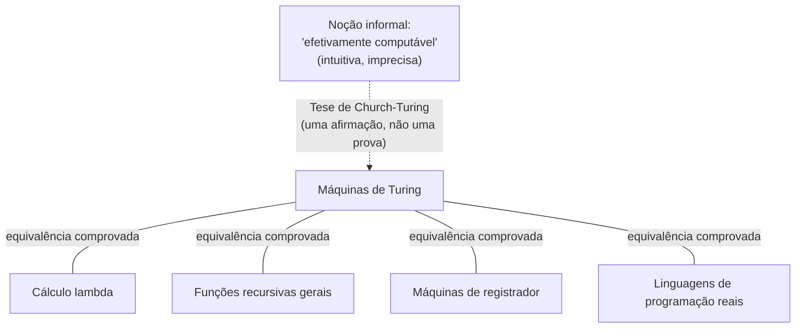

## Objetivos de Aprendizagem

- Enunciar a tese de Church-Turing com precisão, distinguindo o que ela afirma do que ela não afirma.
- Explicar por que a tese é chamada de *tese* em vez de *teorema*, em termos da lacuna informal-para-formal que ela transpõe.
- Identificar ao menos três modelos formais de computação propostos independentemente e explicar por que sua equivalência comprovada com a máquina de Turing funciona como evidência para a tese.
- Distinguir a tese de Church-Turing de afirmações sobre realizabilidade física ou eficiência (é uma afirmação sobre *o quê* é computável, não sobre quão rápido ou com quais recursos).
- Explicar o papel histórico que o trabalho independente de Turing e Church em 1936 desempenhou ao dar a "algoritmo" um significado matematicamente preciso pela primeira vez.

## Contexto e Motivação

Antes de 1936, a palavra "algoritmo" tinha um significado informal perfeitamente funcional, um procedimento passo a passo que uma pessoa poderia executar, mecanicamente, para resolver um problema, mas nenhum significado *matemático* de forma alguma. Matemáticos do final do século 19 e início do século 20 haviam se deparado com problemas que pareciam exigir uma resposta precisa a "existe um algoritmo para isto?", mais urgentemente o *Entscheidungsproblem* de David Hilbert (o "problema da decisão"), que perguntava se algum procedimento mecânico poderia determinar, para qualquer enunciado em lógica de primeira ordem, se aquele enunciado é demonstrável. Responder "não, não existe tal procedimento" é um tipo de afirmação muito diferente de responder "sim, aqui está um", para mostrar que um procedimento existe, você simplesmente o exibe; para mostrar que *nenhum* procedimento pode possivelmente existir, você precisa raciocinar sobre o espaço inteiro de todos os procedimentos possíveis, e para isso você primeiro precisa de uma definição matematicamente exata do que um "procedimento" sequer é. Ninguém tinha uma.

Em 1936, trabalhando independentemente e sem conhecimento do esforço um do outro, Alonzo Church e Alan Turing cada um propôs uma resposta formal. Church propôs que "efetivamente computável" fosse identificado com funções definíveis no **cálculo lambda** (um sistema formal para definir funções via substituição). Turing propôs um dispositivo formal de aparência inteiramente diferente, uma máquina idealizada com uma fita infinita, uma cabeça móvel, e uma tabela finita de regras, e argumentou, analisando diretamente como um "computador" humano (no sentido original: uma pessoa seguindo um método fixo com lápis e papel) de fato realiza uma computação passo a passo, que essa máquina captura exatamente a mesma noção intuitiva. Este curso segue a formulação da máquina de Turing, tanto porque é a mais diretamente usada ao longo do resto da teoria da computabilidade e complexidade, quanto porque o argumento de Turing sobre por que sua máquina captura a noção informal, decompondo uma computação humana em passos atômicos: ler um símbolo, consultar um estado mental finito, escrever um símbolo, mover a atenção, é incomumente persuasivo em seus próprios termos.

O que torna isto genuinamente fundacional, em vez de uma curiosidade histórica, é que essencialmente toda afirmação feita nesta disciplina inteira, decidibilidade, reconhecibilidade, o Problema da Parada, classes de complexidade, NP-completude, é uma afirmação sobre máquinas de Turing especificamente, e o empreendimento inteiro só é significativo na medida em que "máquina de Turing" de fato captura "qualquer procedimento mecânico possível." Se alguma outra noção mais poderosa de "algoritmo" existisse que máquinas de Turing não pudessem simular, então uma prova de que "nenhuma máquina de Turing resolve o problema X" não diria nada sobre se algum outro tipo de procedimento poderia. A tese de Church-Turing é a única afirmação de pé entre "nenhuma máquina de Turing consegue decidir o Problema da Parada" (um fato matemático preciso, demonstrável, coberto mais adiante nesta trilha) e "nenhum algoritmo, no sentido mais amplo e cotidiano dessa palavra, consegue decidir se um programa para" (a conclusão ampla, informal, com a qual as pessoas realmente se importam). Tudo o que vem depois se apoia nessa ponte se sustentando.

## Teoria Central

### A tese, enunciada com precisão

> **Tese de Church-Turing.** Toda função que é intuitivamente "efetivamente computável", computável por algum procedimento mecânico, passo a passo, realizado por um humano ou máquina, usando uma descrição finita e uma quantidade finita de trabalho a cada passo, sem necessidade de intuição ou adivinhação, é computável por alguma máquina de Turing.

Leia este enunciado com cuidado: o lado esquerdo ("efetivamente computável") é uma noção *informal*, ela vive na intuição comum sobre o que é um "procedimento mecânico", a mesma intuição à qual Hilbert estava implicitamente apelando quando colocou o Entscheidungsproblem. O lado direito ("computável por alguma máquina de Turing") é uma noção completamente *formal*, definida com precisão matemática: um alfabeto de fita específico, um conjunto de estados finito específico, uma função de transição específica (o próprio modelo formal de máquina de Turing é desenvolvido no próximo conceito desta trilha). A tese afirma que essas duas noções, uma vaga, uma exata, selecionam exatamente o mesmo conjunto de funções.

### Por que isto é uma tese, não um teorema

Um **teorema** é um enunciado demonstrável a partir de axiomas usando regras de inferência, e para demonstrar qualquer coisa, ambos os lados da afirmação precisam primeiro ser enunciados na mesma linguagem formal. A tese de Church-Turing não pode ser um teorema nesse sentido, por uma razão estrutural que não tem nada a ver com a esperteza de ninguém: um lado da equivalência que ela afirma ("efetivamente computável", no sentido cotidiano, intuitivo) não é, e por sua própria natureza como um apelo à intuição, não pode ser, um objeto matemático formal de forma alguma. Você não pode demonstrar que uma noção informal, intuitiva, "é igual" a uma formal, precisamente definida, pela exata mesma razão que você não pode formalmente demonstrar que sua noção intuitiva de "cadeira" é capturada exatamente por alguma definição geométrica precisa de "cadeira", a noção intuitiva nunca foi fixada com precisão suficiente para "igual" ser uma pergunta bem formada em primeiro lugar.

O que você *pode* fazer, e o que quase um século de evidência acumulada fez, é construir *confiança* esmagadora de que as duas noções coincidem, sem jamais converter aquela confiança em uma demonstração formal. Este é exatamente o status epistêmico que a tese tem: não demonstrada, mas tão bem sustentada quanto uma afirmação indemonstrável possivelmente pode ser.

### A evidência de convergência

O pedaço mais forte de evidência para a tese é um padrão histórico notável: muitas pessoas, trabalhando independentemente, propuseram modelos formais de aparência *diferente* de "computação mecânica" durante os anos 1930 e depois, e cada um único deles foi depois demonstrado ser **exatamente equivalente em poder computacional** à máquina de Turing (capaz de computar precisamente o mesmo conjunto de funções, nem mais nem menos). Alguns dos principais modelos propostos independentemente:

- **Cálculo lambda** (Church, 1936), funções definidas por substituição e abstração, sem nenhuma noção de "fita" ou "estado" à vista em lugar nenhum.
- **Funções recursivas gerais** (Gödel, Herbrand, Kleene, início dos anos 1930), funções construídas a partir de um pequeno conjunto de funções base (zero, sucessor, projeções) via composição, recursão primitiva, e minimização não limitada.
- **Máquinas de registrador / máquinas RAM** (vários, anos 1950-60), um pequeno conjunto de registradores numerados guardando inteiros, manipulados por um programa curto de instruções incremento/decremento/salte-se-zero, muito mais próximo em espírito de como hardware real funciona.
- **Sistemas de Post, algoritmos de Markov, autômatos celulares, linguagens de programação modernas do mundo real** (Python, Java, C, todas Turing-completas), cada uma dessas, quando cuidadosamente formalizada, computa exatamente a mesma classe de funções que uma máquina de Turing, nem mais, nem menos.

Este é exatamente o tipo de evidência que torna uma tese indemonstrável convincente: esses modelos não foram desenhados por pessoas tentando corresponder à máquina de Turing, vários a precedem ou foram desenvolvidos em ignorância dela, e ainda assim todos convergem para a noção idêntica de computabilidade. Se "efetivamente computável" fosse uma noção fundamentalmente escorregadia, dependente de modelo, essa convergência seria uma coincidência extraordinária repetida muitas vezes. Em vez disso, a conclusão natural é que todos esses formalismos estão independentemente descobrindo a *mesma* coisa real, subjacente, e que máquinas de Turing, sendo uma forma particularmente limpa de descrevê-la, são um substituto formal tão bom para "efetivamente computável" quanto qualquer outro.

### O que a tese *não* afirma

Vale a pena ser preciso sobre as fronteiras da tese, já que é fácil ir longe demais:

- Ela **não** afirma que máquinas de Turing são *eficientes*, uma função ser Turing-computável não diz nada sobre quantos passos ela leva; uma máquina de Turing pode precisar de astronomicamente mais passos que algum outro modelo para computar a mesma função. (Teoria da complexidade, desenvolvida mais adiante nesta trilha, é inteiramente sobre exatamente esta questão, eficiência, não computabilidade bruta, e se apoia em uma tese de Church-Turing *estendida*, separada, mais forte, sobre equivalência em tempo polinomial através de modelos razoáveis, o que é uma afirmação mais delicada do que a coberta aqui.)
- Ela **não** afirma que toda função é computável, bem o contrário: fixar uma definição precisa de "computável" é exatamente o que torna significativo demonstrar que funções *específicas* (o Problema da Parada em primeiro lugar) não são computáveis por meio nenhum de forma alguma.
- Ela **não** faz uma afirmação sobre física ou o universo, se algum dispositivo físico futuro (um hipercomputador hipotético, ou afirmações sobre certos modelos de computação quântica ou analógica) poderia de alguma forma computar funções que nenhuma máquina de Turing consegue é uma questão genuinamente separada, física, distinta da tese matemática sobre a noção informal de "procedimento passo a passo."

## Exemplos Resolvidos

### Exemplo 1: traduzindo um procedimento informal "obviamente computável" em evidência para a tese

**Problema:** Considere o procedimento informal "dada uma lista de inteiros, encontre o maior", claramente efetivamente computável por qualquer um com lápis e papel. Mostre como isso mapeia para cada um de dois modelos formais propostos independentemente, como um pequeno pedaço da evidência de convergência.

**Como uma máquina de Turing (esboço):** varra a fita da esquerda para a direita, mantendo o maior valor visto até agora codificado no controle finito da máquina (ou em uma região reservada da fita); toda vez que um número novo é lido, compare-o contra o máximo corrente e sobrescreva o máximo corrente se o número novo for maior; quando o fim da lista (um símbolo em branco) é alcançado, pare com o máximo corrente escrito na fita.

**Como uma função recursiva geral (esboço):** defina `max(a, b)` usando as funções base e recursão primitiva (comparando `a` e `b` via subtração e um teste de zero, depois selecionando um), depois defina `findMax` em uma lista dobrando `max` através dela, uma chamada a `max` por elemento, usando só composição e recursão primitiva, nenhuma busca não limitada necessária.

**O ponto:** essas duas descrições não se parecem em nada, uma é uma cabeça física rastejando sobre uma fita, a outra é uma função puramente simbólica construída a partir de regras de substituição, ainda assim ambas computam exatamente a mesma função nas exatas mesmas entradas, e isso é demonstrável (existe uma simulação formal em cada direção). Este único exemplo não estabelece a tese por si só (nenhum número finito de exemplos poderia, já que a tese é sobre *todas* as funções efetivamente computáveis, uma classe não limitada), mas é uma instância do padrão geral que constitui a evidência da tese.

### Exemplo 2: distinguindo a tese de uma afirmação sobre eficiência

**Problema:** Alguém afirma: "Por causa da tese de Church-Turing, ordenar uma lista de um milhão de números leva a mesma quantidade de tempo não importa em qual linguagem de programação você a escreva." Avalie esta afirmação.

**Raciocínio:** Isso confunde computabilidade com eficiência, e é falso como enunciado. A tese de Church-Turing diz só que *se* uma função é computável de forma alguma em um modelo razoável (digamos, uma linguagem moderna com memória não limitada), então ela é computável por *alguma* máquina de Turing, ela não diz absolutamente nada sobre quantos passos aquela máquina de Turing, ou qualquer outra implementação, precisa dar. Uma ordenação O(n²) mal escrita e uma ordenação O(n log n) bem escrita ambas computam a *mesma função* (a lista ordenada), ambas são Turing-computáveis, ambas caem sob a tese identicamente, ainda assim levam quantidades dramaticamente diferentes de tempo na mesma entrada. A tese é uma afirmação sobre a *fronteira do que é computável de forma alguma*, não sobre *quão rápido* qualquer coisa computável pode ser computada; confundir as duas é uma das leituras equivocadas mais comuns do que a tese de fato diz.

### Exemplo 3: por que "eu consigo imaginar um procedimento para X" não é, por si só, prova de que X é computável

**Problema:** Um aluno diz: "Eu consigo imaginar um procedimento mental passo a passo para decidir se uma dada máquina de Turing para em uma dada entrada: simplesmente simule-a, e veja se ela para. Já que eu consigo imaginar este procedimento, pela tese de Church-Turing, deve ser computável, então o Problema da Parada deve ser decidível." Encontre a falha.

**Raciocínio:** A falha não está na tese de Church-Turing, está na premissa "eu consigo imaginar um procedimento para X." O "procedimento" proposto (simule e veja se para) não é de fato um procedimento que para em toda entrada: se a máquina sendo simulada roda para sempre, a simulação roda para sempre também, e "espere e veja se para" nunca produz uma resposta nesse caso. Um procedimento efetivo genuíno, no sentido sobre o qual a tese trata, precisa terminar com uma resposta definitiva depois de finitamente muitos passos em *toda* entrada, "simule e espere" falha em ser tal procedimento precisamente nas entradas onde a resposta seria "não, não para." (Esta exata lacuna, um procedimento que corretamente diz "sim" sempre que a resposta é sim, mas nunca confiavelmente diz "não", é desenvolvida rigorosamente como a distinção entre linguagens decidíveis e reconhecíveis nos próximos dois conceitos, e é exatamente o mecanismo por trás da indecidibilidade do Problema da Parada, demonstrada mais adiante nesta trilha.) A lição: a tese licencia converter um procedimento efetivo genuíno em uma máquina de Turing, ela não licencia assumir que qualquer processo vagamente descrito é um procedimento efetivo genuíno em primeiro lugar.

## Equívocos Comuns e Armadilhas

- **"A tese de Church-Turing foi demonstrada como verdadeira."** Não foi, e, como argumentado na Teoria Central, ela estruturalmente não pode ser, porque um lado da equivalência afirmada é uma noção informal, não um objeto matemático formal. O que existe é um corpo de *evidência* incomumente grande e incomumente convergente (todo modelo de computação proposto independentemente se revelando equivalente), não uma prova. Chamá-la de "teorema" em qualquer lugar é um erro de categoria que vale a pena capturar.
- **"Se máquinas de Turing não conseguem resolver um problema eficientemente, o problema não é computável."** Isto confunde computabilidade (pode ser resolvido de forma alguma, dado tempo não limitado e memória não limitada) com complexidade (quanto tempo ou memória é exigido). A tese é inteiramente sobre a primeira; um problema pode ser perfeitamente computável, decidível em tempo finito em toda entrada, ainda sendo tão lento de resolver que é inútil na prática. Isso é uma questão de complexidade, endereçada por uma tese estendida inteiramente diferente (e separadamente discutível), não esta.
- **"Máquinas de Turing são um modelo historicamente obsoleto, computadores reais funcionam de forma completamente diferente, então resultados sobre máquinas de Turing não se aplicam de verdade a software real."** Computadores reais têm memória finita, o que tecnicamente os torna mais fracos que uma máquina de Turing (que tem uma fita não limitada), mas isso corta na direção errada para a objeção: significa que computadores reais são, se algo, um *caso especial restrito* das funções Turing-computáveis, não uma alternativa mais poderosa a elas. Qualquer coisa que um computador real, físico, consiga computar, uma máquina de Turing consegue computar (a contenção reversa é a direção aberta interessante, endereçada por argumentos físicos, não matemáticos); nada sobre arquitetura de hardware moderna escapa ao modelo.
- **"Diferentes modelos formais serem 'equivalentes em poder' é uma coincidência, então é evidência fraca."** A força da evidência vem especificamente da *independência* dos modelos, cálculo lambda, funções recursivas gerais, e máquinas de Turing foram desenvolvidos por pessoas diferentes, com motivações diferentes, usando nenhuma maquinaria compartilhada, e ainda assim convergem exatamente. Convergência independente repetida na mesma resposta é precisamente o que torna evidência circunstancial forte, em matemática tanto quanto em qualquer outro lugar.

## Resumo

A tese de Church-Turing afirma que toda função "efetivamente computável" por qualquer procedimento mecânico, passo a passo, de forma alguma é computável por alguma máquina de Turing. É uma *tese*, não um *teorema*, porque afirma uma equivalência entre uma noção informal, intuitiva (computabilidade mecânica, como qualquer pessoa razoável entende) e uma formal, matematicamente precisa (computabilidade por máquina de Turing), e nenhuma prova formal consegue transpor uma noção informal para uma formal, já que o lado informal nunca foi fixado com precisão suficiente para "prova" se aplicar. O que torna a tese tão amplamente acreditada mesmo assim é evidência histórica convergente: cálculo lambda, funções recursivas gerais, máquinas de registrador, e toda linguagem de programação real, cada uma proposta independentemente e por rotas diferentes, foram todas *demonstradas* exatamente equivalentes em poder computacional à máquina de Turing. A tese não diz nada sobre eficiência (isso é uma questão separada, de teoria da complexidade) e nada sobre física (se algum processo físico exótico poderia de alguma forma superá-la é uma questão empírica distinta), ela é puramente a afirmação que fixa, de uma vez por todas, o que "computável" formalmente significa, e é este significado fixo do qual todo resultado posterior em teoria da computabilidade, decidibilidade, reconhecibilidade, o Problema da Parada, e além, depende.

## Documentation Links

- [MIT 18.404/6.5400: Course Information (Sipser)](https://math.mit.edu/~sipser/18404/info.pdf): doc
- [MIT 18.404J: OCW Course Home](https://ocw.mit.edu/courses/18-404j-theory-of-computation-fall-2020/): doc
