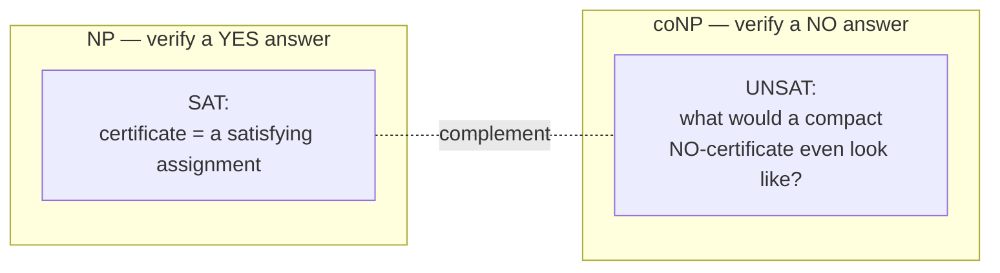
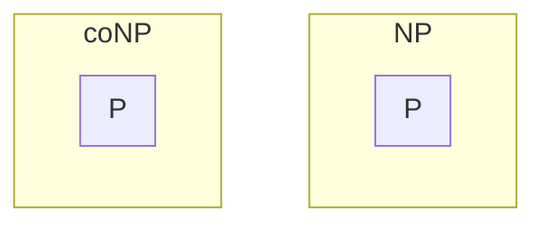

## Learning Objectives

- Define coNP precisely, as the class of problems whose NO-instances have polynomial-time-verifiable certificates.
- Explain the complement relationship between coNP and NP, and state it in terms of formal language complementation.
- Identify UNSAT (boolean unsatisfiability) as the canonical coNP-complete problem, complementary to SAT.
- Prove that P is a subset of coNP, mirroring the P ⊆ NP argument already given for NP.
- State the NP vs. coNP question precisely, and explain why it is believed, but not proven, that the two classes differ.

## Context & Motivation

Every class built so far in this discipline has been organized around verifying a YES answer: NP asks whether a proposed certificate can confirm, in polynomial time, that some instance is a YES-instance — a satisfying assignment for SAT, a Hamiltonian cycle for the Hamiltonian cycle problem, an independent set of the right size for Independent Set. But this asymmetry — building an entire class around confirming YES answers specifically — raises a natural question: what about confirming a NO answer instead? Is "this formula is NOT satisfiable" or "this graph does NOT have an independent set of size k" the kind of claim that can be checked quickly, given the right certificate?

**coNP** is the class built to answer exactly this question, and it is worth being precise about what "co" means here: coNP is not "not NP," and it is not the same as "problems not in NP." It is the class of problems whose complement (the language with YES and NO instances swapped) is in NP — equivalently, the class of problems where a NO-answer, specifically, admits a polynomial-time-checkable certificate. This is a genuine mirror image of NP's definition, built around the opposite kind of answer, not a vague or dismissive complementary label.

The canonical example makes the asymmetry concrete. For SAT, a YES-certificate is easy to describe and check: a specific satisfying assignment, verified by direct substitution. But what would a NO-certificate for SAT look like — a compact piece of evidence, checkable quickly, that a formula has *no* satisfying assignment among all 2ⁿ possible assignments? No such compact certificate is known for the general case, and this is exactly the substance of the coNP concept: coNP asks whether NO-instances of problems like SAT (this specific problem, the unsatisfiability problem UNSAT, is coNP-complete) have this kind of quick verification, and whether that class of "quickly-verifiable NO" problems is the same as, or different from, the class of "quickly-verifiable YES" problems already built. Whether NP and coNP are actually the same class is a real, open question in its own right — related to, but formally distinct from, the P vs. NP question this whole discipline builds toward as its capstone.

## Core Theory

### Formal definition: coNP as complement of NP

For a language (decision problem) L, its **complement**, written L̄ (or co-L), is the language containing exactly the NO-instances of L (and excluding exactly its YES-instances) — every string is in exactly one of L or L̄. The class **coNP** is defined as: L is in coNP if and only if its complement L̄ is in NP. Unwound directly: L is in coNP exactly when there is a polynomial-time verifier V and a certificate scheme such that, for every input x, x is a NO-instance of L if and only if some certificate c (of polynomial size) makes V(x, c) accept. In plain terms: coNP is built around efficiently verifiable evidence for a NO answer to L, in exactly the same shape that NP is built around efficiently verifiable evidence for a YES answer.

### The canonical example: UNSAT

**UNSAT** — "does this boolean formula have NO satisfying assignment" — is the direct complement of SAT: a formula is a YES-instance of UNSAT exactly when it is a NO-instance of SAT, and vice versa. UNSAT is the canonical coNP-complete problem (coNP-complete meaning: in coNP, and every problem in coNP reduces to it in polynomial time — the coNP analogue of NP-completeness, inherited directly from Cook-Levin: since SAT is NP-complete, its complement UNSAT is coNP-complete, by the same reduction machinery mirrored across the complement relationship). Concretely: verifying a YES-instance of SAT means checking that a specific assignment satisfies the formula, a fast, direct computation. Verifying a YES-instance of UNSAT — i.e., confirming that *no* assignment among exponentially many satisfies the formula — has no known compact certificate in general: the natural "proof" that a formula is unsatisfiable is to have checked every one of its 2ⁿ possible assignments and found none that work, which is not a polynomial-size certificate at all.

### P is a subset of coNP

Exactly as with P ⊆ NP, this containment has a direct, constructive proof. Let L be any problem in P, decided by a polynomial-time algorithm A. Then L̄ (the complement of L) is also in P: run A, and flip its answer (accept becomes reject and vice versa) — this is still polynomial time, just A with an extra constant-time negation step at the end. Since L̄ ∈ P, and P ⊆ NP (already proven in the NP concept), L̄ ∈ NP. But L̄ ∈ NP is exactly the definition of L ∈ coNP. So P ⊆ coNP, by essentially the same argument used for P ⊆ NP, run through the complement relationship. Combined with P ⊆ NP, this places P inside the overlap of NP and coNP — every problem solvable outright in polynomial time trivially has quick certificates for both its YES-instances and its NO-instances (in each case, the "certificate" is simply re-running the polynomial-time algorithm and ignoring whatever was actually handed over, exactly as in the P ⊆ NP proof).

*(P sits inside both NP and coNP simultaneously — the diagram shows the two containments separately since P ⊆ NP ∩ coNP, not because P is somehow duplicated.)*

### The open question: is NP = coNP?

It is not known whether NP and coNP are the same class or genuinely different ones. If NP = coNP, then every problem with a quick YES-certificate would also have a quick NO-certificate (and vice versa) — in particular, UNSAT would then have to be in NP, meaning some polynomial-size certificate would exist that a formula is unsatisfiable, checkable in polynomial time, something nobody has found for the general case despite substantial effort. Most researchers in the field believe NP ≠ coNP, for reasons structurally parallel to why most researchers believe P ≠ NP: sustained effort across decades has failed to find compact NO-certificates for problems like UNSAT, and no polynomial-time procedure for finding one is known, mirroring exactly the same kind of circumstantial (not proof-level) evidence used to motivate the P ≠ NP conjecture. It is worth being precise about the logical relationship between the two open questions: if it were ever proven that P = NP, it would follow immediately that NP = coNP as well (since P is closed under complementation, as shown above, collapsing everything together) — but the converse is not known to hold, and NP = coNP is a formally distinct question from P = NP, not merely a restatement of it.

## Worked Examples

### Example 1 — classifying a NO-certificate for graph non-3-colorability

**Problem:** Graph 3-colorability (can every vertex be colored with one of 3 colors so that no edge joins two same-colored vertices) is NP-complete. What would membership in coNP for "this graph is NOT 3-colorable" require, and is a compact certificate known?

**Reasoning.** "Not 3-colorable" is the complement of 3-colorability, so showing it's in coNP would mean exhibiting a polynomial-size certificate that lets a verifier confirm, in polynomial time, that *no* valid 3-coloring exists. As with UNSAT, no such general compact certificate is known — the brute-force "proof" of non-3-colorability is to have tried every one of the (up to) 3ⁿ colorings and found none valid, which is exponential, not polynomial, in size. This mirrors UNSAT exactly (and is expected: graph 3-colorability's complement is believed to be coNP-complete by the same Cook-Levin-style reasoning transferred across the complement relationship), and is exactly the kind of case that makes NP = coNP look unlikely — no one has found the analogous compact certificate for any coNP-complete problem's "hard direction."

### Example 2 — P ⊆ coNP made concrete with graph connectivity

**Problem:** Graph connectivity ("is there a path from s to t") is in P. Confirm directly that its complement, "s and t are NOT connected," is in coNP, using the proof strategy from Core Theory.

**Reasoning.** Connectivity is decided in P by breadth-first search, so its complement — non-connectivity — is also in P: run the same BFS and flip the answer, still polynomial time. Since P ⊆ NP, non-connectivity is therefore in NP. But "non-connectivity is in NP" is, by definition, exactly what it means for "connectivity is in coNP." So connectivity is in coNP, exactly mirroring its membership in NP shown for the same problem in the previous concept's Worked Example 3. Concretely: a certificate for "s and t are connected" is a path; a certificate for "s and t are NOT connected" can, for this specific easy problem, still be built directly — e.g., a partition of the vertices into two sets, one containing s and one containing t, with no edge crossing between them, checkable in polynomial time — illustrating that for problems already in P, quick certificates for both YES and NO answers are always available, exactly as the P ⊆ NP ∩ coNP containment promises.

### Example 3 — distinguishing "NP ≠ coNP" from "P ≠ NP"

**Problem:** Suppose (hypothetically) it were proven that NP ≠ coNP. Would this, by itself, prove P ≠ NP?

**Reasoning.** From Core Theory: P ⊆ NP and P ⊆ coNP both hold unconditionally. If P = NP were true, then (since P is closed under complementation) NP would equal coNP as well — so NP ≠ coNP would indeed rule out P = NP, meaning it WOULD imply P ≠ NP. But note the logical direction here carefully: this shows NP ≠ coNP is sufficient to conclude P ≠ NP (a proof of the former would settle the latter), not that the two statements are equivalent. It remains logically possible (as far as anyone has proven) that P ≠ NP holds while NP = coNP also holds — the two open questions are related by one implication, not a biconditional, and resolving P vs. NP does not automatically resolve NP vs. coNP in the other direction (proving P ≠ NP says nothing, by itself, about whether NP = coNP).

## Common Misconceptions & Pitfalls

- **"coNP means 'the problems that are not in NP.'"** This is not the definition, and it isn't even guaranteed to describe a nonempty class correctly in general — coNP is the class of problems whose *complement* is in NP, which is an entirely different (and, as Core Theory shows, substantially overlapping with NP) collection. P ⊆ NP and P ⊆ coNP simultaneously — so every problem in P is in both classes at once, immediately showing "not in NP" cannot be what coNP means, since P's problems are certainly in NP.
- **"Since SAT is NP-complete and UNSAT is its complement, UNSAT must be NP-complete too."** UNSAT is coNP-complete, not NP-complete — its own membership in NP is exactly the open question. It's not known whether UNSAT has a polynomial-time verifier for its own YES-instances (unsatisfiable formulas); that would require NP = coNP, which is unproven and generally disbelieved. UNSAT sits in coNP by construction (as the complement of the NP-complete SAT), which is a different, and not obviously equivalent, statement.
- **"NP ≠ coNP is just another way of saying P ≠ NP."** As Example 3 shows, the relationship is one-directional: P = NP would force NP = coNP, so NP ≠ coNP implies P ≠ NP — but the reverse implication is not known to hold. It remains an open possibility that P ≠ NP while NP = coNP nonetheless, making the two conjectures related but formally distinct, not interchangeable labels for the same fact.
- **"A problem either has quick YES-certificates or quick NO-certificates, never both."** P ⊆ NP ∩ coNP shows this is false in general — plenty of problems (every problem in P, including connectivity, as Example 2 shows) have both simultaneously. What's specifically unresolved is whether *every* problem in NP also has quick NO-certificates (i.e., whether NP ⊆ coNP as well as coNP ⊆ NP) — not whether any problem can ever have both kinds of certificate at once.

## Summary

coNP mirrors NP's verifier-based definition around the opposite kind of answer: a problem is in coNP when its complement is in NP, equivalently when a NO-instance (rather than a YES-instance) admits a polynomial-time-checkable certificate. UNSAT — boolean unsatisfiability — is the canonical coNP-complete problem, complementary to SAT, and its own membership in NP (a compact certificate that a formula is unsatisfiable) is exactly the kind of thing nobody has found, mirroring the broader open question of whether NP = coNP at all. P ⊆ coNP holds by the same constructive argument used for P ⊆ NP, run through the complement relationship — every polynomial-time-solvable problem has quick certificates for both of its answers. Whether NP = coNP remains a real, unresolved question, formally distinct from (though provably related to, in one direction) the P vs. NP question — most researchers believe the two classes differ, for reasons structurally parallel to, but logically separate from, the belief that P ≠ NP.

## Documentation Links

- [MIT 18.404/6.5400 — Course Information (Sipser)](https://math.mit.edu/~sipser/18404/info.pdf) — doc
- [Stanford CS154 — Course Home](https://cs154.stanford.edu/) — doc
