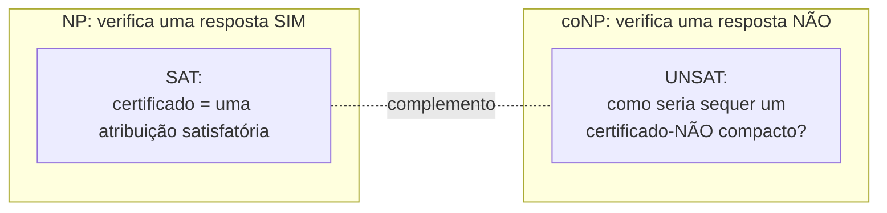
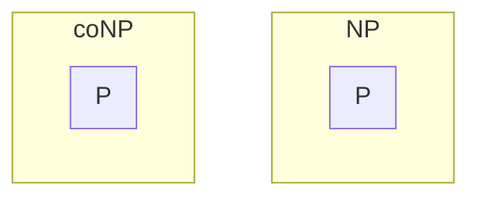

## Objetivos de Aprendizagem

- Definir coNP com precisão, como a classe de problemas cujas instâncias-NÃO têm certificados verificáveis em tempo polinomial.
- Explicar a relação de complemento entre coNP e NP, e enunciá-la em termos de complementação formal de linguagem.
- Identificar UNSAT (insatisfatibilidade booleana) como o problema coNP-completo canônico, complementar a SAT.
- Demonstrar que P é um subconjunto de coNP, espelhando o argumento P ⊆ NP já dado para NP.
- Enunciar a pergunta NP versus coNP com precisão, e explicar por que se acredita, mas não é demonstrado, que as duas classes diferem.

## Contexto e Motivação

Toda classe construída até agora nesta disciplina foi organizada em torno de verificar uma resposta SIM: NP pergunta se um certificado proposto consegue confirmar, em tempo polinomial, que alguma instância é uma instância-SIM, uma atribuição satisfatória para SAT, um ciclo Hamiltoniano para o problema do ciclo Hamiltoniano, um conjunto independente do tamanho certo para Conjunto Independente. Mas essa assimetria, construir uma classe inteira em torno de confirmar respostas SIM especificamente, levanta uma pergunta natural: e confirmar uma resposta NÃO em vez disso? "Esta fórmula NÃO é satisfatível" ou "este grafo NÃO tem um conjunto independente de tamanho k" é o tipo de afirmação que pode ser checada rapidamente, dado o certificado certo?

**coNP** é a classe construída para responder exatamente essa pergunta, e vale a pena ser preciso sobre o que "co" significa aqui: coNP não é "não NP", e não é o mesmo que "problemas que não estão em NP". É a classe de problemas cujo complemento (a linguagem com instâncias SIM e NÃO trocadas) está em NP, equivalentemente, a classe de problemas onde uma resposta NÃO, especificamente, admite um certificado checável em tempo polinomial. Isto é um espelho genuíno da definição de NP, construído em torno do tipo oposto de resposta, não um rótulo complementar vago ou dispensável.

O exemplo canônico torna a assimetria concreta. Para SAT, um certificado-SIM é fácil de descrever e checar: uma atribuição satisfatória específica, verificada por substituição direta. Mas como seria um certificado-NÃO para SAT, um pedaço compacto de evidência, checável rapidamente, de que uma fórmula não tem *nenhuma* atribuição satisfatória entre todas as 2ⁿ atribuições possíveis? Nenhum tal certificado compacto é conhecido para o caso geral, e isto é exatamente a substância do conceito coNP: coNP pergunta se instâncias-NÃO de problemas como SAT (este problema específico, o problema de insatisfatibilidade UNSAT, é coNP-completo) têm este tipo de verificação rápida, e se aquela classe de problemas "NÃO rapidamente-verificável" é a mesma que, ou diferente de, a classe de problemas "SIM rapidamente-verificável" já construída. Se NP e coNP são de fato a mesma classe é uma pergunta real, aberta, em seu próprio direito, relacionada a, mas formalmente distinta de, a pergunta P versus NP para a qual esta disciplina inteira constrói como seu encerramento.

## Teoria Central

### Definição formal: coNP como complemento de NP

Para uma linguagem (problema de decisão) L, seu **complemento**, escrito L̄ (ou co-L), é a linguagem contendo exatamente as instâncias-NÃO de L (e excluindo exatamente suas instâncias-SIM), toda string está em exatamente uma dentre L ou L̄. A classe **coNP** é definida como: L está em coNP se e somente se seu complemento L̄ está em NP. Desenrolando diretamente: L está em coNP exatamente quando existe um verificador V de tempo polinomial e um esquema de certificado tais que, para toda entrada x, x é uma instância-NÃO de L se e somente se algum certificado c (de tamanho polinomial) faz V(x, c) aceitar. Em termos simples: coNP é construída em torno de evidência eficientemente verificável para uma resposta NÃO a L, exatamente na mesma forma que NP é construída em torno de evidência eficientemente verificável para uma resposta SIM.

### O exemplo canônico: UNSAT

**UNSAT**, "esta fórmula booleana NÃO tem nenhuma atribuição satisfatória", é o complemento direto de SAT: uma fórmula é uma instância-SIM de UNSAT exatamente quando é uma instância-NÃO de SAT, e vice-versa. UNSAT é o problema coNP-completo canônico (coNP-completo significando: em coNP, e todo problema em coNP se reduz a ele em tempo polinomial, o análogo em coNP de NP-completude, herdado diretamente de Cook-Levin: já que SAT é NP-completa, seu complemento UNSAT é coNP-completo, pela mesma maquinaria de redução espelhada através da relação de complemento). Concretamente: verificar uma instância-SIM de SAT significa checar que uma atribuição específica satisfaz a fórmula, uma computação rápida, direta. Verificar uma instância-SIM de UNSAT, ou seja, confirmar que *nenhuma* atribuição entre exponencialmente muitas satisfaz a fórmula, não tem nenhum certificado compacto conhecido em geral: a "prova" de força bruta de que uma fórmula é insatisfatível é ter checado cada uma de suas 2ⁿ atribuições possíveis e não ter encontrado nenhuma que funcione, o que não é um certificado de tamanho polinomial de forma alguma.

### P é um subconjunto de coNP

Exatamente como com P ⊆ NP, esta contenção tem uma prova direta, construtiva. Seja L qualquer problema em P, decidido por um algoritmo de tempo polinomial A. Então L̄ (o complemento de L) também está em P: rode A, e inverta sua resposta (aceita se torna rejeita e vice-versa), isto ainda é tempo polinomial, só A com um passo extra de negação em tempo constante no final. Já que L̄ ∈ P, e P ⊆ NP (já demonstrado no conceito de NP), L̄ ∈ NP. Mas L̄ ∈ NP é exatamente a definição de L ∈ coNP. Então P ⊆ coNP, por essencialmente o mesmo argumento usado para P ⊆ NP, realizado através da relação de complemento. Combinado com P ⊆ NP, isso coloca P dentro da sobreposição de NP e coNP, todo problema diretamente solucionável em tempo polinomial trivialmente tem certificados rápidos tanto para suas instâncias-SIM quanto para suas instâncias-NÃO (em cada caso, o "certificado" é simplesmente rodar de novo o algoritmo de tempo polinomial e ignorar o que quer que tenha sido de fato entregue, exatamente como na prova de P ⊆ NP).

*(P se situa dentro de NP e coNP simultaneamente, o diagrama mostra as duas contenções separadamente já que P ⊆ NP ∩ coNP, não porque P é de alguma forma duplicado.)*

### A pergunta em aberto: NP = coNP?

Não é conhecido se NP e coNP são a mesma classe ou genuinamente diferentes. Se NP = coNP, então todo problema com um certificado-SIM rápido também teria um certificado-NÃO rápido (e vice-versa), em particular, UNSAT então precisaria estar em NP, significando que algum certificado de tamanho polinomial existiria de que uma fórmula é insatisfatível, checável em tempo polinomial, algo que ninguém encontrou para o caso geral apesar de esforço substancial. A maioria dos pesquisadores na área acredita que NP ≠ coNP, por razões estruturalmente paralelas a por que a maioria dos pesquisadores acredita que P ≠ NP: esforço sustentado através de décadas falhou em encontrar certificados-NÃO compactos para problemas como UNSAT, e nenhum procedimento de tempo polinomial para encontrar um é conhecido, espelhando exatamente o mesmo tipo de evidência circunstancial (não em nível de prova) usada para motivar a conjectura P ≠ NP. Vale a pena ser preciso sobre a relação lógica entre as duas perguntas em aberto: se algum dia fosse demonstrado que P = NP, seguiria imediatamente que NP = coNP também (já que P é fechado sob complementação, como mostrado acima, colapsando tudo junto), mas a recíproca não é conhecida como válida, e NP = coNP é uma pergunta formalmente distinta de P = NP, não meramente uma reafirmação dela.

## Exemplos Resolvidos

### Exemplo 1: classificando um certificado-NÃO para grafo-não-3-colorável

**Problema:** 3-colorabilidade de grafo (todo vértice pode ser colorido com uma dentre 3 cores de forma que nenhuma aresta una dois vértices da mesma cor) é NP-completa. O que a associação a coNP para "este grafo NÃO é 3-colorável" exigiria, e um certificado compacto é conhecido?

**Raciocínio.** "Não 3-colorável" é o complemento de 3-colorabilidade, então mostrar que está em coNP significaria exibir um certificado de tamanho polinomial que deixa um verificador confirmar, em tempo polinomial, que *nenhuma* 3-coloração válida existe. Como com UNSAT, nenhum tal certificado compacto geral é conhecido, a "prova" de força bruta de não-3-colorabilidade é ter tentado cada uma das (até) 3ⁿ colorações e não ter encontrado nenhuma válida, o que é exponencial, não polinomial, em tamanho. Isto espelha UNSAT exatamente (e é esperado: acredita-se que o complemento de 3-colorabilidade de grafo é coNP-completo pelo mesmo raciocínio estilo-Cook-Levin transferido através da relação de complemento), e é exatamente o tipo de caso que faz NP = coNP parecer improvável, ninguém encontrou o certificado compacto análogo para a "direção difícil" de nenhum problema coNP-completo.

### Exemplo 2: P ⊆ coNP tornado concreto com conectividade de grafo

**Problema:** Conectividade de grafo ("existe um caminho de s a t") está em P. Confirme diretamente que seu complemento, "s e t NÃO estão conectados," está em coNP, usando a estratégia de prova da Teoria Central.

**Raciocínio.** Conectividade é decidida em P por busca em largura, então seu complemento, não-conectividade, também está em P: rode a mesma busca em largura e inverta a resposta, ainda tempo polinomial. Já que P ⊆ NP, não-conectividade portanto está em NP. Mas "não-conectividade está em NP" é, por definição, exatamente o que significa "conectividade está em coNP." Então conectividade está em coNP, espelhando exatamente sua associação a NP mostrada para o mesmo problema no Exemplo Resolvido 3 do conceito anterior. Concretamente: um certificado para "s e t estão conectados" é um caminho; um certificado para "s e t NÃO estão conectados" pode, para este problema específico fácil, ainda ser construído diretamente, ex., uma partição dos vértices em dois conjuntos, um contendo s e um contendo t, sem nenhuma aresta cruzando entre eles, checável em tempo polinomial, ilustrando que para problemas já em P, certificados rápidos para respostas tanto SIM quanto NÃO estão sempre disponíveis, exatamente como a contenção P ⊆ NP ∩ coNP promete.

### Exemplo 3: distinguindo "NP ≠ coNP" de "P ≠ NP"

**Problema:** Suponha (hipoteticamente) que fosse demonstrado que NP ≠ coNP. Isso, por si só, demonstraria P ≠ NP?

**Raciocínio.** Da Teoria Central: P ⊆ NP e P ⊆ coNP ambos valem incondicionalmente. Se P = NP fosse verdadeiro, então (já que P é fechado sob complementação) NP igualaria coNP também, então NP ≠ coNP de fato descartaria P = NP, significando que ISSO implicaria P ≠ NP. Mas note a direção lógica aqui cuidadosamente: isso mostra que NP ≠ coNP é suficiente para concluir P ≠ NP (uma prova da primeira resolveria a segunda), não que as duas afirmações são equivalentes. Permanece logicamente possível (até onde alguém demonstrou) que P ≠ NP valha enquanto NP = coNP também valha, as duas perguntas em aberto são relacionadas por uma implicação, não uma bicondicional, e resolver P versus NP não resolve automaticamente NP versus coNP na outra direção (demonstrar P ≠ NP não diz nada, por si só, sobre se NP = coNP).

## Equívocos Comuns e Armadilhas

- **"coNP significa 'os problemas que não estão em NP'."** Esta não é a definição, e nem sequer é garantido que descreva uma classe não vazia corretamente em geral, coNP é a classe de problemas cujo *complemento* está em NP, o que é uma coleção inteiramente diferente (e, como a Teoria Central mostra, substancialmente sobreposta com NP). P ⊆ NP e P ⊆ coNP simultaneamente, então todo problema em P está em ambas as classes ao mesmo tempo, imediatamente mostrando que "não está em NP" não pode ser o que coNP significa, já que os problemas de P certamente estão em NP.
- **"Já que SAT é NP-completa e UNSAT é seu complemento, UNSAT deve ser NP-completa também."** UNSAT é coNP-completa, não NP-completa, sua própria associação a NP é exatamente a pergunta em aberto. Não é conhecido se UNSAT tem um verificador de tempo polinomial para suas próprias instâncias-SIM (fórmulas insatisfatíveis); isso exigiria NP = coNP, o que não é demonstrado e geralmente não é acreditado. UNSAT se situa em coNP por construção (como o complemento da NP-completa SAT), o que é uma afirmação diferente, e não obviamente equivalente.
- **"NP ≠ coNP é só outra forma de dizer P ≠ NP."** Como o Exemplo 3 mostra, a relação é unidirecional: P = NP forçaria NP = coNP, então NP ≠ coNP implica P ≠ NP, mas a implicação reversa não é conhecida como válida. Permanece uma possibilidade em aberto que P ≠ NP enquanto NP = coNP ainda assim, tornando as duas conjecturas relacionadas mas formalmente distintas, não rótulos intercambiáveis para o mesmo fato.
- **"Um problema ou tem certificados-SIM rápidos ou certificados-NÃO rápidos, nunca ambos."** P ⊆ NP ∩ coNP mostra que isso é falso em geral, muitos problemas (todo problema em P, incluindo conectividade, como o Exemplo 2 mostra) têm ambos simultaneamente. O que especificamente permanece não resolvido é se *todo* problema em NP também tem certificados-NÃO rápidos (ou seja, se NP ⊆ coNP tanto quanto coNP ⊆ NP), não se algum problema pode alguma vez ter os dois tipos de certificado ao mesmo tempo.

## Resumo

coNP espelha a definição baseada em verificador de NP em torno do tipo oposto de resposta: um problema está em coNP quando seu complemento está em NP, equivalentemente quando uma instância-NÃO (em vez de uma instância-SIM) admite um certificado checável em tempo polinomial. UNSAT, insatisfatibilidade booleana, é o problema coNP-completo canônico, complementar a SAT, e sua própria associação a NP (um certificado compacto de que uma fórmula é insatisfatível) é exatamente o tipo de coisa que ninguém encontrou, espelhando a pergunta em aberto mais ampla de se NP = coNP de forma alguma. P ⊆ coNP vale pelo mesmo argumento construtivo usado para P ⊆ NP, realizado através da relação de complemento, todo problema solucionável em tempo polinomial tem certificados rápidos para ambas as suas respostas. Se NP = coNP permanece uma pergunta real, não resolvida, formalmente distinta de (embora demonstravelmente relacionada a, em uma direção) a pergunta P versus NP, a maioria dos pesquisadores acredita que as duas classes diferem, por razões estruturalmente paralelas a, mas logicamente separadas de, a crença de que P ≠ NP.

## Documentation Links

- [MIT 18.404/6.5400: Course Information (Sipser)](https://math.mit.edu/~sipser/18404/info.pdf): doc
- [Stanford CS154: Course Home](https://cs154.stanford.edu/): doc
