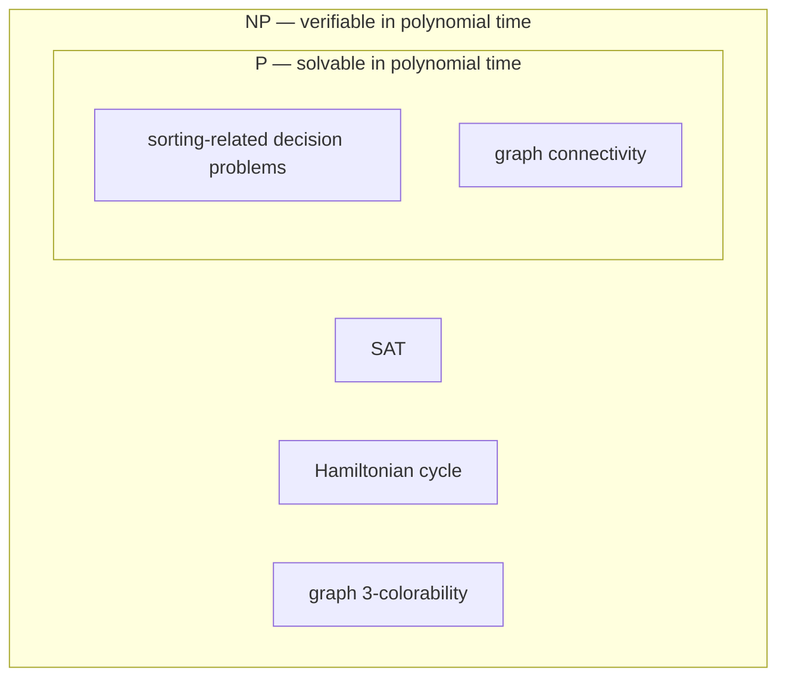

## Learning Objectives

- Define NP precisely as a class of decision problems built around polynomial-time *verification*, not polynomial-time solving.
- Distinguish NP correctly from "solvable in exponential time" and explain why that common phrasing is a misconception.
- Identify the two components of a verifier-based definition: a proposed certificate, and a polynomial-time checking procedure.
- Prove that P is a subset of NP, using a direct, constructive argument.
- Recognize concrete examples of problems believed to be in NP but not known to be in P.

## Context & Motivation

The previous concept formalized P as the class of problems some algorithm can *solve* — find a correct YES-or-NO answer, from scratch — in polynomial time. But Worked Example 2 of that concept left a visible gap: the Hamiltonian cycle problem had no known polynomial-time algorithm for finding a solution, only an exponential brute-force one. NP is built to describe exactly that situation precisely, by asking a different question entirely. Instead of "can a solution be *found* quickly," NP asks "if someone handed you a proposed solution, could you *check* that it's correct, quickly." These sound similar but are not — and the gap between them, whether every quickly-checkable problem is also quickly-solvable, is precisely the P vs. NP question this whole discipline is building toward.

The canonical example makes the distinction concrete. Take a boolean formula — a string of variables connected by AND, OR, and NOT — and ask: does some assignment of TRUE/FALSE to its variables make the whole formula evaluate to TRUE? This is the boolean satisfiability problem, SAT, and no polynomial-time algorithm is known to find such an assignment from scratch; the best known general algorithms are exponential in the number of variables. But suppose someone *hands you* a specific proposed assignment — say, "set x₁ = TRUE, x₂ = FALSE, x₃ = TRUE, …" — and asks you to confirm it actually satisfies the formula. That's just plugging the values in and evaluating the formula once, which takes time linear in the formula's size. Finding a satisfying assignment among exponentially many possibilities is (believed to be) hard; verifying one specific proposed assignment is easy. NP is the formal class built around exactly this asymmetry.

This verifier-based definition is the one that matters, and it is worth being precise about it from the start, because a very common shortcut — "NP means it takes exponential time to solve" — is simply wrong, and actively misleading about what the letters even stand for (NP stands for "nondeterministic polynomial time," a name that refers to the verification-based definition below, not to any claim about exponential running time). Getting this exactly right now is what makes the next few concepts — NP-completeness, reductions, and the P vs. NP question itself — make sense at all.

## Core Theory

### Formal definition: NP as verifiable problems

A decision problem L is in **NP** if there exists a polynomial-time verifier V and a constant k such that: for every input x, x is a YES-instance of L if and only if there exists some **certificate** (also called a witness) c, with |c| ≤ |x|^k (the certificate's length is itself bounded by a polynomial in the input size), such that V(x, c) accepts — and V itself runs in time polynomial in |x|.

Unpacking this: to show a problem is in NP, you need two ingredients. First, a notion of what a certificate for a YES-instance would look like — for SAT, a certificate is a proposed variable assignment; for Hamiltonian cycle, a certificate is a proposed ordering of the vertices; for graph 3-colorability, a certificate is a proposed assignment of one of three colors to each vertex. Second, a polynomial-time verifier that, given the input and a certificate, checks whether that certificate actually witnesses a YES answer — for SAT, evaluate the formula under the proposed assignment; for Hamiltonian cycle, check that the proposed ordering visits every vertex exactly once and that consecutive vertices are actually connected by an edge; for 3-colorability, check that no two adjacent vertices share a color. In every one of these cases, the *checking* step is mechanical and fast, even though no fast method is known for producing the certificate in the first place.

### Why "nondeterministic polynomial time"

The name NP comes from an equivalent, alternative characterization: a problem is in NP if a *nondeterministic* Turing machine — one allowed, at each step, to branch into multiple possible next configurations simultaneously, accepting if *any* branch accepts — can decide it in polynomial time. This is equivalent to the verifier definition: a nondeterministic machine can be thought of as "guessing" a certificate (by branching over every possible certificate at once) and then verifying it deterministically along that one branch. Real computers cannot branch this way, which is exactly why NP problems are believed to require exponential time to *solve* on any real machine — the branching factor has to be paid for somehow, either by trying certificates one at a time (exponentially many of them) or, if P = NP, by some as-yet-unknown polynomial-time trick that avoids the branching altogether. This is also the source of the common misconception addressed below: nondeterministic polynomial time is not the same thing as ordinary (deterministic) exponential time, even though simulating a nondeterministic machine deterministically is currently only known to be achievable in exponential time.

### P is a subset of NP

Every problem in P is also in NP, and the proof is direct and constructive rather than merely plausible. Let L be any problem in P, decided by some polynomial-time algorithm A. To show L is in NP, define a verifier V that simply ignores whatever certificate it's handed, runs A on the input x, and accepts if and only if A accepts. V runs in polynomial time because A does. And the "if and only if there exists a certificate" condition holds trivially: if x is a YES-instance, A accepts on its own, so V(x, c) accepts for *any* c (including an empty one) — a certificate exists (indeed, every string is one). If x is a NO-instance, A rejects regardless of input, so V(x, c) rejects for every c — no certificate exists. Solving a problem outright is a (trivial) way of "verifying" any proposed answer: just re-solve it yourself and check that your own answer matches, ignoring the one you were handed. This gives P ⊆ NP.

Whether this containment is *strict* — whether NP has problems that are genuinely not in P, rather than P and NP secretly being the same class — is exactly the P vs. NP question, unresolved and covered as the capstone of this discipline. What Core Theory establishes here is only the easy direction: P ⊆ NP is a proven fact; NP ⊆ P (which would make the classes equal) is not known to be true or false.

### Concrete problems believed to be in NP but not known to be in P

SAT, Hamiltonian cycle, and graph 3-colorability are three problems with known polynomial-time verifiers (certificate-checking procedures), placing them in NP, but with no known polynomial-time algorithm to find a satisfying assignment, a Hamiltonian cycle, or a valid 3-coloring from scratch. Nobody has proven that no such algorithm can exist — that's precisely why P vs. NP remains open rather than settled — but decades of effort by many researchers have failed to find one for any of these problems, which is part of the circumstantial case (developed further once NP-completeness is introduced) that they are genuinely hard.

## Worked Examples

### Example 1 — verifying a certificate for SAT

**Problem:** Consider the boolean formula φ = (x₁ ∨ x₂) ∧ (¬x₁ ∨ x₃) ∧ (¬x₂ ∨ ¬x₃). A proposed certificate is x₁ = TRUE, x₂ = FALSE, x₃ = TRUE. Verify whether this certificate witnesses that φ is satisfiable.

**Verification.** Substitute the proposed values into each clause: (x₁ ∨ x₂) = (TRUE ∨ FALSE) = TRUE. (¬x₁ ∨ x₃) = (FALSE ∨ TRUE) = TRUE. (¬x₂ ∨ ¬x₃) = (TRUE ∨ FALSE) = TRUE. All three clauses evaluate to TRUE, so their conjunction φ evaluates to TRUE. This certificate is valid — φ is satisfiable, witnessed by this specific assignment. Note what this verification did *not* require: no search over the 2³ = 8 possible assignments was needed, because a specific candidate was handed over already. This single substitution-and-check took three clause evaluations, a cost linear in the size of φ — polynomial (indeed linear) regardless of how many variables φ has, which is exactly the verifier property that places SAT in NP.

### Example 2 — verifying a certificate for Hamiltonian cycle

**Problem:** A graph has vertices {A, B, C, D} and edges {A–B, B–C, C–D, D–A, A–C}. A proposed certificate is the ordering A, B, C, D. Verify whether this witnesses a Hamiltonian cycle.

**Verification.** Two things must hold: the ordering must include every vertex exactly once, and each consecutive pair (including wrapping from the last back to the first) must be connected by an actual edge. The ordering A, B, C, D includes all four vertices exactly once. Checking edges: A–B is an edge (yes), B–C is an edge (yes), C–D is an edge (yes), D–A is an edge (yes, closing the cycle). All four consecutive pairs are genuine edges, so this certificate is valid — the graph has a Hamiltonian cycle, witnessed by this specific ordering. This check cost four edge look-ups, again linear in the size of the graph's description, regardless of how many total orderings (4! = 24, here) would have had to be tried to *find* this one from scratch.

### Example 3 — P ⊆ NP made concrete with graph connectivity

**Problem:** Graph connectivity ("is there a path from s to t") is known to be in P, decidable by breadth-first search in O(V + E) time. Construct an explicit NP-style verifier for it, following the proof from Core Theory.

**Construction.** Define the verifier V(graph, certificate) to simply discard the certificate entirely, run breadth-first search from s, and accept if t is reached. This V runs in O(V + E) time — polynomial — matching the solving algorithm's own running time exactly, because the verifier isn't doing anything beyond re-solving the problem. For any YES-instance (s and t actually connected), V accepts regardless of what certificate is supplied — pick any string as "the certificate," even an empty one. For any NO-instance, V rejects regardless of what's supplied. This is a legitimate, if unglamorous, verifier: it demonstrates that the "solve it yourself and ignore the proposed certificate" strategy from the P ⊆ NP proof is not just an abstract argument but something that can be written down concretely for a specific, familiar problem.

## Common Misconceptions & Pitfalls

- **"NP means the problem takes exponential time to solve."** This is the single most common misreading of the name, and it is false as stated. NP is defined by polynomial-time *verifiability* of a proposed certificate, not by any claim about how long solving the problem from scratch takes. It happens to be true that no polynomial-time solving algorithm is *known* for many NP problems (SAT among them), and that the best known solving algorithms for those problems are exponential — but "no polynomial algorithm is currently known" is an entirely different, weaker claim than "provably requires exponential time," and neither claim is part of NP's actual definition. Worse, by the P ⊆ NP proof above, every problem in P — including ones solvable in linear time, like graph connectivity — is *also* in NP, which alone refutes "NP means exponential": a linear-time problem cannot also "mean" exponential time.
- **"Because SAT is in NP but not known to be in P, checking a certificate for SAT must be as hard as finding one."** Worked Example 1 shows the opposite directly: checking one specific certificate took three clause evaluations, while finding one (in the worst case, with no cleverness) could require checking all 2³ possible assignments. The entire point of NP's definition is that checking and finding are (believed to be) different in difficulty — conflating them erases the distinction the class exists to capture.
- **"A problem is in NP only if no polynomial-time solving algorithm exists for it."** This gets the definition backwards, and Example 3 exists specifically to correct it: graph connectivity has a perfectly good polynomial-time solving algorithm (breadth-first search) and is still in NP, because P ⊆ NP unconditionally. NP is not "the class of hard-to-solve problems" — it's the (larger) class of easy-to-verify ones, which happens to include every easy-to-solve problem as a special case, plus (believed to be) some genuinely harder ones besides.

## Summary

NP is the class of decision problems for which a proposed YES-certificate can be verified in polynomial time — regardless of whether any polynomial-time procedure is known for finding such a certificate from scratch. SAT is the running example: plugging a specific proposed variable assignment into a boolean formula and checking whether it satisfies every clause takes time linear in the formula's size, even though no polynomial-time method is known to construct a satisfying assignment when none is handed over. P ⊆ NP is a proven, constructive fact — any polynomial-time solving algorithm doubles as a polynomial-time verifier that simply ignores the proposed certificate and re-solves the problem itself. Whether this containment is strict (whether NP has problems P genuinely lacks) is the open P vs. NP question. Above all, NP's definition is about verification speed, not about solving-time being exponential — a linear-time problem like graph connectivity is in NP precisely because it's in P, which alone rules out equating "NP" with "necessarily exponential."

## Documentation Links

- [Stanford CS154 — Course Home](https://cs154.stanford.edu/) — doc
- [MIT 18.404/6.5400 — Course Information (Sipser)](https://math.mit.edu/~sipser/18404/info.pdf) — doc
